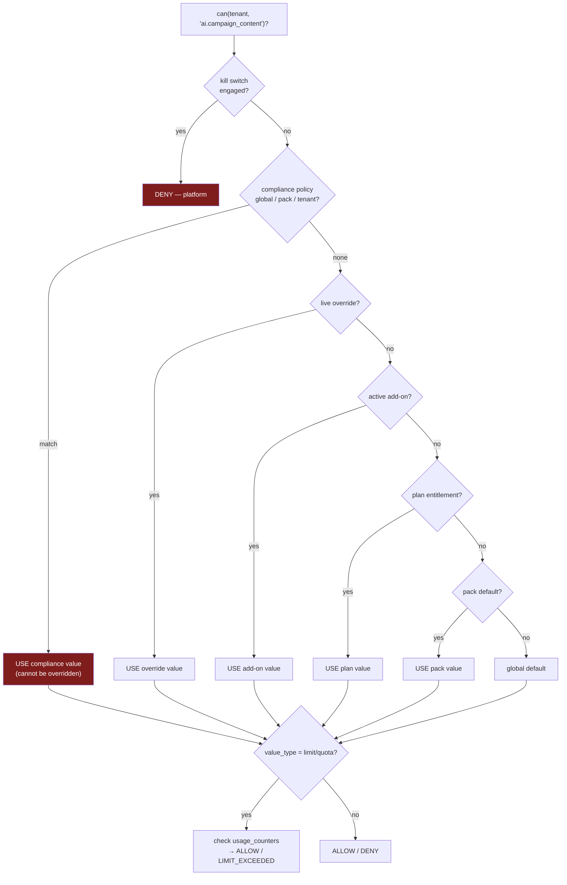
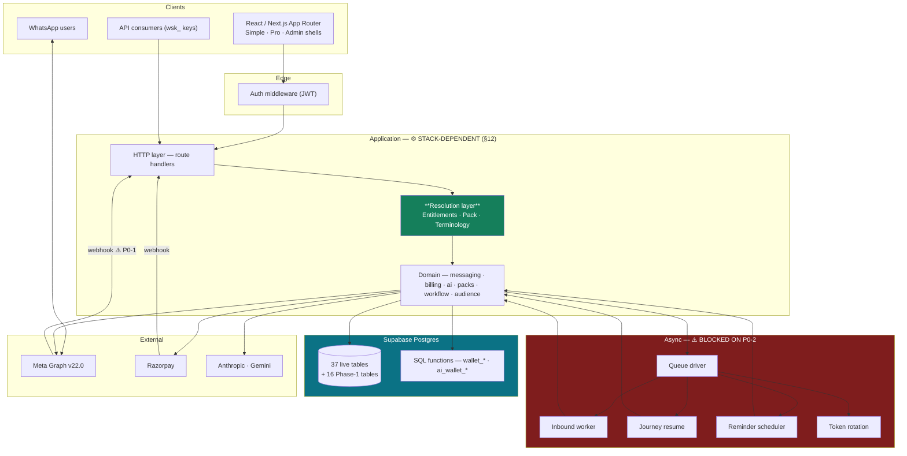
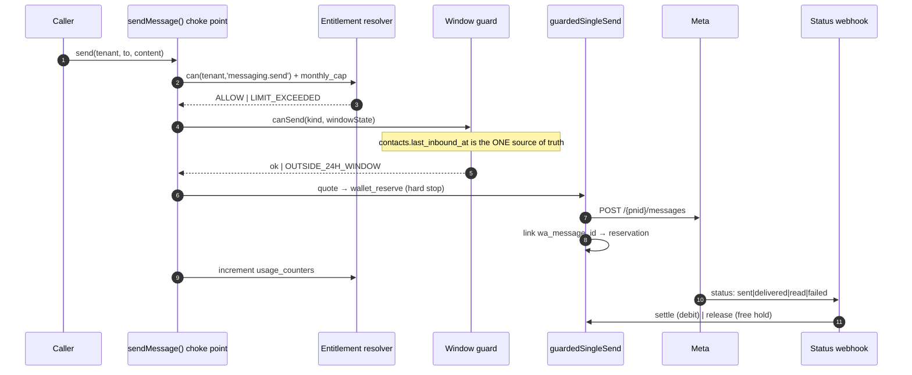
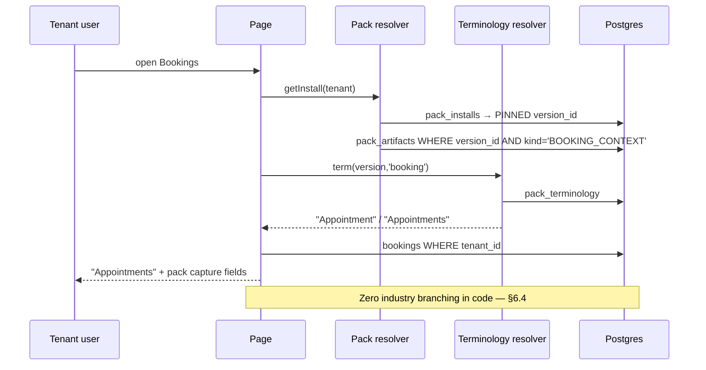
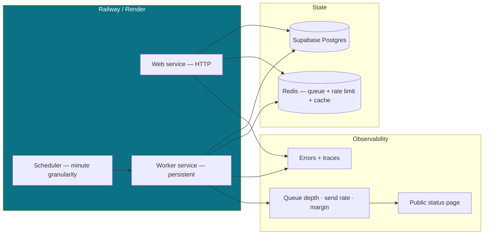

# Phase 1 — Architecture

**SendAnjal · KGS Techway Services · 2026-07-30 · design only, no code written**

**Baseline:** `docs/platform-v2/00-EXECUTIVE-BRIEF.md`, `01-MARKET-PERSONAS.md`,
`02-PLATFORM-ARCHITECTURE.md` (adopted per your instruction, in place of the missing
`sendanjal-vertical-saas-blueprint.md`).
**Grounding:** `docs/00-current-state.md` (Phase 0) and `docs/architecture/` (22-doc
due-diligence pass).

> **This document extends the baseline. It does not restart it.** Personas, module
> catalogue, IA and navigation are **not** reproduced here — they live in platform-v2 and
> are unchanged unless listed in §0.2. What is new here is the *technical specification*:
> schemas, diagrams, API and security architecture.

---

## 0. Preamble

### 0.1 ⚠️ The stack assumption this document rests on

**Q1 is still unanswered.** Ground Truth names Fastify / Prisma / Redis+BullMQ; the repo
contains Next.js route handlers / `supabase-js` / pg-boss (Phase 0 §A.1).

**Assumption A0: I am designing on the actual stack.** Rationale: you adopted platform-v2
as the baseline, and platform-v2 was written on the actual stack — I flagged that before you
chose it. Every stack-dependent section below is marked **⚙️ STACK-DEPENDENT** and quantified
in §12.

**A reconciliation worth considering.** The Ground Truth stack may not be wrong — it may be
the **post-migration target**. P0-2 requires moving off Vercel to Railway/Render. On those
hosts you get persistent processes and managed Redis, which is exactly what makes
**BullMQ viable and a distributed rate-limiter trivial**. Read that way, Ground Truth
describes *where the backend lands after P0-2*, not where it is today. If that is what you
meant, Q1 resolves to: **keep Next.js + `supabase-js`, adopt Redis + BullMQ at the infra
migration, treat Prisma as a separate (and in my view unnecessary) decision** — see §12.2.

### 0.2 What changed from the platform-v2 baseline

Per the "extend, note what changed" restriction:

| # | Change | Why |
|---|---|---|
| C1 | **Entitlement precedence reordered.** Baseline had `… > plan > add-on > tenant override > …`; corrected to `… > tenant override > add-on > plan > …` | A manual override that loses to the plan is not an override. Baseline was wrong |
| C2 | **Industry Pack gains versioning, terminology and dashboards** | Baseline described packs conceptually; this is the schema, and version-pinning is required so a pack update cannot mutate a live tenant |
| C3 | **Vertical portfolio narrowed to Hospitals-first** | Ground Truth names Hospitals as the reference vertical; baseline recommended Clinics. See §1.4 — I still think Clinics is the better *commercial* first move and flag it |
| C4 | **RBAC base roles renamed to Owner / Manager / Staff** | Ground Truth naming; baseline used Owner/Admin/Agent from `team_members.role` |
| C5 | **AI Center narrowed to the 3 scoped features + 2 internal tasks** | Ground Truth scoping. Baseline listed 6 task types without ranking them |
| C6 | **"Pack Registry" deferred out of Phase 1** | Baseline argued Marketplace is premature; still true. Registry schema is here, the *marketplace* is not |
| C7 | **Tenant model: `tenant_id` introduced as a logical indirection** | Lets pack/entitlement schema be written once and survive a later `users` → `organizations` migration. See §2.1 |

### 0.3 Traceability legend

Every claim below carries one of:
**[REPO]** verified in the working tree or live DB · **[GT]** stated in Ground Truth ·
**[A#]** an assumption, listed in §13.

---

## 1. Industry Pack — technical specification

### 1.1 What exists today **[REPO]**

`supabase/migrations/026_verticals.sql`, deployed and seeded:

| Table | Rows | Shape |
|---|---:|---|
| `industry_verticals` | 6 | `slug` UNIQUE, `display_name`, `description`, `icon`, `is_active`, `sort_order`, `is_builtin` |
| `vertical_template_library` | 58 | `vertical_id` FK CASCADE, `kind ∈ {CAMPAIGN_PROMPT, FLOW_JSON, MESSAGE_TEMPLATE}`, `title`, `description`, `outcome`, `payload JSONB`, `meta_category`, `admin_note`, `is_active`, `sort_order` |
| `users.vertical_id` | — | nullable FK, `ON DELETE SET NULL` |

Two CHECK constraints already enforce that `meta_category` is present **iff**
`kind = 'MESSAGE_TEMPLATE'` — an invariant `lib/verticals/repository.ts:77-78` relies on.

**This is a good foundation and is not being replaced.** Four things are missing.

### 1.2 The four gaps

| Gap | Consequence today | Fix |
|---|---|---|
| **No versioning** | Editing a pack artifact mutates it for every tenant already using it, with no changelog and no rollback | `pack_versions` + version-pinned installs |
| **No terminology** | "Appointment" vs "Site Visit" vs "Reservation" cannot be expressed as data, so it leaks into code — the exact thing the no-hardcoding rule forbids | `pack_terminology` |
| **No dashboards** | Every vertical gets the identical Home screen; differentiated reporting is the classic vertical-SaaS upsell | `pack_dashboards` |
| **No install record** | `users.vertical_id` says *which* pack, never *which version*, *when*, or *what was copied* | `pack_installs` |

### 1.3 Target schema

**Config-over-code applied throughout** — no pack name, copy, flow, template, term or widget
appears in TypeScript. This extends the `meta_rates` precedent **[GT]**.

```sql
-- ─── Pack identity: EXTEND the existing table, do not rename ────────────────
ALTER TABLE industry_verticals
  ADD COLUMN IF NOT EXISTS author_type text NOT NULL DEFAULT 'platform'
    CHECK (author_type IN ('platform','partner')),
  ADD COLUMN IF NOT EXISTS author_org_id uuid;      -- null for platform packs

-- ─── Versioning ────────────────────────────────────────────────────────────
CREATE TABLE pack_versions (
  id           uuid PRIMARY KEY DEFAULT uuid_generate_v4(),
  pack_id      uuid NOT NULL REFERENCES industry_verticals(id) ON DELETE CASCADE,
  version      integer NOT NULL,                    -- monotonic per pack
  status       text NOT NULL DEFAULT 'draft'
                 CHECK (status IN ('draft','published','deprecated')),
  changelog    text,
  published_at timestamptz,
  published_by uuid REFERENCES users(id),
  created_at   timestamptz NOT NULL DEFAULT now(),
  UNIQUE (pack_id, version)
);
CREATE UNIQUE INDEX uq_pack_one_published
  ON pack_versions (pack_id) WHERE status = 'published';   -- exactly one live version

-- ─── Artifacts: successor to vertical_template_library, version-scoped ─────
CREATE TABLE pack_artifacts (
  id            uuid PRIMARY KEY DEFAULT uuid_generate_v4(),
  version_id    uuid NOT NULL REFERENCES pack_versions(id) ON DELETE CASCADE,
  kind          text NOT NULL
                  CHECK (kind IN ('CAMPAIGN_PROMPT','FLOW_JSON','MESSAGE_TEMPLATE',
                                  'BOOKING_CONTEXT','DASHBOARD_WIDGET')),
  key           text NOT NULL,                      -- stable across versions; diffable
  title         text NOT NULL,
  description   text NOT NULL,
  outcome       text NOT NULL,                      -- plain-language client benefit
  payload       jsonb NOT NULL,
  meta_category text CHECK (meta_category IN ('UTILITY','MARKETING','AUTHENTICATION')),
  admin_note    text,
  is_active     boolean NOT NULL DEFAULT true,
  sort_order    integer NOT NULL DEFAULT 0,
  UNIQUE (version_id, key),
  -- preserve the existing invariant [REPO]
  CHECK (kind <> 'MESSAGE_TEMPLATE' OR meta_category IS NOT NULL),
  CHECK (kind =  'MESSAGE_TEMPLATE' OR meta_category IS NULL)
);
CREATE INDEX idx_pack_artifacts_lookup ON pack_artifacts (version_id, kind, is_active, sort_order);

-- ─── Terminology: the industry's vocabulary, as data ───────────────────────
CREATE TABLE pack_terminology (
  version_id uuid NOT NULL REFERENCES pack_versions(id) ON DELETE CASCADE,
  locale     text NOT NULL DEFAULT 'en',
  term_key   text NOT NULL,        -- 'booking' | 'customer' | 'announcement' | ...
  singular   text NOT NULL,        -- 'Appointment' | 'Site Visit' | 'Reservation'
  plural     text NOT NULL,
  PRIMARY KEY (version_id, locale, term_key)
);

-- ─── Dashboards: which widgets, in what order, per pack ───────────────────
CREATE TABLE pack_dashboards (
  version_id  uuid NOT NULL REFERENCES pack_versions(id) ON DELETE CASCADE,
  surface     text NOT NULL DEFAULT 'home',   -- 'home' | 'reports'
  widget_key  text NOT NULL,                  -- resolved against a code-side registry
  config      jsonb NOT NULL DEFAULT '{}',
  sort_order  integer NOT NULL DEFAULT 0,
  PRIMARY KEY (version_id, surface, widget_key)
);

-- ─── Installs: which tenant is on which VERSION ───────────────────────────
CREATE TABLE pack_installs (
  tenant_id   uuid PRIMARY KEY,                -- see §2.1 on tenant_id
  pack_id     uuid NOT NULL REFERENCES industry_verticals(id) ON DELETE RESTRICT,
  version_id  uuid NOT NULL REFERENCES pack_versions(id) ON DELETE RESTRICT,
  installed_at timestamptz NOT NULL DEFAULT now(),
  installed_by uuid REFERENCES users(id),
  auto_upgrade boolean NOT NULL DEFAULT false   -- opt-in; default is pinned
);

-- ─── Provenance: what a tenant actually copied out of the pack ───────────
CREATE TABLE pack_artifact_adoptions (
  id            uuid PRIMARY KEY DEFAULT uuid_generate_v4(),
  tenant_id     uuid NOT NULL,
  artifact_id   uuid NOT NULL REFERENCES pack_artifacts(id) ON DELETE SET NULL,
  target_type   text NOT NULL CHECK (target_type IN ('flow','template','campaign')),
  target_id     uuid NOT NULL,          -- the tenant's own row
  adopted_at    timestamptz NOT NULL DEFAULT now(),
  UNIQUE (tenant_id, artifact_id, target_type)
);
```

### 1.4 Design decisions, and one flag

| Decision | Rationale |
|---|---|
| **Extend `industry_verticals`, don't rename to `industry_packs`** | 6 live rows, an FK from `users.vertical_id`, and 2,333 LOC in `lib/verticals/` reference it **[REPO]**. A rename buys a nicer noun and costs a migration across the healthiest subsystem in the codebase |
| **Version-pinned installs, `auto_upgrade` opt-in** | A pack edit must never silently change a live tenant's flows. This is the single most important property of the design |
| **`key` on artifacts** | Enables a real version diff ("Appointment Reminder changed between v2 and v3") and makes upgrade a merge rather than a replace |
| **One published version per pack** (partial unique index) | Removes "which version is live?" ambiguity at the schema level |
| **`BOOKING_CONTEXT` is an artifact kind** | Baseline carried `BookingContext` inside the `FLOW_JSON` payload. Promoting it lets the booking record (platform-v2 M17) read capture-fields and reminder cadence without parsing a flow graph |
| **`DASHBOARD_WIDGET` resolves against a code-side registry** | Widget *selection and order* is data; widget *rendering* is code. Arbitrary code from a pack row would be an injection surface |
| **`ON DELETE RESTRICT` on installs** | You cannot delete a pack version a tenant is pinned to |

> ⚠️ **Flag — reference vertical.** Ground Truth **[GT]** names **Hospitals** as the
> reference pack; the baseline recommended **Clinics & Diagnostics**. I have designed for
> Hospitals as instructed, but restate the concern: a hospital buyer requires SSO, MFA,
> granular RBAC, audit export, a DPA and a security review — **none of which exist**
> (Phase 0 §E.2). A clinic is an owner-decides sale that closes in days on the same pack
> content. **Recommendation: build the pack content for Hospitals, sell it to Clinics
> first.** Same artifacts, achievable buyer. Your call.

### 1.5 Migration from the current tables

Non-destructive, additive, reversible:

1. Create the six new tables.
2. For each of the 6 `industry_verticals`, insert `pack_versions (version=1, status='published')`.
3. Copy all 58 `vertical_template_library` rows into `pack_artifacts` under that v1,
   deriving `key` from a slugified `title`.
4. Backfill `pack_installs` from every non-null `users.vertical_id`, pinned to v1.
5. Repoint `lib/verticals/repository.ts` reads to the new tables.
6. Keep `vertical_template_library` in place, read-only, for one release. Drop later.

`users.vertical_id` is retained as a denormalised pointer so existing reads keep working.

---

## 2. Subscription & Feature-flag architecture

### 2.1 ⚠️ `tenant_id` — a deliberate indirection **[A1]**

Today `users.id` **is** the tenant **[REPO]**; there are no `organizations`. The baseline
recommends introducing organizations as a *parent* of users.

Rather than block Phase 1 on that decision, every new table above and below keys on
`tenant_id uuid`, defined as:

> **`tenant_id` = `users.id` today. It becomes `organizations.id` when the org model
> deploys.** The migration is then `UPDATE <table> SET tenant_id = <org for that user>`
> — one statement per table — with no schema change to any new table.

No FK constraint is placed on `tenant_id` for exactly this reason. That is a deliberate
trade: it costs referential integrity on the new tables until the tenant model settles.
**Decision needed — see Q-A in §13.**

### 2.2 The problem being solved

Four overlapping mechanisms answer "may this tenant do X?" today **[REPO]**:

| Mechanism | Where |
|---|---|
| `TIER_TASKS` hardcoded map | `lib/ai/config.ts:47` |
| `plan_tiers.default_markup_bps` / `monthly_msg_cap` | `lib/billing/rates.ts:23-24` |
| `is_active` columns | 5 tables |
| `ADMIN_EMAILS` env allowlist | `lib/auth.ts:47` |

`TIER_TASKS` is a **hardcoded value where a config table belongs** — precisely the pattern
the restrictions forbid. It moves to `plan_entitlements`.

### 2.3 Target schema

```sql
CREATE TABLE features (
  key         text PRIMARY KEY,          -- 'ai.campaign_content', 'messaging.monthly_cap'
  name        text NOT NULL,
  description text NOT NULL,
  value_type  text NOT NULL CHECK (value_type IN ('boolean','limit','quota')),
  category    text NOT NULL,             -- 'ai' | 'messaging' | 'team' | 'integrations'
  is_active   boolean NOT NULL DEFAULT true
);

-- plan_tiers already exists [REPO] and keeps its billing columns.
-- Entitlements move OUT of code and INTO this table.
CREATE TABLE plan_entitlements (
  tier        text NOT NULL REFERENCES plan_tiers(tier) ON DELETE CASCADE,
  feature_key text NOT NULL REFERENCES features(key)    ON DELETE CASCADE,
  value       jsonb NOT NULL,            -- true | {"limit":5000} | {"quota":100,"period":"month"}
  PRIMARY KEY (tier, feature_key)
);

CREATE TABLE addons (
  key          text PRIMARY KEY,
  name         text NOT NULL,
  price_paise  bigint NOT NULL,
  billing_cycle text NOT NULL DEFAULT 'month' CHECK (billing_cycle IN ('month','year','once')),
  is_active    boolean NOT NULL DEFAULT true
);
CREATE TABLE addon_entitlements (
  addon_key   text NOT NULL REFERENCES addons(key)    ON DELETE CASCADE,
  feature_key text NOT NULL REFERENCES features(key)  ON DELETE CASCADE,
  value       jsonb NOT NULL,
  PRIMARY KEY (addon_key, feature_key)
);
CREATE TABLE tenant_addons (
  tenant_id  uuid NOT NULL,
  addon_key  text NOT NULL REFERENCES addons(key) ON DELETE RESTRICT,
  active_from timestamptz NOT NULL DEFAULT now(),
  active_to   timestamptz,
  PRIMARY KEY (tenant_id, addon_key, active_from)
);

-- Manual grants. ALWAYS audited, ALWAYS expiring.
CREATE TABLE entitlement_overrides (
  id          uuid PRIMARY KEY DEFAULT uuid_generate_v4(),
  tenant_id   uuid NOT NULL,
  feature_key text NOT NULL REFERENCES features(key) ON DELETE CASCADE,
  value       jsonb NOT NULL,
  reason      text NOT NULL,                      -- mandatory
  granted_by  uuid NOT NULL REFERENCES users(id),
  expires_at  timestamptz,                        -- null = permanent, discouraged
  created_at  timestamptz NOT NULL DEFAULT now()
);
CREATE UNIQUE INDEX uq_override_live ON entitlement_overrides (tenant_id, feature_key)
  WHERE expires_at IS NULL OR expires_at > now();

-- Compliance beats commerce. See §2.4.
CREATE TABLE compliance_policies (
  id          uuid PRIMARY KEY DEFAULT uuid_generate_v4(),
  scope_type  text NOT NULL CHECK (scope_type IN ('global','pack','tenant')),
  scope_ref   text,                               -- pack slug or tenant_id
  feature_key text NOT NULL REFERENCES features(key) ON DELETE CASCADE,
  value       jsonb NOT NULL,
  rationale   text NOT NULL,                      -- e.g. 'DPDP: patient message text'
  created_at  timestamptz NOT NULL DEFAULT now()
);

-- Platform-wide emergency off switch.
CREATE TABLE feature_kill_switches (
  feature_key text PRIMARY KEY REFERENCES features(key) ON DELETE CASCADE,
  reason      text NOT NULL,
  engaged_by  uuid NOT NULL REFERENCES users(id),
  engaged_at  timestamptz NOT NULL DEFAULT now()
);

CREATE TABLE usage_counters (
  tenant_id    uuid NOT NULL,
  feature_key  text NOT NULL REFERENCES features(key) ON DELETE CASCADE,
  period_start date NOT NULL,
  used         bigint NOT NULL DEFAULT 0,
  PRIMARY KEY (tenant_id, feature_key, period_start)
);
```

### 2.4 Resolution precedence — **the single source of "may I?"**

```
1. feature_kill_switches       platform emergency stop
2. compliance_policies         regulatory — CANNOT be bought around
3. entitlement_overrides       manual grant, audited + expiring   ← C1: moved above plan
4. addon_entitlements          purchased add-on
5. plan_entitlements           the tier
6. pack defaults               industry pack suggestion
7. global default              feature.value_type zero-value
```



> **Why compliance outranks plan.** A hospital on the top tier still must not have patient
> message text sent to an LLM without opt-in. If plan could beat compliance, you could sell
> your way into a DPDP breach. This is the one rule in the design I would not compromise.
>
> It has an immediate concrete use: `automation_runtime_intent` sends raw inbound customer
> text to an LLM on every message **[REPO]** with no tenant opt-out. A `compliance_policies`
> row scoped to `pack = hospital` turns it off for that vertical without touching any plan.

### 2.5 What this replaces

| Today **[REPO]** | Becomes |
|---|---|
| `TIER_TASKS` map in `lib/ai/config.ts:47` | `plan_entitlements` rows, `ai.*` feature keys |
| `plan_tiers.monthly_msg_cap` (read, never enforced) | `features['messaging.monthly_cap']` + `usage_counters`, enforced in the send choke point |
| `tierAllows(tier, task)` | `can(tenant, featureKey)` — one resolver |
| `ADMIN_EMAILS` env | Stays for platform admin (§3.4). Not a tenant feature |

---

## 3. RBAC

### 3.1 Reality check **[REPO]**

Ground Truth **[GT]** describes "current Owner/Manager/Staff tenant roles". **They do not
exist.** There is no `users.role`; `team_members.role` stores `owner|admin|agent` and is
**never read by any authorization check**; invited members **have no login path**
(Phase 0 §A.3). This section therefore specifies them rather than extending them.

### 3.2 Confirmed base roles

| Role | Intent | Persona (baseline) |
|---|---|---|
| **Owner** | Full control incl. billing, plan, team, deletion | P1 clinic owner, P4 retail owner |
| **Manager** | Everything operational except billing/plan/team-destructive | P7 brokerage lead |
| **Staff** | Day-to-day execution only | P3 reception |

### 3.3 Permission matrix — base roles

`—` no access · `R` read · `W` create/update · `D` delete · `X` execute

| Resource | Owner | Manager | Staff |
|---|:-:|:-:|:-:|
| Conversations | RWX | RWX | RWX |
| Bookings | RWD | RWD | RW |
| Customers / Groups | RWD | RWD | RW |
| Message Library (templates) | RWD | RWD | R |
| Template submit to Meta | X | X | — |
| Announcements (campaigns) | RWDX | RWDX | R |
| Journeys (flows) | RWDX | RWDX | R |
| AI generate (draft) | X | X | X |
| Reports | R | R | R |
| WhatsApp numbers | RWD | R | — |
| Wallet / top-up | RWX | R | — |
| Plan / subscription | RWX | — | — |
| Team & roles | RWD | R | — |
| API keys | RWD | — | — |
| Integrations / webhooks | RWD | R | — |
| Audit log | R | — | — |
| Industry pack (change) | W | — | — |

**Config-over-code:** this matrix is **data**, not a switch statement —
`roles` / `permissions` / `role_permissions`. Custom roles then need no deploy.

```sql
CREATE TABLE permissions (
  key         text PRIMARY KEY,        -- 'campaigns.launch', 'wallet.topup'
  resource    text NOT NULL,
  action      text NOT NULL CHECK (action IN ('read','write','delete','execute')),
  description text NOT NULL
);
CREATE TABLE roles (
  key         text PRIMARY KEY,        -- 'owner' | 'manager' | 'staff' | custom
  name        text NOT NULL,
  scope       text NOT NULL CHECK (scope IN ('tenant','platform','partner')),
  is_builtin  boolean NOT NULL DEFAULT true,
  tenant_id   uuid                     -- non-null only for tenant-defined custom roles
);
CREATE TABLE role_permissions (
  role_key       text NOT NULL REFERENCES roles(key) ON DELETE CASCADE,
  permission_key text NOT NULL REFERENCES permissions(key) ON DELETE CASCADE,
  PRIMARY KEY (role_key, permission_key)
);
ALTER TABLE users ADD COLUMN IF NOT EXISTS role_key text REFERENCES roles(key);
```

Team-member login (the missing piece) needs `team_members.user_id`, an invite token table,
and an accept-invite flow — specified in §7.3.

### 3.4 🔶 SPECULATIVE — Reseller / Partner / internal role layer

> **This entire subsection is Decision Item #1 [GT] and is NOT confirmed.** It is specified
> so the base design does not preclude it. **Do not build it without an explicit decision.**

| Role | Scope | Purpose |
|---|---|---|
| 🔶 Partner Owner | partner | Manages N client tenants, white-label, consolidated billing |
| 🔶 Partner Staff | partner | Operates client tenants, no billing |
| 🔶 Internal Sales | platform | Read tenants, apply overrides/trials, no rate access |
| 🔶 Internal Finance | platform | Rates, margin, invoices, refunds — **the role that most needs audit** |
| 🔶 Internal Support | platform | Read + audited impersonation, no financial mutation |

Schema impact if approved: `organizations.parent_org_id`, `partner_client_links`, and a
`scope` dimension on the resolver. The `roles.scope` column above already anticipates it.

**Cost if approved:** ~3 weeks *on top of* base RBAC, and it requires the org model
(§2.1) to exist first. **My recommendation: defer.** Base RBAC unblocks 4 personas; the
partner layer unblocks 1 (P6) and is a generalisation of work not yet done.

### 3.5 Platform admin — unchanged

`ADMIN_EMAILS` **[REPO]** stays as the platform-admin gate. It cannot be self-granted,
which is a genuine security property. **It is not a tenant role** and does not enter the
matrix. If Internal Sales/Finance/Support (§3.4) is approved, this is what they replace.

---

## 4. AI Center

### 4.1 Scope — locked to Ground Truth **[GT]**

| # | Feature | Task type | Route **[REPO]** |
|---|---|---|---|
| 1 | AI Campaign Creation | `campaign_content` | `POST /api/ai/campaign-draft` |
| 2 | WhatsApp Automation — flow builder | `automation_flow_builder` | `POST /api/ai/flow-draft` |
| 2b | WhatsApp Automation — runtime intent | `automation_runtime_intent` | `lib/automation/intent.ts` |
| 3 | AI Template Creation | `template_content` | `POST /api/templates/generate` |

Also live **[REPO]**: `appointment_nl_parse` (internal), `reminder_draft` (**configured
with no call site — orphaned**), and `automation_ai_reply` (added this session, not yet
routable — see §4.4).

**AI Autopilot is not present and is not being introduced.** **[GT]**

### 4.2 Model routing — 2-model pattern **[GT]**

| Tier | Purpose | Ground Truth intent | Live config **[REPO]** |
|---|---|---|---|
| **Cheap / fast** | Runtime intent, every inbound message | Gemini Flash-Lite class | 🔴 `anthropic` / `claude-haiku-4-5` |
| **Strong / design-time** | Campaign, flow, template generation | GPT-5-mini class | `anthropic` / `claude-sonnet-4-6` |
| Contingency | Only if flow-JSON failure rates justify it | Claude Sonnet | — |

> 🔴 **Live divergence.** `automation_runtime_intent` runs on **every inbound message at 0
> credits** — pure cost — and is pointed at Anthropic, not the cheap model. `lib/ai/service.ts:76-81`
> documents the Flash-Lite intent and a working `GeminiAdapter` exists and is **unused**.
> **Fix is one `ai_model_config` row. No deploy.** Sequenced in Phase 2.

### 4.3 Provider abstraction — interface only **[GT], Decision Item #2**

Already the right shape **[REPO]**:

```ts
interface ProviderAdapter { generate(args: GenerateArgs): Promise<GenerateResult> }
function getAdapter(provider: string): ProviderAdapter | null   // switch
```

**Two live adapters (Anthropic, Gemini). No further providers are being designed.** A
commented `case "gateway"` anticipates a unified gateway if ever needed. **No multi-agent
orchestration.** ⚙️ *This is the abstraction; the provider list stays at 2.*

### 4.4 Required schema change **[REPO]**

`ai_model_config.task_type` carries a CHECK constraint listing exactly six values, so
`automation_ai_reply` (added to the TypeScript union this session) **cannot have a config
row** and degrades to `not_configured`. Widening it is a one-line migration:

```sql
ALTER TABLE ai_model_config DROP CONSTRAINT ai_model_config_task_type_check;
ALTER TABLE ai_model_config ADD CONSTRAINT ai_model_config_task_type_check
  CHECK (task_type IN ('campaign_content','automation_flow_builder','automation_runtime_intent',
                       'appointment_nl_parse','reminder_draft','template_content',
                       'automation_ai_reply'));
```

**Config-over-code observation:** a CHECK constraint enumerating task types *is* a hardcoded
list, just in SQL. A `ai_task_types` reference table with an FK would let a new task type
ship without a migration. Low priority, but it is the consistent pattern.

### 4.5 Prompt Library — new

Baseline described it; this is the schema. Three scopes, cascading.

```sql
CREATE TABLE prompt_categories (
  key text PRIMARY KEY, name text NOT NULL, sort_order integer NOT NULL DEFAULT 0
);
CREATE TABLE prompts (
  id           uuid PRIMARY KEY DEFAULT uuid_generate_v4(),
  scope        text NOT NULL CHECK (scope IN ('platform','pack','tenant')),
  scope_ref    text,                    -- null | pack slug | tenant_id
  category_key text REFERENCES prompt_categories(key),
  task_type    text NOT NULL,           -- which AI feature it targets
  key          text NOT NULL,
  name         text NOT NULL,
  is_active    boolean NOT NULL DEFAULT true,
  UNIQUE (scope, scope_ref, key)
);
CREATE TABLE prompt_versions (
  id         uuid PRIMARY KEY DEFAULT uuid_generate_v4(),
  prompt_id  uuid NOT NULL REFERENCES prompts(id) ON DELETE CASCADE,
  version    integer NOT NULL,
  body       text NOT NULL,             -- may contain {{variables}}
  status     text NOT NULL DEFAULT 'draft'
               CHECK (status IN ('draft','published','archived')),
  created_by uuid REFERENCES users(id),
  created_at timestamptz NOT NULL DEFAULT now(),
  UNIQUE (prompt_id, version)
);
CREATE TABLE prompt_variables (
  version_id uuid NOT NULL REFERENCES prompt_versions(id) ON DELETE CASCADE,
  name       text NOT NULL,
  label      text NOT NULL,
  required   boolean NOT NULL DEFAULT true,
  example    text,
  PRIMARY KEY (version_id, name)
);
```

**Resolution:** tenant prompt → pack prompt → platform prompt.

> ⚠️ **Boundary that must hold.** Prompts that encode an **output contract** —
> `lib/ai/prompts/flow-builder.ts` produces JSON that `sanitizeFlowGraph` parses **[REPO]** —
> stay in **code**, versioned with their parser. Only *content* prompts (tone, industry
> phrasing, campaign angle) become library rows. Moving a contract prompt into the database
> would let a non-engineer break flow generation with no type check and no test.

### 4.6 Unchanged and correct **[REPO]** — do not rebuild

`runTask()` 7-stage pipeline · separate `ai_credit_wallet` / `ai_credit_ledger` **[GT]** ·
debit-on-success · always-log to `ai_usage_log` · graceful fallback with an equally visible
manual path **[GT]** · AI never sends autonomously.

**Gap:** `ai_usage_log` is written on every call and **read by nothing**. The margin
dashboard is a query away.

---

## 5. Database ER diagram — target state

New in Phase 1 highlighted. Existing tables **[REPO]** shown for relationship context.

```mermaid
erDiagram
    users ||--o| pack_installs : "tenant_id"
    users ||--o{ entitlement_overrides : "tenant_id"
    users ||--o{ tenant_addons : "tenant_id"
    users ||--o{ usage_counters : "tenant_id"
    users ||--o{ pack_artifact_adoptions : "tenant_id"
    users }o--|| roles : role_key
    users ||--o{ team_members : owner_id
    users ||--o| ai_credit_wallet : has
    users ||--o| wallet : has
    users ||--o{ whatsapp_numbers : owns
    users ||--o{ contacts : owns
    users ||--o{ templates : owns
    users ||--o{ campaigns : owns
    users ||--o{ automation_flows : owns
    users ||--o{ conversations : owns

    industry_verticals ||--o{ pack_versions : versions
    pack_versions ||--o{ pack_artifacts : contains
    pack_versions ||--o{ pack_terminology : defines
    pack_versions ||--o{ pack_dashboards : configures
    pack_versions ||--o{ pack_installs : "pinned by"
    pack_artifacts ||--o{ pack_artifact_adoptions : "copied as"

    plan_tiers ||--o{ plan_entitlements : grants
    features ||--o{ plan_entitlements : keyed
    features ||--o{ addon_entitlements : keyed
    features ||--o{ entitlement_overrides : keyed
    features ||--o{ compliance_policies : keyed
    features ||--o{ feature_kill_switches : keyed
    features ||--o{ usage_counters : counted
    addons ||--o{ addon_entitlements : grants
    addons ||--o{ tenant_addons : purchased

    roles ||--o{ role_permissions : has
    permissions ||--o{ role_permissions : in

    prompt_categories ||--o{ prompts : groups
    prompts ||--o{ prompt_versions : versions
    prompt_versions ||--o{ prompt_variables : declares
    ai_model_config ||--o{ ai_usage_log : "routes (logical)"

    conversations ||--o{ messages : contains
    campaigns ||--o{ campaign_messages : "fans out"
    wallet ||--o{ wallet_reservations : holds
    wallet_reservations ||--o{ message_billing : settles
    meta_rates ||--o{ message_billing : "prices (logical)"

    industry_verticals {
        uuid id PK
        text slug UK
        text display_name
        text author_type "NEW platform|partner"
    }
    pack_versions {
        uuid id PK
        uuid pack_id FK
        int version
        text status "draft|published|deprecated"
        text changelog
    }
    pack_artifacts {
        uuid id PK
        uuid version_id FK
        text kind "CAMPAIGN_PROMPT|FLOW_JSON|MESSAGE_TEMPLATE|BOOKING_CONTEXT|DASHBOARD_WIDGET"
        text key "stable across versions"
        jsonb payload
        text meta_category "iff MESSAGE_TEMPLATE"
    }
    pack_installs {
        uuid tenant_id PK
        uuid pack_id FK
        uuid version_id FK "PINNED"
        bool auto_upgrade
    }
    features {
        text key PK
        text value_type "boolean|limit|quota"
    }
    plan_entitlements {
        text tier FK
        text feature_key FK
        jsonb value
    }
    compliance_policies {
        text scope_type "global|pack|tenant"
        text feature_key FK
        text rationale "OUTRANKS PLAN"
    }
    roles {
        text key PK
        text scope "tenant|platform|partner"
    }
```



---

## 6. System architecture

### 6.1 High-level



### 6.2 Low-level — outbound send with entitlements



### 6.3 Low-level — pack resolution on a client screen



### 6.4 The invariant, mechanically enforced

> **No module in the domain layer may branch on industry.**

CI gate (extends baseline §5): fail the build if any file under
`lib/{messaging,billing,workflow,audience,booking}/**` or `app/api/**`
(excluding `app/api/admin/packs/**`) contains a known pack slug literal or a
conditional on `vertical`/`industry`. Allowed exceptions: `lib/packs/**`, `lib/i18n/**`.
**Target: 0 violations, merge-blocking.**

---

## 7. API architecture

### 7.1 Conventions

| Concern | Standard |
|---|---|
| Internal | `/api/<resource>` — session cookie |
| Public | `/api/v1/<resource>` — `wsk_` bearer + scopes **[REPO]** |
| Admin | `/api/admin/<resource>` — `requireAdmin()` **[REPO]** |
| Errors | **One envelope everywhere**: `{error:{code,message,details?}}`. Today four conventions coexist **[REPO]**; v1 already uses this one |
| Idempotency | `Idempotency-Key` header on all mutating public endpoints |
| Pagination | `?page&limit` (max 200) — `paginationSchema` exists and is unused **[REPO]** |
| Versioning | `/v1` frozen. Breaking changes → `/v2` + 6-month deprecation header |

### 7.2 Middleware composition — replaces 89× copy-paste **[REPO]**

```
withErrorMapping( withRateLimit( withAuth( withEntitlement('feature.key',
  withValidation(schema, handler) ) ) ) )
```

Makes auth, validation, rate limiting and entitlement checks **structurally unforgettable**
rather than conventions a new route can omit.

### 7.3 New endpoints

**Packs**
| Method | Path | Notes |
|---|---|---|
| GET | `/api/packs/me` | Installed pack + pinned version + artifacts |
| GET | `/api/packs/me/terminology` | Terminology map for the UI |
| POST | `/api/packs/me/adopt/:artifactId` | Copy artifact → tenant's own row; records provenance |
| GET | `/api/admin/packs` · `/api/admin/packs/:id/versions` | Authoring |
| POST | `/api/admin/packs/:id/versions` · `/:versionId/publish` | Draft → publish |
| POST | `/api/admin/tenants/:id/pack` | Install / change / pin |
| POST | `/api/admin/tenants/:id/pack/upgrade` | Explicit version bump |

**Entitlements**
| Method | Path | Notes |
|---|---|---|
| GET | `/api/entitlements/me` | Resolved map + usage — drives UI gating |
| GET | `/api/admin/features` · `/api/admin/plans/:tier/entitlements` | Config |
| POST | `/api/admin/overrides` | **Requires `reason`; always audited** |
| POST | `/api/admin/kill-switches/:featureKey` | Emergency stop |
| POST | `/api/admin/compliance-policies` | Regulatory, outranks plan |

**Team & RBAC**
| Method | Path | Notes |
|---|---|---|
| POST | `/api/team/invite` | Creates single-use expiring token |
| POST | `/api/team/accept-invite` | **The missing login path** for members |
| PATCH | `/api/team/:id/role` | Owner only |
| GET | `/api/roles` · `/api/permissions` | Matrix as data |

**Prompt library**
`GET/POST /api/ai/prompts` · `GET /api/ai/prompts/:id/versions` ·
`POST /api/ai/prompts/:id/versions/:v/publish`

**Bookings** (platform-v2 M17 — the future system of record)
`GET/POST /api/bookings` · `PATCH /api/bookings/:id` · `GET /api/bookings/calendar`

---

## 8. Security architecture

### 8.1 Tenant isolation — the central gap **[REPO]**

**Today:** RLS enabled on all 37 tables, **zero policies**; every route uses the
service-role key which bypasses RLS; isolation is ~78 hand-written `.eq("user_id", …)`.
Three cross-tenant defects were found and fixed this session — evidence the failure mode is
real, not theoretical.

**Two-rung ladder** (baseline §CS-10, unchanged):

| Rung | What | Effort | Gain |
|---|---|---|---|
| **1 — Prove it** | CI lint failing any `.from(<tenant table>)` without a tenant predicate + a two-tenant integration suite asserting A cannot read/mutate B, per route | 1 wk | Turns an invisible risk into a detected one |
| **2 — Enforce it** | Session-variable RLS: `SET LOCAL app.current_tenant_id`, policies `USING (tenant_id = current_setting(...)::uuid)` | 3–4 wks | True database backstop |

> ⚙️ **STACK-DEPENDENT.** Rung 2 needs a **transaction-scoped connection**, which
> `supabase-js` (stateless HTTP/PostgREST) cannot provide. It requires a `pg`-based client
> wrapper — **or Prisma**, which is one honest argument for the Ground Truth stack. See §12.2.
>
> Webhook and cron paths have no user session and need an explicitly audited service context.

### 8.2 Webhook verification — ⚠️ P0-1, not touched **[GT restriction]**

Handler is **correct** **[REPO]**: raw-bytes HMAC-SHA256 with `timingSafeEqual`;
`hub.challenge` echo; `processed_events` dedup; persist-then-enqueue; always-200.

Failure is environmental. Four hypotheses in Phase 0 §F.1 (Deployment Protection · missing
Vercel env · token mismatch · which of the two URLs is registered). **Diagnosis and fix are
sequenced in Phase 2. No design here assumes it is solved.**

### 8.3 Rate limiting **[REPO]**

In-memory `Map`s in `lib/rate-limit.ts:11` and `lib/api-keys.ts:121` — **per-process, so
non-functional on serverless**, and self-documented as such.

| Target | Notes |
|---|---|
| Postgres counter table | Works today, no new infra |
| **Redis** | Better — and **available after the P0-2 migration**, which is part of why Ground Truth's Redis may be the post-migration target (§0.1) |

Limits belong in `features` as `value_type='limit'`, per-plan — not hardcoded.

### 8.4 Remaining posture

| Control | State **[REPO]** | Target |
|---|---|---|
| Token encryption | ✅ AES-256-GCM, random IV | Add key-version prefix while data is small |
| `meta_app_secret` | 🔴 plaintext column | Encrypt (pattern exists) |
| Session | 7-day JWT, no revocation | `jti` + denylist, or 24h + refresh |
| MFA | 🔴 none, incl. admins | TOTP for `ADMIN_EMAILS` and Finance role |
| CSP | `unsafe-inline` + `unsafe-eval` | Nonce-based; drop `api.anthropic.com` (browser never calls it) |
| CSRF | SameSite=Lax only | Convert state-changing `GET`s to `POST` |
| SSRF | Guard added to `httpRequestNode` this session; `webhook_endpoints.url` unguarded | Resolve-then-validate on both |
| **Financial audit** | 🔴 rate/margin/billing-mode changes **unlogged** | Extend `lib/audit.ts` — ~20 lines. **Blocks any financial-controls review** |

---

## 9. DevOps & monitoring

> ## ⚠️ THIS ENTIRE SECTION DEPENDS ON P0-2 (Railway/Render migration) **[GT]**
> Nothing here is achievable on the current Vercel deployment. Designed, explicitly blocked.

### 9.1 Why the current topology cannot support the design **[REPO]**

| Constraint | Evidence | Blocks |
|---|---|---|
| Default queue driver is `InlineDriver` | `QUEUE_DRIVER` unset; fire-and-forget, detached from response | Durable async of any kind |
| pg-boss cannot start | requires `DATABASE_URL`, **not set** | The durable alternative |
| Drain cron is **daily** | `vercel.json` → `"0 0 * * *"` | Journey resume, reminders, near-real-time automation |
| No persistent process | serverless | Workers, schedulers, Redis-backed limiter |
| No log sink | `lib/logger.ts:21` — stdout only | Alerting, incident response |

### 9.2 Target topology (post-P0-2)



**Workers required:** inbound processing · journey resume (`chatbot_sessions.resume_at`,
written and never read **[REPO]**) · reminder scheduler · Meta token rotation
(~60-day expiry, no job exists) · webhook-inbox replay · usage-counter rollup ·
`daily_analytics` writer (`upsert_daily_analytics()` not deployed **[REPO]**).

### 9.3 Monitoring — SLOs

| Signal | Target | Why |
|---|---|---|
| Webhook 200-ack p95 | < 500 ms | Meta retry avoidance |
| Journey resume lag | < 2 min past `resume_at` | The multi-step promise |
| Queue depth | < 100 sustained | Backlog alarm |
| Meta 131047 rate | < 0.1% of sends | Quality-rating protection |
| Token expiry warnings | 0 tokens < 7 days | Prevent tenant outage |
| Cross-tenant test suite | **100%, merge-blocking** | Isolation |
| `meta_rates` staleness | alert > 60 days | **Margin protection** |

---

## 10. Config-over-code audit

Applying the restriction across the design **[GT]**:

| Was / would be hardcoded | Becomes | Status |
|---|---|---|
| `TIER_TASKS` map `lib/ai/config.ts:47` | `plan_entitlements` | **Fixes an existing violation** |
| RBAC permission matrix | `role_permissions` | Designed as data |
| Industry names/copy/flows | `pack_artifacts` | Already correct **[REPO]** |
| Industry vocabulary | `pack_terminology` | New |
| Dashboard composition | `pack_dashboards` | New |
| Model/provider choice | `ai_model_config` | Already correct **[REPO]** |
| Rate limits | `features` (`value_type='limit'`) | New |
| Meta wholesale rates | `meta_rates` | Already correct — the precedent **[GT]** |
| `ai_model_config.task_type` CHECK list | `ai_task_types` reference table | 🟡 Noted, low priority (§4.4) |
| Widget *rendering* | **stays code** | Deliberate — data-driven rendering is an injection surface |
| Output-contract prompts | **stays code** | Deliberate — versioned with their parser (§4.5) |

---

## 11. What is explicitly NOT in this design

| Excluded | Why |
|---|---|
| AI Autopilot | **[GT]** evaluated and dropped |
| 5+ AI providers, multi-agent orchestration | **[GT]** Decision Item #2 — interface only |
| Public pack marketplace | Premature; registry schema only (C6) |
| Partner/reseller layer | 🔶 Decision Item #1 — specified, not designed in depth (§3.4) |
| GST / coupons / billing history | 🔶 Decision Item #3 — see §13 Q-C |
| Organizations model | Deferred behind `tenant_id` indirection (§2.1) |
| Fixes to P0-1 / P0-2 | **[GT]** restriction — Phase 2/3 slots |

---

## 12. ⚙️ Stack-dependency register

Sections that change if Q1 resolves to a re-platform.

| § | Element | If actual stack (assumed) | If Fastify + Prisma |
|---|---|---|---|
| 5 | ER diagram | Unchanged — SQL is portable | Unchanged; add Prisma models |
| 1,2,3,4 | All schemas | Unchanged | Unchanged |
| 6 | HLD/LLD | Route handlers | Fastify plugins/routes — **rewrite 113 handlers** |
| 7 | Middleware composition | HOF wrappers | Fastify hooks/plugins — same concept |
| 8.1 | **RLS Rung 2** | Needs a `pg` wrapper | **Prisma gives this natively — a real argument for Prisma** |
| 9 | DevOps | Railway/Render + Redis | Identical |
| — | Data access | `supabase-js` + generated types | Prisma Client |

**§12.2 — My recommendation on Q1.** Split it:

| Ground Truth element | Recommendation |
|---|---|
| **Redis + BullMQ** | ✅ **Adopt at P0-2.** Right call; needs the persistent host anyway |
| **Fastify** | ❌ **Don't.** Rewriting 113 working handlers buys performance you do not need and costs months. Next.js route handlers run fine on Railway/Render |
| **Prisma** | 🟡 **Only if you want RLS Rung 2.** The type-safety argument is better served by `supabase gen types typescript` (1–2 days vs weeks) — but Prisma's transaction-scoped client is the cleanest path to real RLS. **This is the one genuine reason to adopt it** |
| **RLS** | ✅ **Yes** — Rung 1 immediately, Rung 2 after |

---

## 13. Assumptions & Open Questions

### Assumptions

| # | Assumption | Impact if wrong |
|---|---|---|
| **A0** | Designing on the actual stack (§0.1) | §6, §7, §8.1 need rework — §12 quantifies |
| **A1** | `tenant_id` = `users.id`, later `organizations.id` (§2.1) | If orgs never ship, `tenant_id` is a redundant alias — harmless |
| **A2** | Hospitals is the reference pack **[GT]**, despite the baseline recommending Clinics | Longer sales cycle; content is identical (§1.4) |
| **A3** | ESU v4 deadline 2026-10-15 **[GT]** is accurate | Not verifiable from the repo. **Code is on `sessionInfoVersion: 3`, not v2** — migration may be smaller than budgeted |
| **A4** | `ADMIN_EMAILS` remains the platform-admin gate | Superseded if Decision Item #1 is approved |
| **A5** | Feature keys are stable identifiers | Renaming breaks entitlement rows; treat as an API |

### 🚧 Still blocking

| # | Question |
|---|---|
| **Q1** | **Fastify/Prisma/Redis+BullMQ — target or mis-description?** Still unanswered. I have proceeded on A0 and quantified the delta in §12. **Please confirm before Phase 3.** My split recommendation is §12.2 |

### 🔶 Decision items — flagged, not assumed **[GT]**

| # | Item | Recommendation |
|---|---|---|
| **Q-A** | `tenant_id` indirection + organizations model (§2.1) | Adopt the indirection now (costs nothing), decide organizations before RBAC ships |
| **Q-B** | Partner/reseller/internal roles (§3.4) — Decision Item #1 | **Defer.** Base RBAC unblocks 4 personas; partner layer unblocks 1 and needs orgs first |
| **Q-C** | GST / coupons / billing history — Decision Item #3 | **Sequence after the Growth-tier restructure.** Building invoicing on economics that don't close means rebuilding it. GST is a real India B2B blocker, so it should be next |
| **Q-D** | Multi-provider AI — Decision Item #2 | **Interface only, 2 models.** One live action: repoint `automation_runtime_intent` to the cheap model — one DB row |
| **Q-E** | Reference vertical: Hospitals vs Clinics (§1.4) | Build Hospital pack content, **sell to Clinics first** |

### New questions from this phase

| # | Question |
|---|---|
| Q-F | Deploy-or-delete on the 19 missing tables (Phase 0 §E.1)? Gates both roadmap scope and UI work |
| Q-G | Does P0-2 move compute only, or the database too? Compute-only is far lower risk |
| Q-H | Should `daily_analytics` get its missing writer, or be replaced by live aggregates? |

---

## Phase 1 exit

**Status: complete. Stopping for approval — not proceeding to Phase 2.**

Companion: `docs/02-gap-impact-analysis.md`.
