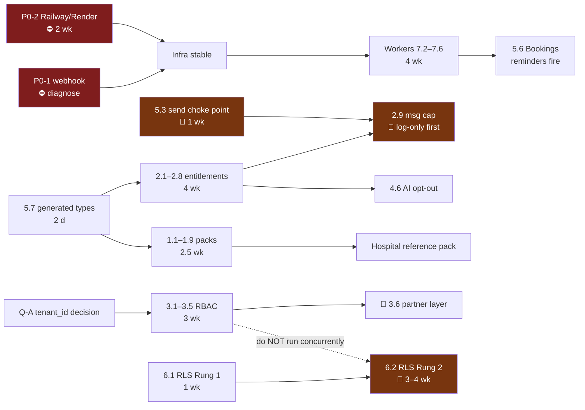

# Phase 1 — Gap & Impact Analysis

**Companion to `docs/01-architecture.md` · 2026-07-30 · analysis only, no code written**

For every architectural element in Phase 1, this states:
**(a)** does it reuse an existing module or require a rewrite ·
**(b)** what is the migration risk ·
**(c)** does it depend on either open P0 blocker.

**Legend**
**Reuse:** ♻️ extends existing · 🆕 net-new, no conflict · ⚠️ replaces existing behaviour · 🔁 rewrite
**Risk:** 🟢 low · 🟡 medium · 🟠 high · 🔴 critical
**P0:** ⛔ blocked · 🔗 partial · ✅ independent

---

## 1. Industry Pack

| # | Element | Reuse / rewrite | Migration risk | P0 dependency | Effort |
|---|---|---|---|---|---|
| 1.1 | `industry_verticals` + `author_type` | ♻️ Two additive nullable columns on a 6-row table | 🟢 Additive, reversible | ✅ | 1 h |
| 1.2 | `pack_versions` | 🆕 | 🟢 New table. Backfill = 6 rows at v1 | ✅ | 1 d |
| 1.3 | `pack_artifacts` | ⚠️ **Supersedes `vertical_template_library`** (58 rows) | 🟡 Copy-then-switch; old table kept read-only one release. `key` derived from slugified `title` — collisions must be checked at migration time | ✅ | 3 d |
| 1.4 | `pack_terminology` | 🆕 | 🟢 Empty until authored. Resolver falls back to defaults | ✅ | 1 d |
| 1.5 | `pack_dashboards` | 🆕 | 🟡 Needs a **code-side widget registry**; a row naming an unknown widget must degrade, not crash | ✅ | 2 d |
| 1.6 | `pack_installs` | ⚠️ Duplicates `users.vertical_id` intent, adds version pin | 🟡 Two sources of "which pack" during transition. Keep `vertical_id` as denormalised pointer; **one writer only** | ✅ | 1 d |
| 1.7 | `pack_artifact_adoptions` | 🆕 provenance | 🟢 Write-only ledger | ✅ | 1 d |
| 1.8 | Repoint `lib/verticals/repository.ts` | 🔁 209 LOC rewritten against new tables | 🟡 **Highest-quality module in the codebase** — mappers, discriminated unions, documented scope rule. Preserve its shape; port, don't redesign | ✅ | 3 d |
| 1.9 | Pack version diff / upgrade UI | 🆕 | 🟢 Admin-only | ✅ | 3 d |

**Section rollup:** ~2.5 weeks · **fully P0-independent** · highest risk is 1.3 (data move) and 1.8 (rewriting good code).

> ⚠️ **1.6 is the subtle one.** Having both `users.vertical_id` and `pack_installs.pack_id`
> is a classic dual-source bug. Rule: `pack_installs` is authoritative; `users.vertical_id`
> is a denormalised read cache maintained by the same transaction. Never write it directly.

---

## 2. Subscription & Entitlements

| # | Element | Reuse / rewrite | Migration risk | P0 dependency | Effort |
|---|---|---|---|---|---|
| 2.1 | `features` catalogue | 🆕 | 🟢 Seed ~25 rows | ✅ | 1 d |
| 2.2 | `plan_entitlements` | ⚠️ **Replaces `TIER_TASKS`** (`lib/ai/config.ts:47`) | 🟡 Behaviour must be byte-identical at cutover. **Mitigation: dual-read + assert-equal in shadow mode before switching** | ✅ | 3 d |
| 2.3 | `addons` / `addon_entitlements` / `tenant_addons` | 🆕 | 🟢 Unused until an add-on is sold | ✅ | 2 d |
| 2.4 | `entitlement_overrides` | 🆕 | 🟢 Additive. Mandatory `reason` + expiry | ✅ | 1 d |
| 2.5 | `compliance_policies` | 🆕 | 🟢 Empty by default | ✅ | 1 d |
| 2.6 | `feature_kill_switches` | 🆕 | 🟢 | ✅ | 0.5 d |
| 2.7 | `usage_counters` | 🆕 | 🟠 **Hot write path** — one increment per send. Must not be a `COUNT(*)`. Needs a rollup job (⛔ P0-2) or an atomic upsert | 🔗 | 2 d |
| 2.8 | **Entitlement resolver** `can(tenant, feature)` | 🆕 core service | 🟠 **Every gated path depends on it.** A resolver bug is a platform-wide outage or a platform-wide free-for-all. Needs exhaustive unit tests across all 7 precedence levels | ✅ | 1 wk |
| 2.9 | Enforce `monthly_msg_cap` | ⚠️ Column read today, **never enforced** | 🔴 **Live behaviour change** — a Starter tenant above 5,000/mo starts getting blocked. **Log-only phase mandatory**, then notify, then enforce. Env-flagged | ✅ | 3 d |
| 2.10 | Caching the resolver | 🆕 | 🟡 Stale entitlements after an upgrade. 60 s TTL + explicit bust on write | 🔗 Redis after P0-2 | 2 d |

**Section rollup:** ~3 weeks · mostly P0-independent · **2.9 is the only element in Phase 1 that can take money incorrectly** — treat as reversible-first.

---

## 3. RBAC

| # | Element | Reuse / rewrite | Migration risk | P0 dependency | Effort |
|---|---|---|---|---|---|
| 3.1 | `permissions` / `roles` / `role_permissions` | 🆕 | 🟢 Seed data | ✅ | 2 d |
| 3.2 | `users.role_key` | ♻️ Additive column | 🔴 **Every existing user must become `owner` with zero behaviour change.** A migration error locks tenants out of their own data. `DEFAULT 'owner'` + permissive mode first | ✅ | 1 d |
| 3.3 | `can(actor, action, resource)` | 🆕 | 🟠 Applied at ~113 routes. Missing a check = privilege escalation; over-applying = lockout | ✅ | 1 wk |
| 3.4 | **Team-member login path** | 🆕 — `team_members.user_id`, invite tokens, accept flow | 🟠 **New authentication surface.** Single-use, expiring, high-entropy tokens. A seat must not be able to escalate to owner | ✅ | 1 wk |
| 3.5 | Role-aware navigation | ⚠️ Modifies `Sidebar.tsx` | 🟢 Presentation only; server re-checks | ✅ | 2 d |
| 3.6 | 🔶 Partner/internal roles | 🆕 **SPECULATIVE — Decision Item #1** | 🟠 Requires the organizations model first | ✅ | +3 wk |

**Section rollup:** ~3 weeks base (excluding 3.6) · P0-independent · **3.2 is the single
highest-risk migration in Phase 1** — it changes the meaning of every existing user row.

> **Sequencing constraint:** 3.x must follow the `tenant_id` decision (Q-A). Building seats
> on `users.id`-as-tenant and then introducing organizations means doing RBAC twice.

---

## 4. AI Center

| # | Element | Reuse / rewrite | Migration risk | P0 dependency | Effort |
|---|---|---|---|---|---|
| 4.1 | Repoint `automation_runtime_intent` to cheap model | ♻️ **One `ai_model_config` row** | 🟢 Reversible in one UPDATE. Needs `GEMINI_API_KEY` + a live check of the existing unused `GeminiAdapter` | ✅ | 2 h |
| 4.2 | Widen `ai_model_config.task_type` CHECK | ♻️ One-line migration | 🟢 Additive | ✅ | 0.5 h |
| 4.3 | `prompts` / `prompt_versions` / `prompt_variables` | 🆕 | 🟡 **Boundary must hold**: contract prompts stay in code, content prompts move to DB. Blurring it lets a non-engineer break flow generation | ✅ | 1 wk |
| 4.4 | Prompt resolution (tenant → pack → platform) | 🆕 | 🟢 Falls back to today's behaviour | ✅ | 2 d |
| 4.5 | AI margin dashboard | 🆕 read-only over `ai_usage_log` | 🟢 **Data already collected, never read** | ✅ | 1 wk |
| 4.6 | Per-tenant AI opt-out (DPDP) | 🆕 via `compliance_policies` | 🟢 Depends on 2.5 + 2.8 | ✅ | 1 d |
| 4.7 | `runTask` pipeline | ♻️ **UNCHANGED** | 🟢 Correct as-is — do not touch | ✅ | 0 |
| 4.8 | Orphaned `reminder_draft` | ⚠️ Wire to a feature or delete the row | 🟢 | ✅ | — |

**Section rollup:** ~2.5 weeks · fully P0-independent · **4.1 is the highest value-per-hour
item in the entire plan** — 2 hours, no deploy, stops a per-inbound-message margin leak.

---

## 5. API & platform services

| # | Element | Reuse / rewrite | Migration risk | P0 dependency | Effort |
|---|---|---|---|---|---|
| 5.1 | Middleware composition stack | 🔁 **Applied to all 113 route files** | 🟡 Mechanically large, individually trivial. Batch by resource family, CI green after each | ✅ | 2 wk |
| 5.2 | Error-envelope unification | ⚠️ Collapses 4 conventions into 1 | 🟠 **`/api/v1/*` envelope must stay byte-identical** — external integrators depend on it. Internal callers update via `lib/api.ts:6-13` (one function) | ✅ | 1 wk |
| 5.3 | `sendMessage()` choke point | ⚠️ Consolidates 7 send paths | 🔴 **Public-API behaviour change**: free-form outside the 24h window becomes `403` instead of failing at Meta. **Log-only phase, then integrator notice, then enforce.** Also the correct home for 2.9 and Meta rate-limit modelling | ✅ | 1 wk |
| 5.4 | Pack + terminology resolvers | 🆕 | 🟢 Null-safe: no pack ⇒ today's exact behaviour | ✅ | 3 d |
| 5.5 | Pack / entitlement / team endpoints | 🆕 | 🟢 Additive | ✅ | 1 wk |
| 5.6 | Bookings (M17) | 🆕 **the future system of record** | 🟡 Generic `bookings` + pack `BOOKING_CONTEXT`. **Reminder cadences do not fire until ⛔ P0-2** | ⛔ **partial** | 2 wk |
| 5.7 | Generated Supabase types | 🆕 tooling | 🟡 `tsc` goes red on the 19 missing tables (Phase 0 §E.1) — **expected and desirable**. Land as a second client export, migrate callers incrementally | ✅ | 2 d |

**Section rollup:** ~7 weeks · **5.3 and 5.6 carry the only external-contract and
P0-dependency risk.**

---

## 6. Security

| # | Element | Reuse / rewrite | Migration risk | P0 dependency | Effort |
|---|---|---|---|---|---|
| 6.1 | **RLS Rung 1** — CI lint + two-tenant suite | 🆕 | 🟢 Test-only, cannot break production | ✅ | 1 wk |
| 6.2 | **RLS Rung 2** — session-variable policies | 🔁 **Re-plumbs the DB client** | 🔴 **Highest-risk element in the whole design.** A missing session variable returns *zero rows*, not an error — symptom is "data disappeared". Table-by-table, monitored, per-table `DISABLE` rollback. ⚙️ **Needs a `pg` wrapper or Prisma (§12.2)** | ✅ | 3–4 wk |
| 6.3 | Rate limiter → Postgres | ⚠️ Replaces two in-memory `Map`s | 🟢 Currently non-functional, so any working implementation is an improvement | ✅ | 2 d |
| 6.4 | Rate limiter → Redis | ⚠️ Supersedes 6.3 | 🟢 | ⛔ **P0-2** | 1 d |
| 6.5 | **Financial audit** on rate/margin/billing-mode/tier/AI-config | ♻️ Extends `lib/audit.ts` | 🟢 ~20 LOC + call sites. **Blocks any financial-controls review today** | ✅ | 2 d |
| 6.6 | Encrypt `meta_app_secret`, `webhook_endpoints.secret` | ♻️ Existing `lib/crypto.ts` + legacy-plaintext pattern | 🟢 One-way; keep the decrypt-legacy path permanently | ✅ | 1 d |
| 6.7 | Session revocation, MFA, nonce CSP, CSRF, SSRF | ♻️/🆕 | 🟡 Several small live behaviour changes; ship independently | ✅ | 3 wk |
| 6.8 | Webhook verification (**P0-1**) | — | 🔴 Environmental, not code | ⛔ **is P0-1** | — |

**Section rollup:** ~9 weeks · **6.2 is the one element I would not attempt during a UI
rewrite or alongside 3.2** — two simultaneous changes to how data is scoped is how you get
a month of unexplainable bugs.

---

## 7. DevOps & workers — ⛔ **entirely gated on P0-2**

| # | Element | Reuse / rewrite | Migration risk | P0 dependency | Effort |
|---|---|---|---|---|---|
| 7.1 | Railway/Render migration | 🔁 Deployment topology | 🟠 Env parity, secrets, domains, cold-cutover vs dual-run. **Compute-only is far lower risk than moving the DB (Q-G)** | ⛔ **is P0-2** | 2 wk |
| 7.2 | Redis + BullMQ | ⚠️ Replaces `QueueDriver` internals | 🟢 **The driver abstraction was built for exactly this** — `lib/queue/index.ts` | ⛔ | 1 wk |
| 7.3 | Journey resume worker | 🆕 | 🟡 **Silently activates dormant multi-step flows for every provisioned tenant**, including all 26 seeded pack flows. Ship disabled → enable per tenant → **announce the behaviour change** | ⛔ | 1 wk |
| 7.4 | Reminder scheduler | 🆕 | 🟡 Timezone correctness; depends on 5.6 | ⛔ | 1 wk |
| 7.5 | **Meta token rotation** | 🆕 | 🟢 Additive. **Prevents predictable ~60-day tenant-wide outages** | ⛔ | 3 d |
| 7.6 | `webhook_inbox` replay | 🆕 | 🟢 Partial index already exists | ⛔ | 3 d |
| 7.7 | `daily_analytics` writer | ⚠️ Deploy missing `upsert_daily_analytics()` or replace with live aggregates | 🟢 Analytics currently reads zeros | 🔗 | 3 d |
| 7.8 | Sentry + metrics + status page | 🆕 | 🟢 Additive. Verify log redaction before shipping errors off-platform | 🔗 | 1 wk |
| 7.9 | Usage-counter rollup | 🆕 | 🟡 Needed by 2.7/2.9 at volume | ⛔ | 3 d |

**Section rollup:** ~8 weeks · **every item blocked or partially blocked on P0-2.**

---

## 8. Rollup — by P0 dependency

| Dependency | Elements | Effort | Can start |
|---|---:|---|---|
| ✅ **Independent** | 33 | ~22 wk | **Immediately** |
| 🔗 **Partial** | 4 | ~2 wk | Degraded now, complete after P0-2 |
| ⛔ **Blocked on P0-2** | 8 | ~8 wk | Only after the infra migration |
| ⛔ **Blocked on P0-1** | 1 | — | Webhook verification is itself P0-1 |

**~70% of Phase 1 is P0-independent and can proceed in parallel with blocker resolution.**
The blocked 30% is concentrated in exactly one place — **anything requiring reliable async**.

---

## 9. Rollup — by risk

| Risk | Elements | The ones that matter |
|---|---:|---|
| 🔴 **Critical** | 4 | **3.2** users.role_key migration · **5.3** send choke point (public API break) · **6.2** RLS Rung 2 · **2.9** message-cap enforcement |
| 🟠 High | 6 | 2.7, 2.8, 3.3, 3.4, 5.2, 7.1 |
| 🟡 Medium | 14 | Data moves, dual-source windows, behaviour activations |
| 🟢 Low | 21 | Additive tables, seeds, read-only surfaces |

### The four critical elements share one property

**Each changes live behaviour for existing tenants**, and each is therefore specified
**reversible-first**:

| Element | Reversibility mechanism |
|---|---|
| 2.9 message cap | Log-only phase → notify → enforce. `ENFORCE_MSG_CAP` flag |
| 3.2 role migration | `DEFAULT 'owner'` → permissive mode logging what *would* be denied → enforce. `ENFORCE_RBAC` flag |
| 5.3 window enforcement | Log-only → integrator notice → enforce. `ENFORCE_24H_WINDOW` flag |
| 6.2 RLS | Table-by-table, per-table `ALTER TABLE … DISABLE ROW LEVEL SECURITY` |

**No critical element ships without a flag that reverts it in one action.**

---

## 10. Rollup — reuse vs rewrite

| Category | Count | Note |
|---|---:|---|
| 🆕 Net-new, no conflict | 24 | Majority — the design is largely additive |
| ♻️ Extends existing | 9 | Reuses the good parts (`lib/audit.ts`, `lib/crypto.ts`, `lib/queue`, `ai_model_config`, `plan_tiers`, `industry_verticals`) |
| ⚠️ Replaces behaviour | 9 | Each needs a cutover plan; 4 are the critical elements above |
| 🔁 True rewrite | 4 | 1.8 verticals repository · 5.1 middleware (mechanical) · 6.2 DB client · 7.1 deployment |

**Only 4 true rewrites, and none is a domain-logic rewrite.** The money path, AI pipeline,
webhook integrity and queue abstraction are all reused unchanged — consistent with the
baseline's "what to keep from v1".

---

## 11. Critical path

### Ordering constraints that are not negotiable

| Constraint | Reason |
|---|---|
| **5.7 generated types before 1.3 / 2.2** | The drift register (19 missing tables) must be compile-visible before moving data |
| **Q-A tenant decision before 3.x** | Building seats on `users.id` then introducing orgs = doing RBAC twice |
| **6.1 before 6.2** | Rung 1's test suite is the only way to prove Rung 2 didn't break isolation |
| **3.2 and 6.2 must not overlap** | Two simultaneous changes to how rows are scoped |
| **5.3 before 2.9** | The cap belongs inside the choke point |
| **P0-2 before 7.2–7.6 and 5.6 reminders** | No persistent workers, no async |
| **4.1 immediately** | 2 hours, no deploy, stops a live margin leak |

---

## 12. What Phase 1 does *not* resolve

| Open | Where |
|---|---|
| **Q1** — Fastify/Prisma/Redis+BullMQ: target or mis-description | `01-architecture.md` §12. Affects 6.2 most (Prisma gives transaction-scoped clients natively) |
| **Q-A** — organizations model | Blocks RBAC sequencing |
| **Q-B** — partner/reseller layer | 🔶 Decision Item #1 |
| **Q-C** — GST/coupons/billing history | 🔶 Decision Item #3 — recommend after Growth restructure |
| **Q-F** — 19 missing tables: deploy or delete | Gates roadmap scope |
| **Growth-tier restructure** | Economics do not close (Phase 0 §H.2). **Not designed here** — it is a business-model decision, not an architecture one, and Phase 2 sequences it before dependent billing work |
| **ESU v2→v4** | Own workstream **[GT]**. Note: code is on `sessionInfoVersion: 3`, not v2 — migration may be smaller than budgeted |

---

## Phase 1 exit

**Status: complete. Stopping for approval — not proceeding to Phase 2.**

Phase 2 will sequence these into sprints with the ordering constraints in §11, placing
P0-1, P0-2, the Growth-tier restructure and ESU v4 **before** any dependent Industry Pack or
AI Center work, with the Hospital reference pack shipping before generalisation.
