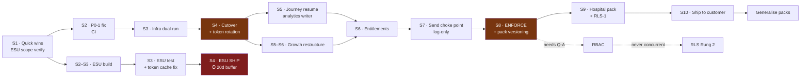
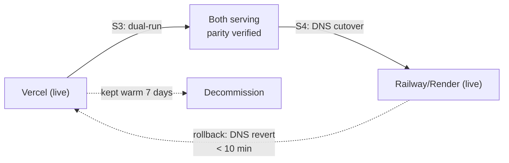

# Phase 2 — Sequencing & Roadmap

**SendAnjal · KGS Techway Services · 2026-07-30 · planning only, no code written**

**Inputs:** `docs/00-current-state.md` (Phase 0) · `docs/01-architecture.md` +
`docs/02-gap-impact-analysis.md` (Phase 1) · `docs/platform-v2/` (baseline).

---

## 1. The two facts that determine this plan

### 1.1 ⏰ Embedded Signup v4 is 11 weeks away

**Today: 2026-07-30. Deadline: 2026-10-15. That is 77 days.** **[GT]**

Under a 2-week sprint cadence starting Mon 3 Aug, the deadline falls **inside Sprint 6**.
Anything scheduled to *finish* in Sprint 6 has zero buffer.

> **If ESU v4 is not done, new customer onboarding stops.** Not degrades — stops. That
> makes it the highest-consequence date on the board, ahead of both P0 blockers, because
> the P0 blockers break *existing* automation while ESU breaks *acquisition*.

**Mitigating fact [REPO]:** the code is already on `sessionInfoVersion: 3`, not v2 as Ground
Truth states (Phase 0 §G). The migration may be materially smaller than budgeted — **but
this must be verified against Meta's current changelog in Sprint 1, not assumed.** That
verification is the single most schedule-relevant task in the plan.

### 1.2 👥 Two founders is ~1.2 FTE of engineering, not 2.0

**[A1]** Founders also sell, support, hire and raise. Phase 1 identified **~35
engineer-weeks** of architectural work, plus the P0 blockers, the Growth restructure and ESU.

At 1.2 FTE that is **~9 months of calendar time for Phase 1 alone** — before any UI work,
before the 19 missing tables, before RBAC.

**This plan therefore does not schedule all of Phase 1.** It schedules a defensible subset
and states explicitly what is cut. Attempting the whole thing is how a 2-person team ships
nothing for a year.

---

## 2. 🔪 Recommended scope cut

Phase 1 specified the *right* architecture. This is what I would actually build first.

| Build now (Sprints 1–10) | Defer (revisit after) | Why deferred |
|---|---|---|
| P0-1, P0-2, ESU v4, Growth restructure | — | Non-negotiable |
| Foundation: types, CI, financial audit | — | Everything else decays without it |
| Workers (journey resume, token rotation) | — | Unblocks the product's core promise |
| Entitlements (features, plan_entitlements, resolver) | Add-ons, coupons, usage rollup | Add-ons need something to sell first |
| Pack versioning + Hospital reference pack | Terminology, dashboards, registry, partner packs | Version-pinning is the safety property; the rest is polish |
| Send choke point + 24h window everywhere | Meta rate-limit modelling | Correctness before optimisation |
| RLS **Rung 1** (lint + cross-tenant tests) | RLS **Rung 2** (session-variable) | Rung 1 is 1 week and catches the real bug class. Rung 2 is 3–4 weeks and needs the Q1 answer |
| — | **RBAC** | 3 weeks, needs the tenant-model decision (Q-A) first. Painful to defer — it blocks 4 personas — but it is not what makes the product *work* |
| — | Partner layer, GST, marketplace, multi-provider AI | 🔶 Decision items, none confirmed |

**Cut rationale:** every deferred item is either (a) gated on an unanswered decision, or
(b) valuable but not on the path to "the product does what we sell." **[A2]**

---

## 3. Two parallel tracks

Two founders → two tracks that rarely touch the same files.

| | **Track A — Platform** | **Track B — Product & Meta** |
|---|---|---|
| Owns | Infra, queues, billing engine, entitlements, security | Meta integration, onboarding, packs, client-facing surfaces |
| Sprints 1–4 | P0-1, P0-2, foundation | **ESU v4** (deadline), Growth restructure design |
| Sprints 5–10 | Workers, entitlements, choke point, RLS-1 | Growth rollout, Hospital pack, pack versioning |
| Collision risk | Low — different modules | Coordination point: the send choke point (§7, Sprint 7) |

---

## 4. Sprint plan

Sprints are 2 weeks. Dates assume a Mon 3 Aug start.

### 🔴 Sprint 1 · Aug 3–14 · *Stop the bleeding, and learn the ESU truth*

| Track | Epic | Work | Exit criterion |
|---|---|---|---|
| A | **E5 Foundation** | Repoint `automation_runtime_intent` to the cheap model **(2 h, one DB row, no deploy)** · widen `ai_model_config` CHECK · extend `lib/audit.ts` to rate/margin/billing-mode/tier/AI-config | Margin leak stopped; **no privileged financial action is unlogged** |
| A | **E1 P0-1** | **Diagnose only.** Test the four hypotheses (Deployment Protection · missing Vercel env · token mismatch · which of the two URLs is registered) | Root cause named in writing |
| B | **E3 ESU v4** | **Verify actual scope against Meta's changelog.** Code is on `sessionInfoVersion: 3` **[REPO]**; confirm what v4 requires | **Scope confirmed. This is the schedule-defining answer** |
| B | **E5** | `supabase gen types typescript` → second client export | Drift is compile-visible |

> **Sprint 1 has one job beyond the quick wins: find out how big ESU v4 actually is.**
> Everything after this depends on that number.

### 🔴 Sprint 2 · Aug 17–28 · *Production unblocked*

| Track | Epic | Work | Exit criterion |
|---|---|---|---|
| A | **E1 P0-1** | Apply the fix. Re-register webhook. Verify with a real inbound message end-to-end | Inbound messages arrive **and persist** |
| A | **E5** | GitHub Actions: `tsc` + lint + build + `prepaid_wallet_test.sql` + unit tests on the 12 pure functions | CI green and merge-blocking |
| B | **E3 ESU v4** | Implement | Migration code complete |

### 🟠 Sprint 3 · Aug 31–Sep 11 · *Infra migration*

| Track | Epic | Work | Exit criterion |
|---|---|---|---|
| A | **E2 P0-2** | Railway/Render: web + worker services, env parity, Redis, `DATABASE_URL`, minute-cron. **Dual-run with Vercel; do not cut over yet** | Both environments serving; parity verified |
| B | **E3 ESU v4** | Test end-to-end against a real Meta app. Fix the per-process ESU token cache (signed JWE cookie) — **this is the intermittent-onboarding-failure bug [REPO]** | ESU completes reliably on multi-instance |

### 🟠 Sprint 4 · Sep 14–25 · *Cut over · ESU ships*

| Track | Epic | Work | Exit criterion |
|---|---|---|---|
| A | **E2 P0-2** | DNS cutover. Vercel kept warm 1 week for rollback | Production on Railway/Render |
| A | **E6 Workers** | BullMQ via the existing `QueueDriver` seam · **Meta token rotation** (prevents ~60-day tenant outages) | Workers running; no token within 7 days of expiry |
| B | **E3 ESU v4** | **SHIP — 3 weeks before deadline** | ✅ **v4 live 2026-09-25, 20 days of buffer** |

### 🟡 Sprint 5 · Sep 28–Oct 9 · *Async product promise*

| Track | Epic | Work | Exit criterion |
|---|---|---|---|
| A | **E6 Workers** | **Journey resume** (`chatbot_sessions.resume_at` — written and never read **[REPO]**) · webhook-inbox replay · `daily_analytics` writer | Multi-step flows fire. Analytics stops showing zeros |
| B | **E4 Growth** | **Restructure design + decision.** Economics do not close today (Phase 0 §H.2) | Model chosen and priced |

> ⚠️ **Journey resume silently activates dormant multi-step flows for every provisioned
> tenant**, including all 26 seeded pack flows. Ship disabled → enable per tenant →
> **announce the behaviour change.** See RB-4.

### 🟡 Sprint 6 · Oct 12–23 · *Billing truth*

| Track | Epic | Work |
|---|---|---|
| A | **E7 Entitlements** | `features`, `plan_entitlements`, resolver with 7-level precedence + exhaustive unit tests. **Shadow-mode dual-read against `TIER_TASKS` until byte-identical** |
| B | **E4 Growth** | Implement restructure. **Existing Growth tenants grandfathered or migrated with notice** |

### 🟡 Sprint 7 · Oct 26–Nov 6 · *One way to send*

| Track | Epic | Work |
|---|---|---|
| A+B | **E8 Choke point** | Single `sendMessage()`: 24h window + entitlements + billing + logging. Route all 7 send paths through it. **Log-only mode** |
| A | **E7** | Replace `TIER_TASKS` with `plan_entitlements`. Message cap in **log-only** |

### 🟢 Sprint 8 · Nov 9–20 · *Enforce, carefully*

| Track | Epic | Work |
|---|---|---|
| A | **E8/E7** | Read the log-only data → notify affected tenants/integrators → **enforce** window + cap behind `ENFORCE_*` flags |
| B | **E9 Hospital pack** | Pack versioning schema (`pack_versions`, `pack_artifacts`, `pack_installs`) + migrate the 58 existing artifacts to v1 |

### 🟢 Sprint 9 · Nov 23–Dec 4 · *Reference vertical*

| Track | Epic | Work |
|---|---|---|
| B | **E9 Hospital pack** | Author Hospital pack v1 on the versioned schema. Booking record (M17) + `BOOKING_CONTEXT` artifacts |
| A | **E11 RLS-1** | Tenant-predicate CI lint + two-tenant cross-tenant test suite, merge-blocking |

### 🟢 Sprint 10 · Dec 7–18 · *Prove it, then generalise*

| Track | Epic | Work |
|---|---|---|
| B | **E9** | **Ship Hospital pack to a real customer.** Reminders now fire (E6 landed Sprint 5) |
| A | **E5** | Margin dashboard from `ai_usage_log` + `message_billing` — **data already collected, never read [REPO]** |

**Gate: do not generalise to a second pack until Hospital has one paying customer using it.** **[GT]**

### Beyond Sprint 10 — sequenced, not scheduled

| Epic | Prerequisite |
|---|---|
| E10 RBAC (Owner/Manager/Staff + team login) | **Q-A tenant-model decision** |
| E11 RLS Rung 2 | Q1 answer; must **not** overlap E10 |
| E12 Pack generalisation (packs 2–4) | Hospital reference customer |
| E13 AI Center (prompt library, per-tenant opt-out) | Entitlements (E7) |
| 19 missing tables | **Q-F deploy-or-delete decision** |
| 🔶 Partner layer · GST · marketplace | Decision items |

---

## 5. Dependency graph



---

## 6. Risk Register

Scored L(1–5) × I(1–5).

| ID | Risk | L | I | Score | Mitigation | Owner |
|---|---|:-:|:-:|:-:|---|---|
| **R1** | **ESU v4 is larger than the v3 starting point suggests → misses Oct 15 → onboarding stops** | 3 | 5 | **15** | Verify scope in **Sprint 1**. If > 3 sprints, drop Growth restructure from S5–S6 and reassign Track A. 20-day buffer built in | B |
| **R2** | Infra cutover loses in-flight work or breaks webhooks | 3 | 5 | **15** | Dual-run S3; DNS cutover only after parity; Vercel warm 1 week; `webhook_inbox` replay covers gaps | A |
| **R3** | P0-1 root cause is not one of the four hypotheses | 2 | 5 | **10** | Sprint 1 is diagnosis-only precisely so this surfaces early with 1 sprint of slack | A |
| **R4** | **Journey resume floods customers with dormant multi-step messages** | 4 | 4 | **16** | Ship disabled → per-tenant enable → announce. Cap sends/tenant/hour on first enable | A |
| **R5** | Growth restructure loses or angers existing Growth tenants | 3 | 4 | **12** | Grandfather existing tenants; 30-day notice; no retroactive charges | B |
| **R6** | Message-cap / window enforcement blocks legitimate traffic | 3 | 4 | **12** | Mandatory log-only phase; measure; notify; `ENFORCE_*` flags | A |
| **R7** | Entitlement resolver bug → platform-wide lockout or free-for-all | 2 | 5 | **10** | Shadow dual-read vs `TIER_TASKS` until byte-identical; unit tests on all 7 levels | A |
| **R8** | 2-founder capacity overrun; roadmap slips ~2× | 4 | 3 | **12** | Scope cut (§2) already applied; **re-plan at Sprint 5**, cut further rather than extend |  Both |
| **R9** | Q1 unanswered → RLS Rung 2 and any Prisma/Fastify work stall | 4 | 2 | **8** | Rung 1 delivers most of the value and is stack-independent | A |
| **R10** | Pack artifact migration loses or corrupts the 58 seeded rows | 2 | 4 | **8** | Copy-then-switch; old table read-only one release; `key` collision check pre-migration | B |
| **R11** | Meta changes wholesale rates unnoticed → selling below cost | 2 | 4 | **8** | `meta_rates` staleness alert (> 60 days) in Sprint 1 audit work | A |
| **R12** | Hospital sale stalls on missing SSO/MFA/RBAC/DPA | 4 | 3 | **12** | **Sell the Hospital pack to Clinics first** (Phase 1 §1.4, Q-E). Same content, owner-decides buyer | B |
| **R13** | Redis/BullMQ adoption reintroduces the Vercel-era queue bugs | 2 | 3 | **6** | Swap behind the existing `QueueDriver` seam; keep pg-boss driver as fallback | A |
| **R14** | Type generation turns `tsc` red and blocks all merges | 3 | 2 | **6** | Land as a second client export; migrate callers incrementally | A |

**Top three by score: R4 (16), R1 (15), R2 (15).** All three are *activation* risks — things
that go from dormant to live and surprise customers. Each has a staged-enable mitigation.

---

## 7. Rollback strategies

Per the required categories.

### 7.1 Database schema changes

| Property | Standard |
|---|---|
| Shape | **Expand → migrate → contract.** Never drop in the same release that adds |
| Additive changes | Nullable columns / new tables only. Rollback = `git revert`; leave the column |
| Data moves (E9 packs) | Copy-then-switch. Source table read-only for **one full release**. Rollback = repoint reads |
| Destructive | Only after one release with zero reads observed in logs |
| Verification | Every migration ships with a **down** script, tested against a branch DB before production |
| Current advantage | Very little production data (1 user, 21 contacts, 3 flows **[REPO]**) — rollback is cheap **today** and gets more expensive every month |

**Named rollbacks:**

| Change | Rollback |
|---|---|
| `pack_*` tables | Repoint `lib/verticals/repository.ts` to `vertical_template_library`. Data untouched |
| `features` / `plan_entitlements` | Re-enable `TIER_TASKS` code path (kept until shadow mode proves equivalence) |
| `users.role_key` | Column stays, `ENFORCE_RBAC=false` → everyone is owner again |
| RLS policies | `ALTER TABLE … DISABLE ROW LEVEL SECURITY`, **per table**, instant |
| `ai_model_config` CHECK widening | Purely additive; no rollback needed |

### 7.2 Infrastructure migration (P0-2)



| Step | Rollback | Recovery |
|---|---|---|
| Dual-run | Stop the new deployment. Zero impact | Instant |
| DNS cutover | Revert DNS. Vercel still warm | < 10 min (TTL-bound) |
| Post-decommission | Redeploy from git; Vercel config in repo | ~1 h |
| **Irreversible** | Messages sent from the new host cannot be un-sent | — |

**Data safety:** the database does **not** move (recommended — see Q-G). Compute-only
migration means rollback never risks data. **If you move the database too, this rollback
plan does not hold and needs rewriting.**

**Queue drain:** before cutover, drain the Vercel-side queue to empty and confirm
`webhook_inbox` has no unprocessed rows.

### 7.3 Billing model change (Growth restructure)

**The highest-consequence rollback in the plan, because it touches money already taken.**

| Principle | Rule |
|---|---|
| No retroactive repricing | Existing Growth tenants keep their current terms until they opt in or a notice period elapses |
| Grandfather by default | New pricing applies to new subscriptions; existing ones migrate on renewal |
| Notice | 30 days minimum before any change to an active subscription |
| Reversibility window | Keep the old pricing path executable for one full billing cycle |
| Ledger integrity | **Never mutate `transactions` or `message_billing` history.** Corrections are new compensating entries |

| Step | Rollback |
|---|---|
| New tier definition | `plan_tiers` row edit — instant revert |
| Repricing existing tenants | `entitlement_overrides` restores prior terms per tenant |
| Wallet/credit change | **No rollback for consumed credits.** Compensating credit only |
| Cap enforcement | `ENFORCE_MSG_CAP=false` |

> ⚠️ **The Growth restructure is a business-model decision, not an architecture one.**
> Phase 1 deliberately did not design it. Sprint 5 is scheduled for the *decision*, Sprint 6
> for implementation. If the decision slips, Sprint 6 becomes buffer for R1 (ESU).

### 7.4 Behaviour activations — the staged-enable pattern

R4, R6 and the RBAC rollout share one shape, and one mitigation:

```
1. Ship the code path DISABLED (env flag, default off)
2. Enable in LOG-ONLY: record what would have happened, change nothing
3. Read the logs. Quantify who is affected
4. Notify affected tenants / integrators
5. Enable for one internal tenant
6. Enable per-tenant, then globally
7. Flag stays for one full release
```

**No behaviour-changing element ships without a flag that reverts it in one action.**

---

## 8. Milestones

| Date | Milestone | Proof |
|---|---|---|
| **Aug 14** | Margin leak stopped; financial actions audited; ESU scope known | Audit rows exist; ESU estimate in writing |
| **Aug 28** | **P0-1 resolved.** CI green and blocking | Real inbound message arrives and persists |
| **Sep 25** | **⏰ ESU v4 SHIPPED** — 20 days before deadline | New WABA onboarded end-to-end on v4 |
| **Sep 25** | **P0-2 resolved.** Persistent workers live | Worker processes running; token rotation active |
| **Oct 9** | Multi-step journeys fire | A 3-step reminder completes end-to-end |
| **Oct 23** | Growth tier economics close | New pricing live; existing tenants grandfathered |
| **Nov 20** | One way to send; window + cap enforced | All 7 paths through `sendMessage()`; 131047 rate < 0.1% |
| **Dec 18** | **Hospital pack live with a paying customer** | Reference customer using seeded flows |

---

## 9. What "done" looks like at Sprint 10

| Dimension | Today | Sprint 10 |
|---|---|---|
| Webhooks | 🔴 failing | ✅ verified, persisting |
| Async workers | 🔴 none durable | ✅ BullMQ on persistent host |
| Multi-step journeys | 🔴 never resume | ✅ fire on schedule |
| Onboarding | ⚠️ ESU v3, intermittent | ✅ v4, reliable |
| Growth tier | 🔴 economics don't close | ✅ restructured |
| Entitlements | 🔴 4 overlapping mechanisms | ✅ one resolver |
| 24h window | 🔴 2 of 7 send paths | ✅ all paths |
| Token expiry | 🔴 no rotation | ✅ automated |
| Financial audit | 🔴 unlogged | ✅ complete |
| Industry packs | ⚠️ unversioned | ✅ versioned, Hospital live |
| Tenant isolation | 🔴 app-layer only | 🟡 Rung 1 (tests + lint) |
| RBAC | 🔴 none | 🔴 **still none — deferred** |

**Readiness estimate: ~46 → ~78 / 100.** RBAC, RLS Rung 2 and the 19 missing tables are the
remaining gap to enterprise-grade.

---

## 10. Assumptions & Open Questions

### Assumptions

| # | Assumption | If wrong |
|---|---|---|
| **A1** | 2 founders ≈ 1.2 FTE engineering | Timeline scales inversely; re-plan at Sprint 5 |
| **A2** | Scope cut (§2) is acceptable — RBAC deferred past Sprint 10 | If RBAC is needed sooner, something else drops. It cannot be added for free |
| **A3** | ESU v4 from a v3 base is ≤ 3 sprints | R1. **Verified in Sprint 1** |
| **A4** | Database stays on Supabase; only compute migrates | Rollback plan §7.2 must be rewritten if the DB moves (Q-G) |
| **A5** | Growth restructure is decidable by Sprint 5 | Sprint 6 becomes ESU buffer instead |
| **A6** | Sprint 1 can start Mon 3 Aug 2026 | Shift everything; **the Oct 15 deadline does not move** |
| **A7** | No new customer onboards during the infra migration | If they do, dual-run window extends |

### 🚧 Still blocking

| # | Question | Blocks |
|---|---|---|
| **Q1** | Fastify/Prisma/Redis+BullMQ — target or mis-description? | RLS Rung 2; my split recommendation stands (`01-architecture.md` §12.2) |
| **Q-A** | Organizations model / `tenant_id` | **RBAC cannot be sequenced without this** |
| **Q-F** | 19 missing tables — deploy or delete? | Roadmap scope beyond Sprint 10 |
| **Q-G** | Does P0-2 move the database, or compute only? | **Changes the §7.2 rollback plan materially.** Recommend compute-only |

### 🔶 Decision items — unchanged, still flagged **[GT]**

| # | Item | Recommendation |
|---|---|---|
| Q-B | Partner/reseller layer | Defer past Sprint 10 |
| Q-C | GST / coupons / billing history | **After** the Growth restructure. GST is a real India B2B blocker — schedule it Sprint 11 |
| Q-D | Multi-provider AI | Interface only. One live action, already in Sprint 1 |
| Q-E | Hospitals vs Clinics as first buyer | **Build Hospital pack content, sell to Clinics first** (R12) |

---

## Phase 2 exit

**Status: complete. Stopping for approval.**

Per the operating prompt, Phase 3 implementation begins only on explicit approval of
Phases 0–2, starting with the P0 blockers, each as its own reviewable change.

**Before approving, four answers would sharpen this materially:** Q-G (does the DB move?),
Q-A (organizations?), Q-F (19 tables?), and confirmation that the §2 scope cut — **RBAC
deferred past Sprint 10** — is acceptable.
