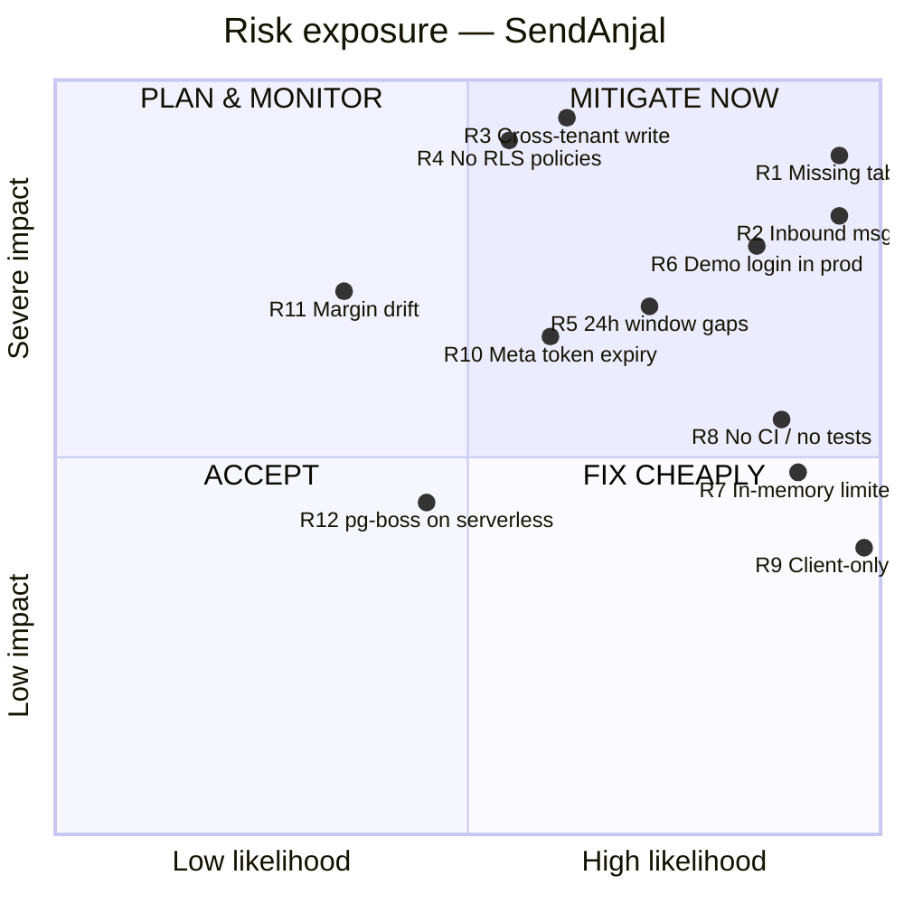

# 00 — CTO Executive Summary

**Verdict: a genuinely well-architected core wrapped in a shell of undeployed features.**

## Executive summary

SendAnjal is a multi-tenant WhatsApp Business API SaaS (BSP/Tech Provider model) for the
Indian SMB market. The **money path and the message path are unusually well built** —
reserve/confirm prepaid billing with Postgres-enforced idempotency, integer-paise
arithmetic, HMAC-verified idempotent webhooks, a config-driven AI layer with its own
metered credit ledger, and a swappable job-queue seam. That work is senior-grade and
the in-code documentation is better than most funded startups produce.

The problem is not the architecture. **The problem is that a large fraction of the
codebase addresses a database that does not exist.** A live schema dump of the
production Supabase project shows **19 of the tables the application queries are
absent**, and several tables that do exist have drifted at the column level from what
the code writes. The result is a product where roughly a third of the navigable
surface fails silently.

Two independent tenant models coexist in the source tree — a legacy `user_id` model
(deployed) and an organization model (never deployed). Twelve files, including the
entire visual flow-automation engine, target the undeployed one and are therefore
dead in production while appearing fully implemented.

**Readiness for enterprise-grade Vertical SaaS: 46 / 100.** The foundations that are
hardest to build (billing correctness, webhook integrity, AI governance, and — notably
— the new verticals layer) are already right. The gap is almost entirely
*deployment/consistency work and frontend architecture*, not redesign.

---

## Top 10 findings, ranked by business impact

| # | Finding | Severity | Evidence |
|---|---|---|---|
| 1 | **19 code-referenced tables missing from the live DB.** CRM, catalog/commerce, ads/CTWA attribution, appointments, subscriptions, webhook audit log, and the whole org model do not exist in production. | 🔴 Critical | Live query, [05](05-DATABASE.md#drift-register) |
| 2 | **Inbound messages are never persisted.** The webhook writes `messages.meta_message_id` (column is `wa_message_id`) and omits `user_id`/`type`, both `NOT NULL`. Every inbound insert fails. The Inbox cannot show incoming messages. | 🔴 Critical | `app/api/webhook/whatsapp/route.ts:421-427` vs live `messages` columns |
| 3 | **Cross-tenant write.** Contact window refresh filters on `phone` only, with no tenant predicate — it updates every tenant's row for that phone number. Violates Law #1. | 🔴 Critical | `app/api/webhook/whatsapp/route.ts:386-389` |
| 4 | **Zero RLS policies deployed.** All 37 tables have RLS enabled and **no policies at all**. Tenant isolation rests entirely on hand-written `.eq("user_id", …)` in 90+ route files. No defence in depth. | 🔴 Critical | `pg_policies` returns 0 rows; Supabase advisor: 37× `rls_enabled_no_policy` |
| 5 | **The 24-hour window (Law #5) is enforced in 2 of ~7 send paths.** `canSend()` has exactly one caller. `/api/whatsapp/send`, `/api/v1/messages/send`, `campaigns/execute`, `products/send`, `carts/recover` do not check it. | 🟠 High | `grep canSend(` → `lib/whatsapp/dispatch.ts:46` only |
| 6 | **41 of 43 pages are `"use client"`.** Zero React Server Components used for data fetching; every screen is a client-side waterfall against `/api/*`. 17,247 LOC of dashboard is client bundle. | 🟠 High | Directive scan, [08](08-FRONTEND.md) |
| 7 | **No CI, no ESLint config, no unit tests.** 212 lines of Playwright e2e total. The `npm run check` gate exists and is good, but nothing enforces it. | 🟠 High | No `.github/`, no `.eslintrc*`, no test runner in `package.json` |
| 8 | **Rate limiting and the ESU token cache are per-process in-memory** on a serverless platform — effectively bypassed under normal Vercel scaling. | 🟠 High | `lib/rate-limit.ts:11`, `lib/whatsapp/token-cache.ts:22` (both self-documented) |
| 9 | **`DEMO_AUTO_LOGIN=true` grants any visitor a full authenticated session as the demo user in production.** Deliberate, documented — but it is a live, unauthenticated path to a real tenant. | 🟠 High | `middleware.ts:54-61`, `app/api/auth/dev-login/route.ts:20-23` |
| 10 | **The verticals layer is the healthiest subsystem and is already live.** 2,333 LOC, DB deployed and seeded (6 verticals, 58 library rows), AI injection wired at all 3 call sites, no hardcoded vertical copy. | 🟢 Asset | Live row counts; `grep buildVerticalPromptContext` → 3 routes |

---

## Readiness score — enterprise-grade Vertical SaaS

Weighted rubric. Each dimension scored 0–10 on evidence, weighted by how much it
gates an enterprise vertical-SaaS sale.

| Dimension | Weight | Score | Weighted | Basis |
|---|---:|---:|---:|---|
| Billing & money correctness | 12% | 9 | 1.08 | Reserve/confirm, integer paise, DB-enforced idempotency, margin trail |
| Message pipeline integrity | 12% | 6 | 0.72 | Send path + status settle solid; 24h window under-enforced; inbound persistence broken |
| **Schema ↔ code consistency** | 12% | 2 | 0.24 | 19 missing tables, column drift, two tenant models |
| Multi-tenant isolation | 10% | 4 | 0.40 | App-layer only, 0 RLS policies, one confirmed cross-tenant write |
| Security posture | 10% | 5 | 0.50 | Good headers/CSP/encryption/HMAC; in-memory limiter, prod demo bypass, no CSRF token |
| AI architecture | 8% | 9 | 0.72 | Config-driven routing, separate credit ledger, tier gate, graceful fallback, always-logged |
| Vertical SaaS foundation | 8% | 8 | 0.64 | Data-driven verticals deployed; booking generalized; 3 injection points |
| Frontend architecture | 8% | 3 | 0.24 | All-client pages, 420 LOC avg, 5 shared primitives, no RSC |
| RBAC & enterprise auth | 6% | 2 | 0.12 | No role column; admin = env allowlist; no SSO/SCIM; `team_members` unenforced |
| Testing & CI/CD | 6% | 1 | 0.06 | No CI, no unit tests, no lint config; tsc clean |
| Observability | 4% | 3 | 0.12 | Structured JSON logger, but stdout-only; no APM/Sentry/tracing |
| Public API & DX | 4% | 7 | 0.28 | Real key auth, scopes + inheritance, OTP flow, docs page |
| **Total** | **100%** | | **5.12** | |

### **Final readiness: 46 / 100** *(5.12 × 10, rounded to the nearest integer, floor-adjusted for the Critical-severity schema gap)*

Score bands used: 0–35 prototype · 36–55 pre-production · 56–75 production · 76–90
enterprise-capable · 91–100 enterprise-grade.

**Band: pre-production.** The honest reading is that SendAnjal is a *strong late-stage MVP
with an enterprise-grade billing core*, not yet a production multi-tenant platform.

### What moves the number fastest

| Action | Effort | Score delta |
|---|---|---|
| Apply/author migrations for the 19 missing tables, or delete the dead features | 2–3 wks | **+14** |
| Fix inbound persistence + the cross-tenant contact write | 2 days | **+6** |
| Deploy RLS policies for the live `user_id` model | 1 wk | **+6** |
| Route every send through one `canSend()`-gated function | 3 days | **+4** |
| Add CI (tsc + lint + e2e) and a unit-test harness for `lib/billing` and `lib/ai` | 1 wk | **+4** |
| Move rate limiting + token cache to Postgres or Upstash | 3 days | **+3** |
| Convert the 10 heaviest pages to RSC data fetching | 3 wks | **+5** |

Those seven items take the score to roughly **88/100** without any redesign.

---

## Risk matrix

Likelihood × Impact. Detailed mitigations in [20-ROADMAP-ADR.md](20-ROADMAP-ADR.md).

| ID | Risk | L | I | Score | Owner surface |
|---|---|---|---|---|---|
| R1 | 19 code-referenced tables absent in prod | 5 | 5 | **25** | `supabase/migrations/`, 40+ routes |
| R2 | Inbound WhatsApp messages silently dropped | 5 | 4 | **20** | `app/api/webhook/whatsapp/route.ts` |
| R3 | Cross-tenant contact write | 3 | 5 | **15** | `app/api/webhook/whatsapp/route.ts:386` |
| R4 | No RLS — single missed `.eq()` leaks a tenant | 3 | 5 | **15** | every route file |
| R6 | Public demo auto-login in production | 4 | 4 | **16** | `middleware.ts`, `dev-login` |
| R5 | Free-form send outside 24h window → Meta 131047 + quality-rating damage | 4 | 4 | **16** | 5 send routes |
| R8 | No CI/tests — regressions ship unnoticed | 4 | 3 | **12** | repo-wide |
| R10 | 60-day Meta long-lived tokens with no rotation job | 3 | 4 | **12** | `lib/meta.ts:extendToken`, no cron |
| R11 | Margin drift if `meta_rates` not maintained | 2 | 4 | **8** | `lib/billing/rates.ts` |
| R7 | In-memory rate limiter ineffective on Vercel | 5 | 2 | **10** | `lib/rate-limit.ts` |
| R12 | pg-boss cron drains once per **day**, not per minute | 2 | 3 | **6** | `vercel.json` |
| R9 | All-client frontend → poor LCP, large bundle | 5 | 2 | **10** | 41 pages |

> **Note on R12:** `CLAUDE.md` states the drain cron "runs every minute". The deployed
> `vercel.json` schedule is `"0 0 * * *"` — **once daily**. With `QUEUE_DRIVER=pgboss`,
> queued inbound events would sit up to 24h. Verified: `vercel.json:4`.

---

## What is genuinely good (do not refactor these)

1. **`lib/billing/*`** — reserve → send → confirm-on-Meta-status, with `wallet_settle`
   idempotent per `(reservation_id, wa_message_id)` and row-locked SQL. A message that
   never reaches `sent` is never charged. This is correct by construction.
2. **`lib/ai/service.ts`** — one governed path: config load → tier gate → credit
   pre-check → timed provider call → validate/retry → debit-on-success → always-log.
   Provider adapters are a clean seam; no model id anywhere in a route.
3. **`lib/queue/index.ts`** — driver interface with inline and pg-boss implementations,
   so durability is a config change.
4. **`lib/verticals/*`** — shapes in TypeScript, all names/copy/flows in the database.
   The standing "no hardcoded vertical" rule is actually honoured.
5. **`lib/meta-version.ts`** — two version constants with a documented reason for the
   split (Graph vs the browser SDK the ESU handshake must match).
6. **In-code documentation.** Nearly every `lib/` module opens with a rationale block
   that explains *why*, including the caveats. This audit was cheap because of it.

## Recommendations at a glance

| Priority | Recommendation |
|---|---|
| P0 | Decide, per feature, **deploy or delete**. Publish a "live surface" manifest and make the nav reflect it. |
| P0 | Fix inbound message persistence and the cross-tenant contact write. |
| P0 | Ship RLS policies for the deployed `user_id` model. |
| P1 | Collapse to **one** tenant model. Delete the org-model branch (12 files) or commit to migrating. Do not keep both. |
| P1 | Single choke-point send function that enforces window + billing + logging. |
| P1 | CI on every push: `tsc`, `next lint`, `playwright`, plus new unit tests for `lib/billing`. |
| P2 | Externalise rate limiting and the ESU token cache. |
| P2 | Correct the drain-queue cron to `* * * * *` if pg-boss is intended. |
| P2 | Move page data fetching to Server Components, starting with the 6 pages over 700 LOC. |
| P3 | Real RBAC (`role` column + policy helper) before any enterprise deal. |
| P3 | Ship an APM/error sink; `lib/logger` already emits structured JSON. |

**Risk level:** High · **Complexity:** High · **Confidence in this summary:** High (95%)
