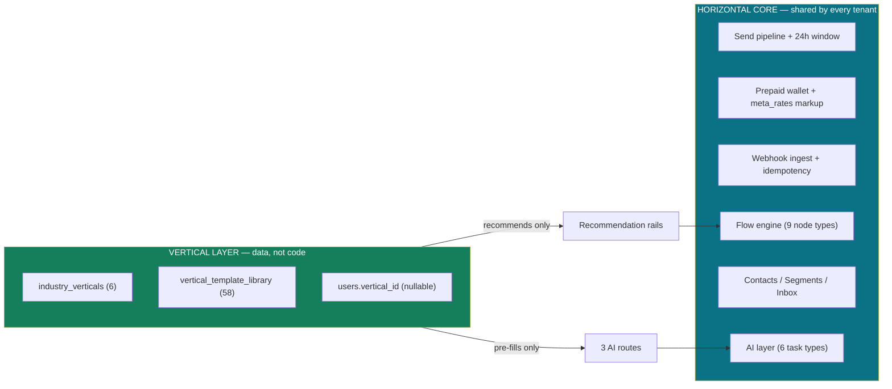
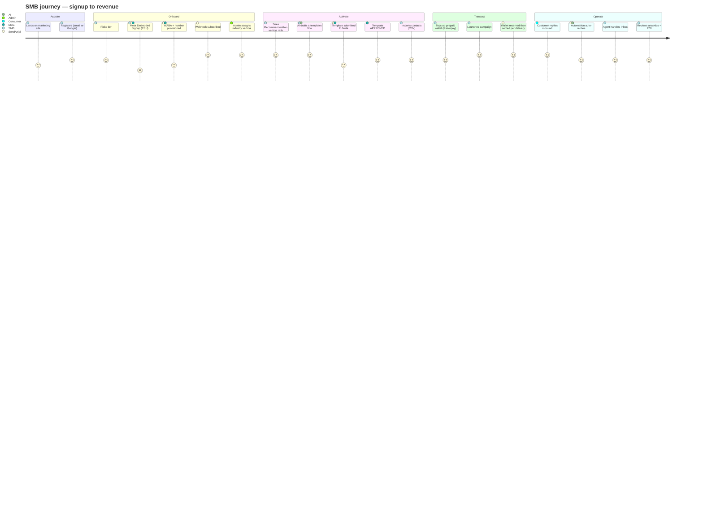

# 01 — Business & Product Discovery

## Executive summary

SendAnjal is a **multi-tenant WhatsApp Business API SaaS for Indian SMBs**, in which the
platform itself acts as a **Meta Tech Provider / BSP**. It is not merely a WhatsApp
marketing tool: it is the telecom-style intermediary that fronts Meta, onboards
businesses onto the WhatsApp Business API, routes their traffic, and bills them at a
markup on Meta's wholesale conversation rates. Positioning: *"Mailchimp for WhatsApp,
where we are also the carrier."*

Product maturity is **late-stage MVP with a production-grade billing core**. The
revenue engine (three coexisting billing models, prepaid wallet, configurable rate
table, tier markups, top-up bonus bands) is real, deployed, and seeded with live
figures. About a third of the *navigable feature surface* is UI-only because its
tables were never deployed.

Horizontal today; **actively mid-conversion to Vertical SaaS** — 6 verticals and 58
library artifacts are already live in the database (uncommitted code on the branch).

**Risk level:** Medium · **Complexity:** Medium · **Confidence:** High (92%) — pricing
and tier facts are live DB values; go-to-market intent is inferred from `CLAUDE.md`,
`.claude/skills/`, and `docs/FOUNDER_GUIDE.md` (the latter not read).

---

## 1. What is this project?

| Question | Answer | Evidence |
|---|---|---|
| Product | Multi-tenant WhatsApp Business API SaaS | `CLAUDE.md`, `app/(dashboard)/**` |
| Platform role | Meta Tech Provider / BSP — resells Meta conversations at a markup | `lib/billing/rates.ts:5`, `plan_tiers.model` = A/B/C |
| Market | India (₹/paise money, IN region rates, Hindi/Tamil/Telugu/Bengali/Marathi/Gujarati locales) | `meta_rates.region='IN'`, `lib/validate.ts:126` |
| Buyer | Small & mid businesses who cannot handle Meta's technical onboarding | `.claude/skills/onboarding-signup` — "Audience is NON-TECHNICAL clients" |
| Delivery | Single Next.js 14 app on Vercel + Supabase Postgres | `package.json`, `.vercel/` |

### Business problem solved

Getting onto the official WhatsApp Business API is genuinely hard for an Indian SMB:
you need a Meta Business Manager, a verified business, a WABA, a dedicated phone
number, template approvals, webhook infrastructure, and a billing relationship with
Meta denominated in USD. SendAnjal collapses all of that into an Embedded Signup flow
and a prepaid ₹ wallet. The business never sees Graph API, never sees a Meta invoice,
and tops up credits like a mobile recharge — a purchasing model Indian SMBs already
understand.

---

## 2. Users

| User type | Surface | Capabilities | Auth |
|---|---|---|---|
| **Tenant owner** (the SMB) | `/dashboard` and all 16 protected areas | Everything: numbers, contacts, templates, campaigns, automations, inbox, wallet, API keys | JWT session cookie |
| **Team member** | — | **Records only.** `team_members` table exists with `role` (`owner`/`admin`/`agent`) but no code enforces it | Not implemented |
| **Platform admin** (SendAnjal staff) | `/admin`, `/admin/rates`, `/admin/clients/[id]/setup` | Meta rate table, tier markups, per-client billing mode, AI model config, vertical provisioning | `ADMIN_EMAILS` env allowlist |
| **Developer / integrator** | `/api/v1/*` | Send messages/documents, contacts CRUD, templates read, OTP request/verify | API key `wsk_{live\|test}_…` + scopes |
| **End consumer** (the SMB's customer) | WhatsApp itself | Receives templates/campaigns, replies inbound, triggers automations | n/a |

> **Finding — no real RBAC.** `users` has no `role` column (verified live). Admin is an
> environment-variable allowlist checked in `lib/auth.ts:47-54`, deliberately kept out
> of the DB "so it can't be self-granted". Defensible for a founder-run platform;
> a hard blocker for any enterprise or reseller deal. See [06-AUTH.md](06-AUTH.md).

---

## 3. Industries supported

Live in `industry_verticals` (6 rows, all `is_builtin=true`, all active):

| Slug | Display name | Flows | Msg templates | Campaign prompts |
|---|---|---:|---:|---:|
| `hospital` | Hospital & Clinic | 5 | 5 | 2 |
| `ecommerce` | Online store | 6 | 5 | 2 |
| `school` | School & College | 6 | 4 | 2 |
| `real_estate` | Real Estate | 5 | 4 | 2 |
| `restaurant` | Restaurant | 2 | 2 | 1 |
| `salon` | Salon & Spa | 2 | 2 | 1 |
| **Total** | | **26** | **22** | **10** |

`users.vertical_id` is a **nullable** FK — NULL is a first-class steady state meaning
"generic experience", not an error (`lib/verticals/repository.ts:154-160`). A vertical
**pre-fills, it never gates**: it is read only by the three AI routes and the
"Recommended for …" rails.

---

## 4. Horizontal or Vertical SaaS?

**Horizontal product, vertical packaging, mid-transition.**



The architectural decision that makes this work: **booking/inquiry is a *configured
instance* of the flow engine, not a forked implementation.** Hospital appointments,
real-estate site visits, school counsellor slots, and salon bookings are all
`capture → qualify → confirm → remind` with different `BookingContext` config carried
in the library row's `payload` (`lib/verticals/types.ts:37-56`). This is the single
highest-leverage design call in the repository. Full assessment in
[18-VERTICAL-READINESS.md](18-VERTICAL-READINESS.md).

---

## 5. Revenue model

Three revenue streams, all present in code and DB.

### 5.1 Subscription (recurring platform fee)

Live `plan_tiers` values:

| Tier | Model | `billing_mode` | `waba_mode` | Monthly | Markup | Msg cap |
|---|---|---|---|---:|---:|---:|
| `starter` | **C** — under platform WABA | `managed` | `shared` | **₹999** | 2500 bps (25%) | 5,000/mo |
| `growth` | **B** — own WABA, we bill | `managed` | `own` | **₹1,999** | 1800 bps (18%) | unlimited |
| `enterprise` | **A** — own WABA, client pays Meta | `byo` | `own` | **₹4,999** | 1000 bps (10%) | unlimited |

`onboarding_fee_paise = 0` on all three today. `razorpay_plan_key` is **NULL** on all
three — plan ids come from env vars instead (`RAZORPAY_PLAN_*`), so the DB column is
currently unused. `setTier()` writes `tier`, `billing_mode`, and `waba_mode` together
so they cannot drift (`lib/billing/tiers.ts:50-72`).

> **Model C is not sendable yet.** `waba_mode='shared'` requires a platform-owned
> number pool that does not exist. `lib/billing/tiers.ts:16-18` documents this
> explicitly: setting a user to `starter` activates wallet billing, but shared-WABA
> send routing is not built. **Starter is currently a plan you can buy but not fully
> use.** Margin-affecting and go-to-market-affecting.

### 5.2 Per-message margin (the profit engine)

```
charged_paise = round( wholesale × (1 + (tier_markup_bps + buffer_bps) / 10000) )
```
`lib/billing/rates.ts:140-142` · `platform_settings.buffer_bps = 1000` (10%)

Derived prices from live data (`meta_rates`, region `IN`, Jan-2026 wholesale):

| Category | Wholesale | Starter (35%) | Growth (28%) | Growth gross margin |
|---|---:|---:|---:|---:|
| MARKETING | 86p | **116p** | **110p** | 24p (21.8% of price) |
| UTILITY | 13p | **18p** | **17p** | 4p (23.5%) |
| AUTHENTICATION | 15p | **20p** | **19p** | 4p (21.1%) |
| SERVICE | 0p | 0p | 0p | — (free, by design) |

Resolution order is per-user override → derived → legacy `message_pricing` default
(`lib/billing/pricing.ts:46-77`). The legacy platform defaults still in the DB
(MARKETING 88p, UTILITY 16p, AUTH 30p) are **lower than the derived prices** for
MARKETING/UTILITY, so if tier config were ever missing, the platform would silently
undercharge. Fallback-driven margin loss — worth an alert, not a redesign.

### 5.3 Breakage & top-up bonuses

| Mechanism | Live value | Source |
|---|---|---|
| Minimum top-up | ₹1,000 | `platform_settings.min_topup_paise = 100000` |
| Low-balance alert | ₹200 | `default_low_balance_threshold_paise = 20000` |
| Credit validity | **12 months** → breakage revenue | `credit_validity_months = 12` |
| Bonus band ≥ ₹1,000 | 0% | `topup_bands` |
| Bonus band ≥ ₹5,000 | +3% (300 bps) | `topup_bands` |
| Bonus band ≥ ₹10,000 | +6% (600 bps) | `topup_bands` |

Bonus resolution takes the **highest band cleared** (`resolveTopupBonusBps`,
`lib/billing/rates.ts:98-112`). Larger prepaid loads buy more credits — classic
float-and-breakage economics.

> **Unable to determine from current repository:** whether credit expiry is actually
> enforced anywhere. `credit_validity_months` is read by `getPlatformSettings()` but
> no expiry job or `expires_at` column exists on `wallet`/`transactions`. If unenforced,
> the breakage revenue line is aspirational.

### 5.4 AI credits — a second, separate meter

`ai_credit_wallet` is a **deliberately separate ledger** from the message wallet
(`lib/ai/wallet.ts:5-8`): credits, not paise, and never merged. Live config:

| Task type | Provider | Model | Credits | Timeout |
|---|---|---|---:|---:|
| `campaign_content` | anthropic | `claude-haiku-4-5` | 1 | 15 s |
| `automation_flow_builder` | anthropic | `claude-sonnet-4-6` | 3 | 30 s |
| `template_content` | anthropic | `claude-sonnet-4-6` | **0** | 20 s |
| `automation_runtime_intent` | anthropic | `claude-haiku-4-5` | **0** | 2 s |
| `appointment_nl_parse` | anthropic | `claude-haiku-4-5` | 1 | 8 s |
| `reminder_draft` | anthropic | `claude-haiku-4-5` | 1 | 10 s |

> **Two margin flags.**
> 1. `automation_runtime_intent` runs on **every inbound message** at 0 credits, on
>    Anthropic Haiku. `lib/ai/service.ts:76-81` explicitly says a Gemini Flash-Lite
>    class model was chosen for this task *because* "cost efficiency there protects
>    margin", and a `GeminiAdapter` is implemented. The live config points at
>    Anthropic instead. This is an unmetered, per-inbound-message cost on the more
>    expensive provider.
> 2. `template_content` at 0 credits is intentional (it predates AI Credits and stays
>    free on every tier — `lib/ai/config.ts:38-40`), but it runs on **Sonnet**, the
>    costlier model, unmetered.

---

## 6. Business workflow — end-to-end user journey



Critical-path status per step:

| Step | Status | Note |
|---|---|---|
| Register / login (email + Google OAuth) | ✅ live | `app/api/auth/*` |
| Tier selection + Razorpay subscription | ✅ live | `billing/create-subscription`, webhook verified |
| Meta Embedded Signup | ⚠️ live but org-model coupled | `save-account` writes both `whatsapp_accounts` (missing) and `whatsapp_numbers` |
| Vertical assignment | ✅ live | `/admin/clients/[id]/setup` |
| AI template / flow draft | ✅ live | config deployed, 6 rows |
| Template submit + sync | ✅ live | `lib/meta.ts:createTemplate`, `getMessageTemplates` |
| Contact import | ✅ live | `contacts/import` |
| Wallet top-up | ✅ live | Razorpay webhook → `wallet_credit` with bonus |
| Campaign send + settle | ✅ live | batch 50, reserve-whole/settle-per-unit |
| **Inbound reply → Inbox** | 🔴 **broken** | `messages` insert fails (column drift) |
| **Automation auto-reply** | ⚠️ partial | first reply only; org-model engine dead |
| Analytics | ⚠️ partial | `daily_analytics` live; CRM/ads panels query missing tables |

---

## 7. Feature matrix — advertised vs actually live

Cross-referenced: sidebar nav (`components/layout/Sidebar.tsx:49-119`), route files,
and the live table list.

| Module | UI | API | Table live? | Verdict |
|---|:--:|:--:|:--:|---|
| Dashboard | ✅ | ✅ | ✅ | **Live** |
| WhatsApp Numbers + ESU | ✅ | ✅ | ✅ `whatsapp_numbers` | **Live** |
| Contacts + Import | ✅ | ✅ | ✅ `contacts` | **Live** |
| Templates (+ Meta sync, library, AI gen) | ✅ | ✅ | ✅ `templates` | **Live** |
| Campaigns (+ create, execute, detail) | ✅ | ✅ | ✅ `campaigns`,`campaign_messages` | **Live** |
| Wallet / Billing / Recharge / Plans | ✅ | ✅ | ✅ `wallet`,`transactions`,`wallet_reservations` | **Live** |
| Admin rates / margin / billing-mode / AI config | ✅ | ✅ | ✅ | **Live** |
| Public API v1 + API keys + OTP | ✅ | ✅ | ✅ `api_keys`,`api_messages`,`otp_codes` | **Live** |
| Outbound webhooks | ✅ | ✅ | ✅ `webhook_endpoints`,`webhook_deliveries` | **Live** |
| **Verticals** (admin setup + rails) | ✅ | ✅ | ✅ `industry_verticals`,`vertical_template_library` | **Live (uncommitted)** |
| Automation flows (visual builder) | ✅ | ✅ | ✅ `automation_flows`,`chatbot_sessions` | **Live, single-reply runtime only** |
| Simple automations | ✅ | ✅ | ✅ `automations` | **Live** |
| Inbox | ✅ | ✅ | ✅ `conversations`,`messages` | ⚠️ **outbound only — inbound insert fails** |
| Analytics | ✅ | ✅ | ✅ `daily_analytics` | ⚠️ partial |
| Segments / RFM | ✅ | ✅ | ❌ `segments` **missing** | 🔴 **Broken** |
| CRM pipeline + deals + activities | ✅ | ✅ | ❌ `crm_*` **missing** | 🔴 **Broken** |
| Catalog / Products / Carts (commerce) | ✅ | ✅ | ❌ `products`,`carts` **missing** | 🔴 **Broken** |
| Ads ROI / CTWA attribution | ✅ | ✅ | ❌ `ad_campaigns`,`ad_leads` **missing** | 🔴 **Broken** |
| Appointments (3 pages) | ✅ | ❌ none | ❌ **missing** | 🔴 **Demo only** — `DEMO_APPOINTMENTS` in local state |
| Team members | ✅ | ✅ | ✅ `team_members` | ⚠️ **records only, no enforcement** |
| Password reset email | ✅ | ⚠️ stub | n/a | 🔴 `TODO` at `forgot-password/route.ts:20` |
| Subscriptions history | — | ✅ | ❌ `subscriptions` **missing** | 🔴 **Broken** |

**Count: 10 fully live · 4 partial · 7 broken/demo.** The sidebar advertises all of them
identically. This is the single biggest gap between perceived and actual product.

---

## 8. Admin capabilities

All gated by `requireAdmin()` → `ADMIN_EMAILS` allowlist. 8 admin route files.

| Capability | Route | Business lever |
|---|---|---|
| Meta wholesale rate table | `POST /api/admin/rates` | **Directly sets COGS** — never hardcoded (Law #2) |
| Tier markup / margin view | `GET /api/admin/margin` | Revenue per tier |
| Per-client billing mode | `POST /api/admin/billing-mode` | Move a client between BYO and managed |
| AI model routing | `GET/POST/PATCH /api/admin/ai-config` | Swap provider/model/price **with no redeploy** |
| Vertical CRUD + seed | `/api/admin/verticals*` | Add "Gym" without a deploy |
| Assign client vertical | `POST /api/admin/clients/[id]/vertical` | Provisioning |

This is a strong operator toolkit — pricing, margin, AI cost, and vertical catalogue
are all runtime-configurable. That is rare at this stage and is a real asset.

---

## 9. Missing business capabilities

Ordered by commercial impact.

| # | Gap | Why it matters | Effort |
|---|---|---|---|
| 1 | **Model C (Starter) cannot send** — no platform number pool | The cheapest, highest-volume tier is unusable; blocks the SMB funnel | High |
| 2 | **No RBAC / seats** | Cannot sell to any business with more than one operator; `team_members` is decorative | Medium |
| 3 | **No invoicing / GST** | India B2B requires GST invoices; nothing generates one | Medium |
| 4 | **No credit-expiry enforcement** | Breakage revenue is modelled but not collected | Low |
| 5 | **Password reset does not send email** | Every forgotten password is a support ticket | Low |
| 6 | **No token-rotation job** | Meta long-lived tokens expire at ~60 days → silent tenant outage | Low |
| 7 | **No self-serve vertical selection** | Admin must assign; adds friction to onboarding | Low |
| 8 | **No usage-based overage billing** | `monthly_msg_cap` (5,000 on Starter) is stored but never enforced | Medium |
| 9 | **No reseller / agency multi-client model** | Blocks the obvious India channel (digital agencies) | High |
| 10 | **No appointment persistence** | Named vertical value prop (hospitals) has no backend | Medium |
| 11 | **No dunning / failed-payment recovery** | Razorpay failures email the user; no retry ladder | Low |
| 12 | **No SLA/uptime surface, no status page** | Enterprise procurement asks for this | Low |

> **On #8 —** `plan_tiers.monthly_msg_cap = 5000` for Starter is read into `TierConfig`
> (`lib/billing/rates.ts:24`) but grep finds no enforcement of it in any send path.
> A Starter tenant with a funded wallet can send unlimited volume. Margin-affecting.

---

## Advantages

- Revenue mechanics are **data-driven and admin-editable**: rates, markups, tiers,
  bonus bands, and AI cost all move without a deploy.
- Prepaid model matches Indian SMB purchasing behaviour and eliminates credit risk.
- Three billing models coexist cleanly behind two boolean-ish axes
  (`billing_mode`, `waba_mode`), so tier changes are one function call.
- The vertical layer adds packaging value without forking the core.

## Disadvantages

- The product **appears ~2× larger than it is**. Seven modules are navigable and broken.
- The cheapest tier is the one that cannot send.
- Revenue depends on a manually maintained `meta_rates` table with no sync job — if
  Meta raises wholesale and nobody updates the row, every send loses money silently.
- No seats, no invoicing, no RBAC caps ARPU at single-operator businesses.

## Recommendations

| P | Recommendation |
|---|---|
| P0 | Publish a **live-surface manifest** and hide/flag the 7 broken modules in nav. Shipping a broken CRM tab costs more trust than not having a CRM. |
| P0 | Either build the Model C number pool or **stop selling Starter as sendable**. |
| P1 | Add a `meta_rates` staleness alert (e.g. warn if newest `effective_from` > 60 days old) — this is the single largest silent-margin risk. |
| P1 | Enforce `monthly_msg_cap`, or delete the column. |
| P2 | Ship GST invoicing and credit expiry — both are revenue, not features. |
| P2 | Point `automation_runtime_intent` at the cheap provider the code was designed for, and update the model ids: live config uses `claude-sonnet-4-6`/`claude-haiku-4-5`; current-generation ids are the Claude 5 family. One `ai_model_config` row each, no deploy. |
| P3 | Self-serve vertical picker at signup, with "Skip / not sure" as an equal-weight option (the code already treats NULL as first-class). |
