# 02 — Repository Structure

## Executive summary

A **single Next.js 14 App Router monolith**, 43,841 LOC of TypeScript/TSX across
249 source files, with no monorepo tooling and no workspace packages. Layering is
`app/` (routes + pages) → `lib/` (domain logic) → Supabase. The structure is
conventional and mostly clean; the notable problems are (a) `app/(dashboard)` holding
**17,247 lines in 41 files** with almost no extraction into `components/`, (b) a
**duplicate tenant-model branch** in `lib/whatsapp/`, and (c) several legacy/reference
artifacts (`prisma/`, `supabase/schema.sql`, `supabase/add_*.sql`) that are documentation
but sit where runtime code lives.

**Risk level:** Medium · **Complexity:** Low · **Confidence:** High (96%) — structure
is fully enumerated; individual page bodies not read.

---

## 1. Size distribution

| Area | LOC | Files | Avg | Purpose |
|---|---:|---:|---:|---|
| `app/(dashboard)` | **17,247** | 41 | 421 | All authenticated screens |
| `app/api` | **11,372** | 113 | 101 | Every backend endpoint |
| `components` | 4,262 | 21 | 203 | Shared UI (thin — see below) |
| `lib/verticals` | 2,333 | 9 | 259 | Industry vertical layer (new) |
| `lib/whatsapp` | 1,972 | 13 | 152 | Meta domain logic |
| `lib` (root) | 2,999 | 19 | 158 | Cross-cutting concerns |
| `app/(auth)` | 568 | 4 | 142 | Login/register/forgot |
| `lib/ai` | 670 | 5 | 134 | AI governance layer |
| `lib/billing` | 633 | 6 | 106 | Money |
| `lib/automation` | 429 | 3 | 143 | Flow schema + intent routing |
| `lib/queue` | 171 | 1 | 171 | Job queue abstraction |
| `supabase/migrations` | 3,394 (SQL) | 34 | 100 | Authoritative schema |
| `e2e` | 212 | 4 | 53 | Playwright specs |

**Signal:** the two largest areas are pages and routes. `components/` is 4,262 lines
for 41 pages — a **4:1 page-to-component LOC ratio**. Healthy Next.js apps invert
this. See [08-FRONTEND.md](08-FRONTEND.md).

---

## 2. Folder-by-folder

### `app/` — routing, pages, and the entire HTTP surface

| Path | Why it exists | Notes |
|---|---|---|
| `app/layout.tsx` (114) | Root shell: fonts, `ThemeProvider`, `ErrorBoundary`, Sonner | One of only 2 server components in `app/` |
| `app/page.tsx` (11) | Root redirect (force-dynamic, emits clean 307) | Commit `b27c093` |
| `app/(auth)/` | Route group: unauthenticated screens | Own minimal layout (7 lines) |
| `app/(dashboard)/` | Route group: the product | `layout.tsx` is `"use client"` — **forces every child into the client bundle** |
| `app/api/` | 113 route handlers | Flat-ish REST; see [07](07-API-CATALOGUE.md) |
| `app/docs/api/page.tsx` (274) | Public API docs page | Duplicates `app/(dashboard)/settings/api/docs/page.tsx` (539) — see §5 |
| `app/sitemap.ts` | Next.js sitemap | |
| `app/globals.css` (294) | **All design tokens** — two palettes (app teal + vertical "workbench") | |

### `lib/` — domain logic

```
lib/
├── auth.ts             JWT sign/verify, getSessionUser, isAdminEmail, requireAdmin
├── supabase/server.ts  Service-role client factory (12 lines, 2 aliased exports)
├── crypto.ts           AES-256-GCM for Meta tokens at rest
├── validate.ts         Zod schemas — used by only 3 routes (see §6)
├── rate-limit.ts       In-memory sliding window  ⚠ per-process
├── logger.ts           Structured JSON → stdout
├── audit.ts            Append-only audit_logs writer (never throws)
├── api-keys.ts         Public API key gen/hash/auth/scopes/rate-limit
├── api.ts              CLIENT-side typed fetch wrapper (448 lines)
├── utils.ts / motion.ts  cn(), framer-motion presets
│
├── billing/            ⭐ the money core — 6 files, all read, all sound
│   ├── guarded-send.ts   reserve → send → link message_billing
│   ├── wallet.ts         typed wrappers over 5 SQL RPCs
│   ├── confirm.ts        settle-on-sent / release-on-failed
│   ├── pricing.ts        category resolution + quote
│   ├── rates.ts          meta_rates × tier markup × buffer
│   └── tiers.ts          tier ⇄ (billing_mode, waba_mode) lockstep
│
├── whatsapp/           13 files — ⚠ SPLIT ACROSS TWO TENANT MODELS
│   ├── window.ts         24h window (pure + DB)      [model-agnostic]
│   ├── dedup.ts          processed_events idempotency [model-agnostic]
│   ├── status.ts         monotonic status ranking     [legacy user_id]
│   ├── inbox.ts          webhook_inbox persist-first  [model-agnostic]
│   ├── errors.ts         typed error hierarchy        [model-agnostic]
│   ├── token-cache.ts    ESU one-shot cache  ⚠ in-memory
│   ├── queue.ts          inbound worker (bridges BOTH models)
│   ├── engine.ts         flow engine        🔴 ORG MODEL — dead in prod
│   ├── dispatch.ts       outbound + window gate 🔴 ORG MODEL — dead in prod
│   ├── service.ts        🔴 ORG MODEL
│   ├── repository.ts     🔴 ORG MODEL
│   ├── dto.ts            🔴 ORG MODEL
│   └── onboarding-repo.ts  legacy user_id
│
├── ai/                 ⭐ config.ts · service.ts · wallet.ts · prompts/{flow-builder,intent}
├── automation/         flow-schema.ts (9 node types) · runtime.ts (live path) · intent.ts
├── verticals/          ⭐ types · repository · seeder · seed-data (1,315) · validate ·
│                       validate-seed · flow-builders · preview · prompt-context
├── queue/index.ts      QueueDriver interface + Inline + PgBoss
├── meta.ts             Graph wrappers (send, templates, media, tokens)
├── meta-client.ts      graphPost/graphGet + MetaApiError (2nd Graph client — see §5)
├── meta-version.ts     GRAPH_API_VERSION=v22.0 · META_SDK_VERSION=v19.0
├── meta-ads.ts         Marketing API / CTWA
├── segments.ts         segment + RFM logic  🔴 targets missing `segments` table
├── commerce.ts         catalog/cart logic   🔴 targets missing `products`/`carts`
├── webhooks-out.ts     outbound webhook dispatch + HMAC
├── razorpay.ts         order/subscription + verifyWebhookSignature
├── google-oauth.ts     Google login
└── email.ts            Resend, logs to console if unset
```

### Supporting folders

| Path | Purpose | Status |
|---|---|---|
| `supabase/migrations/` | **Authoritative schema**, `001`→`028` | ✅ 28 numbered + 2 duplicates (`002_inbox`, `002_model_b_rls` share the `002` prefix) |
| `supabase/schema.sql`, `seed.sql` | Legacy single-file setup | 🟡 **Legacy** — superseded by migrations |
| `supabase/add_crm.sql`, `add_subscriptions.sql` | Pre-migration patches | 🟡 **Legacy** — `CLAUDE.md` says merged in |
| `supabase/tests/prepaid_wallet_test.sql` | The **only** test of billing logic | ✅ valuable, not in CI |
| `prisma/schema.prisma` (671, 20 models) | Documentation only | 🟡 See §4 |
| `components/` | 21 shared components | ⚠️ thin for 43 pages |
| `types/` | `index.ts`, `css.d.ts`, `facebook-sdk.d.ts` | ✅ |
| `e2e/` | 4 Playwright files, 212 LOC | ⚠️ only tests that exist |
| `scripts/` | `production-check.sh` (117), `seed.mjs` | ✅ good gate, not enforced |
| `docs/` | 6 markdown files + `docs/verticals/` | ✅ |
| `.claude/skills/` | 6 domain-rule skill files | ✅ the real source of truth per `CLAUDE.md` |
| `public/` | favicon, manifest, robots | ✅ |
| `.playwright-mcp/` | **98 files** of screenshots/logs | 🔴 **generated junk, should be gitignored** |
| `.next/`, `tsconfig.tsbuildinfo` | Build output | 🟡 present locally; `production-check.sh:58` checks they aren't tracked |
| `setting.json` (root, 1,091 bytes) | Unclear — misspelled, root-level | 🔴 **Suspicious**; `production-check.sh:58` explicitly greps for `/setting\.json$` as leaked junk |

---

## 3. Dependency graph

```mermaid
flowchart TD
    MW["middleware.ts"] --> AUTH["lib/auth.ts"]
    PAGES["app/(dashboard)/** — 41 client pages"] --> APICLIENT["lib/api.ts"]
    APICLIENT -->|"fetch /api/*"| ROUTES["app/api/** — 113 handlers"]
    PAGES --> COMPS["components/**"]

    ROUTES --> AUTH
    ROUTES --> DB["lib/supabase/server.ts<br/>(service role)"]
    ROUTES --> VALID["lib/validate.ts"]
    ROUTES --> RL["lib/rate-limit.ts"]
    ROUTES --> LOG["lib/logger.ts"]

    ROUTES --> GS["lib/billing/guarded-send.ts"]
    GS --> PRICE["lib/billing/pricing.ts"] --> RATES["lib/billing/rates.ts"]
    GS --> WALLET["lib/billing/wallet.ts"]
    GS --> META["lib/meta.ts"]
    WALLET -->|"RPC"| DB
    RATES --> DB

    ROUTES --> AISVC["lib/ai/service.ts"]
    AISVC --> AICFG["lib/ai/config.ts"]
    AISVC --> AIW["lib/ai/wallet.ts"]
    AISVC --> PROMPTS["lib/ai/prompts/*"]
    AISVC -->|adapter| ANTHROPIC["@anthropic-ai/sdk"]
    AISVC -->|adapter| GEMINI["Gemini REST"]

    ROUTES --> VREPO["lib/verticals/repository.ts"]
    VREPO --> VTYPES["lib/verticals/types.ts"] --> FSCHEMA["lib/automation/flow-schema.ts"]
    ROUTES --> VPC["lib/verticals/prompt-context.ts"] --> VREPO

    WH["app/api/webhook/whatsapp"] --> DEDUP["lib/whatsapp/dedup.ts"]
    WH --> INBOX["lib/whatsapp/inbox.ts"]
    WH --> STATUS["lib/whatsapp/status.ts"]
    WH --> CONFIRM["lib/billing/confirm.ts"] --> WALLET
    WH --> WOUT["lib/webhooks-out.ts"]
    WH --> WQ["lib/whatsapp/queue.ts"]

    WQ --> Q["lib/queue/index.ts"]
    Q -->|inline| WQ
    Q -->|pgboss| PGB["pg-boss / DATABASE_URL"]
    WQ --> ENGINE["lib/whatsapp/engine.ts 🔴"]
    WQ --> DISPATCH["lib/whatsapp/dispatch.ts 🔴"]
    WQ --> RUNTIME["lib/automation/runtime.ts ✅"]
    RUNTIME --> INTENT["lib/automation/intent.ts"] --> AISVC
    DISPATCH --> WIN["lib/whatsapp/window.ts"]
    DISPATCH --> MC["lib/meta-client.ts"]

    META --> MV["lib/meta-version.ts"]
    MC --> MV
    MADS["lib/meta-ads.ts"] --> MV

    ROUTES --> SEG["lib/segments.ts 🔴"]
    ROUTES --> COM["lib/commerce.ts 🔴"]
    ROUTES --> RZP["lib/razorpay.ts"]
    ROUTES --> AK["lib/api-keys.ts"]
    ROUTES --> CRYPTO["lib/crypto.ts"]
    ROUTES --> AUDIT["lib/audit.ts"]

    style ENGINE fill:#7f1d1d,color:#fff
    style DISPATCH fill:#7f1d1d,color:#fff
    style SEG fill:#7f1d1d,color:#fff
    style COM fill:#7f1d1d,color:#fff
    style GS fill:#157F5B,color:#fff
    style AISVC fill:#157F5B,color:#fff
    style VREPO fill:#157F5B,color:#fff
```



🔴 = targets tables that do not exist in the deployed database.

### Layer discipline check

| Rule | Held? | Evidence |
|---|:--:|---|
| Pages never touch Supabase directly | ✅ | No `lib/supabase` import in any `app/(dashboard)/**` file |
| All Graph calls go through `lib/meta*.ts` | ⚠️ | `graph.facebook.com` string literals appear only in `lib/meta*.ts` and `lib/ai/service.ts:85` (that one is Gemini, not Meta) — rule effectively held, but via **two** Graph clients |
| Money mutations only via `lib/billing/*` | ✅ | `wallet_*` RPCs called only from `lib/billing/wallet.ts` |
| Rates never hardcoded | ✅ | Only reader is `lib/billing/rates.ts:getWholesalePaise` |
| No circular imports | ✅ | `tsc --noEmit` exit 0; `lib/whatsapp/errors.ts:80` imports `./dto` mid-file (unusual placement, not circular) |

**No circular dependencies detected.** The one structural oddity is
`lib/whatsapp/queue.ts`, which imports from **both** tenant models
(`engine`/`dispatch` = org, `automation/runtime` = legacy) and falls through from one
to the other at runtime (`queue.ts:113-166`).

---

## 4. Prisma — a documentation artifact in a runtime location

Verified:

| Check | Result |
|---|---|
| `prisma` in `package.json` | ❌ **not a dependency** (neither `prisma` nor `@prisma/client`) |
| `PrismaClient` imported anywhere | ❌ **zero occurrences** in `app/`, `lib/`, `components/`, `types/` |
| Models defined | 20 |
| Self-declared status | `prisma/schema.prisma:1-14` — *"REFERENCE / DOCUMENTATION … The application talks to it via the @supabase/supabase-js client, not via Prisma at the moment."* |
| Which schema does it model? | The **organization** model — i.e. the one that is **not deployed** |

So `prisma/schema.prisma` is documentation *for a schema that exists in neither the
migrations-as-applied nor the live database*. It documents the aspiration. It is
listed in the git status as modified on this branch, meaning it is being actively
maintained as a mirror.

**Recommendation:** move it to `docs/reference/schema.prisma` or regenerate it from
the live database (`prisma db pull`) so it stops describing a third, imaginary state.
Keeping a `prisma/` directory at repo root strongly implies Prisma is the ORM; two
audits in a row (this one and `PHASE-0-AUDIT.md §0.1`) had to spend effort
disproving that.

---

## 5. Duplicate modules

| # | Duplication | Files | Assessment |
|---|---|---|---|
| 1 | **Two tenant models** | 12 org-model files vs 34 legacy-model files | 🔴 The core problem. See [16](16-MULTI-TENANCY.md) |
| 2 | **Two Graph API clients** | `lib/meta.ts` (own `graphGet`/`graphPost`, throws `Error`) and `lib/meta-client.ts` (own `graphPost`, throws typed `MetaApiError`) | 🟠 Real duplication. `CLAUDE.md` mandates a typed `MetaError` preserving `code`/`error_subcode` — only `meta-client.ts` does that. `lib/meta.ts` loses Meta error codes that billing/retry logic depends on. |
| 3 | **Two API-docs pages** | `app/docs/api/page.tsx` (274) and `app/(dashboard)/settings/api/docs/page.tsx` (539) | 🟡 Public vs authenticated variant — plausible, but content will drift |
| 4 | **Two rate limiters** | `lib/rate-limit.ts` (`checkRateLimit(id, cfg)`) and `lib/api-keys.ts:123` (`checkRateLimit(ctx)`) — **same function name, different signature, different Map** | 🟠 Confusing; both in-memory |
| 5 | **Webhook route alias** | `app/api/webhooks/whatsapp/route.ts` re-exports the singular route | 🟢 **Correct** — deliberate, documented, single implementation |
| 6 | **Migration `002` twice** | `002_inbox.sql`, `002_model_b_rls.sql` | 🟡 Ordering is ambiguous under lexical sort |
| 7 | **`conversations`/`messages` created 3×** | `001`, `002_inbox`, `009` | 🟡 Idempotent `IF NOT EXISTS`, but the effective shape depends on apply order |

---

## 6. Dead, legacy, and generated

### Dead in production (code runs, DB target absent)

| Files | Lines | Target |
|---|---:|---|
| `lib/whatsapp/{engine,dispatch,service,repository,dto}.ts` | ~1,200 | `whatsapp_accounts`, `organizations` |
| `lib/segments.ts` + `app/api/segments/**` (5 routes) | ~500 | `segments` |
| `lib/commerce.ts` + `app/api/{products,carts,commerce}/**` (8 routes) | ~700 | `products`, `carts` |
| `app/api/crm/**` (6 routes) | ~480 | `crm_deals`, `crm_pipeline`, `crm_activities` |
| `app/api/ads/**` (6 routes) + `lib/meta-ads.ts` | ~700 | `ad_campaigns`, `ad_leads` |
| CTWA block in `app/api/webhook/whatsapp/route.ts:290-382` | ~92 | `ad_campaigns`, `ad_leads`, `contacts.ctwa_*` |
| `app/(dashboard)/appointments/**` (3 pages) | 1,337 | nothing — pure `useState` demo |
| **Total** | **≈ 5,000 LOC (11% of the codebase)** | |

### Genuinely unused

| Item | Evidence |
|---|---|
| `lib/validate.ts` — 12 exported schemas | Only `loginSchema`, `registerSchema`, `passwordChangeSchema` are used (3 routes). 9 schemas (`contactSchema`, `templateSchema`, `campaignSchema`, `walletRechargeSchema`, `profileSchema`, `paginationSchema`, `forgotPasswordSchema`, `contactSearchSchema`, `uuidSchema`) are **written but never imported** by a route. `sanitizeSearch`/`stripHtml` likewise. |
| `plan_tiers.razorpay_plan_key` | NULL on all rows; env vars used instead |
| `plan_tiers.monthly_msg_cap` | Read into type, never enforced |
| `platform_settings.credit_validity_months` | Read, never acted on |
| `ai_model_config` `reminder_draft` | Seeded, no call site (`PHASE-0-AUDIT.md:217`) |
| RPC `increment_messages_sent` | **Called** at `app/api/whatsapp/send/route.ts:83`, **does not exist** in the live DB (verified `pg_proc`). Fire-and-forget, so it fails silently. |
| RPC `increment_ad_campaign_leads` | Called, does not exist |
| RPC `ensure_personal_org` | Called, does not exist (org model) |
| `GeminiAdapter` | Implemented (`lib/ai/service.ts:82-108`), no live config row uses `provider='google'` |

### Generated / junk

| Path | Action |
|---|---|
| `.playwright-mcp/` (98 files) | Add to `.gitignore` |
| `.next/`, `tsconfig.tsbuildinfo`, `.DS_Store` | Confirm untracked (`production-check.sh:58` guards this) |
| `setting.json` at repo root | Identify and remove — the prod-check treats it as leaked junk |

---

## Advantages

- Flat, predictable App Router layout — a new engineer can find any endpoint by URL.
- `lib/` is properly domain-partitioned (`billing`, `ai`, `whatsapp`, `verticals`,
  `automation`, `queue`), not a `utils/` dumping ground.
- Every `lib/` module has a header explaining intent and caveats. This is the repo's
  best quality signal.
- No circular dependencies; `tsc --noEmit` is clean.

## Disadvantages

- ~11% of the codebase is dead against the live schema, and nothing marks it as such.
- `app/(dashboard)` is 17k lines with 4k lines of components — pages are monoliths.
- Documentation artifacts (`prisma/`, `supabase/schema.sql`, `add_*.sql`) sit in
  runtime locations and mislead readers about the actual stack.
- Two Graph clients means Meta error codes are preserved on some paths and lost on others.

## Recommendations

| P | Recommendation |
|---|---|
| P0 | Tag every dead module with a one-line `// DEAD IN PROD: requires <table>` header, or delete. Ambiguity here caused two prior audits to mis-scope. |
| P1 | Collapse `lib/meta.ts` onto `lib/meta-client.ts`'s typed `MetaApiError` so error codes survive on every path. |
| P1 | Rename one of the two `checkRateLimit` functions. |
| P2 | Move `prisma/schema.prisma` → `docs/reference/`, or `prisma db pull` it against the live DB. |
| P2 | Move `supabase/{schema,seed,add_crm,add_subscriptions}.sql` → `supabase/legacy/`. |
| P2 | Renumber `002_inbox.sql` → `002a`/`003` to remove ordering ambiguity. |
| P3 | Extract the 9 unused Zod schemas into use (see [12](12-SECURITY.md)) or delete them. |
| P3 | Gitignore `.playwright-mcp/`; remove root `setting.json`. |
