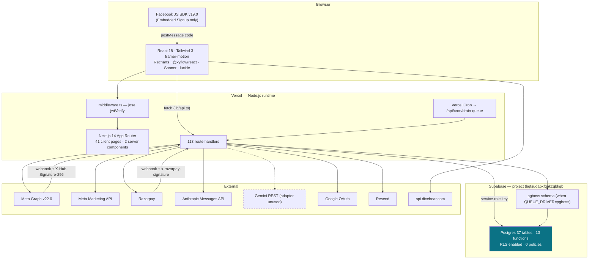

# 03 — Technology Stack

## Executive summary

A deliberately **small, Vercel-native stack**: Next.js 14 App Router, TypeScript
`strict`, Supabase Postgres via `supabase-js` (service role only), custom `jose` JWT
auth, pg-boss for jobs, Razorpay for payments, Anthropic for AI. **29 runtime
dependencies, 8 dev dependencies** — remarkably lean for the feature surface. No Redis,
no ORM at runtime, no state-management library, no component library, no test runner.

The choices are internally consistent and mostly well-reasoned. The three real gaps are
**no CI, no unit-test framework, and no observability sink**.

**Risk level:** Medium · **Complexity:** Low · **Confidence:** High (98%) — read from
`package.json`, config files, and import sites.

---

## 1. Complete inventory

| Layer | Technology | Version | Why chosen (evidence) | Realistic alternative | Verdict |
|---|---|---|---|---|---|
| **Framework** | Next.js App Router | `^14.2.35` | One deploy unit for UI + API; Vercel-native; route groups map to auth boundaries | Next 15/16, Remix, SvelteKit | ✅ Good. **One major behind** (15/16 available) |
| **Language** | TypeScript | `5.9.3` (pinned) | `strict: true`, no `any` epidemic | — | ✅ Excellent |
| **UI runtime** | React | `^18` | Next 14 requirement | React 19 (needs Next 15+) | ✅ |
| **Styling** | Tailwind CSS | `^3.4.1` | Utility-first; token-driven via CSS vars | Tailwind 4, CSS modules | ✅ Good, well-tokenised |
| **Animation** | framer-motion | `^12.38.0` | Page/list transitions; presets in `lib/motion.ts` | CSS transitions, `tailwindcss-animate` (also present) | 🟡 Heavy for the value; both present |
| **Theming** | next-themes | `^0.3.0` | Class-based dark mode | Manual `data-theme` | ✅ |
| **Icons** | lucide-react | `^0.447.0` | Tree-shakeable | — | ✅ |
| **Charts** | Recharts | `^2.12.7` | Analytics/campaign charts | visx, Chart.js | 🟡 Forces `unsafe-eval` in CSP (`next.config.mjs:19`) |
| **Toasts** | Sonner | `^1.5.0` | — | — | ✅ |
| **Flow canvas** | `@xyflow/react` | `^12.10.2` | Visual automation builder | — | ✅ Right tool |
| **Date** | date-fns + react-day-picker | `^3.6.0` / `^8.10.1` | Calendars in appointments/campaigns | — | 🟡 `react-day-picker` used mainly by the **demo-only** appointments UI |
| **Class utils** | clsx + tailwind-merge | | `cn()` in `lib/utils.ts` | — | ✅ |
| **Database** | Supabase Postgres | `@supabase/supabase-js ^2.103.3` | Managed Postgres + RPC + RLS available | Neon, RDS, PlanetScale | ✅ |
| **DB access** | `supabase-js` **service-role only** | | Simple; RPC for atomic money ops | Prisma, Drizzle, Kysely | ⚠️ See §3 |
| **SSR helper** | `@supabase/ssr` | `^0.10.2` | Present | | 🟡 **Unable to determine any import site** — likely vestigial |
| **ORM** | **none at runtime** | — | `prisma/schema.prisma` is docs only | Drizzle (type-safe, no runtime cost) | ⚠️ See §3 |
| **Raw driver** | `pg` + `@types/pg` | `^8.22.0` | pg-boss dependency | — | ✅ |
| **Auth** | custom JWT via `jose` | `^6.2.3` | HS256, 7-day, httpOnly `wa_session` cookie | Supabase Auth, NextAuth, Clerk | ⚠️ See §4 |
| **Password hash** | bcryptjs | `^3.0.3` | Pure JS, edge-safe | argon2 (stronger, native) | 🟡 Acceptable |
| **Validation** | Zod | `^3.25.76` | `lib/validate.ts` | — | ⚠️ **Used by 3 of 113 routes** |
| **Job queue** | pg-boss | `^12.21.1` | Postgres-backed durability, no new infra | BullMQ+Redis, Inngest, QStash, Vercel Queues | ✅ Good call; see §5 |
| **Cron** | Vercel Cron | `vercel.json` | Drains pg-boss | — | 🔴 **Schedule is daily, not per-minute** |
| **Payments** | Razorpay | `^2.9.6` | The India standard (UPI, cards, netbanking) | Stripe (weak India support) | ✅ Correct for market |
| **WhatsApp** | Meta Graph API | `v22.0` (SDK `v19.0`) | Direct BSP integration | Twilio/360dialog (would destroy the margin model) | ✅ Correct — being the BSP *is* the business |
| **AI** | `@anthropic-ai/sdk` | `^0.95.0` | Adapter behind `lib/ai/service.ts` | Vercel AI Gateway, OpenAI | ✅ Good; see §6 |
| **Email** | Resend | via `lib/email.ts` | Optional; console-logs if unset | SES, Postmark | 🟡 Not in `package.json` — REST call presumed |
| **Hosting** | Vercel | `.vercel/` present | Zero-config Next.js | Railway, Render, Fly | ⚠️ See §5 |
| **Storage** | **none** | — | Media goes to Meta via `uploadMedia` | Vercel Blob, S3, Supabase Storage | 🔴 See §7 |
| **Cache** | **none** | — | No Redis, no `unstable_cache`, no Runtime Cache | Upstash, Vercel Runtime Cache | 🔴 See §7 |
| **State mgmt** | React `useState` only | — | No Zustand/Redux/Jotai; no TanStack Query | TanStack Query | ⚠️ See [08](08-FRONTEND.md) |
| **Testing** | Playwright | `^1.59.1` | 4 files, 212 LOC | + Vitest for units | 🔴 **No unit-test framework at all** |
| **Linting** | `next lint` | — | **No `.eslintrc*` / `eslint.config.*`** | — | 🔴 Unconfigured → the gate step warns and passes |
| **CI/CD** | Vercel git integration only | — | **No `.github/`** | GitHub Actions | 🔴 Nothing runs `npm run check` |
| **Monitoring** | **none** | — | `lib/logger.ts:21` — *"In production you'd ship this to Datadog / Sentry / Logtail"* | Sentry, Vercel Agent | 🔴 See §7 |
| **Logging** | custom structured JSON → stdout | `lib/logger.ts` | Level + context, JSON per line | — | ✅ Well-shaped, no sink |
| **Package mgr** | npm | `package-lock.json` | — | pnpm (faster, stricter) | ✅ |
| **Build** | Next.js default (Webpack) | | `next build` | Turbopack (Next 15+) | 🟡 |

**External APIs consumed:** Meta Graph (messaging, templates, media, WABA, OAuth),
Meta Marketing/CTWA, Google OAuth, Razorpay, Anthropic Messages, Google Generative
Language (adapter present, unused), Resend, `api.dicebear.com` (avatars — allowlisted
in CSP and `next.config.mjs` `remotePatterns`).

---

## 2. Stack diagram

---

## 3. Why no ORM — and the cost

**Rationale (inferred):** `supabase-js` gives Postgres + RPC + RLS in one client; money
mutations need row-locked SQL functions anyway, which no ORM improves; and Supabase's
generated types can supply safety without a runtime dependency.

**The cost, measured in this audit:** every schema-drift bug in
[05-DATABASE.md](05-DATABASE.md) — 19 missing tables and multiple column mismatches —
would have been a **compile-time error** under Drizzle or generated Supabase types.
Instead they are runtime `PGRST` errors that route handlers swallow.

Concretely, `tsc --noEmit` passes cleanly on code that writes
`messages.meta_message_id` — a column that does not exist. The type system cannot see
the database.

**Recommendation:** do not adopt Prisma (it would fight the RPC-based money layer).
Instead run `supabase gen types typescript` into `types/database.ts` and parameterise
the client: `createClient<Database>(…)`. Zero runtime cost, and it turns the entire
drift register into build failures. This is the **highest-ROI single change in the
repository.**

---

## 4. Why custom JWT instead of Supabase Auth

Trade-off, honestly made:

| | Custom `jose` JWT (chosen) | Supabase Auth (rejected) |
|---|---|---|
| Session | httpOnly `wa_session`, HS256, 7d | Supabase-managed |
| Edge middleware | ✅ `jwtVerify` works in middleware | ✅ |
| **RLS integration** | ❌ **`auth.uid()` is always NULL** → RLS unusable → service-role everywhere | ✅ RLS works natively |
| Google OAuth | Hand-rolled (`lib/google-oauth.ts`, 105 LOC) | Built-in |
| Password reset | Hand-rolled — **and unfinished** (`TODO`) | Built-in |
| MFA / SSO / SAML | ❌ would be from scratch | ✅ available |

**This is the root cause of finding #4** (zero RLS policies). The org-model migrations
`002`/`009` wrote RLS policies against `auth.uid()` via a `get_user_org_ids()` helper —
which can never evaluate, because the app never authenticates as a Supabase user. So the
policies were written, were never applicable, and were never applied.

The choice is defensible for velocity but it means **tenant isolation has no database-level
backstop**. See [16-MULTI-TENANCY.md](16-MULTI-TENANCY.md) for the two ways out
(a session-variable RLS pattern, or accept app-layer-only and add automated tests).

---

## 5. Queue and cron — good design, misconfigured deploy

`lib/queue/index.ts` is the best abstraction in the repo: a 4-line `QueueDriver`
interface, an `InlineDriver` (fire-and-forget, zero infra) and a `PgBossDriver`
(durable). Callers never change. Redis/BullMQ was explicitly declined per the
`sendanjal-core` rule.

Two deployment problems:

1. **The drain cron is daily.** `vercel.json:4` → `"schedule": "0 0 * * *"`.
   `CLAUDE.md` claims "runs every minute". With `QUEUE_DRIVER=pgboss`, an inbound
   WhatsApp message could wait **24 hours** for its automation reply. Fix: `* * * * *`
   (Vercel Cron supports minute granularity on paid plans; on Hobby the minimum is
   daily — which may be the actual reason, and if so the inline driver must stay).
2. **pg-boss needs session-mode Postgres (port 5432) for advisory locks**
   (`lib/queue/index.ts:76-78`). On serverless that means a real connection per
   invocation with no pooler. Documented, but fragile.

> **Note on the Vercel platform:** functions now default to a 300 s timeout under Fluid
> Compute, and Vercel Queues exists as a managed alternative. The `QueueDriver` seam
> means adopting either is a ~40-line driver, not a rewrite. That is the design paying off.

---

## 6. AI stack

Single provider in use (Anthropic), but the architecture is provider-agnostic by
construction: `ProviderAdapter` interface + `getAdapter(config.provider)` switch
(`lib/ai/service.ts:45-124`). A `GeminiAdapter` is fully implemented and unused. A
commented `case "gateway"` line anticipates Vercel AI Gateway.

| Aspect | Implementation |
|---|---|
| Model selection | `ai_model_config` table, newest active row per `task_type` — **no model id in any route** |
| Timeouts | Per-task from config (2 s for runtime intent → 30 s for flow builder), enforced via `AbortController` |
| Retries | `silentRetries` + `appendOnRetry` feeds the schema error back into the prompt |
| Token accounting | `usage.input_tokens`/`output_tokens` → `rawCostPaise` (rounds **up**) |
| Cost tracking | Every call, success or fallback, writes `ai_usage_log` |
| Failure mode | Never throws to the user — returns `{status:"fallback", reason, message}` with human copy |

**Model currency:** live config uses `claude-sonnet-4-6` and `claude-haiku-4-5`. The
current generation is the Claude 5 family (`claude-opus-5`, `claude-sonnet-5`,
`claude-fable-5`) plus `claude-haiku-4-5`. Because routing is a DB row, upgrading is an
admin UPDATE with no deploy — exactly what the design was for.

---

## 7. Missing infrastructure

| Missing | Consequence | Cheapest fix |
|---|---|---|
| **Object storage** | No inbound media persistence. `lib/meta.ts:uploadMedia` sends bytes to Meta and keeps a `media_id` that **expires in ~30 days**. Inbox file attachments are "coming soon" because there is nowhere to put them. | Vercel Blob (now supports private) |
| **Distributed cache** | `meta_rates`, `plan_tiers`, `platform_settings`, `ai_model_config` are re-read on **every send and every AI call**. A managed single send does ≥5 sequential DB round-trips before touching Meta. | Vercel Runtime Cache or `unstable_cache`, 60 s TTL |
| **Distributed rate limiter** | `lib/rate-limit.ts` Map is per-instance → the webhook's 200 req/10 s and auth's 10 req/min are per-lambda, i.e. effectively unbounded | Postgres counter table, or Upstash |
| **Shared ESU token cache** | `lib/whatsapp/token-cache.ts` Map — if `exchange-token` and `save-account` hit different instances, onboarding fails intermittently. **Self-documented at line 8.** | Signed JWE cookie (no infra) or Postgres row with TTL |
| **Error/APM sink** | No Sentry, no OTel. Logs go to stdout → Vercel log drain only. | Sentry SDK (~30 min) |
| **CI** | Nothing enforces `tsc`, lint, or e2e | GitHub Actions running `npm run check` |
| **Unit test runner** | `lib/billing` — the money code — has **no automated test** except one SQL file that is not in CI | Vitest + run `supabase/tests/prepaid_wallet_test.sql` in CI |
| **ESLint config** | `production-check.sh:71-72` detects the absence and downgrades to a warning | `npx next lint` once |
| **Secrets scanning** | `.env.local` is present locally; guarded only by a grep in the check script | `gitleaks` in CI |

---

## Advantages

- **Minimal dependency surface** (29 runtime deps) — small attack surface, fast installs,
  little version churn. `npm audit --omit=dev --audit-level=high` is part of the gate.
- Every third-party integration is behind a wrapper module (`lib/meta*.ts`,
  `lib/razorpay.ts`, `lib/google-oauth.ts`, `lib/ai/service.ts`) — swappable.
- Postgres does the heavy lifting for correctness (row locks, unique constraints,
  idempotency keys) rather than application code. This is the right instinct.
- `strict` TypeScript with a clean `tsc`, and a real production-readiness script.

## Disadvantages

- No ORM/generated types ⇒ the type system is blind to the database, which is the
  proximate cause of the entire drift register.
- No CI ⇒ the good gate script is optional.
- No cache ⇒ redundant config reads on the hottest paths.
- Two in-memory singletons (rate limiter, token cache) are semantically incorrect on
  serverless and both know it.
- Next.js 14 + Webpack is a major version behind; React 19, PPR, Cache Components,
  and Turbopack are all unavailable.

## Recommendations

| P | Recommendation | Effort |
|---|---|---|
| **P0** | `supabase gen types typescript` → `types/database.ts`, then `createClient<Database>()`. Turns 19 missing tables into build errors. | 1–2 days |
| **P0** | Add GitHub Actions running `npm run check` on PR. | 2 hours |
| P1 | `npx next lint` to generate a config so the lint gate actually gates. | 1 hour |
| P1 | Fix `vercel.json` cron to `* * * * *`, **or** document that the inline driver is the only supported mode on the current plan. | 15 min |
| P1 | Add Vitest and unit-test `lib/billing/{rates,pricing,confirm}` + `lib/whatsapp/{window,status}` — all pure or near-pure and cheap to test. | 3 days |
| P1 | Replace both in-memory singletons with Postgres-backed equivalents. | 2 days |
| P2 | Wire Sentry (or Vercel Agent) to `lib/logger.error`. | 4 hours |
| P2 | Cache `meta_rates`/`plan_tiers`/`platform_settings`/`ai_model_config` for 60 s. | 1 day |
| P2 | Adopt Vercel Blob for inbound media; unblocks Inbox attachments. | 3 days |
| P3 | Plan the Next.js 15/16 upgrade (React 19, Turbopack, Cache Components). Defer until the drift register is closed. | 1 week |
| P3 | Remove `@supabase/ssr` if genuinely unused; drop `react-day-picker` with the appointments demo. | 1 hour |
