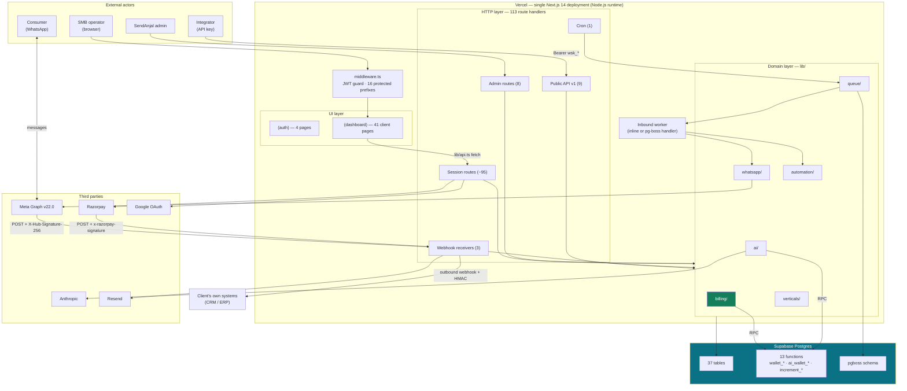
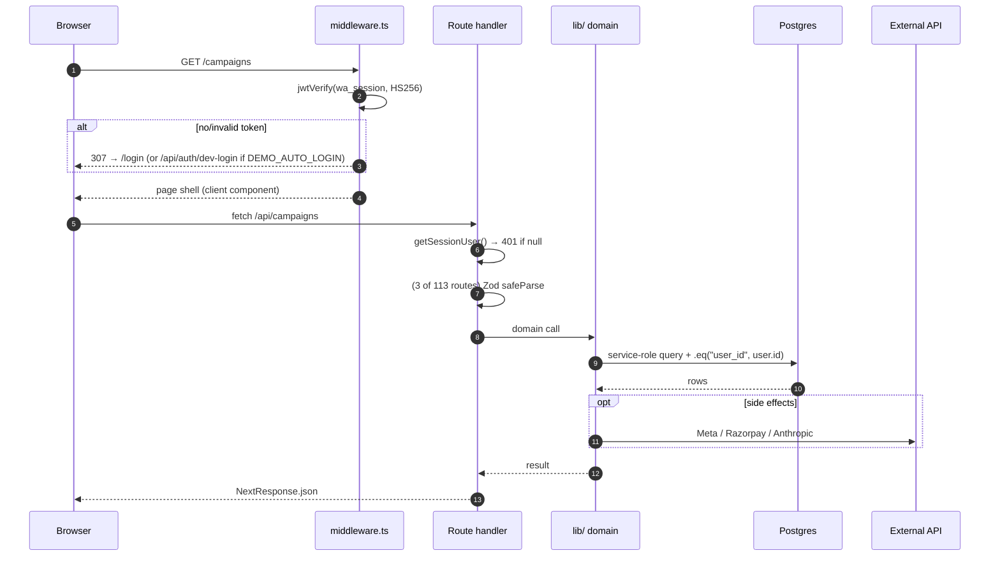
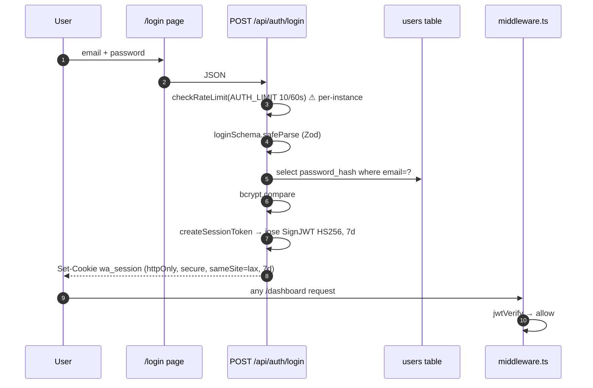
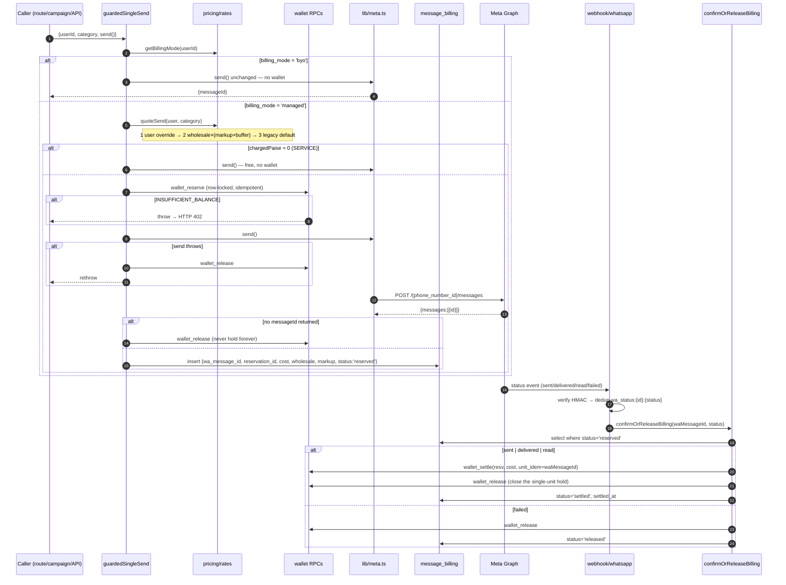
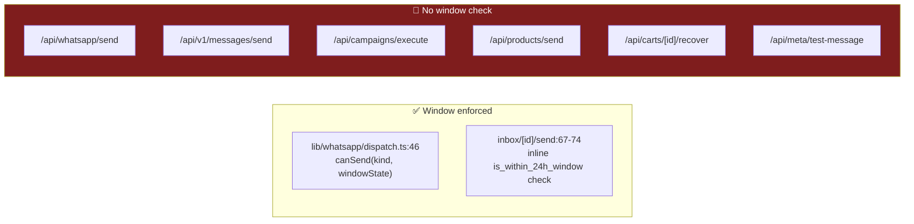
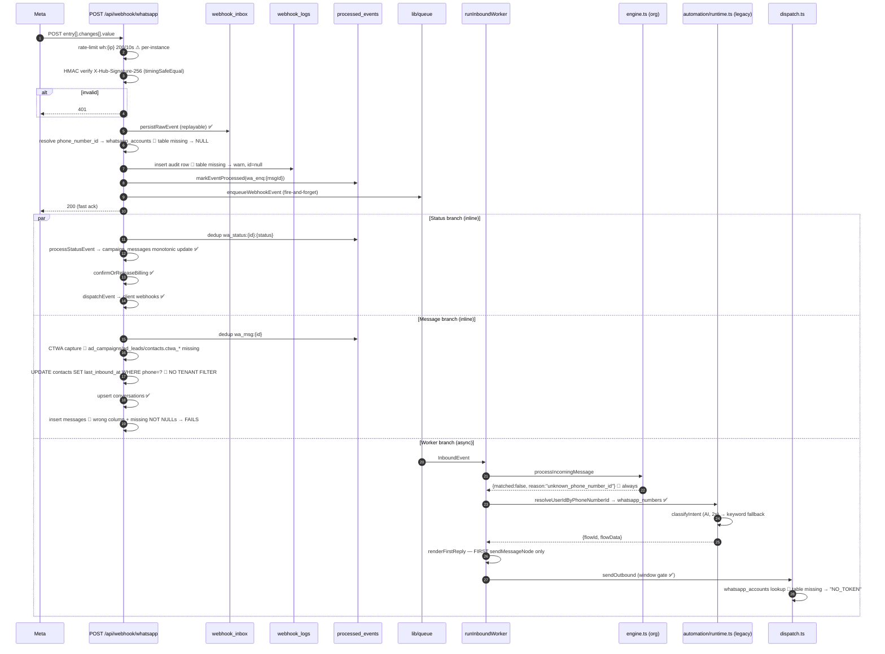
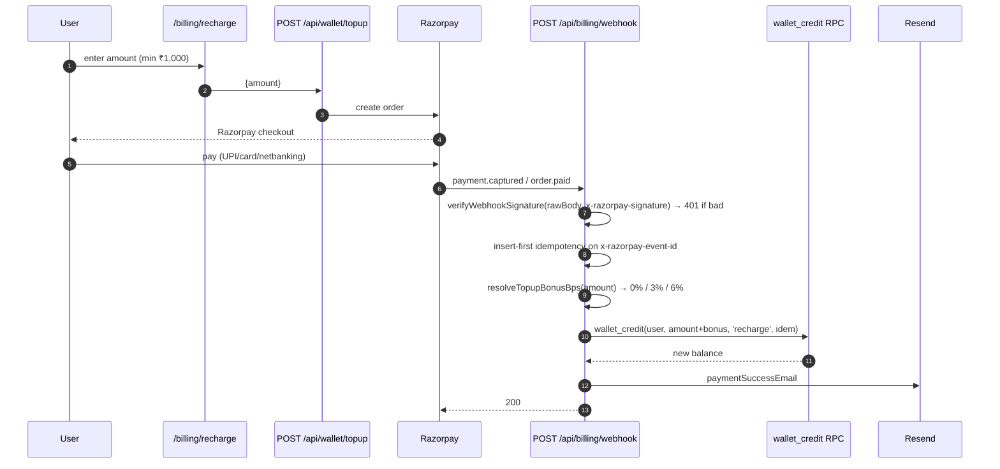
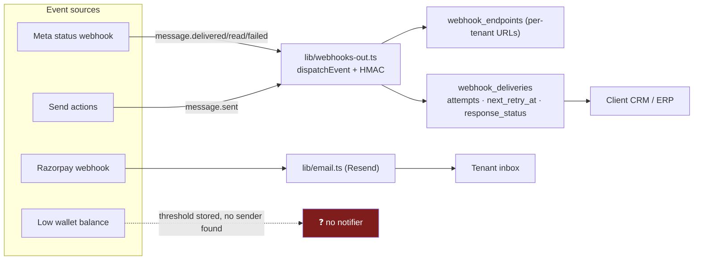

# 04 — System Architecture

## Executive summary

A **modular monolith on serverless**. One Next.js deployment holds the UI, the entire
HTTP API, and the background workers; Postgres is the only stateful component and also
serves as the job queue and the coordination primitive (row locks, unique constraints,
idempotency keys). There is no service mesh, no message broker, no cache tier.

The architecture is **event-driven at its edges** (Meta webhooks, Razorpay webhooks,
outbound webhooks to client systems) and **transactional at its core** (money mutations
in SQL functions). The dominant pattern is *fast-ack + async worker*: handlers verify,
persist, enqueue, and return.

The design is sound. The gap between design and deployment — one tenant model in the
DB, two in the code; a daily cron for a per-minute queue — is where the failures live.

**Risk level:** Medium · **Complexity:** Medium · **Confidence:** High (94%)

---

## 1. Container view

**Architectural style:** modular monolith · event-driven edges · transactional core ·
serverless compute · single-database persistence.

---

## 2. Request flow — the general shape

**Invariant:** every read/write is tenant-scoped by an **explicit `.eq("user_id", …)` in
application code**. The database contributes no isolation (RLS enabled, 0 policies).
See [16](16-MULTI-TENANCY.md).

**Handler discipline (Law #4 — no synchronous external I/O in handlers):** honoured on
the webhook path (persist → enqueue → 200) but **violated on most session routes**,
which call Meta inline (`whatsapp/send`, `templates/sync`, `campaigns/execute`,
`meta/*`). That is a pragmatic choice for user-initiated actions where the user is
waiting, but it means p95 latency on those routes is Meta's latency.

---

## 3. Authentication flow

**Google OAuth** runs in parallel: `/api/auth/google` → consent → `/api/auth/google/callback`
→ upsert `users` → same `wa_session` cookie. **Password reset** stops at a `TODO`
(`app/api/auth/forgot-password/route.ts:20`) — it correctly returns a
non-enumerable response but sends nothing.

**The demo bypass.** When `DEMO_AUTO_LOGIN=true`, `middleware.ts:54-61` redirects any
unauthenticated request for a protected path to `/api/auth/dev-login`, which mints a
full 7-day session for `admin@sendanjal.com` — **in production**. Deliberate and
documented; see [12](12-SECURITY.md).

**JWT payload** is `{id, email, name, company}` (`lib/auth.ts:15`). It deliberately
carries **no tier and no role**, so both are re-read from the DB on every use
(`lib/ai/config.ts:63-74` explains this: "the authoritative gate, not a cached/spoofable
claim"). Good decision; costs a query per AI call.

---

## 4. Outbound message flow (the money path)

**Why this is correct:** the debit happens only after Meta confirms the message left
our hands. A hold is not revenue. Idempotency is triple-layered — `message_billing.status`
gates re-entry, `wallet_settle` is idempotent per `(reservation_id, wa_message_id)`, and
`wallet_release` is idempotent — so duplicate or out-of-order webhooks cannot
double-charge (`lib/billing/confirm.ts:9-15`).

**Campaign variant** (`app/api/campaigns/execute/route.ts`): reserve the **whole**
broadcast up-front (hard stop if unaffordable, campaign marked failed and nothing sends),
then `settle` one unit per success inside a `BATCH_SIZE = 50` loop, then `release` the
remainder at the end. Correct pattern for fan-out.

### Gap: the 24-hour window

`canSend()` has exactly **one** caller repo-wide. `/api/whatsapp/send` accepts
`type: "text"` (free-form) and sends it with no window evaluation
(`app/api/whatsapp/send/route.ts:51-80`). Outside an open window Meta returns error
**131047** and repeated attempts degrade the number's quality rating — a business-level
consequence, not just an error. Law #5 violation.

---

## 5. Inbound message flow

**Four defects visible in one diagram:**

| # | Defect | Consequence |
|---|---|---|
| 1 | `webhook_logs` missing | No webhook audit trail; the duplicate-detection branch (`code === "23505"`) can never fire, so the route relies solely on `processed_events` |
| 2 | `contacts` update has no tenant predicate | Cross-tenant write (`route.ts:386-389`) |
| 3 | `messages` insert uses `meta_message_id`, omits `user_id`/`type` | **Every inbound message fails to persist.** Inbox shows outbound only |
| 4 | Worker → `dispatch.ts` → `whatsapp_accounts` (missing) | The automation reply is computed, then **cannot be sent** — returns `NO_TOKEN` |

Defect 4 is the cruellest: `queue.ts:110-112` documents that a *previous* bug discarded
the engine's reply, and the fix was to call `sendOutbound`. But `sendOutbound` resolves
its token from the undeployed org table, so **the automation reply still does not go out.**
Fixing this is a ~6-line change: resolve the token from `whatsapp_numbers` instead.

**What does work inbound:** signature verification, raw-payload persistence for replay,
per-event idempotency, status processing, billing settlement, and outbound webhook
dispatch to client systems. The integrity machinery is right; the persistence targets
are wrong.

---

## 6. Payment flow

Subscriptions follow the same shape via `subscription.*` events →
`POST /api/billing/create-subscription`. **Note:** `subscription` events would write a
`subscriptions` table that **does not exist** in production, so subscription state is
not persisted; only `users.tier` (set via `setTier`) survives.

**Correct details worth noting:** raw body read before JSON parse for signature
verification (`route.ts:17-18`), `runtime = "nodejs"` pinned, and insert-first
idempotency used as a lock rather than a check-then-act race.

---

## 7. Notification flow

Three distinct outbound channels:

| Channel | Status |
|---|---|
| **Outbound webhooks to clients** | ✅ Live. Signed, retried (`next_retry_at`), success counter via `increment_webhook_endpoint_success` RPC (exists in DB) |
| **Transactional email** | ✅ Live for payment success/failure. Console-logs if `RESEND_API_KEY` unset. Not in `package.json` — presumed REST |
| **Low-balance alert** | 🔴 `wallet.low_balance_threshold_paise` and `platform_settings.default_low_balance_threshold_paise` both exist and are read, but **no code sends the alert**. A managed tenant hits `INSUFFICIENT_BALANCE` with no prior warning — a churn event |
| **In-app notifications** | 🔴 None. No `notifications` table, no bell UI. Sidebar `badge: 3` on Inbox is **hardcoded** (`Sidebar.tsx:50`) |
| **Template approval/rejection** | 🔴 Meta sends `message_template_status_update` webhooks; the handler's `eventType` classifier has no branch for them (`route.ts:105-112` → `"unknown"`). A tenant is never told their template was approved or rejected |

---

## 8. Data flow summary

| Flow | Trigger | Path | Durability |
|---|---|---|---|
| Session read | Page load | client → `/api/*` → PG | none (no cache) |
| Single send | User action | route → `guardedSingleSend` → Meta | `wallet_reservations` + `message_billing` |
| Broadcast | Campaign launch | route → reserve-all → 50-batch loop → settle-per-unit | `campaigns`, `campaign_messages` |
| Status | Meta push | webhook → dedup → monotonic update → settle | `processed_events`, `campaign_messages` |
| Inbound | Meta push | webhook → `webhook_inbox` → queue → worker → reply | `webhook_inbox` ✅, `messages` 🔴 |
| AI draft | User action | route → `runTask` → adapter → debit → log | `ai_credit_ledger`, `ai_usage_log` |
| Payment | Razorpay push | webhook → verify → idempotent credit → email | `transactions`, `wallet` |
| Client webhook | Status/send | `dispatchEvent` → HMAC POST → retry | `webhook_deliveries` |
| Vertical provision | Admin action | route → `setVerticalForUser` (one column) | `users.vertical_id` |

---

## Advantages

- **One deploy unit** — no distributed-systems tax at this scale; a single `next build`
  is the whole platform.
- **Postgres as the coordination primitive** — row locks, unique constraints, and
  idempotency keys do work that would otherwise need Redis or a saga framework.
- **Persist-then-enqueue** on the webhook means no event is unrecoverable, even if the
  worker dies after the 200 ack.
- **Fast-ack** design keeps Meta from retry-storming.
- **Reserve/confirm** billing is the correct model for an unreliable downstream.
- The queue seam makes durability a configuration decision.

## Disadvantages

- Serverless + in-memory singletons (rate limiter, ESU token cache) is a semantic
  mismatch that both modules acknowledge.
- No cache tier ⇒ ~5 config reads before every managed send.
- Law #4 violated on user-facing routes (inline Meta calls) — acceptable but caps p95.
- The async worker path is **fully dead in production** because it resolves tenants and
  tokens from the undeployed org tables.
- Notification coverage is thin: no low-balance warning, no template-status relay.

## Recommendations

| P | Recommendation |
|---|---|
| **P0** | Repoint `lib/whatsapp/dispatch.ts` token resolution to `whatsapp_numbers` (~6 lines). This alone makes automation replies actually send. |
| **P0** | Fix the `messages` insert (correct column, add `user_id`/`type`) and add the tenant predicate to the `contacts` update. |
| P1 | Route every send through one function that enforces window + billing + logging. Delete the ungated paths. |
| P1 | Add a `message_template_status_update` branch to the webhook and notify the tenant. |
| P1 | Ship the low-balance notifier — the threshold columns already exist. |
| P2 | Cache the four config tables (60 s) to cut per-send latency. |
| P2 | Move Meta calls on non-interactive routes (`templates/sync`, `campaigns/execute`) onto the queue to honour Law #4. |
| P3 | Replace the hardcoded Inbox badge with a real unread count (`conversations.unread_count` exists). |
