# 05 — Database

## Executive summary

**This is the most important document in the audit.** Everything here was read from the
live Supabase project `tbqfsudapxfqakzqbkgb`, not inferred from migrations.

The deployed database is **37 tables, 13 functions, 2 triggers, 0 views, 0 RLS policies**,
and it implements the **legacy `user_id` tenant model** exclusively. The
`supabase/migrations/` directory describes a *different, larger* schema (68 `CREATE TABLE`
statements across 34 files, including a full organization model). The delta between those
two realities is the single largest source of defects in the product.

| Metric | Migrations describe | Live database |
|---|---:|---:|
| Distinct tables | 56 | **37** |
| Tables the code queries but that don't exist | — | **19** |
| RLS policies written | 63 | **0 applied** |
| Functions | 21 | **13** |
| Views | 0 | **0** |
| Triggers | 3 | **2** |

**Risk level:** Critical · **Complexity:** High · **Confidence:** Very High (99%) —
every statement below is from `information_schema`, `pg_proc`, `pg_indexes`,
`pg_constraint`, `pg_policies`, or `pg_trigger`.

---

## 1. Live ER diagram

Every table in production, with real FK relationships (from `pg_constraint`).

```mermaid
erDiagram
    users ||--o{ whatsapp_numbers : owns
    users ||--o{ contacts : owns
    users ||--o{ templates : owns
    users ||--o{ campaigns : owns
    users ||--o{ conversations : owns
    users ||--o{ messages : owns
    users ||--o{ automations : owns
    users ||--o{ automation_flows : owns
    users ||--o{ chatbot_sessions : owns
    users ||--o| wallet : has
    users ||--o{ transactions : ledger
    users ||--o{ wallet_reservations : holds
    users ||--o{ message_billing : billed
    users ||--o{ message_pricing : overrides
    users ||--o{ platform_charges : charged
    users ||--o{ api_keys : issues
    users ||--o{ api_messages : sends
    users ||--o{ otp_codes : requests
    users ||--o{ webhook_endpoints : registers
    users ||--o{ webhook_deliveries : receives
    users ||--o{ team_members : invites
    users ||--o{ daily_analytics : rollup
    users ||--o| ai_credit_wallet : has
    users ||--o{ ai_credit_ledger : ledger
    users ||--o{ ai_usage_log : logs
    users }o--o| industry_verticals : "vertical_id (nullable)"

    industry_verticals ||--o{ vertical_template_library : seeds

    whatsapp_numbers ||--o{ conversations : channel
    whatsapp_numbers ||--o{ messages : channel
    whatsapp_numbers ||--o{ campaigns : sender

    templates ||--o{ campaigns : uses
    templates ||--o{ automations : "action_template_id"

    campaigns ||--o{ campaign_messages : fans_out
    campaigns ||--o{ messages : origin
    contacts  ||--o{ campaign_messages : targets
    contacts  ||--o{ conversations : subject
    contacts  ||--o{ messages : subject
    contacts  ||--o{ chatbot_sessions : subject

    conversations ||--o{ messages : contains
    conversations ||--o{ chatbot_sessions : context
    automation_flows ||--o{ chatbot_sessions : runs

    webhook_endpoints ||--o{ webhook_deliveries : attempts

    users {
        uuid id PK
        text email UK
        text password_hash
        text full_name
        text company_name
        text billing_mode "byo|managed"
        text tier "starter|growth|enterprise"
        text waba_mode "own|shared"
        text business_name
        text business_category "META vertical code"
        text city
        text onboarding_path
        uuid vertical_id FK "nullable"
    }
    whatsapp_numbers {
        uuid id PK
        uuid user_id FK
        text phone_number
        text waba_id
        text phone_number_id "Meta id — webhook join key"
        text access_token "AES-256-GCM"
        bool token_encrypted
        timestamptz token_expires_at
        text meta_app_secret "⚠ plaintext"
    }
    wallet {
        uuid id PK
        uuid user_id UK
        bigint balance_paise "authoritative"
        numeric balance "legacy"
        bigint low_balance_threshold_paise
    }
    message_billing {
        text wa_message_id PK
        uuid user_id FK
        uuid reservation_id
        bigint cost_paise
        bigint wholesale_paise "margin trail"
        int markup_bps "margin trail"
        text status "reserved|settled|released"
    }
    plan_tiers {
        text tier PK
        char model "A|B|C"
        bigint monthly_fee_paise
        int default_markup_bps
        int monthly_msg_cap "read, never enforced"
    }
    meta_rates {
        uuid id PK
        text region
        text category
        bigint wholesale_paise "COGS — never hardcoded"
        timestamptz effective_from
    }
```



**Unparented reference/infra tables** (no FK to `users` — global or system-scoped):
`meta_rates`, `plan_tiers`, `platform_settings`, `topup_bands`, `processed_events`,
`webhook_inbox`, `ai_model_config`, `audit_logs` (nullable `user_id`, no FK).

---

## 2. All 37 live tables

### Identity & tenancy

| Table | Rows | Purpose | Tenant key |
|---|---:|---|---|
| `users` | 0 | **The tenant.** Auth + tier + billing axes + vertical | `id` (is the tenant) |
| `team_members` | 0 | Invited members — **records only, no enforcement** | `owner_id` |
| `audit_logs` | 0 | Append-only security events; `organization_id` column present but always NULL | `user_id` (nullable) |

### WhatsApp

| Table | Rows | Purpose | Notes |
|---|---:|---|---|
| `whatsapp_numbers` | 0 | Connected numbers, WABA ids, **encrypted** tokens | `meta_app_secret` stored **plaintext** |
| `templates` | 0 | Local mirror of Meta message templates | `meta_template_id` links to Meta |
| `conversations` | 0 | Inbox threads; carries `is_within_24h_window`, `window_expires_at` | Unique on `(user_id, contact_id, whatsapp_number_id)` |
| `messages` | 0 | Individual messages | 🔴 **webhook writes the wrong columns** — see §4 |
| `campaign_messages` | 0 | Per-recipient broadcast rows; status target | **No `user_id`** — scoped via `campaign_id` join |

### Contacts & automation

| Table | Rows | Purpose | Notes |
|---|---:|---|---|
| `contacts` | 0 | Customers. `last_inbound_at` = the 24h window source of truth | Unique `(user_id, phone)` ✅ |
| `automations` | 0 | Simple trigger→action rules | Live, distinct from flows |
| `automation_flows` | **3** | Visual canvas flows, `flow_data JSONB` | `user_id` model; has `trigger_count`, **not** `total_triggered` |
| `chatbot_sessions` | 0 | Flow cursor | `flow_id`, `context`, `resume_at` — **not** `automation_flow_id`/`session_data` |

### Money

| Table | Rows | Purpose | Notes |
|---|---:|---|---|
| `wallet` | 0 | Prepaid balance in **integer paise** | Legacy `numeric balance` column still present |
| `wallet_reservations` | 0 | Holds: `held_paise`, `consumed_paise`, `status` | Idem index `(user_id, idempotency_key)` |
| `transactions` | 0 | Ledger. Dual-era columns (`amount numeric` + `amount_paise bigint`) | Idem index `uq_txn_idem` |
| `message_billing` | 0 | Links `wa_message_id` → reservation + **margin trail** | PK is the text `wa_message_id` |
| `message_pricing` | **4** | Per-user override or platform default | Partial unique on `(category) WHERE user_id IS NULL` — elegant |
| `meta_rates` | **4** | **Meta wholesale COGS** | The Law-#2 table |
| `plan_tiers` | **3** | Tier → model/markup/fee/cap | |
| `platform_settings` | **1** | `buffer_bps`, min top-up, low-balance default, credit validity | Singleton (`id=1`) |
| `topup_bands` | **3** | Volume bonus bands | |
| `platform_charges` | 0 | One-off charges (onboarding, add-ons) | |
| `daily_analytics` | 0 | Per-day rollups | Unique `(user_id, date)` |

### AI

| Table | Rows | Purpose |
|---|---:|---|
| `ai_model_config` | **6** | Provider/model/price/credits/timeout per `task_type`. Newest active row wins |
| `ai_credit_wallet` | 0 | Credit balance + monthly quota + `trial_granted` |
| `ai_credit_ledger` | 0 | Credit ledger; idem index `(user_id, idempotency_key)` |
| `ai_usage_log` | 0 | **Every** call: tokens, raw cost, credits, status, latency → margin truth |

### Verticals (newest, and healthy)

| Table | Rows | Purpose |
|---|---:|---|
| `industry_verticals` | **6** | Slug, display name, icon, active, builtin |
| `vertical_template_library` | **58** | `kind` ∈ {FLOW_JSON, CAMPAIGN_PROMPT, MESSAGE_TEMPLATE}, `payload JSONB`, `meta_category` |

### Platform / integration

| Table | Rows | Purpose |
|---|---:|---|
| `api_keys` | 0 | SHA-256 hash + prefix + scopes + per-key rate limit |
| `api_messages` | 0 | Public-API send log; idem on `(user_id, client_reference)` |
| `otp_codes` | 0 | Hashed OTP, `attempts`/`max_attempts`, `consumed_at` |
| `webhook_endpoints` | 0 | Per-tenant outbound URLs + HMAC secret |
| `webhook_deliveries` | 0 | Attempt log + `next_retry_at` |
| `processed_events` | 0 | **Webhook idempotency.** `event_id TEXT PK` |
| `webhook_inbox` | 0 | Raw payload persist-first, replayable |

> **All row counts are 0 except the 6 seeded/config tables.** This is a **pre-launch or
> freshly reset production database** — there is no customer data. That is materially
> good news: every fix below can be a destructive migration if needed, with no data
> migration risk. It also means none of the broken paths has yet harmed a real tenant.

---

## 3. Drift register — 19 tables the code queries that do not exist

Verified by cross-joining a list of code-referenced table names against
`information_schema.tables`.

| # | Missing table | From migration | Code that queries it | Failure mode today |
|---|---|---|---|---|
| 1 | `organizations` | 001, 009 | `whatsapp/onboard`, `meta/save-account` | Org resolution returns null |
| 2 | `organization_members` | 001, 009 | same | same |
| 3 | `whatsapp_accounts` | 001, 009 | `webhook/whatsapp:123`, `engine.ts:156`, `dispatch.ts:60`, `service.ts`, `repository.ts` | **Flow engine + dispatch always fail** |
| 4 | `phone_numbers` | 010 | `onboarding-repo.ts` | ESU partial |
| 5 | `access_tokens` | 010 | token rotation | `rotate_access_token` unusable |
| 6 | `webhook_subscriptions` | 010 | `meta/subscribe-webhook` | Subscription not recorded |
| 7 | **`webhook_logs`** | 005 | `webhook/whatsapp:136` | **No webhook audit trail**; the `23505` duplicate branch is unreachable |
| 8 | `ad_campaigns` | 004 | `webhook:301,370`, `ads/campaigns`, `ads/roi` | **CTWA attribution dead** |
| 9 | `ad_leads` | 004 (implied) | `webhook:356`, `ads/track-lead` | Lead capture dead |
| 10 | `products` | 004 | `products/*`, `commerce/*`, `lib/commerce.ts` | Catalog dead |
| 11 | `carts` | — | `carts/*`, `carts/[id]/recover` | Abandoned-cart recovery dead |
| 12 | `cart_items` | — | `lib/commerce.ts` | dead |
| 13 | `crm_pipeline` | 001, 009 | `crm/pipeline` | CRM dead |
| 14 | `crm_deals` | 001, 009 | `crm/deals`, `crm/deals/[id]` | CRM dead |
| 15 | `crm_activities` | 001 | `crm/contacts/[id]/activities` | CRM dead |
| 16 | `appointments` | 001, 009 | none (UI is `useState` demo) | Demo only |
| 17 | `subscriptions` | 001, `add_subscriptions.sql` | `billing/webhook`, `billing/create-subscription` | **Subscription state not persisted** |
| 18 | `agent_stats` | 004 | inbox/analytics | Agent metrics dead |
| 19 | `segments` | — | `segments/*` (5 routes), `lib/segments.ts` | **Smart Segments dead** |

**Why these fail quietly:** `supabase-js` returns `{data: null, error}` rather than
throwing. Most call sites either ignore `error` or log a warning. `webhook_logs`
(`route.ts:151-158`) and `audit.ts:57` explicitly log-and-continue *by design* — correct
for audit writes, but it means a missing table is indistinguishable from a transient
failure.

### Column-level drift inside tables that DO exist

This class is more dangerous because the table resolves and only the write fails.

| Table | Code writes | Live reality | Site | Impact |
|---|---|---|---|---|
| **`messages`** | `meta_message_id`, `content` as plain text; omits `user_id`, `type` | Column is **`wa_message_id`**; `content` is `jsonb`; `user_id` and `type` are **NOT NULL** | `webhook/whatsapp:421-427` | 🔴 **Every inbound message insert fails. The Inbox never shows incoming messages.** |
| **`contacts`** | `ctwa_campaign_id`, `ctwa_ad_id`, `ctwa_campaign_name`, `ctwa_clicked_at`, `crm_source`, `opt_in_status`, `source`, `organization_id` | **None of these columns exist.** Live: `status`, `contact_group`, `crm_stage`, `last_inbound_at`, `tags` | `webhook:311-350`, `engine.ts:306-313` | 🔴 CTWA contact tagging fails; org-model contact insert fails |
| `contacts` | `deal_value`, `crm_notes`, `company` (in `contactSchema`) | Do not exist | `lib/validate.ts:60-63` | Schema is unused, so latent |
| **`automation_flows`** | `total_triggered`, `total_completed`, `organization_id` | Live: `trigger_count`, `last_triggered`, `user_id` | `engine.ts:228,425` | 🔴 Counter updates fail |
| **`chatbot_sessions`** | `automation_flow_id`, `session_data` | Live: `flow_id`, `context`; `current_node_id` is **NOT NULL** | `engine.ts:409-416` | 🔴 Session creation fails |

### Missing functions the code calls

| RPC called | Exists in live DB? | Site | Impact |
|---|:--:|---|---|
| `wallet_credit` / `_reserve` / `_settle` / `_release` / `_charge` | ✅ all 5 | `lib/billing/wallet.ts` | Money layer fully functional |
| `ai_wallet_credit` / `ai_wallet_debit` | ✅ both | `lib/ai/wallet.ts` | AI credits functional |
| `increment_webhook_endpoint_success` | ✅ | `lib/webhooks-out.ts` | ✅ |
| `increment_campaign_stat` | ✅ | campaigns | ✅ |
| **`increment_messages_sent`** | ❌ | `whatsapp/send:83` | Number send counter never increments (fire-and-forget, silent) |
| **`increment_ad_campaign_leads`** | ❌ | ads | Silent |
| **`ensure_personal_org`** | ❌ | org onboarding | Silent |

---

## 4. Indexes

**37 non-PK indexes.** Coverage is genuinely good for the live model.

### Well-indexed

| Pattern | Examples |
|---|---|
| Tenant scoping | `idx_contacts_user_id`, `idx_campaigns_user_id`, `idx_templates_user_id`, `idx_messages_user_id`, `idx_conversations_user_id`, `idx_whatsapp_numbers_user_id`, `idx_transactions_user_id`, `idx_automation_flows_user_id` |
| Composite hot paths | `idx_contacts_phone (user_id, phone)`, `idx_conversations_last_msg (user_id, last_message_at DESC)`, `idx_conversations_status (user_id, status)`, `idx_messages_conv_created (conversation_id, created_at)` |
| Webhook join | `idx_campaign_messages_meta_id (meta_message_id)` ✅ critical for status updates |
| Config lookups | `idx_meta_rates_lookup (region, category, effective_from DESC)`, `idx_ai_model_config_lookup (task_type, is_active, effective_from DESC)`, `idx_vertical_tpl_lookup (vertical_id, kind, is_active, sort_order)` |
| **Partial indexes** (excellent) | `idx_wallet_resv_user … WHERE status='held'`, `idx_msgbill_open … WHERE status='reserved'`, `idx_webhook_inbox_pending … WHERE status<>'processed'`, `idx_chatbot_sessions_resume_at … WHERE status='waiting'`, `idx_api_keys_hash … WHERE is_active`, `idx_users_vertical_id … WHERE vertical_id IS NOT NULL` |
| Idempotency uniques | `uq_txn_idem`, `uq_wallet_resv_idem`, `uq_ai_ledger_idem`, `uq_api_messages_cref`, `uq_message_pricing_default` — all partial on `IS NOT NULL` |

The partial-index discipline here is above average. Whoever wrote migrations 011/019/021
knew what they were doing.

### Missing indexes

| Missing | Query it would serve | Priority |
|---|---|---|
| **`whatsapp_numbers(phone_number_id)`** | Every inbound webhook resolves the tenant with `.eq("phone_number_id", …)` — `runtime.ts:49`, `webhook:294,396`. Currently a **sequential scan on the hottest read in the system** | 🔴 **P0** |
| `messages(wa_message_id)` | exists as partial ✅ | — |
| `contacts(user_id, last_inbound_at)` | 24h-window sweeps, re-engagement segments | P2 |
| `contacts(user_id, crm_stage)` | CRM board (once tables exist) | P3 |
| `campaign_messages(status)` | Campaign progress counters | P2 |
| `templates(user_id, status)` | "approved templates only" pickers | P2 |
| `otp_codes(phone, expires_at)` | Verify lookup — currently `(user_id, phone, created_at DESC)` which works | P3 |
| `webhook_deliveries(status, next_retry_at)` | exists ✅ | — |
| `ai_usage_log(created_at)` | Margin reporting over time windows | P3 |

> **The `whatsapp_numbers(phone_number_id)` gap is the one that matters.** At zero rows
> it is invisible; at 1,000 connected numbers × every inbound message it becomes the
> platform's first scaling wall.

---

## 5. Constraints, triggers, views, normalization

| Object class | Count | Detail |
|---|---:|---|
| Primary keys | 37 | All present. `message_billing` uses text `wa_message_id`; `plan_tiers` uses text `tier`; `processed_events` uses text `event_id`; `platform_settings` uses `integer id=1` singleton; `ai_credit_wallet` uses `user_id` |
| Foreign keys | **43** | All `ON DELETE CASCADE` for owned data, `SET NULL` for optional refs. Consistent and correct |
| Unique constraints/indexes | 13 | Incl. `contacts(user_id, phone)`, `users.email`, `wallet.user_id`, `industry_verticals.slug` |
| CHECK constraints | present in DDL | `vertical_template_library` enforces `meta_category` present iff `kind='MESSAGE_TEMPLATE'` (`repository.ts:77-78` relies on this) |
| **Triggers** | **2** | `trg_industry_verticals_touch`, `trg_vertical_template_library_touch` → `touch_updated_at()`. **Only the newest tables have `updated_at` maintenance**; every other table relies on the application passing `updated_at` |
| **Views** | **0** | None |
| **Materialized views** | **0** | None |
| **RLS policies** | **0** | See §6 |

### Normalization assessment

Broadly **3NF with two deliberate, defensible denormalizations** and one accident.

| Case | Type | Verdict |
|---|---|---|
| `conversations.contact_phone`, `contact_name` alongside `contact_id` | Denormalization | ✅ Intentional — the inbox list renders without a join; also allows a conversation before a contact exists |
| `campaigns.recipients_count/sent_count/delivered_count/failed_count/read_count` | Counter cache | ✅ Intentional — maintained by `increment_campaign_stat`. Risk: drift from `campaign_messages` truth with no reconciliation job |
| `campaigns.template_name` alongside `template_id` | Snapshot | ✅ Correct — the template can change or be deleted; the campaign must remember what it sent |
| `message_billing.wholesale_paise`, `markup_bps` | Snapshot | ✅ **Correct and important** — margin must be reconstructible even after `meta_rates` changes |
| `transactions.amount numeric` + `amount_paise bigint`; `wallet.balance numeric` + `balance_paise bigint` | **Dual-era columns** | 🟠 **Accident.** Two representations of money coexist. `CLAUDE.md` mandates integer paise and no floats; the `numeric` columns are pre-011 legacy. A write to the wrong one is a silent money bug |
| `contacts.crm_stage` with no `crm_*` tables | Orphan | 🟡 Vestige of the CRM feature |

---

## 6. Row Level Security — the critical finding

```
pg_policies WHERE schemaname='public'  →  0 rows
```

**All 37 tables have `rls_enabled = true` and not one policy.** Supabase's advisor
confirms with 37 × `rls_enabled_no_policy` lints.

### What this actually means

| Client | Effect |
|---|---|
| `anon` key (browser) | **Deny all** — cannot read or write anything |
| `authenticated` role | **Deny all** — irrelevant anyway, the app never authenticates as a Supabase user |
| `service_role` key (all API routes) | **Bypasses RLS entirely** |

So the posture is: **safe by default at the edge, zero defence in depth in the interior.**
Nothing can be read directly from a browser — genuinely good. But every tenant boundary
inside the product is a hand-written `.eq("user_id", user.id)` in one of ~95 route files.
One omission is a cross-tenant data leak, and [one such omission already exists](#7-the-cross-tenant-write).

### Why the written policies were never applied

Migrations `002_model_b_rls.sql` (57 policies) and `009_model_b_unified.sql` (8 policies)
define policies via a `get_user_org_ids()` helper built on `auth.uid()`. The application
uses **custom `jose` JWTs, not Supabase Auth** (`lib/auth.ts`), so `auth.uid()` is always
NULL. The policies were correct for a Supabase-Auth design that was never adopted, and
they target `organization_id` columns on tables that were never created. They are
**unapplicable, not merely unapplied.**

Migrations `022` and `027` (RLS for `message_billing`, `webhook_inbox`,
`automation_flows`) and `021` appear to only *enable* RLS without adding usable policies —
consistent with what is live.

### The two ways forward

| Option | How | Cost | Gain |
|---|---|---|---|
| **A — Session-variable RLS** | Every route wraps its work in `SET LOCAL app.current_user_id = '<uuid>'`; policies read `current_setting('app.current_user_id')::uuid = user_id` | Medium — needs a transaction-scoped client wrapper; `supabase-js` makes this awkward (would likely need `pg` directly for scoped sessions) | True database-level isolation for all 37 tables |
| **B — Accept app-layer, prove it** | Keep service-role everywhere, but add (i) a lint/codemod that fails CI on any `.from(<tenant table>)` without a tenant predicate, and (ii) a cross-tenant integration test per route | Low | No DB backstop, but the gap becomes *detectable* rather than invisible |

**Recommendation: B now, A later.** Option B is a week of work and closes the detection
gap immediately. Option A is the right end state but requires re-plumbing the DB client
and is not compatible with a fast fix cycle.

---

## 7. The cross-tenant write

```ts
// app/api/webhook/whatsapp/route.ts:386-389
await supabase
  .from("contacts")
  .update({ last_contacted: receivedAt, last_inbound_at: receivedAt })
  .eq("phone", fromPhone);          // ← no user_id / tenant predicate
```

**Violates Law #1** ("every client-data table is tenant-scoped; never query across
tenants"). The same phone number legitimately appears under multiple tenants — `contacts`
is unique on `(user_id, phone)`, which *guarantees* this is possible by design.

**Blast radius:** currently limited to two timestamp columns, so it is a **24h-window
integrity bug and a cross-tenant information side-channel**, not a data disclosure:
Tenant B's contact record shows a `last_inbound_at` caused by a message that arrived on
Tenant A's number. That falsely opens B's free-form send window, which can then produce a
Meta 131047 rejection and quality-rating damage for B.

**Fix:** the surrounding code already resolves `wn.user_id` from `whatsapp_numbers`
(lines 394-398) — hoist that resolution above line 386 and add `.eq("user_id", wn.user_id)`.
Roughly 4 lines.

---

## 8. Migration hygiene

| Issue | Detail |
|---|---|
| **Numbering collision** | Two files share `002`: `002_inbox.sql` and `002_model_b_rls.sql`. Under lexical ordering `002_inbox` applies first — probably harmless, but the intended order is undocumented |
| **`conversations`/`messages` created three times** | `001`, `002_inbox`, `009`. All `IF NOT EXISTS`, so the *effective* shape depends entirely on apply order. This is likely how the `wa_message_id` vs `meta_message_id` confusion arose |
| **Migrations describe two models** | `001`/`009` build the org model; `003`/`011`+ build against `user_id`. The directory is not a linear history of one schema |
| **No migration ledger** | `supabase_migrations.schema_migrations` was not populated (this project's migrations were applied ad hoc). There is no way to answer "which migrations are applied?" from the DB — this audit had to diff table-by-table |
| **`023`/`028` pin `search_path`** | Good practice (mitigates `function_search_path_mutable`). One function still unpinned: `increment_campaign_stat` (live advisor WARN) |
| **Legacy files in the same tree** | `supabase/schema.sql`, `seed.sql`, `add_crm.sql`, `add_subscriptions.sql` |

**One live security warning remains:** `public.increment_campaign_stat` has a mutable
`search_path` (Supabase lint `0011`). Migrations 023/028 pinned other functions but
missed this one. Low severity (it is `SECURITY INVOKER` by default and takes typed args),
but it is a one-line fix.

---

## 9. Unused tables and columns

| Item | Evidence |
|---|---|
| `platform_charges` | Table exists; grep finds no insert site |
| `daily_analytics` | Only read by `/api/analytics`; **no writer** — `upsert_daily_analytics()` was defined in migration 001 but is **not in the live function list**. So analytics reads a table nothing populates |
| `team_members.role` | Stored, never checked |
| `plan_tiers.razorpay_plan_key` | NULL on all 3 rows; env vars used |
| `plan_tiers.monthly_msg_cap` | Read into `TierConfig`, never enforced |
| `platform_settings.credit_validity_months` | Read, no expiry job |
| `wallet.low_balance_threshold_paise` | Read, no notifier |
| `wallet.balance` (numeric), `transactions.amount`/`balance_after` (numeric) | Legacy dual-era money columns |
| `contacts.crm_stage` | Written by CTWA path (which fails), read by dead CRM routes |
| `audit_logs.organization_id` | Always NULL |
| `ai_usage_log.organization_id` | Always NULL |
| `conversations.assigned_to` | Column + FK exist; no assignment UI/route found |
| `ai_credit_wallet.monthly_quota`, `quota_reset_at`, `trial_granted` | Present; **unable to determine** whether any quota-reset job exists — none found |

---

## Advantages

- FK integrity is complete and consistent (43 FKs, correct CASCADE/SET NULL choices).
- Idempotency is a **first-class schema concern** — five partial-unique idempotency
  indexes, plus `processed_events` as a dedicated dedup table. This is what makes the
  webhook and money paths actually safe.
- Money is integer paise with the margin trail (`wholesale_paise`, `markup_bps`) snapshotted
  onto each billed message — margin stays reconstructible after rate changes.
- Partial indexes are used well and deliberately.
- `message_pricing`'s partial unique on `(category) WHERE user_id IS NULL` is a neat way to
  express "one platform default per category, plus per-user overrides" in one table.
- Row counts are zero — **there is no data-migration risk on any fix below.**

## Disadvantages

- 19 tables the application queries do not exist; 5 more have column-level drift.
- Zero RLS policies: no database-level tenant isolation.
- One confirmed cross-tenant write.
- No migration ledger — "what is deployed?" is unanswerable without a diff.
- Dual-era money columns invite a silent currency bug.
- The hottest join key in the system (`whatsapp_numbers.phone_number_id`) is unindexed.
- `daily_analytics` is read but never written (its writer function is not deployed).
- No views, so every route re-derives joins in TypeScript.

## Recommendations

| P | Recommendation | Effort |
|---|---|---|
| **P0** | Fix the `messages` insert: `wa_message_id`, add `user_id` + `type`, JSON-encode `content`. | 1 hour |
| **P0** | Add the tenant predicate to the `contacts` window update. | 30 min |
| **P0** | `CREATE INDEX idx_whatsapp_numbers_pnid ON whatsapp_numbers(phone_number_id)`. | 5 min |
| **P0** | Author migration `029_drift_reconciliation.sql`: for each of the 19 missing tables, **either** create it keyed on `user_id`, **or** delete the code. Publish the decision per feature. | 2–3 weeks |
| **P0** | `supabase gen types typescript` → make all of the above compile-time errors. | 1 day |
| P1 | Ship RLS Option B (CI lint for missing tenant predicates + cross-tenant tests). | 1 week |
| P1 | Deploy `upsert_daily_analytics()` or stop reading `daily_analytics`. | 1 day |
| P1 | Pin `search_path` on `increment_campaign_stat`. | 5 min |
| P1 | Establish a migration ledger: apply future migrations through the Supabase CLI so `schema_migrations` is authoritative. | 2 hours |
| P2 | Drop the legacy `numeric` money columns after confirming no writer. | 1 day |
| P2 | Add `updated_at` triggers to the remaining tables (the `touch_updated_at()` function already exists). | 2 hours |
| P2 | Add the 5 missing secondary indexes from §4. | 1 hour |
| P2 | Add a reconciliation job for `campaigns.*_count` vs `campaign_messages`. | 1 day |
| P3 | Introduce views for the repeated inbox/campaign/analytics joins. | 3 days |
| P3 | Move legacy SQL to `supabase/legacy/`; renumber the duplicate `002`. | 1 hour |
