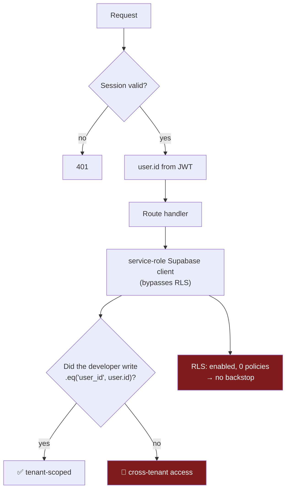

# 06 — Authentication & Authorization

## Executive summary

Three independent authentication schemes, each correct in isolation:

1. **Session** — custom HS256 JWT (`jose`) in an httpOnly `wa_session` cookie, verified
   in `middleware.ts` for pages and via `getSessionUser()` in ~95 route handlers.
2. **API key** — `wsk_{live|test}_{32 hex}` bearer token, SHA-256 hashed at rest, with
   scopes, scope inheritance, expiry, revocation, and a per-key rate limit.
3. **HMAC webhook** — `X-Hub-Signature-256` (Meta, `timingSafeEqual`) and
   `x-razorpay-signature` (Razorpay), both computed over the **raw** body.

The cryptography and session mechanics are done properly. **Authorization is where this
falls short**: there is no role model at all. `users` has no `role` column,
platform-admin status is an environment-variable allowlist, and `team_members.role`
(`owner`/`admin`/`agent`) is stored but never read by any code path. Combined with zero
RLS policies, authorization is entirely "does this request carry a session, and did the
developer remember to add `.eq("user_id", …)`".

**Risk level:** High · **Complexity:** Low · **Confidence:** High (96%)

---

## 1. Registration flow

```
POST /api/auth/register
  → checkRateLimit(AUTH_LIMIT: 10 req / 60 s)     ⚠ per-instance (see §7)
  → registerSchema.safeParse                       ✅ Zod: email lowercased/trimmed,
                                                     password 8–128, name 2–100
  → bcrypt hash
  → INSERT users (email UNIQUE)
  → createSessionToken → Set-Cookie wa_session
```
`app/api/auth/register/route.ts` (90 lines) · `lib/validate.ts:36-41`

One of only **three** routes in the entire repository that use Zod.

## 2. Login flow

```
POST /api/auth/login
  → checkRateLimit(AUTH_LIMIT)
  → loginSchema.safeParse
  → SELECT password_hash FROM users WHERE email = ?
  → bcrypt.compare
  → jose SignJWT({id,email,name,company}, HS256, exp 7d)
  → Set-Cookie wa_session; HttpOnly; Secure(prod); SameSite=Lax; Path=/; Max-Age=604800
```

| Property | Value | Assessment |
|---|---|---|
| Algorithm | HS256, symmetric, `JWT_SECRET` | ✅ Fine for single-issuer. `production-check.sh:51` warns if < 32 chars |
| Lifetime | **7 days**, no refresh, no rotation | 🟠 Long. No revocation list — a leaked cookie is valid for up to 7 days |
| Cookie flags | `httpOnly` ✅, `secure` in prod ✅, `sameSite=lax` ✅, `path=/` | ✅ |
| Payload | `{id, email, name, company}` | ✅ **No tier, no role** — deliberate, see §5 |
| Session store | None (stateless) | 🟠 Cannot force-logout a user |

**Google OAuth** (`/api/auth/google` → `/api/auth/google/callback`, 136 lines) upserts
`users` and issues the identical cookie. **Unable to determine** from the routes alone
whether the OAuth `state` parameter is validated against CSRF — `lib/google-oauth.ts`
(105 lines) was not read. Flagged for verification.

## 3. Password reset

```
POST /api/auth/forgot-password
  → SELECT id FROM users WHERE email = ?
  → return "If that email exists, a reset link has been sent"   ← always
  → // TODO: integrate an email provider
```
`app/api/auth/forgot-password/route.ts:20`

| Aspect | Status |
|---|---|
| Email enumeration protection | ✅ Correct — identical response either way (`route.ts:15-17`) |
| Rate limiting | 🔴 **None** — unlike login/register |
| Zod validation | 🔴 None (`forgotPasswordSchema` exists in `lib/validate.ts:48` but is not imported) |
| Reset token generation | 🔴 None |
| Email delivery | 🔴 `TODO` |
| **Net effect** | **The feature does not exist.** The UI page (`app/(auth)/forgot-password/page.tsx`, 148 lines) collects an email and receives a success message that is a lie |

**Password change** (authenticated) *is* implemented and *does* use Zod:
`POST /api/settings/password` with `passwordChangeSchema` requiring the current password.

## 4. Middleware guard

```ts
// middleware.ts
protectedPaths = [/dashboard, /inbox, /numbers, /contacts, /templates, /campaigns,
                  /automation, /analytics, /billing, /settings, /crm, /appointments,
                  /ads, /segments, /catalog, /admin]                    // 16 prefixes
authPaths      = [/login, /register, /forgot-password]
matcher        = everything except _next/static, _next/image, favicon, images
```

Logic (`middleware.ts:28-73`):
- Not protected and not an auth path → pass through.
- Protected + no valid JWT → redirect to `/login?from=…` **or** to `/api/auth/dev-login`
  when auto-login is enabled.
- Auth path + valid JWT → redirect to `/dashboard`.

| Finding | Detail |
|---|---|
| ✅ Correct prefix matching | `pathname === p \|\| pathname.startsWith(p + "/")` — avoids the `/contacts-export` class of bug |
| ✅ Open-redirect guarded | `dev-login` validates `from` starts with `/` and not `//` (`dev-login/route.ts:53`) |
| 🟠 **`/api/*` is not guarded by middleware** | Every API route must call `getSessionUser()` itself. This is a *convention*, not an enforced boundary — a new route that forgets it is public. Verified: `/api/health`, `/api/auth/*`, `/api/webhook/*`, `/api/cron/*` are intentionally unguarded; every other route does check |
| 🟠 **`/docs/api` is unprotected** | Publicly readable API documentation (274 lines) — probably intended |
| 🔴 **`/catalog` and `/appointments` are protected but backed by nothing** | Guarding a broken page |

## 5. Authorization model

### What exists

| Mechanism | Implementation | Scope |
|---|---|---|
| Authenticated / not | `getSessionUser()` → 401 | ~95 routes |
| **Platform admin** | `isAdminEmail(email)` against `ADMIN_EMAILS` env, comma-separated, case-insensitive (`lib/auth.ts:47-54`); `requireAdmin()` wraps it | 8 admin routes |
| **API key scopes** | 6 scopes with write→read inheritance (`lib/api-keys.ts:45-51,108-117`) | 9 v1 routes |
| Tenant ownership | Hand-written `.eq("user_id", user.id)` | ~78 routes |
| **Roles** | 🔴 **none** | — |

`lib/auth.ts:42-46` states the rationale explicitly: *"There is no role column on `users`
— admin is an operational allowlist, kept out of the DB so it can't be self-granted."*
That is a genuinely thoughtful decision for a founder-operated platform. It is also a hard
ceiling.

### What is missing

| Gap | Consequence |
|---|---|
| No `users.role` | Cannot distinguish owner from agent |
| `team_members.role` never read | The Team Members screen (`settings/team`, 245 lines) invites people who get **no access at all** — there is no login path for a team member |
| No per-resource permissions | Any session holder can do anything within their tenant |
| No `conversations.assigned_to` enforcement | Column + FK exist; no route assigns or filters by it |
| No SSO / SAML / SCIM | Blocks enterprise procurement |
| No MFA | Blocks any regulated buyer (hospitals under DPDP, schools) |
| No API-key IP allowlist | A leaked `wsk_live_*` is usable from anywhere until revoked |
| No audit of admin actions | `lib/audit.ts` defines 10 `AuditAction` values — **all ESU/token related**. Rate changes, margin changes, billing-mode changes, and vertical assignment are **not audited** |

> **That last row is the most commercially serious authorization gap.** An admin can
> change `meta_rates` (COGS) or a tenant's `billing_mode` with no audit record. For a
> business whose margin *is* the product, unlogged privileged pricing changes would fail
> any financial control review.

## 6. Tenant isolation

Full analysis in [16-MULTI-TENANCY.md](16-MULTI-TENANCY.md). Summary:



**One confirmed omission**: `app/api/webhook/whatsapp/route.ts:386-389` updates `contacts`
filtered on `phone` only. See [05-DATABASE.md §7](05-DATABASE.md#7-the-cross-tenant-write).

**Routes with no visible tenant predicate** (from the route scan — each needs manual
confirmation, since some legitimately operate on non-tenant data):

| Route | Likely explanation |
|---|---|
| `ai/wallet`, `verticals/me`, `verticals/suggestions/[id]`, `segments/rfm`, `settings/profile`, `wallet/topup`, `onboarding/profile`, `templates/generate`, `ai/appointment-parse` | Operate on `user.id` directly (as a PK, not a filter) — likely fine |
| `whatsapp/accounts`, `whatsapp/accounts/[id]` | Query `whatsapp_accounts` (**table missing**) — dead |
| `meta/exchange-token`, `meta/save-account`, `meta/manual-connect` | Org-model onboarding — partially dead |
| `admin/*` (6 of 8) | Global config, correctly untenanted |
| `ads/callback`, `ads/connect` | OAuth callbacks — **should be verified** |

## 7. Security weaknesses

Ordered by severity.

| # | Weakness | Severity | Detail |
|---|---|---|---|
| 1 | **`DEMO_AUTO_LOGIN=true` in production** | 🔴 Critical | `middleware.ts:54-56` + `dev-login/route.ts:20-23`. Any visitor to any protected path receives a full 7-day session as `admin@sendanjal.com`. Deliberate and documented for a public demo deploy — but it is an **unauthenticated path to a real tenant with wallet, API-key, and send capability**. Git log shows `23eb5aa`/`9bf305d` era commits enabling it for prod |
| 2 | **Zero RLS policies** | 🔴 Critical | No database backstop for 37 tables |
| 3 | **Rate limiting is per-process** | 🟠 High | `lib/rate-limit.ts:11` `Map` + `lib/api-keys.ts:121` `Map`. On Vercel each lambda instance has its own. Login's 10/min and the webhook's 200/10 s are effectively unbounded under concurrency. **Self-documented at `rate-limit.ts:3`** |
| 4 | **No CSRF token** | 🟠 High | `sameSite=lax` blocks cross-site POST from a foreign form, which covers the common case. But `lax` **does** send the cookie on top-level GET navigations, so any state-changing `GET` route is CSRF-able. Live examples: `GET /api/billing/create-subscription`, `GET /api/admin/verticals/seed`, `GET /api/ads/callback`, `GET /api/commerce/connect` |
| 5 | **No admin action audit** | 🟠 High | Pricing/margin/billing-mode changes unlogged (see §5) |
| 6 | **7-day session, no revocation** | 🟠 High | No jti, no denylist, no session table. Logout only clears the cookie client-side |
| 7 | **`meta_app_secret` stored in plaintext** | 🟠 High | `whatsapp_numbers.meta_app_secret` is a plain `text` column. `access_token` is AES-256-GCM encrypted (`token_encrypted` flag), but the app secret beside it is not |
| 8 | **ESU token cache is in-memory** | 🟠 High | `lib/whatsapp/token-cache.ts:8` — "Single-instance only". Between `exchange-token` and `save-account` a different lambda instance loses the token → intermittent onboarding failure. Note the *design* is good: the plaintext token never reaches the browser, only an opaque `transferId` |
| 9 | **Only 3 of 113 routes validate input with Zod** | 🟠 High | 9 schemas written and unused. Most routes destructure `await request.json()` with ad-hoc `if (!x)` checks. See [12](12-SECURITY.md) |
| 10 | **Dev `ENCRYPTION_KEY` fallback is 64 zeros** | 🟡 Medium | `lib/crypto.ts:16`. Correctly throws in production (`crypto.ts:12-14`), but any data encrypted in dev/preview is trivially decryptable |
| 11 | **Webhook signature bypass in non-prod** | 🟡 Medium | `webhook/whatsapp/route.ts:19-22` returns `true` when `META_APP_SECRET` is unset and `NODE_ENV !== "production"`. On a Vercel **preview** deployment (`NODE_ENV === "production"`) this is safe; on a self-hosted staging it is not |
| 12 | **No password history / breach check** | 🟡 Medium | 8-char minimum, no complexity rule, no HIBP check |
| 13 | **No MFA anywhere** | 🟡 Medium | Including for platform admins who can change COGS |
| 14 | **`forgot-password` unrated-limited** | 🟡 Medium | Free user-enumeration timing oracle and email-bombing vector once email is wired |
| 15 | **API keys never expire by default** | 🟢 Low | `expires_at` is nullable and checked when set; nothing sets it |

### What is done well

- `timingSafeEqual` for Meta signature comparison (`route.ts:29`) — no timing oracle.
- Raw body read **before** JSON parse in both webhook handlers — signatures computed over
  exactly the received bytes.
- Meta tokens AES-256-GCM encrypted at rest with a random 96-bit IV per value, and
  `isEncrypted()` supports transparent legacy-plaintext migration (`lib/crypto.ts`).
- API keys stored as SHA-256 hashes; only a 17-char prefix is displayable; the full key is
  shown exactly once.
- Scope inheritance is explicit rather than string-prefix magic.
- The session JWT deliberately excludes `tier` so entitlement cannot be spoofed by an
  attacker who obtains signing capability — `lib/ai/config.ts:63-68` documents this.
- Audit writes never throw and never block the user action (`lib/audit.ts:6-9`).

---

## Advantages

- Three auth schemes, each using the right primitive for its job.
- Cookie and JWT hygiene is correct (httpOnly, secure, sameSite, short-ish TTL, no
  localStorage).
- Secrets at rest are handled properly for the highest-value secret (Meta access tokens).
- Admin privilege cannot be self-granted from inside the product.
- Email enumeration is correctly prevented on the one route where it matters.

## Disadvantages

- No role model ⇒ no seats, no delegation, no least privilege. `team_members` is a UI
  fiction.
- No database-level authorization. A single missing `.eq()` is a breach.
- Privileged pricing actions are unaudited.
- Rate limiting does not function on the deployment target.
- A production demo bypass grants full tenant access to anonymous visitors.
- Password reset is advertised and non-functional.

## Recommendations

| P | Recommendation | Effort |
|---|---|---|
| **P0** | Gate `DEMO_AUTO_LOGIN` behind an IP allowlist or a shared secret query param, and point it at a **sandbox** tenant with no wallet balance, no API keys, and a disabled send path. | 1 day |
| **P0** | Audit every privileged mutation. Extend `AuditAction` with `rates.update`, `margin.update`, `billing_mode.change`, `ai_config.update`, `vertical.assign`, `tier.change`. `lib/audit.ts` already exists — this is ~20 lines plus call sites. | 2 days |
| **P0** | Move rate limiting to Postgres (a `rate_limits(key, window_start, count)` table with an upsert) so the login and webhook limits are real. | 2 days |
| P1 | Add Zod validation to every mutating route. The 9 unused schemas in `lib/validate.ts` cover most of them already. | 1 week |
| P1 | Convert every state-changing `GET` to `POST` (kills the SameSite=Lax CSRF window), or add a double-submit CSRF token. | 3 days |
| P1 | Encrypt `whatsapp_numbers.meta_app_secret` with the existing `lib/crypto.ts`. | 4 hours |
| P1 | Replace the in-memory ESU token cache with a signed JWE cookie (no new infra) or a TTL row. | 1 day |
| P1 | Ship password reset: token table, Resend email, rate limit, `forgotPasswordSchema`. Or remove the UI. | 3 days |
| P2 | Introduce a real role model: `users.role` + `team_members` login + a `can(user, action, resource)` helper. Prerequisite for any multi-seat sale. | 2–3 weeks |
| P2 | Add session revocation: a `jti` claim plus a `revoked_sessions` table checked in middleware, or shorten to 24 h with a refresh token. | 1 week |
| P2 | Rate-limit `forgot-password` and add Zod. | 2 hours |
| P3 | MFA (TOTP) for `ADMIN_EMAILS` accounts at minimum. | 1 week |
| P3 | Optional IP allowlist and mandatory `expires_at` on `wsk_live_*` keys. | 3 days |
| P3 | Verify Google OAuth `state`/PKCE handling in `lib/google-oauth.ts` — not covered by this audit. | 2 hours |
