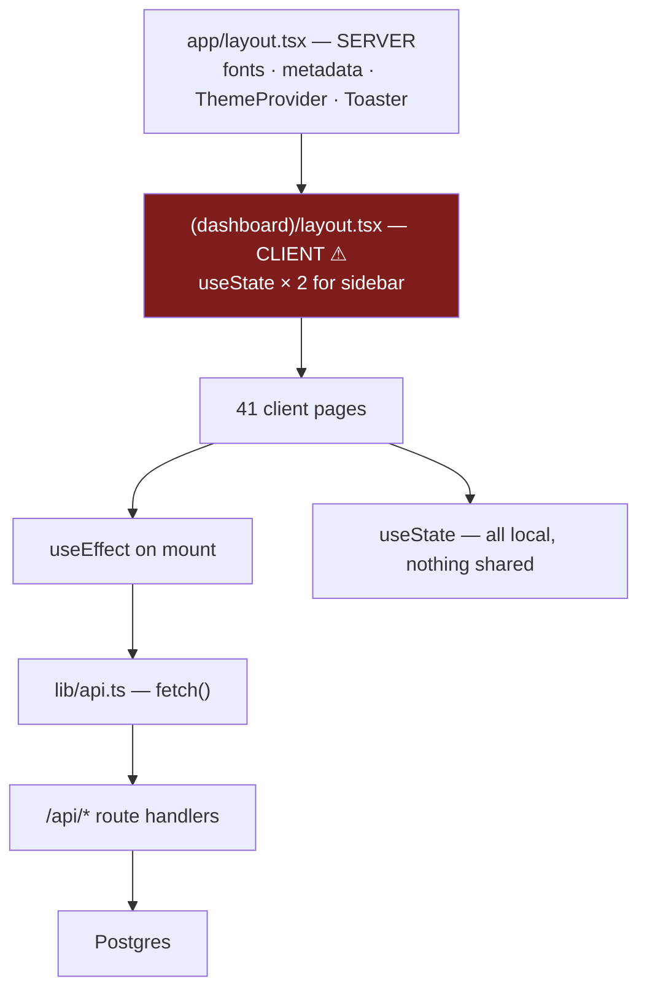

# 08 — Frontend

## Executive summary

The frontend has a **genuinely good design system and a genuinely poor component
architecture**.

The design layer is strong: 294 lines of HSL design tokens in `app/globals.css` covering
two complete palettes (the teal app chrome plus a separate "workbench" palette for the
vertical screens), three deliberately-chosen Google fonts, semantic status tokens, and a
Tailwind config that maps every colour through `hsl(var(--token))` so light/dark are one
source of truth. Someone made real design decisions here — including the notable one of
*not* using WhatsApp green.

The architecture layer is the problem. **41 of 43 pages are `"use client"`**, including
`app/(dashboard)/layout.tsx`, which forces every dashboard child into the client bundle.
There are **zero React Server Components used for data fetching**, zero `loading.tsx`,
zero `error.tsx`, no data-fetching library, no form library, and no shared state. Pages
average 421 lines and reach 1,198; only 4,262 lines live in `components/` against 17,247
lines of pages. Accessibility is effectively absent: **8 `aria-label`s and 0 `htmlFor`
attributes in the entire application**.

A UI redesign, which is the stated next step, would touch essentially all 17,247 lines.

**Risk level:** High (for the redesign) · **Complexity:** High · **Confidence:** High
(90%) — inventory and directive/hook/a11y scans are complete; individual page bodies not read.

---

## 1. Page inventory

43 `.tsx` route files. `server` = no `"use client"` directive.

| Page | LOC | Render | Status |
|---|---:|---|---|
| `app/layout.tsx` | 114 | **server** | Root: fonts, metadata, theme, Toaster |
| `app/page.tsx` | 11 | **server** | force-dynamic redirect |
| `app/(auth)/layout.tsx` | 7 | server | |
| `app/(auth)/login` | 190 | client | |
| `app/(auth)/register` | 223 | client | |
| `app/(auth)/forgot-password` | 148 | client | 🔴 backend is a stub |
| `app/(dashboard)/layout.tsx` | 37 | **client** | 🔴 forces all children client |
| `dashboard` | 396 | client | |
| **`inbox`** | **1,198** | client | 🔴 largest page; inbound msgs never arrive |
| `numbers` | 199 | client | |
| `numbers/connect` | 370 | client | |
| `contacts` | 286 | client | |
| `contacts/import` | 515 | client | |
| `contacts/segments` | 244 | client | |
| **`segments`** | **711** | client | 🔴 `segments` table missing |
| `templates` | **1,073** | client | |
| `templates/send` | 350 | client | |
| **`campaigns/create`** | **1,167** | client | |
| `campaigns` | 355 | client | |
| `campaigns/[id]` | 478 | client | |
| **`automation/create`** | **893** | client | xyflow canvas |
| `automation` | 573 | client | |
| `appointments` | 506 | client | 🔴 `DEMO_APPOINTMENTS` useState |
| `appointments/book` | 452 | client | 🔴 demo |
| `appointments/automations` | 379 | client | 🔴 demo |
| `crm` | 519 | client | 🔴 `crm_*` missing |
| `crm/[id]` | 494 | client | 🔴 |
| **`catalog`** | **727** | client | 🔴 `products`/`carts` missing |
| `ads` | 528 | client | 🔴 `ad_campaigns` missing |
| `analytics` | 296 | client | ⚠️ `daily_analytics` has no writer |
| `billing` | 622 | client | |
| `billing/plans` | 491 | client | |
| `billing/recharge` | 207 | client | |
| `settings` | 245 | client | |
| `settings/team` | 245 | client | ⚠️ invites grant no access |
| `settings/api` | 647 | client | |
| `settings/api/docs` | 539 | client | duplicate of `/docs/api` |
| `settings/api-keys` | 274 | client | |
| `admin` | 228 | client | |
| `admin/rates` | 249 | client | |
| `admin/clients/[id]/setup` | 476 | client | ✅ verticals (new) |
| `admin/clients/[id]/setup/NewVerticalForm` | 278 | client | ✅ new |
| `docs/api` | 274 | client | public |

**Totals:** 17,815 LOC across 43 files · **2 server components** · median 370 · max 1,198.
**Six pages exceed 700 lines. Seven pages (3,485 LOC) render features with no backing table.**

## 2. Component inventory

21 components, 4,262 LOC.

| Component | LOC | Render | Reuse | Role |
|---|---:|---|---|---|
| **`whatsapp/EmbeddedSignupModal`** | **1,313** | client | 1 | 🔴 **Largest file in the repo.** Meta ESU handshake + FB SDK |
| `layout/Sidebar` | 426 | client | layout | Nav tree (7 groups, 25 links) |
| `automation/FlowNodes` | 348 | client | 1 | 9–10 xyflow node renderers |
| `verticals/ui` | 267 | **server** | many | ✅ Workbench primitives (new) |
| `verticals/Recommendations` | 270 | client | 3 | ✅ Rails |
| `whatsapp/SendTestMessage` | 232 | client | 1–2 | |
| `layout/Navbar` | 211 | client | layout | |
| `ai/AICampaignAssist` | 200 | client | 1 | |
| `ai/AIFlowAssist` | 185 | client | 1 | |
| `ai/AIAppointmentAssist` | 151 | client | 1 | demo-only page |
| `shared/StatsCard` | 99 | **server** | many | ✅ |
| `shared/StatusBadge` | 96 | **server** | many | ✅ |
| `ErrorBoundary` | 90 | client | 2 | |
| `verticals/VerticalIcon` | 67 | **server** | many | ✅ |
| `shared/Skeleton` | 67 | client | few | |
| `whatsapp/MetaConnectButton` | 63 | client | 1 | |
| `ai/AICreditsIndicator` | 51 | client | few | |
| `shared/EmptyState` | 44 | client | many | ✅ |
| `auth/GoogleSignInButton` | 44 | client | 2 | |
| `shared/PageHeader` | 28 | **server** | many | ✅ |
| `theme-provider` | 10 | client | root | |

### The reuse problem

**Only 6 components are genuinely reusable primitives** (`PageHeader`, `StatsCard`,
`StatusBadge`, `EmptyState`, `Skeleton`, `VerticalIcon`) totalling **401 lines**. There is
**no** shared `Button`, `Input`, `Select`, `Modal`, `Dialog`, `Table`, `Tabs`, `Card`,
`Toggle`, `Tooltip`, `Dropdown`, `Pagination`, or `Form` component.

Consequence: every one of the 41 pages hand-writes its own buttons, inputs, tables, and
modals with inline Tailwind. That is the direct explanation for the 421-line average.
A 1,167-line campaign wizard is mostly re-implemented form controls.

```
Page LOC   17,815  ████████████████████████████████████████
Comp LOC    4,262  █████████
Primitives    401  █
```

Healthy Next.js applications invert the first two bars.

## 3. Rendering architecture



**Every screen is a client-side waterfall:** HTML shell → JS bundle → hydrate →
`useEffect` → `fetch` → render. Nothing is server-rendered with data. There is no
streaming, no `Suspense` boundary around data (3 files mention `Suspense`, none for data
fetching), no PPR.

### Why `(dashboard)/layout.tsx` is the root cause

It is `"use client"` solely to hold two booleans for sidebar open/collapsed state
(`layout.tsx:13-14`). In the App Router, a client layout makes every descendant a client
component. Those 37 lines cost the entire dashboard its ability to be a Server Component.

**Fix:** keep the layout as a Server Component and move the two `useState` calls into a
small `<SidebarShell>` client island that wraps only `Sidebar` + `Navbar`, passing
`children` straight through. This is a ~20-line change and it **unblocks RSC adoption for
all 41 pages.** Highest-leverage frontend change in the repo.

## 4. State management

| Mechanism | Present | Count |
|---|:-:|---|
| `useState` | ✅ | 50 files |
| `useEffect` | ✅ | 35 files |
| `useCallback` | ✅ | 9 |
| `useRef` | ✅ | 7 |
| `useMemo` | ✅ | **3** |
| `useContext` / `createContext` | 🔴 | **0** |
| `useReducer` | 🔴 | 0 |
| `useTransition` / `useOptimistic` | 🔴 | 0 |
| Zustand / Redux / Jotai | 🔴 | 0 |
| TanStack Query / SWR | 🔴 | 0 |

**No global state at all.** Consequences:

- Wallet balance, AI credit balance, session user, and connected-numbers list are re-fetched
  independently by every page that needs them. `AICreditsIndicator` fetches
  `/api/ai/wallet` on its own; so does the billing page.
- No cache, so navigating away and back re-fetches everything.
- No optimistic updates — every mutation is a round-trip before the UI moves.
- No request deduplication.
- 3 `useMemo` across 17,815 lines of client code means expensive derivations (segment
  previews, campaign audience counts, chart data transforms) recompute on every render.

## 5. Forms and validation

**No form library** — 0 files reference `react-hook-form` or `formik`.

| Concern | Reality |
|---|---|
| Form state | Individual `useState` per field |
| Client validation | Ad-hoc `if (!x)` before submit |
| **Shared validation with the server** | 🔴 None. `lib/validate.ts` Zod schemas are server-only and 9 of 12 are unused anywhere |
| Field labels | 🔴 **0 `htmlFor` attributes** — no label/input association |
| Error display | Per-page bespoke |
| Submit protection | **Unable to determine** double-submit guarding without reading pages |

The `campaigns/create` page at 1,167 lines is a multi-step wizard built entirely from raw
`useState`. Zod runs on the server for 3 routes; the client re-implements a subset by hand.
**Sharing the Zod schemas across the wire is a large, cheap win**: one schema, both sides.

## 6. Loading, error, and empty states

| Next.js convention | Files | Assessment |
|---|---:|---|
| `loading.tsx` | **0** | 🔴 No route-level loading UI or streaming |
| `error.tsx` | **0** | 🔴 No route-level error boundary |
| `not-found.tsx` | **0** | 🔴 Default 404 |
| `template.tsx` | 0 | fine |
| `<ErrorBoundary>` | 2 files | ✅ Manual, wraps dashboard `children` (`layout.tsx:32`) and root |
| `<Skeleton>` | ✅ exists (67 L) | Used in "few" pages — most likely hand-roll spinners |
| `<EmptyState>` | ✅ exists (44 L) | Reasonably reused |

The manual `ErrorBoundary` is a reasonable substitute for `error.tsx`, but the **complete
absence of `loading.tsx`** means every navigation shows a blank main area until the
client fetch resolves. This is the biggest perceived-performance problem, and it is
~43 four-line files to fix.

## 7. Design system

The strongest part of the frontend.

### Typography — three deliberate faces

| Role | Font | Rationale (from `app/layout.tsx:6-27`) |
|---|---|---|
| Body | **Plus Jakarta Sans** | "friendly, highly readable humanist sans (distinct from generic Inter)" |
| Display | **Bricolage Grotesque** | "characterful editorial grotesque for headings" |
| Mono | **JetBrains Mono** | eyebrows, chips, prompt text |

All loaded via `next/font/google` with `display: "swap"` and CSS-variable output. Correct.

### Colour — two complete palettes

**App chrome** (teal-blue `#0B7285`, explicitly *not* WhatsApp green):

| Token | Light | Purpose |
|---|---|---|
| `--background` | `178 44% 96%` | cool mint tint |
| `--primary` | `189 85% 28%` | brand teal |
| `--success` | `160 84% 39%` | emerald — **reserved for sent/delivered only** |
| `--warning` | `38 92% 50%` | amber |
| `--destructive` | `347 77% 50%` | rose |
| `--radius` | `0.75rem` | |

**Workbench palette** (new, for vertical screens — `globals.css:47-62`): warm paper
`#FAFAF8`, near-black ink `#0F0F0F`, forest-green accent `#157F5B`, hairline rules
`#E8E7E2`. Deliberately scoped so "the rest of the product is untouched".

Plus one genuinely thoughtful semantic token:

```css
/* Higher cost is INFORMATION, not an error — amber, deliberately not --destructive. */
--cost-note: 32 85% 44%;
```

That comment is a product decision encoded in a design token. It is the kind of detail
that distinguishes a designed system from a themed one.

### Dark mode

A full parallel dark set (`globals.css:64+`), class-based via `next-themes`, with
lightened primaries for dark surfaces and brightened muted-foreground for AA contrast.
Comments claim AA compliance; **not independently verified in this audit.**

### Motion

`tailwindcss-animate` plus 7 custom keyframes (`shimmer`, `fade-in`, `slide-in`,
`pulse-slow`, `spin-slow`, accordion up/down) **and** `framer-motion` with presets in
`lib/motion.ts` (106 L). Two animation systems for one app — mild redundancy.

### Legacy aliasing done right

```js
wa: { green: "#0B7285", teal: "#0B7285", dark: "#095C6B", light: "#E0F2F1" }
```
`tailwind.config.ts:86-93` — the old `bg-wa-green` class names were repointed to the new
brand rather than find-replaced across 41 pages. Pragmatic and correctly commented.

## 8. Responsiveness

| Signal | Evidence |
|---|---|
| Mobile sidebar | `isOpen`/`onClose` drawer pattern (`layout.tsx:18-23`) |
| Collapsible desktop sidebar | `lg:pl-[60px]` ⇄ `lg:pl-64` with a 220 ms cubic-bezier transition |
| Responsive padding | `p-4 sm:p-6` on `<main>` |
| Viewport metadata | ✅ `Viewport` exported from root layout |
| Container config | `center: true, padding: 2rem, 2xl: 1400px` |

The shell is responsive. **Whether the 41 page bodies are responsive is unable to be
determined without reading them** — with 1,000-line pages of hand-written Tailwind,
per-page breakpoint coverage is likely uneven. Data-dense screens (`inbox` at 1,198 lines,
`catalog` at 727) are the usual failure points.

## 9. Accessibility — the weakest area

Full-repo attribute counts across `app/` + `components/`:

| Attribute | Occurrences | Files |
|---|---:|---:|
| `aria-label` | **8** | 3 |
| `aria-describedby` | **0** | 0 |
| `aria-live` | 1 | 1 |
| `role=` | **1** | 1 |
| `sr-only` | 2 | 2 |
| `tabIndex` | **0** | 0 |
| **`htmlFor`** | **0** | **0** |
| `alt=` | **1** | 1 |

For a 17,815-line application with dozens of forms, modals, tables, and a drag-and-drop
canvas, this is effectively **no accessibility implementation**.

| WCAG concern | Status |
|---|---|
| Form labels programmatically associated | 🔴 0 `htmlFor` |
| Images have alt text | 🔴 1 `alt=` total |
| Modals trap focus / are announced | 🔴 no `role="dialog"`, no `aria-modal`, no focus management |
| Keyboard navigation for custom controls | 🔴 0 `tabIndex` |
| Live regions for async status | 🔴 1 `aria-live` |
| Icon-only buttons named | 🔴 8 `aria-label` against 25+ nav links and many icon buttons |
| Colour contrast | 🟡 Tokens claim AA; unverified |
| Reduced motion | 🟡 **Unable to determine** — no `prefers-reduced-motion` found in the CSS sampled |

For a platform targeting hospitals and schools — buyers with accessibility procurement
requirements — this is a commercial blocker, not just a quality issue.

---

## Advantages

- A real, considered design system: three-font pairing, two full token palettes,
  semantic status colours, light/dark parity from one source, and design decisions
  documented in comments.
- Deliberate brand differentiation (teal, not WhatsApp green; emerald reserved for
  delivery states only).
- The new `components/verticals/*` files are **Server Components** and are genuinely
  reusable — evidence that the team knows the better pattern and applied it on the newest
  work.
- `ErrorBoundary` wraps the dashboard content area.
- Legacy Tailwind class aliasing avoided a risky 41-file find-replace.
- Sidebar/shell responsiveness is properly implemented.

## Disadvantages

- 41 of 43 pages are client components; no RSC data fetching anywhere.
- 4:1 page-to-component LOC ratio; only 401 lines of reusable primitives and no
  Button/Input/Modal/Table.
- Six pages over 700 lines; two over 1,100. Untestable and unreviewable at that size.
- No data-fetching library ⇒ no cache, no dedupe, no optimistic UI; duplicated fetches
  for shared data like wallet balance.
- No form library and no shared client/server validation.
- Zero `loading.tsx` / `error.tsx` ⇒ blank screens on every navigation.
- Accessibility is essentially unimplemented.
- 3,485 lines of pages render features with no database behind them.
- Two animation systems.

## Recommendations

Ordered by leverage. Items 1–3 are prerequisites for the planned redesign.

| P | Recommendation | Effort | Why |
|---|---|---|---|
| **P0** | Make `(dashboard)/layout.tsx` a Server Component; extract a `<SidebarShell>` client island. | **~20 lines** | Unblocks RSC for all 41 pages. Single highest-leverage change |
| **P0** | Build the missing primitives: `Button`, `Input`, `Select`, `Textarea`, `Modal`, `Table`, `Tabs`, `Card`, `Toggle`, `Pagination`, `Field` (label + input + error, with `htmlFor` and `aria-describedby` built in). Consider `shadcn/ui` — it matches this Tailwind + CSS-variable token setup exactly and would drop straight onto the existing tokens. | 2 weeks | Cuts the redesign surface by an estimated 40–50% and fixes form a11y structurally |
| **P0** | Add `loading.tsx` and `error.tsx` per route group. | 1 day | Removes blank-screen navigation |
| P1 | Migrate the 10 heaviest pages to RSC: fetch on the server, keep interactive parts as islands. | 3 weeks | Kills the client waterfall; large LCP win |
| P1 | Adopt TanStack Query (or RSC + Server Actions) for the remaining client fetches. | 1 week | Cache, dedupe, optimistic updates |
| P1 | Share the `lib/validate.ts` Zod schemas with the client via `react-hook-form` + `zodResolver`. One schema, both sides. | 1 week | Fixes 2.7% server validation coverage *and* client duplication together |
| P1 | Hide or flag the 7 pages with no backing table. | 1 day | Trust |
| P2 | Split the six 700+ line pages. `EmbeddedSignupModal` (1,313) and `inbox` (1,198) first. | 3 weeks | Testability |
| P2 | Accessibility pass: `htmlFor` on every input, `alt` on every image, `aria-label` on icon buttons, focus trap + `role="dialog"` on modals, `aria-live` for async status, `prefers-reduced-motion`. | 2 weeks | Procurement blocker for the target verticals |
| P2 | Pick one animation system — keep `tailwindcss-animate`, drop `framer-motion` (or vice versa). | 3 days | Bundle size |
| P3 | Add `useMemo` to the expensive derivations in `segments`, `campaigns/create`, and `analytics`. | 2 days | |
| P3 | Replace the hardcoded `badge: 3` on the Inbox nav item (`Sidebar.tsx:50`) with the real `conversations.unread_count`. | 1 hour | It currently lies to every user |
