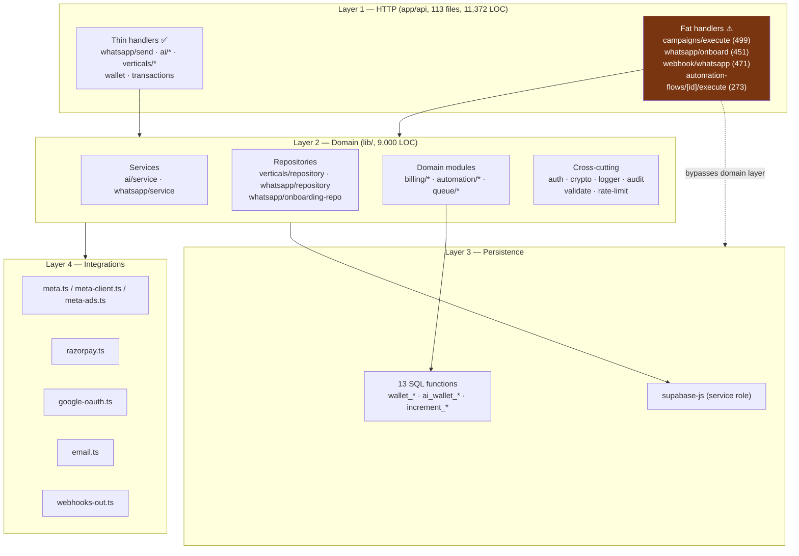

# 09 — Backend

## Executive summary

The backend is **three-layer, not fully consistently applied**: route handlers →
`lib/` domain modules → Supabase. Where a domain module exists (`lib/billing`, `lib/ai`,
`lib/verticals`, `lib/queue`), the layering is clean and the handler is thin. Where one
does not (contacts, campaigns, CRM, inbox, ads, commerce), the handler *is* the business
logic and talks to Postgres directly.

The result is a bimodal codebase: `lib/billing/guarded-send.ts` is 133 lines of
well-factored domain logic, while `app/api/campaigns/execute/route.ts` is 499 lines of
handler containing pricing, reservation, batching, Graph calls, settlement, and counter
updates. Both handle money.

Cross-cutting concerns are **defined but under-applied**: a good structured logger used
inconsistently, a typed error hierarchy wired only into dead code paths, Zod schemas used
by 3 of 113 routes, an audit helper covering 10 actions (none of them the financially
sensitive ones), and no retry logic outside of outbound webhooks.

**Risk level:** Medium · **Complexity:** Medium · **Confidence:** High (90%)

---

## 1. Layering



**Layer-violation count:** 4 large handlers reach past the domain layer straight into
Postgres for business-critical logic. Two of them (`campaigns/execute`,
`webhook/whatsapp`) mutate money.

## 2. "Controllers" — route handlers

Next.js route handlers are the controller layer. Statistics:

| Metric | Value |
|---|---|
| Files | 113 |
| Total LOC | 11,372 |
| Median | ~80 |
| Mean | 101 |
| Over 200 lines | 12 |
| Over 400 lines | 4 |
| Largest | `campaigns/execute` 499 · `webhook/whatsapp` 471 · `whatsapp/onboard` 451 |

**Common handler shape** (the good one, `app/api/whatsapp/send/route.ts`):

```
1. getSessionUser() → 401
2. destructure body
3. resolve idempotency key (header → body → randomUUID)
4. presence checks → 400
5. tenant-scoped resource fetch (.eq("user_id", user.id)) → 404
6. state checks (status active, connected) → 400
7. decrypt secrets
8. delegate to domain (guardedSingleSend)
9. typed catch (InsufficientBalanceError → 402)
10. NextResponse.json
```

That is a good template. It is followed properly by roughly the thin third of the routes.

## 3. Services

| Service | LOC | Read? | Assessment |
|---|---:|:-:|---|
| **`lib/ai/service.ts`** | 344 | ✅ | ⭐ The exemplar. Single `runTask<T>()` entry point; provider adapters behind an interface; 7-stage pipeline (config → tier gate → credit pre-check → timed call → validate/retry → debit-on-success → always-log); returns a discriminated union, never throws to the caller |
| **`lib/billing/guarded-send.ts`** | 133 | ✅ | ⭐ Closure-injection: the sender is passed in as `send: () => Promise<T>`, so `lib/meta.ts` is never modified or wrapped. Textbook |
| `lib/whatsapp/service.ts` | ~200 | ✗ | 🔴 Org model — dead in production |
| `lib/whatsapp/engine.ts` | 588 | ✅ | 🔴 Org model. Well-written pure-ish engine (computes payloads, no I/O) that cannot run |
| `lib/whatsapp/dispatch.ts` | 90 | ✅ | 🔴 Two explicit gates (window, token) — correct design, wrong table |
| `lib/automation/runtime.ts` | ~180 | partial | ✅ The live path. AI intent → keyword fallback |
| `lib/verticals/seeder.ts` | 125 | ✗ | ✅ Validates every seed through `sanitizeFlowGraph` before writing |

**Missing services** — these have no domain module, so the logic lives in handlers:
contacts, campaigns (partly), inbox, CRM, ads, products/carts, team members, analytics.

## 4. Repositories

The Repository pattern is applied **inconsistently but correctly where present**.

| Repository | Model | Quality |
|---|---|---|
| `lib/verticals/repository.ts` (209) | legacy `user_id` | ⭐ Exemplary: explicit `VERTICAL_COLS`/`LIBRARY_COLS` constants, row→domain mappers (`toVertical`, `toItem`), discriminated-union return types, documented scope discipline ("Inbox, contacts, billing … must never call into this module") |
| `lib/whatsapp/repository.ts` | org | 🔴 dead |
| `lib/whatsapp/onboarding-repo.ts` | legacy | ✅ live |
| `lib/billing/wallet.ts` (116) | legacy | ✅ Thin typed wrappers over 5 RPCs; converts SQL error strings into typed exceptions (`isInsufficient` → `InsufficientBalanceError`) |
| `lib/ai/wallet.ts` (93) | legacy | ✅ Mirror of the above for credits |

**Elsewhere**: raw `supabase.from(...)` inline. Roughly 78 route files construct their own
queries. That is why 19 missing tables took a live-DB diff to find rather than a
grep of a data-access layer.

## 5. Business logic quality — money as the case study

The money path is the best-engineered code in the repository. Three properties make it correct:

**(a) Reserve, don't debit.**
```
wallet_reserve (hold)  →  Meta send  →  Meta status webhook  →  wallet_settle (debit)
                                                              or wallet_release (free)
```
`lib/billing/guarded-send.ts:55-67` states the invariant: *"a message that never reaches
`sent` is never charged."* There is no charge-then-refund path anywhere.

**(b) Idempotency at three levels.** From `lib/billing/confirm.ts:9-15`:
- `message_billing.status` gates re-processing (only `'reserved'` rows act),
- `wallet_settle` is idempotent per `(reservation_id, unit_idem = wa_message_id)`,
- `wallet_release` is idempotent.

Duplicate or out-of-order Meta webhooks therefore cannot double-charge or double-release.

**(c) Integer paise, enforced in Postgres.** All amounts `bigint`; row locks
(`SELECT … FOR UPDATE`) and a non-negative constraint live inside the SQL functions
(migration 011), not in TypeScript. The application cannot race itself.

**Every failure branch is handled** (`guarded-send.ts:95-113`): send throws → release;
Meta returns no `messageId` → release rather than hold forever, with a warning log.

### Failure-mode design elsewhere

| Module | Failure philosophy | Correct? |
|---|---|---|
| `lib/billing/rates.ts` | **Fail soft** — every reader returns `null` on error so code can deploy before migration 017 (`rates.ts:7-9`) | ✅ …but see the margin caveat below |
| `lib/whatsapp/dedup.ts` | **Fail open** — if the dedup write errors, process anyway, because "silently dropping a real message would be worse" (`dedup.ts:20-23`) | ✅ Right call, and downstream idempotency backs it |
| `lib/audit.ts` | **Never throw** — audit failure must not block the user action (`audit.ts:6-9`) | ✅ |
| `lib/ai/service.ts` | **Never throw** — always returns a `fallback` with human-readable copy | ✅ |
| `lib/whatsapp/status.ts` | **Monotonic guard in the UPDATE filter**, so a late `sent` cannot clobber a `read` even under concurrency (`status.ts:62-63`) | ✅ Race-safe by construction |

> **The one place fail-soft is dangerous:** `deriveQuote()` returning `null` causes
> `quoteSend` to fall through to the legacy `message_pricing` defaults — which are
> **lower** than the derived prices (MARKETING 88p vs 110p). A missing `plan_tiers` row or
> a `platform_settings` read failure silently reduces revenue instead of erroring. Should
> log a warning at minimum.

## 6. Middleware and cross-cutting concerns

| Concern | Module | Applied where | Coverage |
|---|---|---|---|
| Page auth | `middleware.ts` | 16 path prefixes | ✅ complete |
| Route auth | `lib/auth.ts:getSessionUser` | per handler, by convention | ✅ 89 routes; **no enforcement mechanism** |
| Admin auth | `lib/auth.ts:requireAdmin` | 8 routes | ✅ |
| API key auth | `lib/api-keys.ts:withApiAuth` | 9 routes | ✅ auth + scope + rate limit in one call |
| Validation | `lib/validate.ts` | **3 routes** | 🔴 2.7% |
| Rate limiting | `lib/rate-limit.ts` | 3 routes + 9 via `withApiAuth` | 🟠 and per-process |
| Logging | `lib/logger.ts` | ~40 files | 🟡 inconsistent |
| Audit | `lib/audit.ts` | ESU/token actions only | 🟠 no financial actions |
| Error mapping | `lib/whatsapp/errors.ts:toApiError` | dead paths only | 🔴 |
| CORS + security headers | `next.config.mjs` | global | ✅ |

**There is no composable middleware layer for routes.** Every handler re-implements
`const user = await getSessionUser(); if (!user) return 401`. A `withAuth(handler)` /
`withValidation(schema, handler)` / `withRateLimit(cfg, handler)` composition stack would
make the 2.7% validation coverage a one-line-per-route fix and make omission impossible.

## 7. Logging

`lib/logger.ts` (40 lines) is well-shaped:

```ts
{ timestamp, level, message, env, ...context }  // JSON, one line
logger.debug → suppressed unless NODE_ENV !== "production"
errorMsg(err) → safe string coercion
```

| Assessment | Detail |
|---|---|
| ✅ Structured JSON | Log-drain and query friendly |
| ✅ Typed context | `userId`, `route`, `method`, `status`, `duration` + index signature |
| ✅ Debug gating | |
| 🔴 **No sink** | `logger.ts:21` — *"In production you'd ship this to Datadog / Sentry / Logtail."* Everything goes to stdout → Vercel logs only |
| 🟡 Inconsistent adoption | ~40 of 132 `lib`+`api` files import it. Others use bare `catch {}` |
| 🟡 `console.error` in hot paths | `campaigns/execute:143,228` uses `console.error` for **wallet settle/release failures** — the most important errors in the system go through the unstructured path |
| 🟡 No request id / correlation id | A webhook → queue → worker → Meta chain cannot be traced end-to-end |
| ✅ 1 stray `console.log` | `production-check.sh:101` guards this |

**Notably good:** `logger.warn` messages consistently include the identifiers needed to
act (`waMessageId`, `phoneNumberId`, `eventKey`, `reservationId`).

## 8. Caching

**None.** No Redis, no `unstable_cache`, no `revalidate`, no Vercel Runtime Cache, no
in-process memoisation of config.

Re-read on every request:

| Table | Read by | Frequency |
|---|---|---|
| `users.billing_mode` | `getBillingMode` | every send |
| `users.tier` | `deriveQuote`, `getUserTier` | every send + every AI call |
| `meta_rates` | `getWholesalePaise` | every managed send |
| `plan_tiers` | `getTierConfig` | every managed send |
| `platform_settings` | `getPlatformSettings` | every managed send |
| `ai_model_config` | `loadModelConfig` | every AI call |

A single managed send performs **≈7 sequential Postgres round-trips** before it reaches
Meta. `deriveQuote` does parallelise three of them with `Promise.all`
(`rates.ts:132-136`) — good — but the first two are sequential.

The four config tables change perhaps weekly. A 60-second cache would cut managed-send DB
work by ~60%.

## 9. Retries

| Path | Retry? | Mechanism |
|---|:-:|---|
| Outbound webhooks to clients | ✅ | `webhook_deliveries.attempts` + `next_retry_at`, partial index `WHERE status IN ('pending','retrying')` |
| AI provider calls | ✅ | `silentRetries` + `appendOnRetry` feeds the parse error back into the prompt (`ai/service.ts:207-249`) |
| pg-boss jobs | ✅ | `boss.fail()` on throw; pg-boss retries |
| Meta webhook receipt | ✅ | Meta retries on non-200; we always 200 and replay from `webhook_inbox` |
| **Outbound Meta sends** | 🔴 | No retry, no backoff, no circuit breaker. A transient Graph 5xx loses the message; the wallet hold is released, so no money is lost, but the message is silently dropped |
| **Razorpay calls** | 🔴 | None |
| Inline queue driver | 🔴 | `void Promise.then().catch(log)` — a failed job is logged and gone (`queue/index.ts:58-66`) |

`lib/whatsapp/errors.ts` defines `GraphApiError` (502) and `lib/meta-client.ts` exposes
`MetaApiError` with a `code` — the raw material for retry classification (Meta's 131xxx
family is well-documented as retryable vs terminal). None of it is used for retry decisions.

## 10. Background jobs

`lib/queue/index.ts` (171 lines) is the cleanest abstraction in the codebase.

```ts
interface QueueDriver {
  enqueue(type, payload, opts?): Promise<void>
  drain?(type, batchSize): Promise<DrainResult>
}
```

| Driver | Behaviour |
|---|---|
| `InlineDriver` (default) | Runs the handler in-process, **detached from the response promise** (`void Promise.resolve().then(...)`), so the HTTP response returns immediately. Zero infra |
| `PgBossDriver` | Writes to the `pgboss` schema; drained by a cron calling `drainQueue()`. Uses `singletonKey` as a secondary dedup guard. Requires session-mode Postgres (5432) for advisory locks |

Registered job types: **1** — `whatsapp:inbound`.

### Three deployment problems

1. **Inline driver on serverless is not durable.** After the response is sent, the Vercel
   function may be frozen or terminated before the detached promise resolves. Work started
   inline can vanish. Mitigated only by `webhook_inbox` replayability — which nothing
   currently replays.
2. **The cron fires daily.** `vercel.json` → `"0 0 * * *"`. With `QUEUE_DRIVER=pgboss`, an
   inbound automation reply could wait 24 hours. `CLAUDE.md` says "every minute".
3. **No dead-letter queue, no depth metric, no replay job.** `webhook_inbox` has a
   `status <> 'processed'` partial index built for exactly this purpose, and nothing reads it.

**Missing jobs the product needs:** Meta token rotation (60-day expiry), template-status
polling, low-balance notification, credit expiry, `daily_analytics` rollup, campaign
continuation beyond one invocation, `webhook_inbox` replay.

## 11. Dependency injection

No DI container, and none needed at this size. Two lightweight patterns are used well:

| Pattern | Site | Why it works |
|---|---|---|
| **Closure injection** | `guardedSingleSend({ send: () => sendTextMessage(...) })` | Billing wraps sending without importing or modifying the sender |
| **Adapter + factory** | `getAdapter(cfg.provider)` → `AnthropicAdapter` / `GeminiAdapter` | New provider = new class + a DB row; routes unchanged |
| **Driver selection** | `selectDriver()` reads `QUEUE_DRIVER` | Durability is config |
| Client factory | `createServiceClient()` | Single construction point — makes a future typed/scoped client a one-file change |

**Testability consequence:** because dependencies are module-level imports rather than
injected, `lib/billing/guarded-send.ts` cannot be unit-tested without mocking
`@/lib/supabase/server`. The pure functions (`windowStateFrom`, `canSend`,
`toBillableCategory`, `sanitizeFlowGraph`, `tierAxes`, `rawCostPaise`) *are* directly
testable and are the obvious first unit tests.

---

## Advantages

- The money path is correct by construction: reserve/confirm, integer paise, triple
  idempotency, Postgres row locks, every failure branch handled.
- `lib/ai/service.ts` and `lib/billing/guarded-send.ts` are reference-quality domain modules.
- Failure philosophies are **explicitly chosen and documented** per module (fail-soft,
  fail-open, never-throw) rather than accidental.
- `lib/whatsapp/status.ts` achieves race-safe monotonic state via the UPDATE filter — no
  locking, no read-modify-write.
- The queue abstraction makes durability a configuration decision.
- Closure injection lets billing wrap sending with zero coupling.
- Structured JSON logging with actionable identifiers.

## Disadvantages

- Bimodal quality: excellent domain modules alongside 499-line money-handling handlers.
- Cross-cutting concerns are built but unapplied — Zod at 2.7%, `toApiError` only on dead
  paths, audit missing every financial action.
- No composable route middleware, so omission is the default failure mode.
- No caching ⇒ ~7 DB round-trips per managed send.
- No retry or circuit breaker on outbound Meta sends; transient 5xx silently drops messages.
- Inline queue driver is not durable on serverless, and the daily cron makes the durable
  driver unusable.
- No log sink, no correlation ids, no dead-letter handling.
- `console.error` on the two most important error paths in the system.

## Recommendations

| P | Recommendation | Effort |
|---|---|---|
| **P0** | Build a middleware composition stack: `withAuth`, `withAdmin`, `withValidation(schema)`, `withRateLimit(cfg)`, `withErrorMapping(toApiError)`. Apply to all 113 routes. Turns four systemic gaps into one mechanical migration. | 2 weeks |
| **P0** | Replace `console.error` with `logger.error` on the wallet settle/release paths in `campaigns/execute:143,228`. | 15 min |
| **P0** | Fix the cron schedule, or document inline-only and add a `webhook_inbox` replay job. | 1 day |
| P1 | Extract the `campaigns/execute` send loop into `lib/whatsapp/broadcast.ts`. Add continuation for >1,000 recipients. | 1 week |
| P1 | Add retry with exponential backoff + Meta error-code classification (retryable vs terminal) to outbound sends, using the existing `MetaApiError.code`. | 1 week |
| P1 | Cache the four config tables for 60 s. | 1 day |
| P1 | Log a warning when `deriveQuote` returns null and pricing falls back to the cheaper legacy defaults — this is a silent revenue leak. | 1 hour |
| P1 | Extend `lib/audit.ts` to cover `rates.update`, `margin.update`, `billing_mode.change`, `ai_config.update`, `tier.change`, `vertical.assign`. | 2 days |
| P2 | Unit-test the pure functions first: `window`, `status`, `pricing`, `rates`, `tiers`, `flow-schema`, `ai/config.rawCostPaise`. High value, no mocking needed. | 1 week |
| P2 | Introduce a repository module per resource family (contacts, campaigns, inbox) so schema drift becomes a compile error in one file instead of 78. | 3 weeks |
| P2 | Add a correlation id: generate at the webhook/route edge, thread through `logger` context and the queue payload. | 3 days |
| P2 | Wire `logger.error` to Sentry. | 4 hours |
| P3 | Add the missing background jobs: token rotation, template-status poll, low-balance notify, credit expiry, analytics rollup. | 3 weeks |
| P3 | Add a dead-letter table and a queue-depth metric on `/api/health`. | 3 days |
