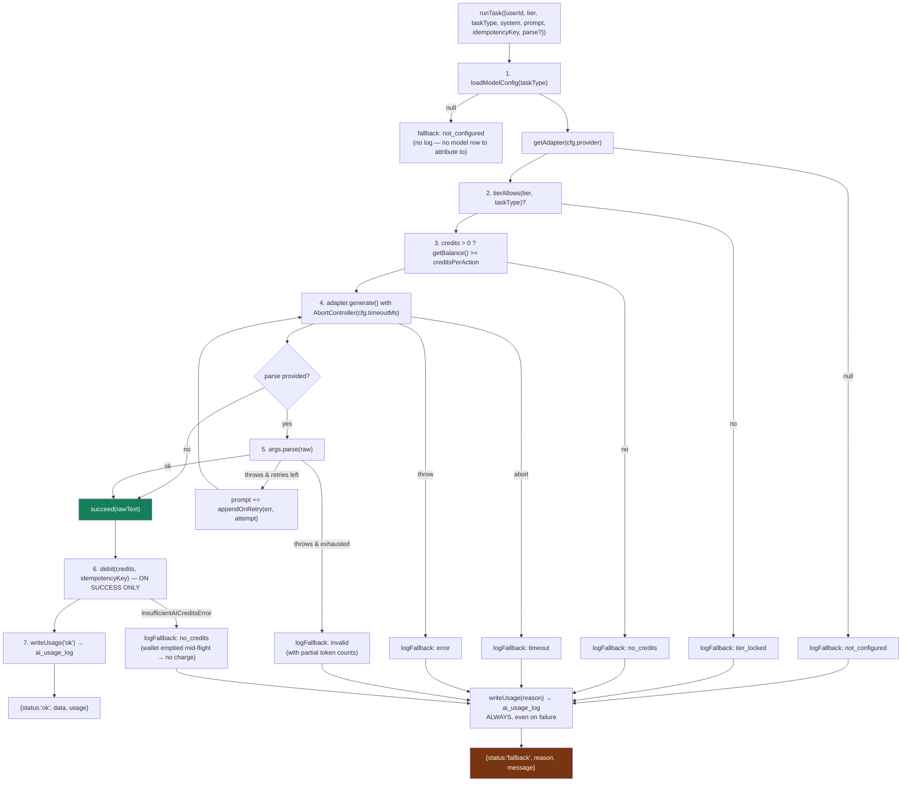

# 10 — AI Architecture

## Executive summary

**This is the best-designed subsystem in the codebase**, and the one most clearly built
from stated principles rather than convenience. Every AI action in SendAnjal flows through
exactly one function — `runTask<T>()` in `lib/ai/service.ts` — which enforces a 7-stage
pipeline: load config → tier gate → credit pre-check → timed provider call →
validate/retry → debit-on-success → always-log.

The load-bearing decisions:

- **No model id appears in any route.** Provider, model, price, credits, timeout, and
  retry budget all come from the `ai_model_config` table at request time. Changing model
  or provider is an admin UPDATE, not a deploy.
- **AI credits are a separate ledger from the message wallet.** Credits vs paise, never
  merged, both row-locked and idempotent in Postgres.
- **AI never performs a customer-facing action.** `runTask` returns a draft or a parse for
  a human to confirm. The one runtime path that *does* act (intent routing) only selects
  among flows a human already published.
- **AI failure is a product state, not an exception.** `runTask` never throws; it returns
  a discriminated union whose fallback branch carries human-readable copy.

**Total AI surface: 670 LOC in `lib/ai/` + 429 in `lib/automation/` + 72 in
`prompt-context.ts`.** Small, and doing a lot.

**Gaps:** no vector store, no RAG, no conversation memory, no streaming, no output
moderation, and — the one real defect — **the highest-volume task is misconfigured onto
the expensive provider.**

**Risk level:** Low · **Complexity:** Medium · **Confidence:** High (95%) — all three
`lib/ai/` files read in full, plus `intent.ts`, `prompt-context.ts`, and the live config.

---

## 1. Providers

| Provider | Adapter | Status | Notes |
|---|---|---|---|
| **Anthropic** | `AnthropicAdapter` (`service.ts:54-74`) | ✅ Live, all 6 tasks | `@anthropic-ai/sdk` `messages.create` with `{ signal }` for timeout |
| **Google Gemini** | `GeminiAdapter` (`service.ts:82-108`) | ⚠️ **Implemented, unused** | Raw REST — deliberately no SDK dependency added. Reads `usageMetadata` for tokens |
| Vercel AI Gateway | — | 🔵 Anticipated | `// case "gateway": …` commented at `service.ts:120` |

```ts
function getAdapter(provider: string): ProviderAdapter | null {
  case "anthropic": return process.env.ANTHROPIC_API_KEY ? new AnthropicAdapter() : null;
  case "google":    return process.env.GEMINI_API_KEY    ? new GeminiAdapter()    : null;
  default:          return null;   // → graceful fallback
}
```

A missing API key returns `null`, which becomes a `not_configured` fallback — not a crash.

### Live configuration (`ai_model_config`, 6 rows, all active)

| `task_type` | Provider | Model | Credits | Timeout | Entry point |
|---|---|---|---:|---:|---|
| `campaign_content` | anthropic | `claude-haiku-4-5` | 1 | 15 s | `POST /api/ai/campaign-draft` |
| `automation_flow_builder` | anthropic | `claude-sonnet-4-6` | 3 | 30 s | `POST /api/ai/flow-draft` |
| `template_content` | anthropic | `claude-sonnet-4-6` | **0** | 20 s | `POST /api/templates/generate` |
| `automation_runtime_intent` | anthropic | `claude-haiku-4-5` | **0** | **2 s** | `lib/automation/intent.ts` |
| `appointment_nl_parse` | anthropic | `claude-haiku-4-5` | 1 | 8 s | `POST /api/ai/appointment-parse` |
| `reminder_draft` | anthropic | `claude-haiku-4-5` | 1 | 10 s | **no call site** |

> ### 🟠 Margin defect: `automation_runtime_intent` is on the wrong provider
>
> This task runs on **every inbound customer message**, at 0 credits, so it is pure cost.
> Both the service and the classifier document the intended design:
>
> - `lib/ai/service.ts:76-81` — *"Used for the cheapest fast task,
>   `automation_runtime_intent`, which runs on EVERY inbound message — cost efficiency
>   there protects margin (config points it at a Flash-Lite class model)."*
> - `lib/automation/intent.ts:5-7` — *"routes to the cheapest/fastest model via
>   ai_model_config (Gemini Flash-Lite class by default)."*
>
> The live row says `provider = anthropic`, `model = claude-haiku-4-5`. The `GeminiAdapter`
> exists and works. **Fix: one UPDATE to `ai_model_config` plus a `GEMINI_API_KEY`.** No
> deploy. Because the mitigations below (2 s timeout, `maxTokens: 40`) are already in
> place, the exposure is bounded — but it is unbounded in *volume*.
>
> Secondary note: `template_content` is 0 credits on **Sonnet**, the costlier model.
> The 0-credit choice is intentional (`config.ts:38-40`: it predates AI Credits and stays
> free on every tier); the model choice makes that free feature the most expensive one.
>
> Model currency: `claude-sonnet-4-6` / `claude-haiku-4-5` are prior-generation ids. The
> current generation is the Claude 5 family. Again: a DB row, not a deploy.

---

## 2. The `runTask` pipeline



### Why each stage matters

| Stage | Guarantee |
|---|---|
| 1. Config load | Missing table or inactive row ⇒ clean fallback. Code can deploy **before** migration 024 (`config.ts:93-96`) |
| 2. Tier gate | `tierAllows()` is **server-side authority**. `config.ts:31-36` is explicit: *"hiding a button in the UI is cosmetic only"* |
| 3. Credit pre-check | Avoids burning a provider call on an empty wallet. Not the authority — the debit is |
| 4. Timed call | Per-task `AbortController`; `finally { clearTimeout }` |
| 5. Validate/retry | Schema error is fed **back into the prompt** on retry — self-correction, not blind repetition |
| 6. Debit-on-success | Never charged for a failed generation. A mid-flight empty wallet degrades to fallback with no charge (`service.ts:270-274`) |
| 7. Always-log | Every call writes tokens + raw cost + credits + status + latency. **`ai_usage_log` is the margin ledger** |

### Tier gating (`lib/ai/config.ts:37-57`)

| Task | starter | growth | enterprise |
|---|:-:|:-:|:-:|
| `campaign_content` | ✅ | ✅ | ✅ |
| `appointment_nl_parse` | ✅ | ✅ | ✅ |
| `template_content` | ✅ | ✅ | ✅ |
| `automation_flow_builder` | ❌ | ✅ | ✅ |
| `automation_runtime_intent` | ❌ | ✅ | ✅ |
| `reminder_draft` | ❌ | ✅ | ✅ |

Tier is read fresh from the DB on every call (`getUserTier`) because the session JWT
deliberately omits it — *"the authoritative gate, not a cached/spoofable claim"*
(`config.ts:63-68`). Correct security posture; costs one query per call.

> **Consequence worth noting:** `automation_runtime_intent` is growth+ only. A Starter
> tenant's inbound messages get **keyword matching only** — no AI routing. That is a
> coherent packaging decision, but it means the Starter automation experience is materially
> different, and nothing in the UI says so.

---

## 3. Prompts and context building

| File | LOC | Contents |
|---|---:|---|
| `lib/ai/prompts/flow-builder.ts` | 77 | `flowBuilderUserPrompt(description, businessName)` + system prompt encoding the 9-node-type JSON contract |
| `lib/ai/prompts/intent.ts` | 36 | `INTENT_SYSTEM_PROMPT`, `intentUserPrompt(message, candidates)`, `IntentCandidate` |
| `lib/verticals/prompt-context.ts` | 72 | `buildVerticalPromptContext(userId)`, `withVerticalContext(prompt, ctx)` |
| Inline in routes | — | `campaign-draft`, `templates/generate` build their prompts locally |

**Prompts are code, not database rows.** That is the right call: they encode output
*contracts* (`sanitizeFlowGraph` and the template parser depend on the shape), so they
must be versioned with the parser that consumes them.

### Vertical context injection — a well-guarded seam

Three call sites, all appending to the **user** prompt:

| Route | Line |
|---|---|
| `app/api/ai/campaign-draft/route.ts` | `:104` |
| `app/api/ai/flow-draft/route.ts` | `:76,83` |
| `app/api/templates/generate/route.ts` | `:101,107` |

`lib/verticals/prompt-context.ts:1-16` states four constraints, each of which is actually
honoured in the code:

1. Adds context only — no new `task_type`, no fourth feature, no autopilot.
2. **Appended to the user prompt, never the system prompt** — *"the system prompts encode
   the output format and safety contract … polluting them with variable content risks the
   JSON contract for a cosmetic gain."* Verified: both call sites pass
   `withVerticalContext(userPrompt, ctx)`, and `system` is untouched.
3. **Every injected word comes from the database** — `displayName`, `description`, and up
   to 6 `title`s from `vertical_template_library`. Nothing about any industry is hardcoded.
   An admin-created "Gym" steers the model exactly as well as a shipped vertical.
4. **NULL vertical ⇒ byte-identical prompt** — `withVerticalContext` returns the prompt
   unchanged when context is null, so every call site is a one-line change with no branching.

The injected block, assembled at `prompt-context.ts:52-59`:

```
Business context: this is a {displayName} business.
About them: {description}
Messages this kind of business typically sends: {up to 6 titles}.
Write for this industry — use its everyday vocabulary and the situations its
customers actually have. Do not mention this context in the output.
```

Using **message titles** rather than the industry name alone is a genuinely good choice —
titles describe what the business actually sends, which steers tone and subject matter
far better than "you are a hospital".

**Cost:** `MAX_EXAMPLES = 6` from a `limit(30)` query — bounded prompt growth, one extra
DB read per AI call.

---

## 4. Conversation memory, embeddings, RAG

| Capability | Present | Assessment |
|---|:-:|---|
| Conversation memory | 🔴 No | Every `runTask` call is stateless: one `system`, one `user` message, no history array |
| Embeddings | 🔴 No | No embedding call anywhere |
| Vector database | 🔴 No | No `pgvector` extension in the live DB; no vector column |
| RAG | 🔴 No | Context is assembled by direct SQL (vertical library titles, flow candidate lists), not retrieval |
| Function calling / tools | 🔴 No | Adapters send plain text and parse JSON out of the response |
| Streaming | 🔴 No | `messages.create` non-streaming; UI shows a spinner |

**This is the correct scope for what the product does.** All six tasks are single-turn
structured transformations (NL → flow JSON, NL → campaign copy, NL → template, message →
intent id, NL → appointment fields). None benefits from history, retrieval, or tools.

The one place memory would matter — multi-turn conversational automation — is explicitly
out of scope: `lib/automation/intent.ts:9-11` notes the classifier *"NEVER generates
customer-facing text; it only classifies against flows a human already built and
published."* AI selects; humans author.

**Where RAG would earn its cost later:** if per-tenant knowledge-base answering
("what's your refund policy?") becomes a feature, that needs `pgvector` + embeddings +
retrieval, and it changes the safety model — because for the first time AI-generated text
would go to a customer. That is a new architecture decision, not an increment.

---

## 5. Token counting and cost tracking

```ts
// lib/ai/config.ts:112-120
export function rawCostPaise(cfg, tokensIn, tokensOut): number {
  const inCost  = (tokensIn  / 1_000_000) * cfg.inputPricePerMillionPaise;
  const outCost = (tokensOut / 1_000_000) * cfg.outputPricePerMillionPaise;
  return Math.ceil(inCost + outCost);   // round UP — never understate cost
}
```

| Property | Detail |
|---|---|
| Token source | Provider-reported (`msg.usage.input_tokens` / Gemini `usageMetadata`) — actual, not estimated |
| Rounding | **Ceil**, with the reason in a comment |
| Prices | Per-million paise, per model, in the config row |
| Accumulation across retries | `tokensIn += …; tokensOut += …` inside the retry loop — retries are **counted, not hidden** (`service.ts:232-233`) |
| Partial-failure logging | `logFallback("invalid", cfg, { tokensIn, tokensOut, started })` — cost of a failed generation is still recorded |
| Margin denominator | `raw_cost_paise` on every `ai_usage_log` row |
| `markupMultiplier` | Loaded into `ModelConfig` (`config.ts:103`) but **never used in a calculation** — credits are a flat `creditsPerAction`, so the multiplier is currently decorative |
| Output cap | `maxTokens ?? 1500`; intent classification uses **40** — *"classify-only → tiny output protects margin"* |
| Logging failure | Best-effort try/catch — *"never fail the user action over telemetry"* (`service.ts:337-342`) |

`ai_usage_log` carries `user_id`, `task_type`, `provider`, `model_id`, `tokens_in/out`,
`raw_cost_paise`, `credits_deducted`, `status`, `latency_ms`, `ref_id`. That is everything
needed for per-tenant, per-task AI margin analysis. Indexed on `(user_id, created_at DESC)`
and `(task_type, created_at DESC)`.

**Gap:** no admin surface reads it. There is no AI-margin dashboard, and no alert on
`raw_cost_paise` exceeding `credits_deducted × credit_price`. The data is being collected
for a report nobody runs.

---

## 6. Safety, moderation, and guardrails

| Guardrail | Implementation | Strength |
|---|---|---|
| **AI never sends** | `runTask` returns drafts only; `service.ts:16-17` states it *"NEVER performs a customer-facing action (send/publish/launch)"* | ⭐ Architectural, not procedural |
| **Human confirm required** | AI flow drafts land on the canvas and must be manually Activated (`flow-schema.ts:11-13`) | ⭐ |
| **Output schema validation** | `sanitizeFlowGraph` rejects unknown node types, caps 25 nodes / 40 edges, enforces exactly one trigger, coerces positions, dedupes ids | ⭐ |
| **Hallucination guard** | `parseIntent` rejects any intent id not in the candidate list — *"Guard against a hallucinated id"* (`intent.ts:41-44`) | ⭐ |
| **Confidence floor** | `MIN_CONFIDENCE = 0.55`; below it no flow fires | ✅ |
| **Timeouts** | Per-task, `AbortController` | ✅ |
| **Output caps** | `maxTokens` per call | ✅ |
| **Tier gate** | Server-side | ✅ |
| **Credit hard stop** | Postgres-enforced non-negative | ✅ |
| **Idempotency** | Every debit carries a key; intent uses `intent:{userId}:{hash(message)}` so replays don't double-count the margin log | ✅ |
| **Input moderation** | 🔴 None — user text goes to the provider unfiltered | 🟠 |
| **Output moderation** | 🔴 None — no toxicity/PII scan on generated copy before a human sees it | 🟠 |
| **PII in prompts** | 🔴 Inbound customer messages are sent to Anthropic for intent classification | 🟠 See below |
| **Prompt-injection defence** | 🟡 Partial — a customer could craft a message to steer classification, but the id allow-list and confidence floor bound the damage to "wrong approved flow fires" | ✅ Well-bounded |
| **Content-policy warning** | 🟡 `PHASE-0-AUDIT.md` risk #8 notes hospital templates must use a "doorbell pattern" (notify, never disclose lab values). **Unable to determine** whether the template editor warning described there was implemented | — |

> ### 🟠 Data-protection flag: inbound customer messages leave India
>
> `automation_runtime_intent` sends the **raw text of a real consumer's WhatsApp message**
> to a third-party LLM provider on every inbound event. For a platform serving hospitals
> (patient messages) and schools (parent/minor messages) under India's DPDP Act, that is a
> processing disclosure that needs to be in the privacy policy and the data-processing
> agreement, and it may need a tenant-level opt-out.
>
> Mitigating factors: only the message text is sent (no name, phone, or contact record);
> output is capped at 40 tokens; and the whole task is skippable — Starter tenants already
> run keyword-only. **Recommendation: make AI intent routing an explicit per-tenant
> setting, defaulting off for `hospital` and `school` verticals.** This is a genuine
> vertical-SaaS requirement, not a generic privacy nicety.

---

## 7. Fallback, retry, and error handling

Six named fallback reasons, each with client-safe copy (`service.ts:172-179`):

| Reason | Message shown to the user |
|---|---|
| `not_configured` | "AI is not available right now — please build manually." |
| `tier_locked` | "This AI feature isn't included in your plan — please build manually." |
| `no_credits` | "You're out of AI Credits — please build manually or top up." |
| `timeout` | "AI took too long — please build manually or try again." |
| `invalid` | "AI couldn't produce a valid result — please rephrase or build manually." |
| `error` | "AI is temporarily unavailable — please build manually." |

**Every message names the manual path.** The AI is positioned as an accelerator, so its
absence degrades the experience rather than blocking it. `CLAUDE.md` confirms: *"Missing
config → graceful fallback to manual flows."*

### The retry design is the sophisticated part

```ts
for (let attempt = 0; attempt <= retries; attempt++) {
  gen = await adapter.generate({...});
  try { return await succeed(args.parse(gen.text)); }
  catch (err) {
    if (attempt < retries && args.appendOnRetry)
      prompt = `${args.prompt}\n\n${args.appendOnRetry(err, attempt + 1)}`;
  }
}
```

The **schema error becomes prompt context** for the next attempt. The flow builder is
configured for 2 silent retries (`PHASE-0-AUDIT.md:223`), so a model that emits an invalid
node type is told what was wrong and tries again — invisibly to the user. Retry tokens are
accumulated and logged, so the margin impact of retries is visible.

**Provider-level gaps:** no exponential backoff, no jitter, no circuit breaker. A provider
outage produces one 15–30 s timeout per user action and a `timeout` fallback. Acceptable
for interactive drafting; **not** acceptable for the per-inbound-message intent task,
where a provider outage means every inbound message pays a 2 s penalty before falling back
to keywords.

---

## Advantages

- **One governed path.** Every AI action, without exception, goes through `runTask`. There
  is no bypass, no direct SDK call in a route.
- **Provider- and model-agnostic by construction.** Zero model ids in application code;
  switching provider is a DB row.
- **AI cannot send.** The safety property is architectural.
- **Separate credit ledger**, row-locked and idempotent in Postgres.
- **Always-logged**, with provider-reported tokens and ceil-rounded cost — genuine margin
  visibility.
- **Debit-on-success only**, including the mid-flight-empty-wallet case.
- **Self-correcting retries** that feed the validation error back into the prompt.
- **Hallucination guard + confidence floor** on the one path that acts autonomously.
- **Graceful degradation with human-readable copy**, and every message points at the
  manual alternative.
- **Vertical injection is data-driven and scope-disciplined**, with the constraints written
  down and actually followed.

## Disadvantages

- The highest-volume, zero-revenue task runs on the expensive provider, contradicting the
  documented design. `GeminiAdapter` sits unused.
- No input or output moderation.
- Raw consumer message text is sent to a third-party LLM with no per-tenant opt-out — a
  DPDP exposure for the hospital and school verticals.
- `markupMultiplier` is loaded and never applied; credit pricing is flat.
- `ai_usage_log` is written and never read — no margin dashboard, no cost alert.
- No backoff or circuit breaker; a provider outage taxes every inbound message.
- `reminder_draft` is configured with no call site.
- No streaming ⇒ 15–30 s spinners on the flow builder.
- Model ids are a generation behind (fixable without a deploy).

## Recommendations

| P | Recommendation | Effort |
|---|---|---|
| **P0** | Repoint `automation_runtime_intent` to `provider='google'` + a Flash-Lite class model, set `GEMINI_API_KEY`, and verify against the existing `GeminiAdapter`. **One DB row.** | 2 hours |
| **P0** | Add a per-tenant `ai_intent_routing_enabled` flag, default **off** for `hospital` and `school`. Document LLM processing in the privacy policy and DPA. | 3 days |
| P1 | Build the AI-margin dashboard: `ai_usage_log` already has every column. Add an alert when `raw_cost_paise > credits_deducted × credit_price` for any task over a window. | 1 week |
| P1 | Update the model ids to the current Claude 5 generation, and move `template_content` to a cheaper model given it is free on every tier. | 1 hour |
| P1 | Add exponential backoff + a circuit breaker to the intent task so a provider outage short-circuits to keyword matching instead of paying 2 s per message. | 3 days |
| P2 | Add output moderation before a draft is shown — at minimum a PII/lab-value pattern scan for the hospital vertical, which `PHASE-0-AUDIT.md` risk #8 already called for. | 1 week |
| P2 | Stream the flow-builder and campaign-draft responses. `maxTokens` and timeouts already make this safe; it turns a 30 s spinner into progressive output. | 1 week |
| P2 | Apply `markupMultiplier`, or remove it from `ModelConfig`. | 1 day |
| P2 | Surface tier-gated AI capability in the UI (Starter has no AI intent routing today, silently). | 2 days |
| P3 | Wire `reminder_draft` to a real feature or delete the config row. | — |
| P3 | Evaluate the Vercel AI Gateway adapter (the `case "gateway"` stub) for provider failover and unified cost tracking. | 1 week |
| P3 | Revisit RAG only if per-tenant knowledge-base answering is committed — and treat it as a new safety review, since it would be the first AI-generated text sent to a customer. | — |
