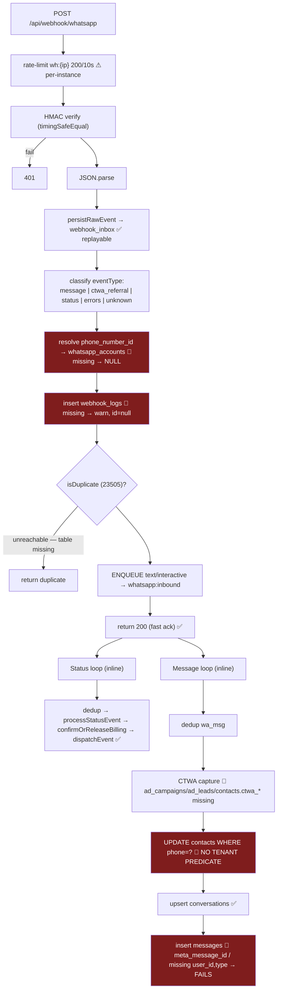

# 11 — WhatsApp Architecture

## Executive summary

SendAnjal integrates **directly** with Meta's Graph API as a Tech Provider/BSP — no Twilio,
no 360dialog. That is the business: the margin exists precisely because there is no
intermediary. `lib/meta-version.ts` pins Graph at `v22.0` and the browser SDK at `v19.0`,
with a documented reason for the split.

The integrity machinery is genuinely good: HMAC signature verification with
`timingSafeEqual`, persist-then-enqueue for replayability, per-event idempotency keyed
into `processed_events`, race-safe monotonic status transitions, AES-256-GCM token
encryption at rest, and a one-shot in-memory cache so a plaintext token never reaches the
browser during Embedded Signup.

Three problems dominate. **(1)** The 24-hour customer-service window — Law #5, the rule
that governs every send — is enforced in only 2 of 7 send paths. **(2)** Inbound messages
are never persisted, because the webhook writes a column that does not exist. **(3)** The
async automation worker resolves its sending token from `whatsapp_accounts`, a table that
does not exist in production, so automation replies are computed and then silently dropped.

**Risk level:** High · **Complexity:** High · **Confidence:** High (94%)

---

## 1. Graph API integration

### Version pinning

```ts
// lib/meta-version.ts
export const GRAPH_API_VERSION = "v22.0";   // server-to-server: messaging, media, templates, CTWA
export const META_SDK_VERSION  = "v19.0";   // MUST match FB.init({version}) in the browser
export const GRAPH_API_BASE = `https://graph.facebook.com/${GRAPH_API_VERSION}`;
export const GRAPH_SDK_BASE = `https://graph.facebook.com/${META_SDK_VERSION}`;
export const FB_DIALOG_BASE = `https://www.facebook.com/${GRAPH_API_VERSION}`;
```

Two constants because two things move independently, and the file says why: the ESU
handshake must speak the same version as the JS SDK loaded in
`components/whatsapp/EmbeddedSignupModal.tsx`, and *"Upgrading this requires retesting
Embedded Signup end-to-end — do not bump it casually."*

**Verified:** no `graph.facebook.com` string literal appears outside `lib/meta*.ts`. The
`CLAUDE.md` rule holds.

### Two Graph clients — a real inconsistency

| | `lib/meta.ts` (436 L) | `lib/meta-client.ts` (314 L) |
|---|---|---|
| Helpers | own `graphGet` / `graphPost` | own `graphPost` / `graphGet` |
| Error type | **plain `Error`** with `data.error?.message` | **`MetaApiError`** carrying `code` |
| Used by | send routes, templates, media, tokens, WABA discovery | `lib/whatsapp/dispatch.ts` |
| Auth | `access_token` as a **query parameter** | (not read in this audit) |

`CLAUDE.md` requires: *"Meta errors map to an internal `MetaError` preserving
`code`/`error_subcode` (billing/retry depend on them)."* Only `meta-client.ts` does this.
**`lib/meta.ts` — which handles every production send — discards the Meta error code**,
so the retry/backoff classification the rule was written to enable is impossible on the
live path.

Secondary note: `lib/meta.ts` passes the access token in the URL query string
(`url.searchParams.set("access_token", token)`). Meta supports this, but tokens in URLs are
more likely to land in logs, proxies, and error traces than an `Authorization: Bearer`
header.

### Implemented Graph operations (`lib/meta.ts`)

| Function | Endpoint | Notes |
|---|---|---|
| `exchangeCodeForToken` | `/oauth/access_token` | ESU code → user token |
| `extendToken` | `/oauth/access_token?grant_type=fb_exchange_token` | → ~60-day long-lived token |
| `getWABAsForToken` | `/me/businesses` → `/{biz}/whatsapp_business_accounts` → `/{waba}/phone_numbers` | 🟠 **N+1**: 1 + N + M sequential calls. Falls back to `/me/whatsapp_business_accounts` for direct-access users |
| `subscribeWABAToApp` | `POST /{waba}/subscribed_apps` | Webhook subscription |
| `sendTemplateMessage` | `POST /{pnid}/messages` type=template | |
| `sendTextMessage` | `POST /{pnid}/messages` type=text | |
| `sendDocumentMessage` | `POST /{pnid}/messages` type=document | Link-based, `filename` + `caption` |
| `uploadMedia` | `POST /{pnid}/media` multipart | Returns reusable `media_id` |
| `getMessageTemplates` | `GET /{waba}/message_templates?limit=200` | ✅ Auto-paginates via `paging.next` |
| `createTemplate` | `POST /{waba}/message_templates` | With AUTHENTICATION shape validation |
| `createLibraryTemplate` | same, with `library_template_name` | Meta shared library |

---

## 2. Webhook architecture

### Verification (GET)

```
GET /api/webhook/whatsapp?hub.mode=subscribe&hub.verify_token=…&hub.challenge=…
  → 403 if WHATSAPP_WEBHOOK_VERIFY_TOKEN unset
  → 200 + challenge if mode==="subscribe" && token matches
  → 403 otherwise
```

### Signature verification (POST)

```ts
const rawBody = Buffer.from(await request.arrayBuffer());   // raw bytes, before JSON.parse ✅
const expected = `sha256=${createHmac("sha256", APP_SECRET).update(rawBody).digest("hex")}`;
return timingSafeEqual(Buffer.from(signature), Buffer.from(expected));   // ✅ no timing oracle
```

`timingSafeEqual` throws on length mismatch, correctly caught → `false`.

**One caveat:** when `META_APP_SECRET` is unset and `NODE_ENV !== "production"`,
verification returns `true` (`route.ts:19-22`). Safe on Vercel (previews run
`NODE_ENV=production`); unsafe on a self-hosted staging environment.

### Idempotency

DB-backed via `processed_events` (`event_id TEXT PRIMARY KEY`), because *"only a DB unique
constraint can atomically reject a concurrent duplicate — in-memory/per-instance dedup
races under serverless"* (`lib/whatsapp/dedup.ts:4-6`).

| Key scheme | Consumer |
|---|---|
| `wa_msg:{message.id}` | inline message processing |
| `wa_enq:{message.id}` | queue hand-off — **a distinct key per consumer**, so a first delivery runs both and a redelivery runs neither |
| `wa_status:{message_id}:{status}` | status events (delivered/read/failed are distinct events) |

`markEventProcessed` uses `upsert(… , { onConflict: "event_id", ignoreDuplicates: true })
.select()` and treats "no rows returned" as a duplicate. **Fails open** on error — process
anyway, because *"silently dropping a real message would be worse"* and downstream
idempotency guards the money. Correct reasoning.

### Ingest pipeline



**Always returns 200**, even on internal error (`route.ts:453-454`) — deliberately correct,
since a non-200 makes Meta retry indefinitely, and the raw payload is already durable in
`webhook_inbox`.

### The route alias

`app/api/webhooks/whatsapp/route.ts` (19 lines) re-exports `{ GET, POST }` from the
singular route, with a header explaining that the plural path was an earlier org-model
draft which *"in production resolved no tenant and SILENTLY DROPPED every event"*, and that
numbers are already subscribed at both URLs. **Re-export rather than fork is exactly right.**

### Filtering gaps

| Event type Meta sends | Handled? |
|---|---|
| `messages` type=text | ✅ (persistence broken) |
| `messages` type=interactive | ✅ enqueued only — the inline loop `continue`s on non-text (`route.ts:276`) |
| `messages` type=image/video/document/audio/location/contacts | 🔴 **Dropped entirely** — filtered out at `route.ts:183` and `:276` |
| `statuses` | ✅ |
| `errors` | 🟡 Classified as `"errors"`, never processed |
| **`message_template_status_update`** | 🔴 **No branch** → `"unknown"`. Tenants are never told a template was approved or rejected |
| `phone_number_quality_update` | 🔴 No branch — quality-rating drops go unnoticed |
| `account_update` / `account_alerts` | 🔴 No branch |

Inbound media being dropped is why "Inbox file attachments" is listed as coming soon —
there is no storage layer and no handler.

---

## 3. The 24-hour customer service window (Law #5)

`lib/whatsapp/window.ts` (79 lines) is a clean, well-documented module:

```ts
export const WINDOW_MS = 24 * 60 * 60 * 1000;
windowStateFrom(lastInboundAt, now?) : WindowState   // PURE — no DB
getWindowState(contactId)            : Promise<WindowState>
canSend(kind, state) : {ok:true} | {ok:false, reason:"OUTSIDE_24H_WINDOW"}
  // template → always allowed;  text/interactive → only inside an open window
```

Source of truth is `contacts.last_inbound_at`. The module even documents the exact Meta
error it prevents: *"Meta rejects free-form sends (error 131047 'Re-engagement message')."*

### Enforcement coverage — the critical gap

```
grep -rn "canSend(" app lib
  → lib/whatsapp/dispatch.ts:46      (the only caller)
  → lib/whatsapp/window.ts:72        (the definition)
```

| Send path | Window enforced? | How |
|---|:-:|---|
| `lib/whatsapp/dispatch.ts` (automation replies) | ✅ | `canSend(outbound.type, windowStateFrom(lastInboundAt))` |
| `/api/inbox/[id]/send` | ✅ | **Inline, different mechanism** — reads `conversations.is_within_24h_window` + `window_expires_at`, returns 403 `WINDOW_EXPIRED`, and correctly **reopens** the window after a template send (`:141-144`) |
| `/api/whatsapp/send` | 🔴 **No** | Accepts `type:"text"` and sends it unchecked |
| `/api/v1/messages/send` | 🔴 **No** | Public API, `type:"text"` unchecked |
| `/api/campaigns/execute` | 🔴 **No** | Templates only in practice, so mostly safe — but unverified by code |
| `/api/products/send` | 🔴 **No** | |
| `/api/carts/[id]/recover` | 🔴 **No** | Cart recovery is outbound-initiated — the highest-risk case |
| `/api/meta/test-message` | 🔴 **No** | |

**Two independent window implementations exist** — `contacts.last_inbound_at` (used by
`window.ts`) and `conversations.is_within_24h_window`/`window_expires_at` (used by the
inbox route). They can disagree: the webhook's `contacts` update is cross-tenant and
unfiltered, while `conversations` is updated correctly. A tenant could see an "open"
inbox window when `contacts.last_inbound_at` says closed, or vice versa.

**Business consequence of the gap:** repeated 131047 rejections degrade a number's quality
rating, which reduces its messaging tier and can get it flagged. That is per-tenant
deliverability damage the platform is contractually responsible for as the BSP.

---

## 4. Templates

| Capability | Implementation | Status |
|---|---|---|
| Local mirror | `templates` table (`user_id`-scoped) with `meta_template_id` | ✅ |
| **Sync from Meta** | `getMessageTemplates(wabaId, token)` — auto-paginates `limit=200`, requests `id,name,status,category,language,components,rejected_reason,quality_score` | ✅ |
| Status normalization | `normalizeTemplateStatus` collapses 8 Meta statuses → `APPROVED`/`PENDING`/`REJECTED`; `IN_APPEAL` → PENDING | ✅ Sensible |
| Body/variable extraction | `extractTemplateBody` regex-matches `{{n}}`, dedupes and sorts indices, prefers Meta's `example.body_text` values, falls back to `var_{n}` | ✅ Careful |
| **Create** | `createTemplate(wabaId, token, {name, category, language, components})` | ✅ |
| **AUTHENTICATION validation** | `assertAuthTemplateShape` rejects any non-empty BODY text up front, with an actionable message, because Meta generates auth bodies itself | ⭐ Prevents a confusing Graph rejection |
| Meta library instantiation | `createLibraryTemplate` with `library_template_name` + `library_template_button_inputs` | ✅ |
| AI generation | `POST /api/templates/generate` → `template_content` task + vertical context | ✅ |
| Name validation | `templateSchema` enforces `/^[a-z0-9_]+$/` per Meta rules — **but the schema is unused** | 🟠 |
| **Approval/rejection notification** | 🔴 None. No `message_template_status_update` webhook branch | 🔴 |
| Template versioning / edit | 🔴 Not implemented | |
| Quality-score surfacing | 🟡 Fetched in the sync query; **unable to determine** whether stored or displayed — no column for it on `templates` |

**Category matters for money.** `toBillableCategory` maps the template category to the
billable category (`lib/billing/pricing.ts:19-33`), so MARKETING costs 110p and UTILITY
17p on Growth. `PHASE-0-AUDIT.md` risk #7 flagged that seeded MARKETING templates could
surprise clients on cost; `vertical_template_library.meta_category` is required on
`MESSAGE_TEMPLATE` rows precisely so this is visible at provisioning time. Good.

---

## 5. Media

| Direction | Support |
|---|---|
| **Outbound document (link)** | ✅ `sendDocumentMessage(pnid, token, to, url, filename?, caption?)` |
| **Outbound upload** | ✅ `uploadMedia(pnid, token, {data, mimeType, filename})` → `media_id`, via multipart `FormData` |
| Outbound image/video/audio | 🟡 `uploadMedia` returns a reusable id; **no dedicated send wrapper** for image/video/audio types |
| **Inbound media** | 🔴 Not handled. The webhook drops every non-text, non-interactive message |
| Media storage | 🔴 None. No object storage anywhere in the stack |
| Media expiry handling | 🔴 `uploadMedia`'s docstring notes ids *"are tied to the uploading number and expire after ~30 days"* — nothing tracks or refreshes them |

The documented use case is WorkspaceCV resume delivery: OTP request → verify → document
send (`lib/whatsapp/workspacecv-templates.ts` exists, not read). That flow works. General
media handling does not.

---

## 6. Delivery status

`lib/whatsapp/status.ts` (79 lines) — one of the sharpest pieces of code in the repo.

```ts
const OVERWRITABLE = {
  sent:      ["pending"],
  delivered: ["pending", "sent"],
  read:      ["pending", "sent", "delivered"],
  failed:    ["pending", "sent"],
};

await supabase.from("campaign_messages").update(patch)
  .eq("meta_message_id", metaMessageId)
  .or(`status.is.null,status.in.(${overwritable.join(",")})`)
  .select("id");
```

Monotonicity is enforced **in the UPDATE's WHERE clause**, not by a read-modify-write. A
late `sent` arriving after `read` matches zero rows and is a no-op. Concurrent workers
cannot regress state. No locking required.

Returns `applied: boolean` (did a row actually move forward?), which the webhook uses to
decide whether to emit an outbound client webhook — so clients don't receive duplicate
`message.delivered` notifications for re-delivered Meta events.

**Limitation:** status lands **only** on `campaign_messages`. Single sends via
`/api/whatsapp/send` and `/api/v1/messages/send` have no status-trackable row — the module
says so: *"the only status-trackable table in the deployed schema."* Billing still settles
correctly (via `message_billing`), but `api_messages.status` is never advanced by the
webhook, so the public API's `GET /api/v1/messages/[id]` cannot report delivery.

**Failed-status error capture:** `patch.error_message = errors[0].title ?? errors[0].message
?? "Delivery failed"`. The numeric `code` — the field that determines retryability — is
discarded.

---

## 7. Retry, rate limits, and failure handling

| Concern | Status |
|---|---|
| **Outbound send retry** | 🔴 None. No backoff, no circuit breaker. A transient Graph 5xx loses the message. The wallet hold is released, so no money is lost, but nothing is queued for retry |
| **Meta error-code classification** | 🔴 `lib/meta.ts` discards codes; `MetaApiError` (which preserves them) is only on the dead dispatch path |
| Meta's own webhook retries | ✅ We always 200; `webhook_inbox` is durable |
| Outbound client webhooks | ✅ `attempts` + `next_retry_at` + partial index |
| **Meta rate limits / messaging tier** | 🔴 Not modelled at all. No token bucket, no per-number throughput cap, no awareness of Meta's 1K/10K/100K/unlimited tiers |
| `whatsapp_numbers.daily_limit` | 🟡 Column exists; grep finds no enforcement |
| `whatsapp_numbers.messages_sent` | 🔴 Incremented via `increment_messages_sent` RPC — **which does not exist in the live DB** |
| Quality-rating monitoring | 🔴 `quality_rating` is fetched during WABA discovery; no `phone_number_quality_update` webhook branch, no alerting |
| Campaign pacing | 🟡 `BATCH_SIZE = 50` sequential inside one invocation — an implicit throttle, not a rate limiter |
| Token expiry | 🔴 `token_expires_at` column exists; **no rotation job**. Meta long-lived tokens are ~60 days ⇒ a silent tenant-wide outage roughly every two months |

> **Token expiry is the highest-likelihood operational failure in the product.**
> `extendToken` exists to mint the 60-day token, and `whatsapp_numbers.token_expires_at`
> exists to record when it dies. Nothing reads it. Migration 010 defined a
> `rotate_access_token()` function — **it is not in the live function list**, and its
> `access_tokens` table does not exist either. There is no code path that renews a token.

---

## 8. Phone number management & multi-number

| Capability | Status |
|---|---|
| Multiple numbers per tenant | ✅ `whatsapp_numbers` is 1:N on `user_id`, with `is_primary` |
| Number → tenant resolution | ✅ via `phone_number_id` — 🔴 **but that column is unindexed** (see [05](05-DATABASE.md#4-indexes)); it is the hottest read in the system |
| Per-number token | ✅ AES-256-GCM encrypted, `token_encrypted` flag, transparent legacy-plaintext support |
| Per-number app secret | 🔴 `meta_app_secret` stored **plaintext** |
| Campaign number selection | ✅ `campaigns.whatsapp_number_id` |
| Conversation number binding | ✅ `conversations.whatsapp_number_id` |
| Number migration between WABAs | 🔴 "coming soon" per `CLAUDE.md` |
| **Shared platform number pool (Model C / Starter)** | 🔴 **Not built.** `lib/billing/tiers.ts:16-18`: *"`waba_mode='shared'` … requires a platform-owned WhatsApp number pool to actually send — that provisioning is deferred."* |
| Number status gating | ✅ `/api/whatsapp/send` requires `status === "active"` and both `phone_number_id` and `access_token` present |

## 9. Tenant isolation on the WhatsApp path

| Operation | Scoped correctly? |
|---|---|
| Resolve number for send | ✅ `.eq("id", numberId).eq("user_id", user.id)` |
| Resolve tenant from webhook | ✅ `whatsapp_numbers.phone_number_id → user_id` (`runtime.ts:44-53`) |
| Resolve template category | ✅ `.eq("user_id", userId).eq("name", templateName)` |
| Conversation upsert | ✅ scoped by `whatsapp_number_id` (which implies the tenant) |
| **Contact window refresh** | 🔴 **`.eq("phone", fromPhone)` only — cross-tenant** |
| CTWA contact upsert | ✅ scoped by `wn.user_id` — but the columns don't exist |
| Automation flow resolution | ✅ `.eq("user_id", userId).eq("is_active", true)` |
| Org-model paths | 🔴 Resolve nothing (tables absent) |

## 10. Embedded Signup (ESU)

Three-step handshake, with the key security property done right:

```
browser: FB.login (SDK v19.0) → code
  → POST /api/meta/exchange-token      code → user token → extendToken → 60-day token
                                       putTokenInCache(transferId, token, ttl ≤ 600s)
                                       returns ONLY an opaque transferId  ✅
  → POST /api/meta/save-account        consumeTokenFromCache(transferId)  (one-shot)
                                       encrypt() → whatsapp_numbers.access_token
  → POST /api/meta/subscribe-webhook   subscribeWABAToApp
```

**The plaintext token never reaches the browser** (`lib/whatsapp/token-cache.ts:3-5`) —
the client only ever sees `transferId`. TTL is capped at 600 s and `get()` consumes the
entry. That is the correct design.

**The flaw is deployment, not design:** the cache is a per-process `Map`, and the file says
so — *"Single-instance only — for multi-instance deployments swap this for Redis (Upstash)
or signed JWE cookies."* On Vercel, `exchange-token` and `save-account` are separate
invocations that may land on different instances. **Onboarding fails intermittently and
non-deterministically** — the worst possible failure mode for the first thing a new
customer does. Fix without new infrastructure: put the encrypted token in a signed,
short-TTL httpOnly cookie (JWE) instead of a Map.

ESU is also the one flow with real audit coverage — all 10 `AuditAction` values in
`lib/audit.ts` are ESU/token related.

---

## Advantages

- Direct BSP integration — the margin model depends on it, and it is implemented properly.
- Single-source version pinning with a documented reason for the two-constant split.
- Signature verification uses `timingSafeEqual` over the raw bytes.
- Persist-then-enqueue makes every event replayable.
- DB-backed idempotency with **per-consumer keys**, chosen deliberately over in-memory dedup.
- Race-safe monotonic status transitions with no locking.
- Always-200 to Meta, preventing retry storms.
- Tokens encrypted at rest; the ESU design keeps plaintext away from the browser entirely.
- Template handling is careful: auto-pagination, status normalization, variable extraction
  with Meta's own examples, and up-front AUTHENTICATION shape validation.
- The webhook alias is a re-export, not a fork.
- `window.ts` is pure, testable, and documents the exact Meta error it prevents.

## Disadvantages

- Law #5 enforced in 2 of 7 send paths, via **two different mechanisms** that can disagree.
- Inbound messages never persist (wrong column, missing NOT NULLs).
- Automation replies are computed then dropped (`dispatch.ts` reads a missing table).
- Inbound media and 4 webhook event types are silently discarded — including template
  approval and quality-rating updates.
- No outbound retry, no Meta error-code classification on the live path, no circuit breaker.
- Meta rate limits and messaging tiers are not modelled.
- No token rotation ⇒ predictable ~60-day tenant outages.
- `phone_number_id`, the hottest join key, is unindexed.
- ESU token cache is per-process ⇒ intermittent onboarding failure.
- `meta_app_secret` stored plaintext.
- Model C (Starter) cannot send — no platform number pool.
- N+1 Graph calls in WABA discovery.

## Recommendations

| P | Recommendation | Effort |
|---|---|---|
| **P0** | Repoint `lib/whatsapp/dispatch.ts` token resolution from `whatsapp_accounts` to `whatsapp_numbers`. ~6 lines. Makes automation replies actually send. | 1 hour |
| **P0** | Fix the `messages` insert: `wa_message_id`, add `user_id` + `type`, JSON-encode `content`. | 1 hour |
| **P0** | Add the tenant predicate to the `contacts` window refresh. | 30 min |
| **P0** | `CREATE INDEX idx_whatsapp_numbers_pnid ON whatsapp_numbers(phone_number_id)`. | 5 min |
| **P0** | Single choke-point: `sendMessage()` in `lib/whatsapp/` that enforces `canSend()` + billing + logging. Route all 7 paths through it. Pick **one** window source of truth (`contacts.last_inbound_at`) and derive `conversations.*` from it. | 1 week |
| **P0** | Ship a token-rotation cron: find `token_expires_at < now() + 7 days`, call `extendToken`, re-encrypt, alert on failure. | 3 days |
| P1 | Replace the ESU token `Map` with a signed JWE cookie. Fixes intermittent onboarding failure with no new infrastructure. | 1 day |
| P1 | Add a `message_template_status_update` branch → update `templates.status` and notify the tenant. | 2 days |
| P1 | Add a `phone_number_quality_update` branch → store the rating and alert on YELLOW/RED. | 2 days |
| P1 | Collapse `lib/meta.ts` onto `MetaApiError` so Meta error codes survive; then classify retryable vs terminal and add backoff. | 1 week |
| P1 | Encrypt `meta_app_secret`. | 4 hours |
| P2 | Handle inbound media: add object storage, persist `media_id` + a downloaded copy, unblock Inbox attachments. | 2 weeks |
| P2 | Model Meta rate limits: a per-number token bucket sized from the messaging tier; enforce `daily_limit`; deploy the missing `increment_messages_sent` RPC. | 1 week |
| P2 | Give single sends a status-trackable home — advance `api_messages.status` from the webhook so `GET /api/v1/messages/[id]` works. | 3 days |
| P2 | Batch `getWABAsForToken` with Graph field expansion to kill the N+1. | 1 day |
| P2 | Move the access token from the query string to an `Authorization` header in `lib/meta.ts`. | 2 hours |
| P3 | Build the Model C shared-number pool, or stop selling Starter as sendable. | 4 weeks |
| P3 | Store and surface template `quality_score` (already fetched). | 2 days |
| P3 | Add a `webhook_inbox` replay job — the partial index for it already exists. | 3 days |
