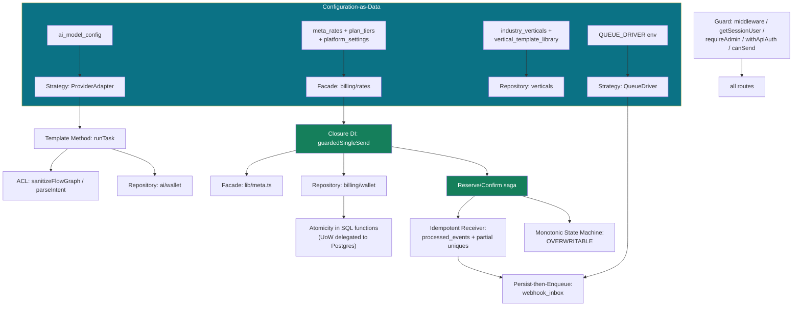

# 15 — Design Patterns

## Executive summary

The codebase uses **a small set of patterns deliberately and well**, rather than a large
set decoratively. The strongest are **Strategy** (queue drivers, AI provider adapters),
**Facade** (`lib/meta.ts`, `lib/billing/wallet.ts`), **Repository** (verticals, wallet),
and — the most distinctive choice — **closure-based Dependency Injection** in
`guardedSingleSend`, which lets the billing layer wrap the Meta sender without importing,
subclassing, or modifying it.

There is no DI container, no CQRS, no event sourcing, no microservices, and no aggregate
roots. That is correct for a 44k-LOC modular monolith with one database. Patterns are
applied where they earn their complexity and absent where they would not.

The gaps that matter: **no Unit of Work** (money atomicity is delegated to SQL functions
instead, which is arguably better), **no consistent Adapter at the HTTP boundary** (four
error conventions), and **the Repository pattern applied to only 4 of ~15 resource
families**, which is why schema drift was distributed across 78 route files instead of
localised.

**Risk level:** Low · **Complexity:** Low · **Confidence:** High (92%)

---

## 1. Pattern inventory

| Pattern | Present | Where | Quality |
|---|:-:|---|---|
| **Strategy** | ✅ | `QueueDriver` (Inline / PgBoss) · `ProviderAdapter` (Anthropic / Gemini) | ⭐⭐⭐ |
| **Facade** | ✅ | `lib/meta.ts` · `lib/billing/wallet.ts` · `lib/api.ts` · `lib/razorpay.ts` | ⭐⭐⭐ |
| **Repository** | ✅ partial | `verticals/repository.ts` · `billing/wallet.ts` · `ai/wallet.ts` · `whatsapp/onboarding-repo.ts` | ⭐⭐⭐ where used, 4/15 families |
| **Adapter** | ✅ | `AnthropicAdapter` / `GeminiAdapter` · `toApiError` · `toVertical`/`toItem` row mappers | ⭐⭐ (`toApiError` only on dead paths) |
| **Factory** | ✅ | `createServiceClient()` · `selectDriver()` · `getAdapter(provider)` · `generateApiKey(env)` | ⭐⭐⭐ |
| **Dependency Injection** (closure) | ✅ | `guardedSingleSend({ send: () => … })` | ⭐⭐⭐ **The signature pattern of this codebase** |
| **Template Method** | ✅ | `runTask<T>()` — fixed 7-stage pipeline with `parse` / `appendOnRetry` hooks | ⭐⭐⭐ |
| **Guard / Gateway** | ✅ | `middleware.ts` · `getSessionUser` · `requireAdmin` · `withApiAuth` · `canSend` | ⭐⭐ (inconsistently applied) |
| **Singleton** | ✅ | `driver` module const · `handlers` Map · rate-limit `store` Map · token-cache `cache` Map | ⭐ **Semantically wrong on serverless** |
| **Value Object** | 🟡 | `WindowState`, `SendQuote`, `TierConfig`, `AIUsage` — data-only, but plain interfaces with no behaviour or invariants | ⭐⭐ |
| **Discriminated Union / Result** | ✅ | `RunTaskResult<T>` · `canSend()` return · `VerticalTemplateItem` | ⭐⭐⭐ |
| **Idempotent Receiver** | ✅ | `processed_events` + per-consumer keys · 5 partial-unique idempotency indexes | ⭐⭐⭐ |
| **Reserve / Confirm (Saga-lite)** | ✅ | `wallet_reserve` → send → `wallet_settle`/`wallet_release` | ⭐⭐⭐ |
| **Persist-then-Enqueue (Inbox)** | ✅ | `webhook_inbox` before any processing | ⭐⭐⭐ |
| **Monotonic State Machine** | ✅ | `OVERWRITABLE` rank map enforced in the UPDATE filter | ⭐⭐⭐ |
| **Sanitizer / Anti-Corruption Layer** | ✅ | `sanitizeFlowGraph` · `parseIntent` id allow-list · `assertAuthTemplateShape` | ⭐⭐⭐ |
| **Alias / Re-export** | ✅ | `webhooks/whatsapp` → `webhook/whatsapp` | ⭐⭐⭐ |
| **Configuration-as-Data** | ✅ | `ai_model_config` · `meta_rates` · `plan_tiers` · `industry_verticals` · `vertical_template_library` | ⭐⭐⭐ **The core architectural bet** |
| **Feature Toggle** | 🟡 | Env-based (`QUEUE_DRIVER`, `DEMO_AUTO_LOGIN`, `DEV_AUTO_LOGIN`), plus `is_active` columns | ⭐⭐ no runtime flag system |
| **Error Hierarchy** | ✅ | `WhatsAppError` + 8 subclasses · `InsufficientBalanceError` · `InsufficientAICreditsError` · `MetaApiError` · `ApiAuthError` | ⭐⭐ (best one under-wired) |
| **Observer / Pub-Sub** | 🟡 | `dispatchEvent` → `webhook_endpoints` is a webhook fan-out, not an in-process observer | ⭐⭐ |
| **Command** | 🟡 | Queue jobs (`InboundEvent`) are commands in spirit; only 1 job type registered | ⭐ |
| **Builder** | 🔴 | Absent. Meta payloads are built as object literals per call site | — |
| **Decorator** | 🔴 | Absent — the closest is closure injection |
| **Composite** | 🟡 | `FlowGraph` (nodes + edges) is a graph, not a recursive composite |
| **Mediator** | 🔴 | Absent |
| **State** | 🟡 | Status/reservation lifecycles are string-typed transitions, not State objects |
| **Bridge** | 🔴 | Absent |
| **Unit of Work** | 🔴 | **Absent by design** — atomicity is delegated into SQL functions (see §4) |
| **DDD (aggregates, bounded contexts)** | 🟡 | `lib/` folders read as bounded contexts; no aggregate roots, entities, or domain events |
| **CQRS** | 🔴 | Absent. Same model reads and writes. Correct at this scale |
| **Event Sourcing** | 🟡 | `transactions` and `ai_credit_ledger` **are** append-only ledgers with `balance_after` — event-sourced *accounting*, not event-sourced *application state* |
| **Clean / Hexagonal Architecture** | 🟡 | Directionally yes (routes → domain → persistence, integrations behind wrappers), but 4 fat handlers bypass the domain layer |
| **Microservices** | 🔴 | Modular monolith. Correct |

---

## 2. The patterns that carry the architecture

### 2.1 Strategy — `QueueDriver`

```ts
// lib/queue/index.ts:40-44
export interface QueueDriver {
  enqueue(type: string, payload: unknown, opts?: EnqueueOptions): Promise<void>;
  drain?(type: string, batchSize: number): Promise<DrainResult>;
}
```

Two implementations (`InlineDriver`, `PgBossDriver`), selected by
`selectDriver()` reading `QUEUE_DRIVER`. Callers use `enqueue()` / `registerHandler()` and
never know which is active.

| | |
|---|---|
| **Why** | The module states it: *"Centralizing the seam here means moving to a durable backend is a config change, not a rewrite."* |
| **Advantage** | Zero-infrastructure default; durability is one env var; a future Vercel Queues or QStash driver is ~40 lines |
| **Disadvantage** | The optional `drain?` makes the interface asymmetric — inline silently no-ops, which is why a misconfigured cron produces no visible error |
| **Alternative** | Direct pg-boss coupling (simpler, unswappable) or Inngest (managed, new dependency) |

### 2.2 Strategy + Factory — `ProviderAdapter`

```ts
// lib/ai/service.ts:45-47, 114-124
export interface ProviderAdapter { generate(args: GenerateArgs): Promise<GenerateResult>; }
function getAdapter(provider: string): ProviderAdapter | null { switch (provider) { … } }
```

Combined with `ai_model_config`, this yields the property that **no model id appears
anywhere in application code**. Adding a provider is a class plus a DB row.

| | |
|---|---|
| **Advantage** | Provider-agnostic; the factory returns `null` on a missing key, which the pipeline turns into a graceful fallback rather than a crash |
| **Disadvantage** | The `switch` is a closed set — a truly pluggable system would register adapters. Fine for 2–3 providers |
| **Alternative** | Vercel AI Gateway (`"provider/model"` strings, one adapter) — the code anticipates this with a commented `case "gateway"` |

### 2.3 Closure Dependency Injection — the signature pattern

```ts
// lib/billing/guarded-send.ts:69-76
export async function guardedSingleSend<T extends { messageId?: string }>(args: {
  userId: string;
  category: MessageCategory;
  send: () => Promise<T>;      // ← the dependency, injected as a closure
  …
}): Promise<T>
```

Call site:
```ts
await guardedSingleSend({
  userId: user.id, category,
  send: () => sendTextMessage(number.phone_number_id, decryptedToken, to, text),
});
```

| | |
|---|---|
| **Why** | Stated at `guarded-send.ts:13`: *"The sender itself is passed in as a closure, so `lib/meta.ts` is never touched."* |
| **Advantage** | Billing wraps sending with **zero coupling in either direction**. `lib/meta.ts` has no knowledge of wallets; `guarded-send.ts` has no knowledge of Graph. The generic `T extends {messageId?: string}` keeps the return type intact for every sender variant |
| **Disadvantage** | Unit-testing still requires mocking the module-level Supabase import. The injected dependency is testable; the ambient ones are not |
| **Alternative** | Decorator/proxy around the sender (more machinery), or a `MessageSender` interface (more ceremony for one consumer) |

### 2.4 Template Method — `runTask`

A fixed 7-stage pipeline with two extension points (`parse`, `appendOnRetry`) and inner
helper closures (`succeed`, `fallback`, `logFallback`, `writeUsage`) that capture
`args`/`cfg`.

| | |
|---|---|
| **Advantage** | Governance is structural: tier gate, credit debit, and usage logging **cannot be skipped**, because there is no path around them |
| **Disadvantage** | The function is 164 lines with nested closures — dense reading. And `RunTaskArgs<T>` has 12 fields, several optional and interdependent (`silentRetries` is meaningless without `parse`) |
| **Alternative** | A middleware chain (`compose(withConfig, withTierGate, withCredits, withProvider)`) — more flexible, less obvious |

### 2.5 Configuration-as-Data — the core bet

Five tables drive behaviour that would normally be code:

| Table | Governs |
|---|---|
| `ai_model_config` | provider, model, price, credits, timeout, retries per task |
| `meta_rates` | COGS per category/region/date |
| `plan_tiers` | tier → model, markup, fee, cap |
| `platform_settings` | buffer, min top-up, thresholds, validity |
| `industry_verticals` + `vertical_template_library` | every vertical name, flow, template, prompt |

| | |
|---|---|
| **Advantage** | Pricing, margin, AI cost, and the vertical catalogue all change with **no deploy**. `lib/verticals/types.ts:4-7` states the rule: *"no vertical NAME, COPY, FLOW or TEMPLATE may be hardcoded … so an admin can add 'Gym' through the UI without a deploy."* Enforced in practice |
| **Disadvantage** | Configuration becomes a **correctness surface with no type checking and no tests**. A bad `ai_model_config` row silently degrades every AI feature; a stale `meta_rates` row silently destroys margin; a missing `plan_tiers` row silently falls back to cheaper legacy prices. Config needs validation and change-audit as much as code does — and currently has neither |
| **Alternative** | Code-as-config with typed constants (safe, needs a deploy) or a hybrid: typed schema validation on write plus an audit row |

### 2.6 Reserve/Confirm — a Saga without an orchestrator

```
wallet_reserve (hold)  →  Meta send  →  [status webhook]  →  wallet_settle | wallet_release
```

A distributed transaction across Postgres and Meta, coordinated by **state on
`message_billing` plus idempotency**, with no saga framework.

| | |
|---|---|
| **Advantage** | No orchestrator to operate. Compensation is `wallet_release`, which is idempotent. Correctness comes from three independent idempotency layers, so out-of-order and duplicate webhooks are safe by construction |
| **Disadvantage** | **No timeout/reaper.** If Meta never sends a terminal status, a `message_billing` row stays `'reserved'` and the hold is never freed. The `idx_msgbill_open … WHERE status='reserved'` partial index was clearly built for a reaper job — **the job does not exist** |
| **Alternative** | Temporal/WDK durable workflow (heavy for one hop) or a periodic reconciliation job (the right next step) |

### 2.7 Anti-Corruption Layer — `sanitizeFlowGraph`

```ts
// lib/automation/flow-schema.ts:78
export function sanitizeFlowGraph(raw: unknown): CanvasGraph
```
Validates and coerces LLM output: rejects unknown node types, caps 25 nodes / 40 edges,
requires exactly one trigger, dedupes ids, coerces positions, defaults labels.

Used in three roles: AI output validation, **seed-time build gate**
(`PHASE-0-AUDIT.md:273` — *"fail the seed, not the tenant"*), and canvas load safety.
Reusing the same validator for all three is genuinely good design.

Companion guards: `parseIntent`'s hallucinated-id allow-list (`intent.ts:41-44`) and
`assertAuthTemplateShape` (`meta.ts:294-302`).

---

## 3. Repository pattern — good, but only 27% applied

`lib/verticals/repository.ts` is the exemplar:

```ts
const VERTICAL_COLS = "id, slug, display_name, …";        // explicit projection
function toVertical(r: VerticalRow): IndustryVertical      // row → domain mapper
function toItem(r: LibraryRow): VerticalTemplateItem       // → discriminated union
export async function getVerticalForUser(userId)           // domain-language API
```

Plus a documented scope rule (`repository.ts:8-11`): *"the ONLY consumers … are the three
AI routes and the 'Recommended for …' rails. Inbox, contacts, billing … must never call
into this module."* A repository that documents who may call it is unusual and useful.

| Resource family | Repository? |
|---|:-:|
| verticals | ✅ |
| message wallet | ✅ (`billing/wallet.ts`) |
| AI wallet | ✅ (`ai/wallet.ts`) |
| onboarding | ✅ (`whatsapp/onboarding-repo.ts`) |
| whatsapp (org) | 🔴 dead |
| **contacts, campaigns, templates, inbox, conversations, messages, CRM, ads, products, segments, team, analytics** | 🔴 **none** |

**This is the direct cause of the drift register's blast radius.** Schema knowledge for
`messages` lives in `webhook/whatsapp/route.ts`; for `contacts` it lives in a dozen files.
With repositories, the broken `messages` insert would have been one file, and generated
types would have caught it at compile time.

---

## 4. Unit of Work — deliberately absent, and that is defensible

There is no transaction wrapper. `supabase-js` cannot span multiple statements in one
transaction from the client. Instead, **atomicity is pushed into Postgres functions**:

```
wallet_credit / wallet_reserve / wallet_settle / wallet_release / wallet_charge
ai_wallet_credit / ai_wallet_debit
  → SELECT … FOR UPDATE  (row lock)
  → balance check (non-negative)
  → ledger write
  → all in one server-side transaction
```

| | |
|---|---|
| **Advantage** | Stronger than an application-level UoW: the invariant cannot be violated by any client, in any language, ever. Concurrency correctness is in the database where it belongs |
| **Disadvantage** | Business logic is split between SQL and TypeScript. The SQL is versioned in migrations but has **no test in CI** (only `supabase/tests/prepaid_wallet_test.sql`, which nothing runs). Multi-entity operations that are *not* money — e.g. "create campaign + insert 5,000 campaign_messages" — have **no atomicity at all** and can partially fail |
| **Alternative** | Use `pg` directly for a transaction-scoped client (also the prerequisite for session-variable RLS), or move more multi-step operations into SQL functions |

---

## 5. Anti-patterns

| Anti-pattern | Where | Severity |
|---|---|---|
| **Singleton mutable state on serverless** | `rate-limit.ts:11` Map · `token-cache.ts:22` Map · `queue/index.ts:23` handlers Map · `:157` driver const | 🔴 The first two are functionally broken; both self-documented |
| **God object / God handler** | `EmbeddedSignupModal` 1,313 · `inbox` 1,198 · `campaigns/execute` 499 · `webhook/whatsapp` 471 | 🔴 |
| **Anemic domain model** | `WindowState`, `SendQuote`, `TierConfig` are data bags; behaviour lives in free functions | 🟡 Idiomatic TypeScript; acceptable |
| **Shotgun surgery** | Adding a flow node type requires 4 synchronised edits (`CANVAS_NODE_TYPES`, `FlowNodes.tsx` ×3, executor switch, AI prompt) | 🟠 |
| **Parallel inheritance / duplicate hierarchies** | Two tenant models, two Graph clients, two window implementations, two rate limiters | 🔴 |
| **Speculative generality** | Org model (never deployed) · `GeminiAdapter` (unused) · 9 unused Zod schemas · `markupMultiplier` (unapplied) · `toApiError` (dead paths only) | 🟠 |
| **Primitive obsession** | Money as bare `number`, disambiguated only by parameter name | 🟡 |
| **Copy-paste programming** | 89× `getSessionUser()`/401 boilerplate; hand-rolled UI controls across 41 pages | 🟠 |
| **Swallowed exceptions** | `catch {}` / `.catch(() => {})`. Correct for audit and telemetry; questionable for `increment_messages_sent` (which fails silently against a non-existent RPC) | 🟡 |
| **Leaky abstraction** | `QueueDriver.drain?` optional — inline no-ops invisibly, hiding cron misconfiguration | 🟡 |

---

## 6. Pattern dependency map



---

## Advantages

- Patterns are chosen for stated reasons, and the reasons are written in the code.
- **Strategy at exactly the two right seams** (queue durability, AI provider) — the two
  places most likely to change.
- Closure DI achieves complete decoupling between billing and sending with no framework.
- Template Method makes AI governance structurally unskippable.
- Configuration-as-Data lets pricing, margin, AI cost, and the entire vertical catalogue
  change without a deploy — a genuine operational advantage.
- Idempotent Receiver + Monotonic State Machine + Reserve/Confirm together make the money
  path correct under duplicate, concurrent, and out-of-order events.
- The Anti-Corruption Layer is reused in three roles from one implementation.
- Discriminated unions used for results (`RunTaskResult`, `canSend`) rather than exceptions.
- Correctly **absent**: CQRS, event sourcing, microservices, DI containers, aggregate roots.
  Nothing is over-engineered.

## Disadvantages

- Repository applied to 4 of ~15 resource families, so schema knowledge is scattered across
  78 files — the reason drift had this blast radius.
- Singleton mutable state is semantically invalid on the deployment target (twice).
- No Unit of Work for non-money multi-entity operations (campaign + N messages can partially fail).
- No reaper for the Reserve/Confirm saga — the partial index for it exists, the job does not.
- Speculative generality: an entire undeployed tenant model, an unused provider adapter,
  9 unused schemas, an unapplied multiplier, and a typed error adapter wired only to dead code.
- Four error-response conventions instead of one Adapter at the boundary.
- Shotgun surgery on flow node types (4 coupled edit sites).
- Configuration-as-Data has no schema validation, no tests, and no change audit — the
  pattern's main risk is unmitigated.

## Recommendations

| P | Recommendation | Pattern |
|---|---|---|
| **P0** | Add **validation and audit to configuration writes**. `ai_model_config`, `meta_rates`, and `plan_tiers` are code-equivalent; validate on write (Zod), record who changed what, and alert on staleness. This is the missing half of Configuration-as-Data. | Configuration-as-Data |
| **P0** | Replace the two serverless Singletons with Postgres-backed state. | Singleton removal |
| **P1** | Introduce a **Repository per resource family**, starting with `contacts`, `messages`, `conversations`, `campaigns`. Combined with generated types, drift becomes a one-file compile error. | Repository |
| **P1** | One **Adapter at the HTTP boundary**: extend `toApiError` and wrap every handler. Collapses four error conventions into one. | Adapter |
| **P1** | Compose the Guards into middleware (`withAuth` · `withValidation` · `withRateLimit` · `withErrorMapping`) so they cannot be forgotten. | Guard / Decorator |
| **P1** | Ship the **reaper** for `message_billing` rows stuck in `'reserved'` past a TTL. The `idx_msgbill_open` index is already there for it. | Saga compensation |
| P2 | A `sendMessage()` **Facade** enforcing window + billing + logging, and delete the direct-send paths. | Facade |
| P2 | A `Paise` branded type to end primitive obsession on money. | Value Object |
| P2 | Registry-based adapter/node-type registration to kill the 4-site shotgun surgery. | Registry |
| P2 | Run `supabase/tests/prepaid_wallet_test.sql` in CI — the SQL half of the domain logic is currently untested. | Unit of Work |
| P3 | Delete the speculative generality: org model, unused schemas, `markupMultiplier`. Reintroduce when actually needed. | — |
| P3 | Consider a transaction-scoped `pg` client for non-money multi-entity operations — also the prerequisite for session-variable RLS. | Unit of Work |
