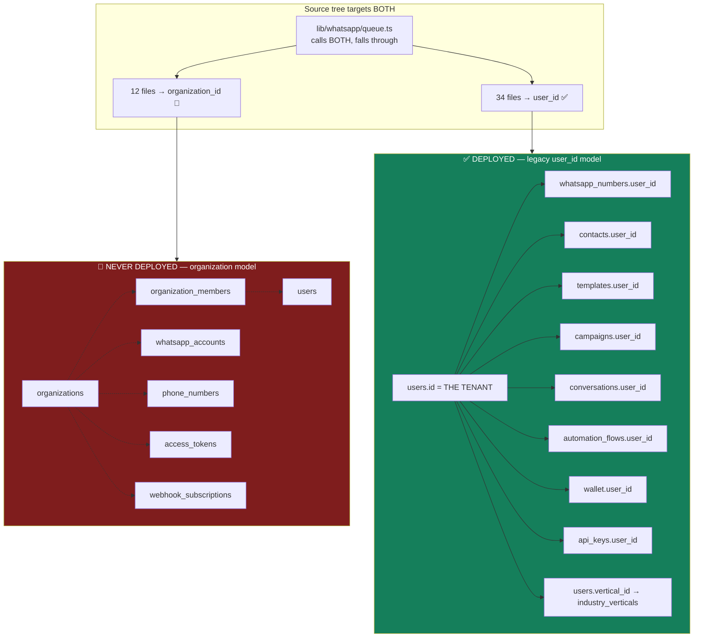
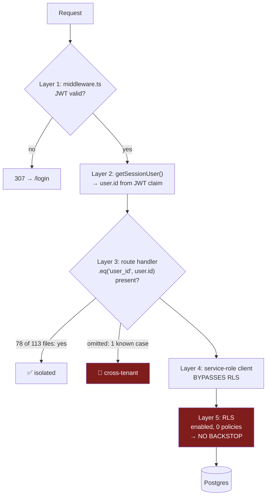

# 16 — Multi-Tenancy

## Executive summary

SendAnjal is **multi-tenant with a shared database, shared schema, and row-level tenant
discrimination** — the standard SaaS pattern. The tenant is the **user**: `users.id` *is*
the tenant identifier, and every client-data table carries a `user_id` FK with
`ON DELETE CASCADE`.

Two facts define the risk profile:

1. **Two tenant models exist in the source tree, and only one is deployed.** The legacy
   `user_id` model is live. An organization model (`organizations`, `organization_members`,
   `whatsapp_accounts`, `organization_id`) exists in migrations `001`/`009`, in
   `prisma/schema.prisma`, and in 12 code files — **and in no deployed table.**
2. **Isolation is enforced entirely in application code.** All 37 tables have RLS enabled
   and **zero policies**. Every tenant boundary is a hand-written `.eq("user_id", user.id)`
   in one of ~78 route files. There is no database backstop, and **one omission already
   exists in production code.**

The saving grace is that `anon`/`authenticated` roles are denied everything, so nothing is
reachable from a browser. The exposure is entirely interior: a bug in a route handler, not
a misconfigured client.

**Risk level:** High · **Complexity:** Medium · **Confidence:** Very High (98%) — the
policy count, table list, and FK graph are from live queries.

---

## 1. Tenancy model classification

| Dimension | SendAnjal |
|---|---|
| Model | **Multi-tenant** |
| Database strategy | **Shared database** (one Supabase Postgres project) |
| Schema strategy | **Shared schema** (`public`, single set of tables) |
| Discriminator | **Row-level** — `user_id` column |
| Tenant identity | `users.id` (UUID). **Each user IS a tenant** |
| Isolation enforcement | **Application layer only** |
| RLS | Enabled on 37 tables, **0 policies** |
| Connection strategy | Single service-role connection; no per-tenant credentials |
| Compute isolation | None — shared serverless functions |
| Data residency | Single region (Supabase project) |
| Tenant provisioning | `POST /api/auth/register` → one `users` row |
| Tenant deletion | `ON DELETE CASCADE` from `users` across 43 FKs |

This is the correct choice for the market: thousands of small Indian SMBs at low ARPU
cannot economically justify schema-per-tenant or database-per-tenant.

---

## 2. The two-model problem



### Which files target which

**Organization model (12 files — dead in production):**
```
lib/whatsapp/engine.ts          lib/whatsapp/dispatch.ts
lib/whatsapp/service.ts         lib/whatsapp/repository.ts
lib/whatsapp/dto.ts             lib/audit.ts (nullable org column)
lib/ai/service.ts (nullable)    app/api/webhook/whatsapp/route.ts (partial)
app/api/webhooks/whatsapp/route.ts   app/api/whatsapp/onboard/route.ts
app/api/meta/save-account/route.ts   app/api/meta/manual-connect/route.ts
```

**Legacy model (34 files — live).** Includes every campaign, contact, template, inbox,
billing, and API route.

### The consequence, concretely

`lib/whatsapp/queue.ts` is the bridge, and its own comments describe the situation
(`queue.ts:122-134`):

> *"The org-model engine above is coded but NOT deployed (CLAUDE.md deployment reality), so
> in production it never matches. Fall back to the live user_id model…"*

So on every inbound message:
1. `processIncomingMessage()` queries `whatsapp_accounts` → table absent → returns
   `{matched:false, reason:"unknown_phone_number_id"}`.
2. The fallback path (`lib/automation/runtime.ts`) queries `whatsapp_numbers` → works.
3. It resolves a flow and computes a reply.
4. It calls `sendOutbound()` → **`lib/whatsapp/dispatch.ts:60` queries `whatsapp_accounts`**
   for the token → absent → returns `{sent:false, reason:"NO_TOKEN"}`.

**The automation reply is computed correctly and then dropped.** The fallback was built to
work around the dead engine but delegates delivery back to a dead module. This is the
clearest illustration of what carrying two models costs.

---

## 3. Isolation mechanism, layer by layer



| Layer | Mechanism | Strength |
|---|---|---|
| 1 | JWT verification in middleware | ✅ Strong — HS256, httpOnly cookie |
| 2 | `user.id` from a signed claim | ✅ Strong — cannot be forged without `JWT_SECRET` |
| 3 | Explicit `.eq("user_id", …)` per query | 🔴 **Weak — human discipline, 113 opportunities to forget** |
| 4 | Service-role Supabase client | 🔴 Bypasses all RLS by design |
| 5 | Row Level Security | 🔴 **Zero policies** |

**Effective isolation strength = Layer 3 only.**

### Why RLS is not merely "not yet done"

Migrations `002_model_b_rls.sql` (57 policies) and `009_model_b_unified.sql` (8 policies)
define policies through a `get_user_org_ids()` helper built on **`auth.uid()`**.

The application does not use Supabase Auth — it signs its own `jose` JWTs (`lib/auth.ts`).
The Supabase client is constructed with the **service-role key** and
`{ auth: { persistSession: false } }` (`lib/supabase/server.ts:4-8`). There is no Supabase
session, so `auth.uid()` is always NULL and every such policy evaluates to false for every
row.

Those policies also reference `organization_id` columns on tables that do not exist.

**They are unapplicable, not unapplied.** Writing them was not wasted effort — it was
effort aimed at an architecture (Supabase Auth) that was subsequently rejected in favour of
custom JWT. The two decisions were never reconciled.

---

## 4. Tenant-scoped table inventory

All 37 live tables, by how they are scoped.

### Directly `user_id`-scoped (24 tables) — FK to `users`, `ON DELETE CASCADE`

`whatsapp_numbers` · `contacts` · `templates` · `campaigns` · `conversations` · `messages` ·
`automations` · `automation_flows` · `chatbot_sessions` · `wallet` · `transactions` ·
`wallet_reservations` · `message_billing` · `message_pricing` · `platform_charges` ·
`api_keys` · `api_messages` · `otp_codes` · `webhook_endpoints` · `webhook_deliveries` ·
`team_members` (via `owner_id`) · `daily_analytics` · `ai_credit_wallet` ·
`ai_credit_ledger` · `ai_usage_log`

### Indirectly scoped (1 table) — 🟠 the weak spot

| Table | Scoping | Risk |
|---|---|---|
| `campaign_messages` | **No `user_id` column.** Scoped only via `campaign_id → campaigns.user_id` | 🟠 Any query must join. The webhook status path (`webhook/whatsapp:234-239`) does `select("id, phone, campaigns(user_id)")` — correct, but the *update* in `lib/whatsapp/status.ts:64-69` filters **only on `meta_message_id`**. Meta message ids are globally unique, so this is safe in practice — but it is an unscoped write on a tenant table, and it would break if ids were ever tenant-local |

### Global / non-tenant (11 tables) — correctly unscoped

`users` (the tenant itself) · `meta_rates` · `plan_tiers` · `platform_settings` ·
`topup_bands` · `industry_verticals` · `vertical_template_library` · `ai_model_config` ·
`processed_events` · `webhook_inbox` · `audit_logs` (nullable `user_id`, no FK)

> **`webhook_inbox` is worth a note:** it stores raw Meta payloads with **no tenant
> column**. That is defensible (it is a pre-tenant-resolution buffer) but it means raw
> customer message content from all tenants sits in one unscoped, un-RLS'd table with no
> retention policy. For DPDP purposes that is a shared data store containing personal data.

---

## 5. Cross-tenant risk analysis

### Confirmed defect

```ts
// app/api/webhook/whatsapp/route.ts:386-389
await supabase
  .from("contacts")
  .update({ last_contacted: receivedAt, last_inbound_at: receivedAt })
  .eq("phone", fromPhone);          // ← NO TENANT PREDICATE
```

| Aspect | Assessment |
|---|---|
| Law violated | **#1** — *"every client-data table is tenant-scoped; never query across tenants"* |
| Is it reachable? | ✅ Yes. This runs on every inbound text message |
| Is multi-tenant collision realistic? | ✅ **Guaranteed possible by design** — `contacts` is unique on `(user_id, phone)`, which exists precisely because the same phone number appears under multiple tenants |
| Data **disclosure**? | ❌ No — it is a write, not a read. No tenant sees another's data |
| Data **corruption**? | ✅ Yes — Tenant B's contact gets a `last_inbound_at` caused by traffic on Tenant A's number |
| Business consequence | 🔴 **Real.** `last_inbound_at` is the 24-hour-window source of truth (`lib/whatsapp/window.ts:11`). A falsely-open window lets Tenant B send a free-form message that Meta rejects with **131047**, and repeated 131047s degrade B's number quality rating — which the platform, as BSP, is responsible for |
| Fix | The surrounding code already resolves `wn.user_id` (lines 394-398). Hoist that above line 386 and add `.eq("user_id", wn.user_id)`. **~4 lines** |

### Systemic risk surface

| # | Risk | Likelihood | Impact |
|---|---|---|---|
| 1 | A new route omits `.eq("user_id", …)` | **High** — 113 files, no lint, no test, no RLS | Critical (read = disclosure) |
| 2 | An IDOR on a `[id]` route (fetch by id without tenant check) | Medium | Critical |
| 3 | Service-role key leakage | Low | **Catastrophic** — full cross-tenant read/write |
| 4 | `campaign_messages` queried without the `campaigns` join | Medium | High |
| 5 | Org-model code accidentally revived without tenant scoping | Medium | High |
| 6 | `webhook_inbox` / `processed_events` used for tenant-scoped logic | Low | Medium |
| 7 | Shared `phone_number_id` collision (two tenants, same Meta number) | Very low | High |
| 8 | In-memory caches leaking across tenants | **Low but real** — `token-cache` is keyed by opaque `transferId` (✅ safe); `rate-limit` is keyed by IP/api-key id (✅ safe). No tenant data cached | Low |

### IDOR verification status

Programmatic audit found tenant predicates in 78 of 113 route files. The remaining 35 fall
into: admin/global config (correctly unscoped), routes operating on `user.id` as a primary
key rather than a filter, and dead org-model routes.

**This audit did not read all 113 handlers.** A per-route IDOR verification is recommended,
and an automated cross-tenant test suite would settle it permanently rather than
repeatedly.

---

## 6. What multi-tenancy is *missing* for enterprise

| Capability | Status | Blocks |
|---|---|---|
| Tenant = organization with multiple users | 🔴 Coded, never deployed | Any business with >1 operator |
| Roles within a tenant | 🔴 `team_members.role` stored, never read | Delegation, least privilege |
| Team-member login | 🔴 No auth path exists for an invited member | The Team screen is decorative |
| Per-tenant data residency | 🔴 Single region | EU/regulated buyers |
| Per-tenant encryption keys | 🔴 One global `ENCRYPTION_KEY` | High-assurance buyers |
| Tenant-level audit log | 🟡 `audit_logs` exists; ESU actions only | Compliance |
| Tenant export / portability | 🔴 None | DPDP data-portability rights |
| Tenant deletion / right to erasure | 🟡 `ON DELETE CASCADE` would work, but no route, no `webhook_inbox` purge | **DPDP obligation** |
| Per-tenant rate limits / quotas | 🟡 `monthly_msg_cap` stored, never enforced | Fair use, abuse control |
| Noisy-neighbour isolation | 🔴 Shared functions and DB | Enterprise SLA |
| Reseller / agency hierarchy | 🔴 No parent-tenant concept | The obvious India channel |

---

## 7. The two ways to get real isolation

### Option A — Session-variable RLS (the correct end state)

```sql
-- policy, per tenant table
CREATE POLICY tenant_isolation ON contacts
  USING (user_id = current_setting('app.current_user_id', true)::uuid);
```
```ts
// every request, before any query
await client.query("SET LOCAL app.current_user_id = $1", [user.id]);
```

| | |
|---|---|
| **Gain** | True database-level isolation across all 24 tenant tables. A forgotten `.eq()` returns zero rows instead of another tenant's data |
| **Cost** | `supabase-js` (HTTP/PostgREST) cannot issue `SET LOCAL` scoped to a transaction. This requires a `pg`-based transaction-scoped client wrapper — a real re-plumb of `lib/supabase/server.ts` and every call site, or a `pgbouncer`-compatible alternative |
| **Bonus** | The same wrapper delivers the missing Unit of Work for non-money multi-entity operations (see [15](15-DESIGN-PATTERNS.md#4-unit-of-work--deliberately-absent-and-that-is-defensible)) |
| **Effort** | 3–4 weeks |

### Option B — Prove the app layer (the pragmatic first step)

1. **CI lint:** a custom rule that fails on any `.from("<tenant table>")` chain lacking
   `.eq("user_id"` / `.eq("owner_id"` / an explicit `// SAFE:` annotation. The tenant-table
   list is 24 names — a small, high-value rule.
2. **Cross-tenant test suite:** seed two tenants; for every route, assert Tenant A cannot
   read or mutate Tenant B's resources. Run in CI.
3. **Generated types**, so a missing column is a build error.

| | |
|---|---|
| **Gain** | Turns an invisible risk into a detected one. Catches the class of bug that produced the `contacts` defect |
| **Cost** | No database backstop; a determined mistake can still ship if annotated `// SAFE:` |
| **Effort** | 1 week |

**Recommendation: B now, A before the first enterprise contract.** B is a week and closes
the detection gap immediately; A is the right architecture but must not block the P0 fixes.

---

## Advantages

- The right tenancy model for the market: shared DB, shared schema, row discriminator —
  economically viable at thousands of low-ARPU tenants.
- FK graph is complete and consistent: 43 FKs, `CASCADE` for owned data, `SET NULL` for
  optional references. Tenant deletion is structurally correct.
- `contacts` unique on `(user_id, phone)` correctly models that a phone number is
  tenant-local, not global.
- Tenant identity comes from a **signed JWT claim**, not a client-supplied parameter — the
  most common multi-tenancy bug class is structurally impossible here.
- `anon`/`authenticated` roles are denied everything, so no data is reachable from a browser.
- Tenant-scoping indexes exist on all 8 high-traffic tables.
- The in-memory caches happen to be keyed safely (opaque `transferId`, IP, api-key id) — no
  tenant data is cached, so no cache-poisoning cross-tenant path exists.
- The verticals layer added `users.vertical_id` as a **nullable sibling column** with no
  coupling to `tier` or `billing_mode` — a textbook additive multi-tenant extension.

## Disadvantages

- **Zero RLS policies.** Isolation depends entirely on developer discipline across 113 files.
- **One confirmed cross-tenant write** in the hottest code path in the product.
- **Two tenant models in one codebase**, one of them dead, with a bridge module that falls
  through from one to the other — and back into the dead one for delivery.
- `campaign_messages` has no `user_id`, so correct scoping requires a join every time.
- `webhook_inbox` holds raw multi-tenant personal data with no tenant column and no retention.
- No organization/seat model deployed ⇒ single-operator ceiling on ARPU.
- No roles, no team-member login, no tenant export, no erasure route (a DPDP obligation).
- Service-role key compromise is a total-platform event with no secondary control.
- `monthly_msg_cap` unenforced ⇒ no per-tenant quota or abuse control.

## Recommendations

| P | Recommendation | Effort |
|---|---|---|
| **P0** | Fix the cross-tenant `contacts` write. | 30 min |
| **P0** | **Decide the tenant model once and delete the other.** Recommendation: **keep `user_id`**, delete the 12 org-model files. It is deployed, it is what 34 files use, and `users.vertical_id` already proves additive per-tenant config works on it. Introduce organizations later as a *parent* of users (`users.organization_id` nullable) rather than a replacement. | 1–2 weeks |
| **P0** | Repoint `lib/whatsapp/dispatch.ts` to `whatsapp_numbers` so automation replies actually deliver. | 1 hour |
| **P0** | Ship Option B: CI tenant-predicate lint + cross-tenant test suite + generated types. | 1 week |
| P1 | Add `user_id` to `campaign_messages` (denormalised, backfilled from `campaigns`) so it is directly scopable. | 1 day |
| P1 | Add a retention/purge job for `webhook_inbox` and `processed_events`, and a tenant-scoped erasure route. Both are DPDP obligations, not features. | 1 week |
| P1 | Enforce `monthly_msg_cap` in the send choke point. | 2 days |
| P2 | Implement Option A (session-variable RLS) via a transaction-scoped `pg` client. Also delivers Unit of Work. | 3–4 weeks |
| P2 | Add roles: `users.role` + a team-member login path + a `can(user, action, resource)` helper. Prerequisite for multi-seat pricing. | 2–3 weeks |
| P2 | Add a tenant-data export endpoint (DPDP portability). | 1 week |
| P3 | Design the reseller/agency hierarchy (parent tenant → child tenants) — the India channel play. Do this **after** the tenant model is unified, not before. | 4+ weeks |
| P3 | Per-tenant encryption keys with a key-version prefix (cheap now, a migration later). | 1 week |
