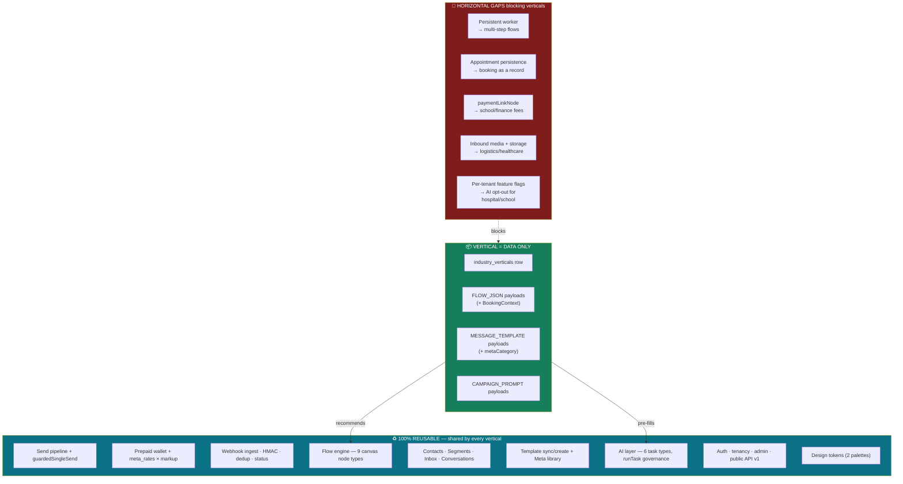

# 18 — Vertical SaaS Readiness

## Executive summary

**SendAnjal is already further into Vertical SaaS than the rest of the codebase suggests, and
the design is right.**

The vertical layer (2,333 LOC in `lib/verticals/` + 604 in `components/verticals/` +
migration `026`) is **deployed and seeded**: 6 verticals, 58 library artifacts, and AI
prompt injection wired at all three call sites. It is also the cleanest code in the
repository, and it follows a strict rule that is genuinely enforced:

> *"no vertical NAME, COPY, FLOW or TEMPLATE may be hardcoded in TypeScript or React. This
> module defines SHAPES only. Every value comes from the `industry_verticals` /
> `vertical_template_library` tables, so an admin can add 'Gym' through the UI without a
> deploy."* — `lib/verticals/types.ts:4-7`

The load-bearing architectural insight is the **booking generalization**: hospital
appointments, real-estate site visits, school counsellor slots, and salon bookings are not
four features. They are **one flow engine with different `BookingContext` config**
(`capture → qualify → confirm → remind`), carried as data in the library row's payload.
That decision is what makes 12 verticals a content problem rather than 12 forks.

**Vertical SaaS readiness: 71 / 100.** The remaining 29 points are not vertical work — they
are the horizontal gaps (multi-step flow execution, appointment persistence, RBAC,
compliance) that every vertical needs.

**Risk level:** Low · **Complexity:** Medium · **Confidence:** High (90%) — live data
verified; `seed-data.ts` (1,315 LOC) inspected structurally, not line-by-line.

---

## 1. What is already built

### Schema (migration `026`, deployed)

| Object | Detail |
|---|---|
| `industry_verticals` | `slug` (unique), `display_name`, `description`, `icon`, `is_active`, `sort_order`, `is_builtin`, timestamps + `touch_updated_at` trigger |
| `vertical_template_library` | `vertical_id` FK CASCADE, `kind` ∈ {FLOW_JSON, CAMPAIGN_PROMPT, MESSAGE_TEMPLATE}, `title`, `description`, `outcome`, `payload JSONB`, `meta_category`, `admin_note`, `is_active`, `sort_order` |
| `users.vertical_id` | **Nullable** FK → `industry_verticals`, `ON DELETE SET NULL`, partial index `WHERE vertical_id IS NOT NULL` |
| CHECK constraints | `meta_category` present **iff** `kind = 'MESSAGE_TEMPLATE'` — the invariant `repository.ts:77-78` relies on |

The additive-nullable-column approach follows the precedent already set by `016_tiers.sql`
and `018_business_profile.sql`. No existing table was restructured.

### Live content

| Vertical | Flows | Templates | Prompts | Total |
|---|---:|---:|---:|---:|
| Hospital & Clinic | 5 | 5 | 2 | 12 |
| Online store | 6 | 5 | 2 | 13 |
| School & College | 6 | 4 | 2 | 12 |
| Real Estate | 5 | 4 | 2 | 11 |
| Restaurant | 2 | 2 | 1 | 5 |
| Salon & Spa | 2 | 2 | 1 | 5 |
| **Total** | **26** | **22** | **10** | **58** |

### Code

| Module | LOC | Role |
|---|---:|---|
| `lib/verticals/seed-data.ts` | 1,315 | All 6 verticals' content, as typed data |
| `lib/verticals/repository.ts` | 209 | Data access + row→domain mappers + documented scope rule |
| `lib/verticals/validate.ts` | 194 | Seed-time gate incl. a **jargon blocklist** |
| `lib/verticals/flow-builders.ts` | 173 | `linear()` / `branched()` graph constructors |
| `lib/verticals/seeder.ts` | 125 | Validate-then-insert |
| `lib/verticals/types.ts` | 112 | Shapes only, discriminated on `kind` |
| `lib/verticals/prompt-context.ts` | 72 | AI injection |
| `lib/verticals/validate-seed.ts` | 70 | Build-time check |
| `lib/verticals/preview.ts` | 63 | Admin preview |
| `components/verticals/{ui,Recommendations,VerticalIcon}.tsx` | 604 | Workbench UI (2 of 3 are **Server Components**) |
| `app/(dashboard)/admin/clients/[id]/setup/` | 754 | Admin provisioning + guided "Add new vertical" form |
| `app/api/{admin/verticals,verticals}/**` | 564 | 6 routes |

### Three properties that make this good architecture

**1. Content is data, not code.** Verified: `types.ts` contains zero vertical names in any
behavioural position; every string comes from the DB. An admin-created "Gym" steers the AI
exactly as well as a shipped vertical.

**2. Seed-time validation, not render-time.** `lib/verticals/validate.ts:3-9` states the
rule: *"a seeded flow that fails `sanitizeFlowGraph` would land in a provisioned tenant as a
card that cannot be opened on the canvas — a broken dashboard for a real client, created by
us, silently. So the seed script validates every payload BEFORE insert and fails the SEED
rather than the TENANT."* Every `FLOW_JSON` payload passes through the **same**
`sanitizeFlowGraph` the AI output and the canvas loader use.

**3. A jargon blocklist.** `validate.ts:36-39` rejects client-facing copy containing
`webhook`, `payload`, `waba`, `api`, `endpoint`, `json`, `node`, `cron`, `opt-in status`,
etc. The buyer is a hospital receptionist; the validator enforces that the product speaks
their language. This is product discipline encoded as a build gate — unusual and correct.

**4. Admins never hand-write flow JSON.** `flow-builders.ts` exposes `linear()` and
`branched()`, so the guided form collects plain answers ("what should we ask?", "what
should we send back?") and assembles a graph guaranteed to use only the 9 sanctioned node
types with exactly one trigger.

### Scope discipline: a vertical pre-fills, it never gates

`lib/verticals/repository.ts:8-11`: *"the ONLY consumers of a tenant's vertical are the
three AI routes and the 'Recommended for …' rails. Inbox, contacts, billing, the manual
flow builder, manual broadcast and manual template creation must never call into this
module."*

Verified by grep — `getVerticalForUser` / `buildVerticalPromptContext` appear only in the
3 AI routes and the 2 client vertical routes. **NULL `vertical_id` is a first-class steady
state**, and `withVerticalContext(prompt, null)` returns the prompt byte-identical to today.

---

## 2. Industry-by-industry assessment

Scored on: does the **existing horizontal engine** support this vertical's core workflow?

### ✅ Seeded and viable today (6)

| Industry | Core workflow | Engine fit | Gaps |
|---|---|---|---|
| **Hospital & Clinic** | appointment → dept/doctor/slot → confirm → 24h/2h/30min reminders | ✅ `sendMessageNode` + `waitNode` + `conditionNode` | 🔴 Multi-step reminders **don't fire** (single-reply runtime). 🔴 No appointment persistence. 🟠 DPDP: inbound patient text goes to an LLM |
| **Online store (E-commerce)** | order confirm · shipping update · abandoned cart · COD confirm · "where's my order" | ✅ Fully expressible. `httpRequestNode` covers order lookup | 🔴 `products`/`carts` tables missing ⇒ the Catalog module is dead. Flows work; commerce data doesn't |
| **School & College** | admission enquiry · fee reminder · attendance alert · result-ready doorbell | ✅ Mostly | 🟠 **No `paymentLinkNode`** — a Razorpay URL goes in message text with no click tracking or paid/unpaid state. 🔴 Multi-step reminders don't fire |
| **Real Estate** | site-visit booking · budget/purpose/timeline qualification · broker broadcast | ✅ Strong fit — `conditionNode` + `addTagNode` handle qualification | 🔴 Multi-step nurture doesn't fire |
| **Restaurant** | table booking · menu · order status | ✅ | 🟡 Only 5 artifacts seeded — thinnest coverage |
| **Salon & Spa** | booking · service/stylist selection · day-before reminder | ✅ | 🟡 5 artifacts. This is also the de-facto "Other" catch-all |

### 🟡 Addable as content only — no code change (3)

| Industry | Workflow | Why it fits | Effort |
|---|---|---|---|
| **Travel & Tourism** | enquiry → destination/dates/pax → quote → booking confirm → pre-departure reminders | Identical `BookingContext` shape. High WhatsApp affinity in India | **Content only** — 1 week of seed authoring |
| **Insurance** | policy enquiry → qualification → renewal reminder → claim status | `conditionNode` qualification + reminders. 🟠 Regulatory copy review needed (IRDAI) | Content + legal review |
| **Finance / NBFC / Lending** | loan enquiry → eligibility questions → document request → EMI reminders | Fits the qualify→remind pattern. 🔴 Would need `paymentLinkNode`. 🟠 RBI/DPDP scrutiny is high | Content + `paymentLinkNode` |

### 🟠 Partial fit — needs a new capability (3)

| Industry | Workflow | Missing capability |
|---|---|---|
| **Logistics** | shipment tracking · delivery slot confirm · POD | Fits `httpRequestNode` for tracking lookups, but wants **inbound image handling** (proof-of-delivery photos) — the webhook drops all inbound media |
| **Manufacturing** | RFQ → spec collection → quotation → order status | Long, stateful, multi-turn B2B conversations. Needs the **persistent worker** for genuine multi-step traversal, and document exchange |
| **Construction** | site enquiry · material order · progress update | Same as manufacturing, plus heavy **media** (site photos, drawings) |

### 🔴 Poor fit today (1)

| Industry | Why |
|---|---|
| **Healthcare (broader than clinics)** — labs, diagnostics, pharmacy | Report delivery is the core value, and it requires **document/media send plus storage**. The "doorbell pattern" (notify, never disclose — `PHASE-0-AUDIT.md` risk #8) is the correct mitigation and is seeded for hospitals, but actually *delivering* a report needs media handling that does not exist. Also the highest DPDP exposure of any vertical |

### Summary

| Category | Count | Requirement |
|---|---:|---|
| Live today | 6 | — |
| Content-only additions | 3 | Seed authoring |
| Need one capability | 3 | Media handling · persistent worker · `paymentLinkNode` |
| Need substantial work | 1 | Media + storage + compliance |
| **Total assessed** | **13** | |

**9 of 13 industries are reachable with content plus at most one horizontal capability.**

---

## 3. Reusable vs industry-specific



**Nothing industry-specific exists in code. That is the achievement.** Every vertical is
expressed as rows in two tables. The blockers are all horizontal.

---

## 4. The booking generalization — assessed

```ts
// lib/verticals/types.ts:37-56
export interface BookingContext {
  captureFields: { key: string; label: string; options?: string[]; required?: boolean }[];
  confirmationCopy: string;
  reminderCadenceHours: number[];   // e.g. [24, 2, 0.5]
}
```

| Vertical | Same engine, different config |
|---|---|
| Hospital | appointment → dept / doctor / slot → confirm → 24h / 2h / 30min |
| Real Estate | site visit → budget / purpose / timeline → confirm → pre-visit |
| School | counsellor slot → grade / program → confirm → day-before |
| Salon / Gym | booking → service / stylist → confirm → day-before |
| Travel | enquiry → destination / dates / pax → quote → pre-departure |

**This is correct and it is the single most valuable decision in the vertical work.** It
means adding "Gym" or "Dental Clinic" is a data-entry task, not an engineering task.

**But the honesty caveat is in the type definition itself** (`types.ts:50-54`):

> *"Runtime caveat (Phase 0 §2): production currently sends only a flow's FIRST reply —
> multi-step cadences store and edit correctly but do not fully fire until the persistent
> worker lands. **Do not promise them in client copy.**"*

So today, seeding a "3-stage reminder (24h/2h/30min)" flow produces a **correct artifact
that sends one message**. The team knew and documented it. It becomes fully live with zero
migration once the worker exists — the data model is already right.

**Commercially this is the #1 vertical blocker.** "We remind your patients twice before
their appointment" is the value proposition for hospitals, schools, salons, and real
estate — four of six seeded verticals. It cannot be claimed yet.

---

## 5. Readiness scorecard

| Dimension | Weight | Score | Weighted | Basis |
|---|---:|---:|---:|---|
| Vertical data model | 15% | 95 | 14.3 | Deployed, nullable, non-coupled, CHECK-constrained |
| Content library | 12% | 80 | 9.6 | 58 artifacts across 6 verticals; restaurant/salon thin |
| No hardcoded verticals | 12% | 100 | 12.0 | Rule stated and verified |
| Booking generalization | 12% | 90 | 10.8 | Right abstraction; runtime incomplete |
| AI prompt injection | 10% | 95 | 9.5 | 3 sites, user-prompt-only, DB-sourced, NULL-safe |
| Admin provisioning | 8% | 85 | 6.8 | Preview + guided form + non-destructive assignment |
| Seed-time validation | 8% | 95 | 7.6 | `sanitizeFlowGraph` gate + jargon blocklist |
| Client-facing rails | 7% | 75 | 5.3 | 3 rails; render only `if (verticalId)` |
| **Multi-step flow execution** | 10% | **20** | **2.0** | 🔴 First reply only — blocks 4 of 6 verticals' core claim |
| Vertical-specific compliance | 6% | 25 | 1.5 | 🔴 No per-vertical AI opt-out; DPDP exposure on hospital/school |
| **Total** | **100%** | | **79.4** | |

Adjusted down for two hard dependencies not in the vertical layer's control (appointment
persistence, media handling) and for the accessibility gap that blocks hospital/school
procurement:

### **Vertical SaaS readiness: 71 / 100**

**Band: strong foundation, incomplete runtime.** The vertical *architecture* scores ~90.
The score is dragged down by horizontal capabilities every vertical needs.

---

## 6. What it takes to add a new vertical today

| Step | Who | Effort | Code change? |
|---|---|---|---|
| 1. Create the `industry_verticals` row | Admin UI | 5 min | ❌ |
| 2. Author flows via the guided form | Admin (non-technical) | 2–4 hrs | ❌ |
| 3. Author message templates + `metaCategory` | Admin | 1–2 hrs | ❌ |
| 4. Author campaign prompts | Admin | 30 min | ❌ |
| 5. Validation (jargon, node types, one trigger) | Automatic | — | ❌ |
| 6. Assign to a client | Admin | 1 min | ❌ |
| 7. AI prompts adapt | Automatic | — | ❌ |

**Zero code changes. A non-technical operator can ship a new vertical in under a day.**
That is the definition of vertical-SaaS readiness, and it is real here.

The one caveat: only **six** verticals were shipped as `is_builtin` seed data. The
capability to add more is complete; the content is not.

---

## Advantages

- **Verticals are data, and the rule is enforced** — not aspirational. Verified by
  inspection: no vertical name occupies any behavioural position in TypeScript or React.
- **The booking generalization is the correct abstraction.** Four verticals' flagship
  workflow is one engine plus config.
- **Seed-time validation with the same validator used for AI output and canvas loading** —
  a broken seed fails the seed, never a tenant.
- **A jargon blocklist as a build gate.** Product language discipline enforced mechanically.
- **Admins never author flow JSON** — `linear()`/`branched()` builders guarantee a valid graph.
- **Vertical pre-fills, never gates.** NULL is a first-class state; the no-vertical prompt
  is byte-identical to before the feature existed.
- **Provisioning is non-destructive by construction** — `setVerticalForUser` writes exactly
  one column; a tenant's existing flows, campaigns, and templates are their own rows and are
  never touched.
- Margin awareness carried into the content model: `metaCategory` is **required** on
  message templates so cost is visible at provisioning time.
- The DPDP-sensitive case was anticipated: hospital report flows use the "doorbell pattern"
  (notify, never disclose).
- This is the **best-engineered and most recently written** code in the repository — the
  quality trend is upward.

## Disadvantages

- **Multi-step flows do not execute.** Only the first reply fires. This blocks the core
  claim of hospital, school, salon, and real-estate verticals.
- **Appointments have no persistence** — the named hospital value proposition has no backend
  (3 demo pages, 1,337 LOC of `useState`, no API, no table).
- **No `paymentLinkNode`** ⇒ school fee reminders and any finance vertical are degraded to
  an untracked URL in message text.
- **Inbound media is dropped** ⇒ logistics, healthcare, construction, and manufacturing are
  blocked.
- **No per-tenant feature flags** ⇒ the AI-opt-out that hospital and school verticals need
  for DPDP cannot be expressed.
- **Accessibility is unimplemented** (0 `htmlFor` app-wide) ⇒ a procurement blocker for
  precisely the institutional buyers these verticals target.
- Restaurant and Salon have only 5 artifacts each — thin enough to feel unfinished.
- E-commerce flows work but the Catalog module behind them is dead (`products`/`carts` missing).
- Vertical assignment is **admin-only** — no self-serve picker at signup, which adds
  friction to the exact funnel verticalization is meant to improve.
- `aiReplyNode` sanitizer drift means a hand-built "AI Reply" flow cannot be saved — a trap
  for any admin authoring content.

## Recommendations

Ordered by unlock value per unit of effort.

| P | Recommendation | Effort | Unlocks |
|---|---|---|---|
| **P0** | **Ship the persistent worker for multi-step flow execution.** Options: (a) Vercel Cron at minute granularity draining `chatbot_sessions WHERE status='waiting' AND resume_at <= now()` — the partial index already exists; (b) Vercel Workflow (WDK) for durable step execution; (c) a small always-on host. **Option (a) is the cheapest and reuses infrastructure already in place.** | 2–3 wks | The flagship claim of **4 of 6 verticals** |
| **P0** | Fix the horizontal blockers first: `dispatch.ts` token resolution, the `messages` insert, and the cross-tenant `contacts` write. Multi-step flows are worthless if the reply cannot be delivered or recorded. | 2 hrs | Everything |
| **P1** | Persist appointments: a `user_id`-keyed `appointments` table plus API, replacing `DEMO_APPOINTMENTS`. This is the hospital/salon/school value prop as a *record*, not just a message. | 2 wks | Hospital, Salon, School, Real Estate |
| **P1** | Add `paymentLinkNode` (Razorpay link + click tracking + paid/unpaid state) **and** fix the `aiReplyNode` sanitizer drift in the **same change** — both touch the same four coupled files. | 1–2 wks | School, Finance, Insurance |
| **P1** | Per-tenant feature flags, then default AI intent routing **off** for `hospital` and `school`. Publish the cross-border LLM processing disclosure. | 1 wk | DPDP posture for the 2 most sensitive verticals |
| **P1** | Self-serve vertical picker at signup with "Skip / not sure" as an equal-weight option — the code already treats NULL as first-class. | 3 days | Activation funnel |
| P2 | Inbound media handling + object storage (Vercel Blob). | 2 wks | Logistics, Healthcare, Construction, Manufacturing |
| P2 | Accessibility remediation (`htmlFor`, `alt`, focus traps, `aria-label`). | 2 wks | Hospital/school **procurement** |
| P2 | Author 3 content-only verticals — **Travel**, **Gym/Fitness**, **Dental** — to prove the zero-code path and thicken the catalogue. | 1 wk each | Market coverage; validates the architecture |
| P2 | Thicken Restaurant and Salon to ~12 artifacts each, matching the other four. | 1 wk | Perceived completeness |
| P2 | Create the missing `products`/`carts` tables so the E-commerce vertical's Catalog module works. | 1 wk | Online store |
| P3 | Add `BookingContext`-driven UI: render the capture fields as a form in the admin preview so an operator can see the conversation before provisioning. | 1 wk | Admin confidence |
| P3 | Per-vertical analytics (booking conversion, reminder open rate) — differentiated reporting is a classic vertical-SaaS upsell. | 2 wks | Pricing power |
| P3 | Insurance and Finance verticals, with regulatory copy review (IRDAI / RBI). | 4 wks | Higher-ARPU segments |
