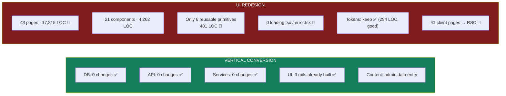

# 19 — Impact Analysis: UI Redesign + Horizontal → Vertical Conversion

## Executive summary

The question posed is: *"we are redesigning the entire UI and converting this Horizontal
SaaS into a Vertical SaaS — what breaks?"*

The answer is **asymmetric, and probably the opposite of what you expect**:

| Change | Blast radius | Risk |
|---|---|---|
| **Vertical conversion** | **Very small.** The layer is built, deployed, and data-driven. Adding verticals is admin data entry. Zero backend changes required | 🟢 **Low** |
| **UI redesign** | **Very large.** 17,815 LOC across 43 pages, 41 of them client components, with only 401 lines of reusable primitives and no shared Button/Input/Modal/Table | 🔴 **High** |

The vertical work is nearly free because someone already did it correctly. The UI redesign
is expensive because the component architecture never invested in primitives — every page
hand-rolls its own controls.

**Two findings change the sequencing materially:**

1. **~3,485 LOC of pages (7 screens) render features with no database behind them.**
   Redesigning CRM, Catalog, Ads, Segments, and Appointments means paying full design and
   build cost for screens that cannot function. **Decide deploy-or-delete before you design.**

2. **`app/(dashboard)/layout.tsx` is a 37-line client component.** Converting it to a Server
   Component (a ~20-line change) is the difference between a redesign that can adopt React
   Server Components and one that reproduces the current client-waterfall architecture in
   new paint. **Do this before writing any new UI.**

**Overall risk: Medium-High · Complexity: High · Confidence: High (88%)**

---

## 1. Scope of change

| Layer | Vertical conversion | UI redesign |
|---|---|---|
| Database | **none** — `026` deployed | none |
| API routes (113) | **none** | none (contracts unchanged) |
| `lib/` domain (9,000 LOC) | **none** | none |
| Auth / middleware | **none** | none |
| Design tokens | none | **keep** — already good |
| Pages | 0 changed | **43 rewritten** |
| Components | 3 already built | **21 → ~45 rebuilt** |

---

## 2. Vertical conversion — affected surface

### Affected files: **zero required**

Verified: `026_verticals.sql` is applied, `industry_verticals` has 6 rows,
`vertical_template_library` has 58, `users.vertical_id` exists with an index, and AI
injection is wired at all three call sites (`ai/campaign-draft:104`, `ai/flow-draft:76`,
`templates/generate:101`).

| Concern | Impact |
|---|---|
| Affected DB | None. Column is nullable, `ON DELETE SET NULL`, no backfill, no default |
| Affected APIs | None. 6 vertical routes already exist |
| Affected UI | None required. 3 rails already render `if (verticalId)` |
| Affected services | None. `getVerticalForUser` reads one column |
| **Breaking changes** | **None.** `withVerticalContext(prompt, null)` returns the prompt byte-identical to before the feature existed |
| Migration complexity | **Trivial** — already done |
| Backward compatibility | **Complete.** NULL = today's exact behaviour |
| Testing impact | Content validation is automated (`sanitizeFlowGraph` + jargon blocklist) |
| Deployment impact | None |
| Rollback | `UPDATE users SET vertical_id = NULL` — instant, non-destructive |
| **Risk level** | 🟢 **Low** |

### Why the risk is genuinely low, not optimistically low

`lib/verticals/repository.ts:177-183` documents the guarantee:

> *"Provision (or clear) a tenant's vertical. **NON-DESTRUCTIVE by construction**: this
> writes one column and nothing else. Flows, campaigns and templates the client already has
> are their own rows and are never touched — changing vertical only changes what appears on
> the 'recommended' rails."*

And the scope rule (`repository.ts:8-11`) confirms only 5 read sites exist. A vertical
cannot break billing, inbox, or sending because those subsystems never read it.

### What vertical conversion *does* require

| Work | Type | Effort |
|---|---|---|
| Author content for new verticals | **Admin data entry** | ~1 day per vertical |
| Thicken Restaurant + Salon (5 → 12 artifacts) | Admin data entry | 1 week |
| Self-serve vertical picker at signup | **New UI** (small) | 3 days |
| Per-tenant AI opt-out for hospital/school | **New capability** | 1 week |
| Multi-step flow execution | **Horizontal capability** | 2–3 weeks |
| Appointment persistence | **Horizontal capability** | 2 weeks |
| `paymentLinkNode` | **Horizontal capability** | 1–2 weeks |

**The vertical conversion is blocked by horizontal gaps, not by vertical work.**
See [18-VERTICAL-READINESS.md](18-VERTICAL-READINESS.md).

---

## 3. UI redesign — affected surface

### Affected files

| Category | Files | LOC | Action |
|---|---:|---:|---|
| Root layout | 1 | 114 | Keep (server, fonts, metadata) — minor edits |
| Auth layout + pages | 4 | 568 | Rewrite |
| **Dashboard layout** | 1 | 37 | **Convert to Server Component + `<SidebarShell>` island** |
| Dashboard pages | 41 | 17,247 | Rewrite |
| Layout components (Sidebar, Navbar) | 2 | 637 | Rewrite |
| Shared primitives | 6 | 401 | **Expand to ~25 components** |
| Feature components (AI, whatsapp, automation) | 10 | 2,620 | Refactor |
| Vertical components | 3 | 604 | **Keep** — already Server Components in the new design language |
| Design tokens | `globals.css` 294 + `tailwind.config.ts` 144 | 438 | **Keep** |
| **Total to rewrite** | **~48** | **≈21,000** | |

### Affected APIs, DB, services

| Layer | Impact |
|---|---|
| **API routes** | 🟢 **None.** All 113 handlers return JSON consumed via `lib/api.ts`. A redesign changes callers, not contracts |
| **`lib/api.ts` (448 LOC)** | 🟡 Becomes partly redundant if pages move to RSC (server-side fetch replaces client fetch). Keep for genuinely client-side mutations |
| **Database** | 🟢 None |
| **`lib/` domain** | 🟢 None |
| **Auth** | 🟡 `middleware.ts` `protectedPaths` needs updating **only if routes are renamed**. Recommendation: **do not rename routes** during the redesign — it doubles the risk for zero user benefit |
| **`types/index.ts`** | 🟡 Shared DTO types — reuse |

### Breaking changes

| # | Breaking change | Severity | Mitigation |
|---|---|---|---|
| 1 | Every page component replaced | High (internal only) | No external contract breaks |
| 2 | `(dashboard)/layout.tsx` server conversion — children can no longer assume client context | Medium | Intentional; do it first so all new pages are written correctly |
| 3 | Route renames would break bookmarks, `middleware.ts`, and the sidebar | High | **Don't rename.** If unavoidable, add redirects and update `protectedPaths` in the same commit |
| 4 | If `lib/api.ts` is dropped for RSC, all 41 pages lose their data layer at once | High | Migrate page-by-page; keep `lib/api.ts` until the last page is converted |
| 5 | 7 pages have no backing table — redesigning them ships polished broken screens | **High** | **Decide deploy-or-delete before designing** |
| 6 | Sidebar nav restructure changes the information architecture users know | Medium | Ship IA changes separately from visual changes |
| 7 | `EmbeddedSignupModal` (1,313 LOC) is coupled to `META_SDK_VERSION` and the FB SDK | **High** | **Do not rewrite it in the redesign.** Restyle only. Rewriting risks breaking onboarding, which is unrecoverable revenue loss |

### Migration complexity, per screen group

| Group | Pages | LOC | Complexity | Note |
|---|---:|---:|---|---|
| Auth | 4 | 568 | 🟢 Low | Self-contained forms |
| Dashboard, Numbers, Contacts, Analytics | 5 | 1,547 | 🟢 Low–Med | Standard CRUD/dashboard |
| Templates, Campaigns, Billing, Settings | 11 | 5,772 | 🟠 Med–High | Large wizards, 1,073 + 1,167 LOC pages |
| **Inbox** | 1 | **1,198** | 🔴 **High** | Real-time-ish list + thread + composer + 24h window state |
| **Automation builder** | 2 | 1,466 | 🔴 **High** | `@xyflow/react` canvas + 348 LOC of node renderers |
| **ESU modal** | 1 | **1,313** | 🔴 **Critical** | Meta handshake. **Restyle, do not rewrite** |
| Verticals (admin + rails) | 5 | 1,358 | 🟢 Low | Already in the new design language |
| **Dead-backend screens** | 7 | **3,485** | ⚫ **Decide first** | CRM(2), Catalog(1), Ads(1), Segments(1), Appointments(3) |

### Testing impact

| Test asset | Impact |
|---|---|
| `e2e/auth.spec.ts` (55 L) | 🔴 Selectors break |
| `e2e/campaign-flow.spec.ts` (70 L) | 🔴 Selectors break |
| `e2e/inbox.spec.ts` (67 L) | 🔴 Selectors break |
| `e2e/global-setup.ts` (20 L) | 🟡 Likely survives |
| Unit tests | **None exist** — nothing to break, and nothing to catch regressions |
| `tsc --noEmit` | ✅ The only automated safety net during the rewrite |

**This is the most serious risk in the whole plan: a ~21,000-line UI rewrite with 212 lines
of e2e tests, no unit tests, and no CI.** The redesign has essentially no regression net.

### Deployment impact

| Concern | Assessment |
|---|---|
| Deploy mechanism | Vercel git integration — unchanged |
| Big-bang vs incremental | **Incremental is possible and strongly preferred.** Route groups allow per-page migration; old and new pages coexist |
| Feature flag for the new UI | 🔴 No flag system exists. Would need one (env var at minimum) for A/B or gradual rollout |
| Vercel Rolling Releases | Available, unused — worth adopting for this |
| Bundle size | Should **improve** (RSC + primitives + `next/dynamic`) |
| Cold starts | Unaffected |
| Cache invalidation | New asset hashes; users may need a hard refresh mid-deploy |
| DB migrations | **None** for the redesign |

### Rollback strategy

| Scenario | Rollback | Recovery time |
|---|---|---|
| New UI is broken | Vercel instant rollback to the prior deployment | < 2 min |
| One page is broken | Revert that page's commit | < 10 min |
| Layout server conversion breaks pages | Revert the layout commit | < 5 min |
| Vertical assignment is wrong | `UPDATE users SET vertical_id = NULL` | Instant |
| **Route renames shipped** | 🔴 **Hard** — bookmarks, middleware, and nav all diverge | Hours |
| **ESU modal rewrite breaks onboarding** | 🔴 **Very hard to detect** — failures are silent and per-user | Days, with revenue loss |

**Rollback is cheap for everything except route renames and the ESU modal.** Both are
avoidable by decision rather than engineering.

---

## 4. The dead-backend decision (do this first)

| Screen | LOC | Missing tables | Options |
|---|---:|---|---|
| `crm` + `crm/[id]` | 1,013 | `crm_deals`, `crm_pipeline`, `crm_activities` | Build (1 wk) · Delete · Downgrade to `contacts.crm_stage` only |
| `catalog` | 727 | `products`, `carts`, `cart_items` | Build (1 wk) · Delete |
| `segments` | 711 | `segments` | **Point the nav at the live `contacts/segments` instead** — cheapest option |
| `ads` | 528 | `ad_campaigns`, `ad_leads` | Build (1 wk) · Delete |
| `appointments` ×3 | 1,337 | none (pure demo) | **Build** — it is a named vertical value prop (2 wks) |
| **Total** | **4,316** | | |

**Cost of designing all five anyway: roughly 4,300 lines of design and build effort on
screens that cannot function.** At a conservative 3 LOC/minute for polished UI that is
several engineer-weeks spent on non-functional product.

**Recommendation:**

| Screen | Decision | Rationale |
|---|---|---|
| Appointments | **Build the backend** | Named value prop for hospital/salon/school — 4 of 6 verticals |
| Segments | **Repoint nav** to `contacts/segments` | The live implementation already exists |
| CRM | **Downgrade** to a `contacts.crm_stage` kanban | `crm_stage` is already a live column; delivers 70% of the value for 10% of the work |
| Catalog | **Delete for now** | E-commerce flows work without it; revisit when the vertical has paying customers |
| Ads / CTWA | **Delete for now** | The webhook capture path also needs `contacts.ctwa_*` columns; a bigger job than the UI |

This removes **~2,270 LOC** from the redesign scope and converts ~1,337 into a real feature.

---

## 5. Per-change impact matrix

| # | Change | Files | APIs | DB | Breaking | Complexity | Risk | Rollback |
|---|---|---:|:-:|:-:|:-:|---|:-:|---|
| 1 | Server-convert `(dashboard)/layout.tsx` | 2 | — | — | Medium | Low (~20 LOC) | 🟢 | Revert commit |
| 2 | Build ~25 UI primitives | +25 | — | — | None | Medium | 🟢 | Additive |
| 3 | Add `loading.tsx` / `error.tsx` | +6 | — | — | None | Low | 🟢 | Additive |
| 4 | Redesign auth pages | 4 | — | — | Low | Low | 🟢 | Per-page |
| 5 | Redesign standard CRUD pages | 12 | — | — | Low | Medium | 🟢 | Per-page |
| 6 | Redesign large wizards (templates, campaigns) | 4 | — | — | Medium | High | 🟠 | Per-page |
| 7 | Redesign Inbox | 1 | — | — | Medium | High | 🟠 | Per-page |
| 8 | Redesign automation canvas | 2 | — | — | Medium | High | 🟠 | Per-page |
| 9 | **Restyle** ESU modal (no rewrite) | 1 | — | — | **High if rewritten** | High | 🔴 | Revert; failures silent |
| 10 | Migrate pages to RSC data fetching | 41 | — | — | High (internal) | High | 🟠 | Per-page; keep `lib/api.ts` |
| 11 | Nav / IA restructure | 1 | — | — | Medium (UX) | Low | 🟡 | Revert |
| 12 | Delete dead screens | −5 | −20 routes | — | Low | Low | 🟢 | Revert |
| 13 | Build appointments backend | +6 | +4 | **+1 table** | None (additive) | Medium | 🟢 | Drop table |
| 14 | Downgrade CRM to `crm_stage` kanban | 2 | −6 routes | — | Low | Low | 🟢 | Revert |
| 15 | Self-serve vertical picker | +2 | — | — | None | Low | 🟢 | Hide |
| 16 | Accessibility remediation | ~48 | — | — | None | Medium | 🟢 | Additive |
| 17 | **Route renames** | 48 + middleware | — | — | **High** | Medium | 🔴 | **Hard** |

---

## 6. Recommended sequencing

The critical insight: **fix the foundation, then decide scope, then design.** Designing
first means designing screens you will delete and building UI in an architecture you are
about to change.

```mermaid
gantt
    dateFormat X
    axisFormat %s
    title Sequencing (weeks)

    section Phase 0 — Foundation (must precede design)
    P0 data fixes (messages, contacts, dispatch, index)   :0, 1
    CI + unit tests on pure functions                     :0, 2
    Generated Supabase types                              :1, 1
    Server-convert dashboard layout                       :2, 1

    section Phase 1 — Decide scope
    Deploy-or-delete decision on 7 dead screens           :2, 1
    Delete Catalog + Ads; repoint Segments nav            :3, 1

    section Phase 2 — Design system
    Build ~25 UI primitives (shadcn on existing tokens)   :3, 3
    loading.tsx / error.tsx per route group               :5, 1

    section Phase 3 — Redesign, page by page
    Auth + standard CRUD (16 pages)                       :6, 3
    Wizards, Billing, Settings (11 pages)                 :9, 4
    Inbox + automation canvas                             :13, 3
    ESU modal — RESTYLE ONLY                              :16, 1

    section Phase 4 — Vertical completion (parallel)
    Persistent worker → multi-step flows                  :6, 3
    Appointment persistence                               :9, 2
    paymentLinkNode + aiReplyNode fix                     :11, 2
    Self-serve vertical picker                            :13, 1
    Author 3 new verticals (content only)                 :14, 3

    section Phase 5 — Harden
    Accessibility remediation                             :17, 2
    RSC migration of the 10 heaviest pages                :17, 3
```

### Why this order

| Decision | Reason |
|---|---|
| **P0 data fixes first** | Redesigning the Inbox while inbound messages don't persist means designing against an empty screen. 2 hours of work unblocks realistic design |
| **CI + unit tests before the rewrite** | A 21,000-line rewrite with 212 lines of e2e and no CI has no regression net. This is the highest-risk item in the plan |
| **Generated types before the rewrite** | Turns the entire drift register into compile errors while you are touching everything anyway |
| **Server-convert the layout before any new page** | Otherwise all 43 redesigned pages get written as client components and you rebuild the same waterfall in new paint |
| **Decide dead screens before designing** | Saves ~2,270 LOC of wasted design and build |
| **Primitives before pages** | 25 components built once, or 43 pages hand-rolling controls again. This single decision determines whether the redesign takes 10 weeks or 20 |
| **Vertical work in parallel** | It touches `lib/` and the DB, not the UI — genuinely independent tracks |
| **ESU modal last, restyle only** | Highest-consequence, lowest-visibility failure mode in the product |

---

## 7. Effort estimate

| Phase | Work | Effort (1 senior FE + 1 senior BE) |
|---|---|---|
| 0 | Foundation: P0 fixes, CI, types, layout conversion | **3 weeks** |
| 1 | Scope decisions + deletions | **1 week** |
| 2 | Design system (~25 primitives + loading/error) | **4 weeks** |
| 3 | Page redesign (36 pages after deletions) | **11 weeks** |
| 4 | Vertical completion (parallel with 3) | **8 weeks (overlapped)** |
| 5 | Accessibility + RSC migration | **5 weeks** |
| | **Total elapsed** | **≈ 20 weeks (5 months)** |
| | **Without the design system (hand-rolling per page)** | **≈ 32 weeks** |

**The design-system investment pays for itself roughly 3×.** Four weeks spent on primitives
saves an estimated twelve weeks of per-page control rebuilding — and is the only version of
this plan that also fixes the accessibility gap structurally, since `htmlFor`/`aria-*` live
in the `Field` primitive rather than in 43 hand-written forms.

---

## 8. Risk register for this programme

| ID | Risk | L | I | Mitigation |
|---|---|:-:|:-:|---|
| IR-1 | 21,000-LOC rewrite with no regression net | **High** | **High** | **Phase 0: CI + unit tests + generated types before any rewrite.** Non-negotiable |
| IR-2 | ESU modal rewrite silently breaks onboarding | Med | **Critical** | Restyle only; never rewrite. Add an ESU e2e test first |
| IR-3 | Redesigning dead screens wastes weeks | **High** | Med | Phase 1 decision gate |
| IR-4 | Pages redesigned as client components again | **High** | Med | Server-convert the layout in Phase 0; make "no `use client` on a page" a review rule |
| IR-5 | Route renames break bookmarks + middleware | Med | High | **Do not rename routes.** Separate change if ever needed |
| IR-6 | Design-system scope creep | Med | Med | Fix the primitive list up front; consider `shadcn/ui` on the existing tokens rather than building from zero |
| IR-7 | Vertical claims promised before multi-step flows land | Med | **High** | Marketing gate: no multi-step claims until the worker ships (`types.ts:50-54` already says this) |
| IR-8 | Accessibility deferred, then blocks a hospital/school deal | Med | High | Build a11y into the primitives; do not retrofit |
| IR-9 | Redesign and vertical tracks collide | Low | Med | They touch different layers; enforce with a shared interface freeze on `lib/api.ts` |
| IR-10 | No feature flag ⇒ big-bang cutover | Med | Med | Add an env-var flag or adopt Vercel Rolling Releases in Phase 0 |

---

## Advantages of the proposed approach

- The vertical conversion is essentially **free** — no DB, API, or service changes.
- API contracts are stable, so front and back ends can move independently.
- Rollback is trivial (Vercel instant) for everything except two avoidable decisions.
- Design tokens are already good and should be **kept**, not redone.
- Route groups allow genuine page-by-page migration; old and new coexist.
- The two work tracks (UI, vertical) touch disjoint layers and can run in parallel.
- Zero rows in the database today means the P0 fixes carry no data-migration risk.

## Disadvantages / honest constraints

- Almost no regression net exists today. Phase 0 is not optional overhead; it is the
  precondition for the whole programme.
- 41 pages must be individually rewritten; there is no shortcut, only leverage from primitives.
- 3,485 LOC of pages have no backend, forcing a product decision before a design decision.
- The two highest-complexity screens (Inbox, automation canvas) are also the two most
  differentiated — they cannot be simplified away.
- The ESU modal is 1,313 lines of Meta-coupled code whose failures are silent and per-user.
- No feature-flag system, so a gradual rollout needs one built first.

## Recommendations

| P | Recommendation |
|---|---|
| **P0** | **Do not start the redesign until Phase 0 is complete.** CI, unit tests on the 12 pure functions, generated Supabase types, the four P0 data fixes, and the layout server conversion. Three weeks that de-risk five months. |
| **P0** | **Make the deploy-or-delete decision on all 7 dead screens before any design work.** Publish it as a live-surface manifest. |
| **P0** | **Server-convert `(dashboard)/layout.tsx` first.** ~20 lines that determine the architecture of every page you are about to write. |
| **P1** | **Invest 4 weeks in ~25 UI primitives with accessibility built in.** `shadcn/ui` maps directly onto the existing Tailwind + CSS-variable tokens. This is the difference between 20 and 32 weeks. |
| **P1** | **Do not rename routes. Do not rewrite the ESU modal.** Two decisions that remove the two hardest rollback scenarios. |
| **P1** | Run the vertical track in parallel: persistent worker → appointments → `paymentLinkNode` → self-serve picker → new content. It is backend work and does not contend with the UI track. |
| **P2** | Add a feature flag (env var minimum) and adopt Vercel Rolling Releases before the first cutover. |
| **P2** | Write e2e coverage for the ESU flow **before** touching that modal. |
| **P2** | Gate marketing claims on the persistent worker. `lib/verticals/types.ts:50-54` already instructs this — honour it. |
| **P3** | Ship IA/nav changes as a separate release from visual changes so user confusion and visual regressions can be diagnosed independently. |
