# 20 — Roadmap, ADRs & Developer Onboarding

## Executive summary

This document closes the discovery with three deliverables: a **prioritised roadmap**
(P0 → P3, sequenced and estimated), **Architecture Decision Records** capturing the
decisions already made (so future contributors inherit the reasoning rather than
re-litigating it) plus the decisions still open, and a **developer onboarding guide**
written for someone joining tomorrow.

The headline sequencing judgement: **spend the first three weeks on foundation, not
features.** Four P0 data fixes total roughly 2 hours of work and unblock the Inbox,
automation replies, and tenant integrity. CI and generated Supabase types take a further
two weeks and convert the entire 19-table drift register from invisible runtime failures
into build errors. Everything else in this document is cheaper and safer after those two
weeks.

---

## 1. Prioritised refactoring roadmap

### P0 — Blocking. Do first. (≈3 weeks)

| # | Task | Effort | Fixes | Doc |
|---|---|---|---|---|
| 1 | Fix the `messages` insert: `wa_message_id` (not `meta_message_id`), add `user_id` + `type`, JSON-encode `content` | **1 hr** | Inbound messages never persist | [05](05-DATABASE.md), [11](11-WHATSAPP.md) |
| 2 | Add the tenant predicate to the `contacts` window update (`webhook/whatsapp:386`) | **30 min** | Cross-tenant write; Law #1 | [16](16-MULTI-TENANCY.md) |
| 3 | Repoint `lib/whatsapp/dispatch.ts` token resolution to `whatsapp_numbers` | **1 hr** | Automation replies computed then dropped | [11](11-WHATSAPP.md) |
| 4 | `CREATE INDEX idx_whatsapp_numbers_pnid ON whatsapp_numbers(phone_number_id)` + 13 FK indexes | **35 min** | First scaling wall | [13](13-PERFORMANCE.md) |
| 5 | **CI**: GitHub Actions running `npm run check` + `gitleaks` on every PR | 4 hrs | Nothing else stays fixed without this | [14](14-CODE-QUALITY.md) |
| 6 | `npx next lint` once, so the lint gate actually gates | 1 hr | Silent lint step | [03](03-TECH-STACK.md) |
| 7 | **Generated Supabase types** → `createClient<Database>()` | 1–2 days | Turns 19 missing tables + all column drift into **compile errors** | [03](03-TECH-STACK.md) |
| 8 | **Unit tests on the 12 pure functions** (window, status, pricing, rates, tiers, flow-schema, `rawCostPaise`, `parseIntent`, …) + run `prepaid_wallet_test.sql` in CI | 1 wk | Money layer has zero automated tests | [14](14-CODE-QUALITY.md) |
| 9 | Server-convert `(dashboard)/layout.tsx` via a `<SidebarShell>` island | **~20 LOC** | Unblocks RSC for 41 pages | [08](08-FRONTEND.md) |
| 10 | **Deploy-or-delete decision** on the 7 dead screens; publish a live-surface manifest; tag ~5,000 dead LOC with `// DEAD IN PROD: requires <table>` | 1 wk | 30% of routes fail silently | [02](02-REPOSITORY.md), [19](19-IMPACT-ANALYSIS.md) |
| 11 | Point `DEMO_AUTO_LOGIN` at a sandbox tenant (no balance, no keys, send disabled) | 1 day | Anonymous prod session | [12](12-SECURITY.md) |
| 12 | Audit every privileged mutation via the existing `lib/audit.ts` | 2 days | Unlogged COGS/margin changes | [06](06-AUTH.md), [17](17-SAAS-MATURITY.md) |
| 13 | Move rate limiting to Postgres | 2 days | Limits non-functional on Vercel | [12](12-SECURITY.md) |
| 14 | Fix the drain-queue cron (`* * * * *`) **or** document inline-only and add a `webhook_inbox` replay job | 1 day | Up to 24 h queue latency | [04](04-SYSTEM-ARCHITECTURE.md) |
| 15 | `logger.error` instead of `console.error` on the wallet settle/release paths | 15 min | Most critical errors unstructured | [09](09-BACKEND.md) |
| 16 | Repoint `automation_runtime_intent` to the cheap provider (**one DB row**) | 2 hrs | Per-inbound-message cost on the expensive model | [10](10-AI.md) |

### P1 — High. Next quarter. (≈10 weeks)

| # | Task | Effort |
|---|---|---|
| 17 | **Migration `029_drift_reconciliation`**: for each of the 19 missing tables, create it keyed on `user_id` or delete the code | 2–3 wks |
| 18 | **One `sendMessage()` choke point** enforcing `canSend()` + billing + logging; route all 7 send paths through it; pick one window source of truth | 1 wk |
| 19 | **Route middleware stack**: `withAuth` · `withValidation` · `withRateLimit` · `withErrorMapping` | 2 wks |
| 20 | Collapse to **one tenant model** — keep `user_id`, delete the 12 org-model files | 1–2 wks |
| 21 | **Persistent worker** for multi-step flows (drain `chatbot_sessions WHERE status='waiting'`) | 2–3 wks |
| 22 | Token-rotation cron (~60-day Meta expiry) | 3 days |
| 23 | The four missing notifications: low balance · template status · quality rating · token expiry | 1 wk |
| 24 | Replace the ESU token `Map` with a signed JWE cookie | 1 day |
| 25 | Collapse `lib/meta.ts` onto `MetaApiError`; add retry + backoff with error-code classification | 1 wk |
| 26 | RLS Option B: tenant-predicate CI lint + cross-tenant test suite | 1 wk |
| 27 | Config cache (60–300 s) for the 5 hot config reads | 1 day |
| 28 | Appointment persistence (`user_id`-keyed table + API) | 2 wks |
| 29 | `paymentLinkNode` + `aiReplyNode` sanitizer fix (one change — same 4 coupled files) | 1–2 wks |
| 30 | **~25 UI primitives** with a11y built in (`shadcn/ui` on the existing tokens) | 4 wks |
| 31 | `loading.tsx` / `error.tsx` per route group | 1 day |
| 32 | Wire `logger.error` → Sentry; alerts on auth failures, wallet errors, webhook signature failures | 1 day |
| 33 | Deploy `upsert_daily_analytics()` or replace with live aggregates | 3 days |
| 34 | Margin dashboard from `ai_usage_log` + `message_billing` (data already collected) | 1 wk |
| 35 | Enforce `monthly_msg_cap` and credit expiry — uncollected revenue | 1 wk |
| 36 | Persist subscriptions (create the missing table); report MRR | 1 wk |
| 37 | Encrypt `meta_app_secret` and `webhook_endpoints.secret` | 1 day |
| 38 | Per-tenant feature flags; default AI intent routing off for hospital/school | 1 wk |
| 39 | Self-serve vertical picker with "Skip / not sure" | 3 days |
| 40 | `message_billing` reaper for rows stuck in `'reserved'` | 2 days |

### P2 — Medium. (≈14 weeks)

| # | Task | Effort |
|---|---|---|
| 41 | Redesign 36 pages on the new primitives | 11 wks |
| 42 | Repository per resource family (contacts, messages, conversations, campaigns) | 3 wks |
| 43 | Migrate the 10 heaviest pages to RSC data fetching | 3 wks |
| 44 | Accessibility remediation (built into primitives, then swept) | 2 wks |
| 45 | Real RBAC: `users.role`, team-member login, `can(user, action, resource)` | 2–3 wks |
| 46 | GST invoicing | 2 wks |
| 47 | Inbound media + object storage (Vercel Blob) | 2 wks |
| 48 | Extract `campaigns/execute` → `lib/whatsapp/broadcast.ts` with continuation past 1,000 recipients | 1 wk |
| 49 | DPDP package: DPA, retention, erasure route, export, cross-border disclosure | 2 wks |
| 50 | Session revocation (`jti` + denylist) or 24 h + refresh | 1 wk |
| 51 | SSRF protection on `webhook_endpoints.url` and `httpRequestNode` | 3 days |
| 52 | Nonce-based CSP; drop `unsafe-inline`; remove `api.anthropic.com` from `connect-src` | 1 wk |
| 53 | Model Meta rate limits (per-number token bucket); deploy `increment_messages_sent` | 1 wk |
| 54 | Author 3 content-only verticals (Travel, Gym, Dental); thicken Restaurant + Salon | 4 wks |
| 55 | OpenAPI spec for `/api/v1/*` | 3 days |
| 56 | Drop legacy `numeric` money columns; add a `Paise` branded type | 2 days |
| 57 | Correlation ids: edge → queue → worker | 3 days |
| 58 | `next/dynamic` for xyflow, Recharts, `EmbeddedSignupModal` | 1 day |
| 59 | Split the six 700+ LOC pages | 3 wks |
| 60 | Pagination on all list routes; virtualise Inbox + Contacts | 1 wk |

### P3 — Strategic. (post-quarter)

| # | Task |
|---|---|
| 61 | Session-variable RLS (Option A) via a transaction-scoped `pg` client — also delivers Unit of Work |
| 62 | Model C shared-number pool (makes Starter sendable) |
| 63 | Next.js 15/16 upgrade: React 19, PPR, Cache Components, Turbopack |
| 64 | SSO / SAML / SCIM / MFA |
| 65 | Reseller / agency hierarchy — the India channel |
| 66 | SOC 2 Type II |
| 67 | Usage-based overage billing with proration + dunning |
| 68 | Stream AI responses; evaluate the Vercel AI Gateway adapter |
| 69 | Per-vertical analytics (booking conversion, reminder open rate) |
| 70 | Multi-region / data residency |

---

## 2. Implementation roadmap, phased

```mermaid
gantt
    dateFormat X
    axisFormat W%s
    title SendAnjal — 6-month plan

    section Phase 0 · Foundation (3 wks)
    P0 data fixes + indexes            :0, 1
    CI + lint + gitleaks               :0, 1
    Generated Supabase types           :1, 1
    Unit tests on pure functions       :1, 2
    Server-convert dashboard layout    :2, 1
    Deploy-or-delete decision          :2, 1
    Security P0 (demo tenant, audit, rate limit) :1, 2

    section Phase 1 · Make it true (10 wks)
    Migration 029 drift reconciliation :3, 3
    One tenant model                   :3, 2
    sendMessage() choke point          :5, 1
    Route middleware stack             :5, 2
    Persistent worker (multi-step)     :6, 3
    Token rotation + 4 notifications   :7, 2
    Config cache + Sentry + analytics  :8, 2
    Margin dashboard + quota + subs    :9, 3

    section Phase 2 · Make it good (14 wks)
    UI primitives (25, a11y built in)  :13, 4
    Page redesign (36 pages)           :17, 11
    RSC migration (10 heaviest)        :22, 3
    Appointments + paymentLinkNode     :13, 4
    Repository per family              :17, 3
    RBAC + GST invoicing               :20, 5
    3 new verticals (content)          :19, 4

    section Phase 3 · Make it enterprise
    Session-variable RLS               :28, 4
    DPDP package + accessibility       :28, 4
    Model C number pool                :30, 4
```



| Phase | Theme | Weeks | Exit criterion |
|---|---|---|---|
| **0** | **Foundation** | 3 | Drift is a compile error; CI green; money layer tested; 4 critical bugs fixed |
| **1** | **Make it true** | 10 | Every navigable feature works; one tenant model; multi-step flows fire; readiness ≈ 75 |
| **2** | **Make it good** | 14 | New UI shipped on primitives; RBAC + invoicing; readiness ≈ 88 |
| **3** | **Make it enterprise** | 12+ | RLS, DPDP, Model C, SSO; readiness ≈ 95 |

---

## 3. Architecture Decision Records

### Part A — Decisions already made (recovered from code and comments)

Recorded so they are inherited, not re-litigated.

---
**ADR-001 · Be the BSP, not a reseller** · Accepted
**Context** Reaching WhatsApp requires either Meta directly (Tech Provider) or an
aggregator (Twilio, 360dialog).
**Decision** Integrate directly with Meta Graph as a Tech Provider/BSP.
**Consequences** ✅ The entire margin model exists because there is no intermediary.
❌ We own onboarding complexity, token lifecycle, quality ratings, and Meta policy
compliance. 🔗 `lib/meta.ts`, `lib/meta-version.ts`, `plan_tiers.model`

---
**ADR-002 · Meta wholesale rates live in the database, never in code** · Accepted
**Context** COGS changes when Meta changes pricing, per category and region.
**Decision** `meta_rates` table, read at send time; `charged = round(wholesale × (1 + (markup + buffer)/10000))`.
**Consequences** ✅ Repricing needs no deploy; margin is reconstructible.
❌ A stale row silently destroys margin and there is no staleness alert.
🔗 `lib/billing/rates.ts`, Law #2

---
**ADR-003 · Money in integer paise, atomicity in Postgres** · Accepted
**Context** Floats cannot represent currency; application-level transactions cannot span
`supabase-js` calls.
**Decision** All amounts `bigint` paise; every mutation via a row-locked, idempotent SQL
function (`wallet_*`, `ai_wallet_*`).
**Consequences** ✅ Correctness enforced by the database for any client, in any language.
❌ Logic split across SQL and TypeScript; the SQL has one test that never runs; non-money
multi-entity operations have no atomicity.
🔗 `supabase/migrations/011`, `lib/billing/wallet.ts`

---
**ADR-004 · Reserve → confirm-on-Meta-status, never charge-then-refund** · Accepted
**Context** Meta may accept, reject, or fail a send after we commit.
**Decision** Hold funds on reserve; settle only on `sent`/`delivered`/`read`; release on
`failed` or any pre-Meta error.
**Consequences** ✅ A message that never reaches `sent` is never charged; triple idempotency
makes duplicate/out-of-order webhooks safe.
❌ No reaper for reservations stuck in `'reserved'` (the partial index for one exists).
🔗 `lib/billing/{guarded-send,confirm}.ts`

---
**ADR-005 · Custom `jose` JWT instead of Supabase Auth** · Accepted, with a large consequence
**Context** Needed session auth plus Google OAuth.
**Decision** Sign our own HS256 JWT into an httpOnly `wa_session` cookie; use the Supabase
**service-role** client server-side.
**Consequences** ✅ Full control; works in edge middleware; no vendor lock-in on identity.
❌ **`auth.uid()` is always NULL, so RLS is unusable.** All 37 tables have RLS enabled with
0 policies; the 65 policies written in migrations `002`/`009` can never evaluate. Tenant
isolation is application-layer only. Also: password reset, MFA, and SSO must all be built
from scratch.
🔗 `lib/auth.ts`, `lib/supabase/server.ts`, [16](16-MULTI-TENANCY.md)

---
**ADR-006 · pg-boss behind a swappable driver; no Redis** · Accepted
**Decision** `QueueDriver` interface with `InlineDriver` (default) and `PgBossDriver`.
**Consequences** ✅ Zero-infra default; durability is one env var; a Vercel Queues driver
would be ~40 lines. ❌ Inline is not durable on serverless; the drain cron is configured
**daily**, making the durable driver unusable as deployed.
🔗 `lib/queue/index.ts`, `vercel.json`

---
**ADR-007 · AI routing is configuration, not code** · Accepted
**Decision** `ai_model_config` supplies provider, model, price, credits, timeout, retries per
`task_type`. One governed entry point (`runTask`). Provider adapters behind an interface.
**Consequences** ✅ No model id in any route; provider/model changes need no deploy; tier
gating, credit metering, and usage logging are structurally unskippable.
❌ Configuration becomes a correctness surface with no type checking, no tests, and no change
audit — and one row is currently misconfigured onto the expensive provider.
🔗 `lib/ai/{config,service}.ts`, [10](10-AI.md)

---
**ADR-008 · AI drafts; humans send** · Accepted
**Decision** `runTask` never performs a customer-facing action. The one runtime path that
acts (intent routing) selects only among human-published flows.
**Consequences** ✅ The safety property is architectural, not procedural.
❌ No conversational AI product is possible without revisiting this — and doing so would be
the first time AI-generated text reaches a customer, requiring a new safety review.
🔗 `lib/ai/service.ts:16-17`, `lib/automation/intent.ts:9-11`

---
**ADR-009 · AI credits are a separate ledger from the message wallet** · Accepted
**Decision** Credits, not paise; `ai_credit_wallet` / `ai_credit_ledger`; never merged.
**Consequences** ✅ Two independent margin models stay independently analysable.
❌ Two wallets to top up and explain; `markupMultiplier` is loaded but never applied.
🔗 `lib/ai/wallet.ts:5-8`

---
**ADR-010 · Verticals are data; nothing about an industry is hardcoded** · Accepted
**Decision** `industry_verticals` + `vertical_template_library`; `users.vertical_id`
nullable; TypeScript defines shapes only; AI injection appends to the **user** prompt only.
**Consequences** ✅ A non-technical admin ships a new vertical in under a day with zero code
change; NULL is a first-class state; provisioning writes exactly one column and is
non-destructive. ❌ Content quality becomes an operations discipline; seed validation must
be airtight (it is — `sanitizeFlowGraph` + a jargon blocklist).
🔗 `lib/verticals/types.ts:4-7`, `lib/verticals/validate.ts`

---
**ADR-011 · Booking is flow-engine configuration, not a separate primitive** · Accepted
**Decision** `capture → qualify → confirm → remind` is one engine; per-vertical
`BookingContext` (fields, confirmation copy, reminder cadence) rides in the library payload.
**Consequences** ✅ Hospital, real estate, school, salon, and travel are one implementation.
❌ Requires a persistent worker to actually fire multi-step cadences — which does not exist,
so only the first reply sends. The type definition says so and instructs against
overclaiming.
🔗 `lib/verticals/types.ts:37-56`, `PHASE-0-AUDIT.md §1`

---
**ADR-012 · Two Graph API version constants** · Accepted
**Decision** `GRAPH_API_VERSION` (`v22.0`) for server calls; `META_SDK_VERSION` (`v19.0`)
pinned to the browser FB SDK the ESU handshake must match.
**Consequences** ✅ Server upgrades don't break onboarding. ❌ Two versions to track; bumping
the SDK requires full ESU retesting. 🔗 `lib/meta-version.ts`

---
**ADR-013 · The plural webhook path is a re-export, not a fork** · Accepted
**Decision** `/api/webhooks/whatsapp` re-exports `{GET, POST}` from the singular route.
**Consequences** ✅ Both subscribed URLs behave identically; one implementation.
🔗 `app/api/webhooks/whatsapp/route.ts`

---
**ADR-014 · Admin is an environment allowlist, not a database role** · Accepted
**Decision** `ADMIN_EMAILS` checked by `isAdminEmail`; no `role` column.
**Consequences** ✅ Cannot be self-granted from inside the product. ❌ No RBAC, no seats, no
delegation; `team_members.role` is decorative and invited members cannot log in.
🔗 `lib/auth.ts:42-54`

---
**ADR-015 · No ORM at runtime; `prisma/schema.prisma` is documentation** · Accepted, needs revisiting
**Decision** `supabase-js` only; Prisma kept as a reference model.
**Consequences** ✅ No runtime dependency; RPCs stay first-class. ❌ **The type system is
blind to the database** — the direct cause of the 19-table drift register and the broken
`messages` insert. And the Prisma file documents the *organization* model, which is deployed
nowhere, so it describes a third imaginary state.
**Revisit** Adopt generated Supabase types (P0 #7). Do **not** adopt Prisma — it would fight
the RPC money layer.
🔗 `prisma/schema.prisma:1-14`, [03](03-TECH-STACK.md#3-why-no-orm--and-the-cost)

---

### Part B — Decisions still open

| ADR | Question | Options | Recommendation |
|---|---|---|---|
| **ADR-016** | **One tenant model, or two?** | (a) Keep `user_id`, delete the org branch · (b) Deploy the org model and migrate · (c) Keep both | **(a).** It is deployed, 34 files use it, and `users.vertical_id` proves additive per-tenant config works on it. Introduce organizations later as a nullable **parent** of users, not a replacement |
| **ADR-017** | **How to get real tenant isolation?** | (a) Session-variable RLS via a `pg` transaction-scoped client · (b) App-layer + CI lint + cross-tenant tests | **(b) now, (a) before the first enterprise contract.** (b) is a week and closes the detection gap; (a) is right but must not block P0 |
| **ADR-018** | **Where does multi-step flow execution run?** | (a) Vercel Cron at minute granularity draining `chatbot_sessions` · (b) Vercel Workflow (WDK) · (c) An always-on host | **(a) first.** The `idx_chatbot_sessions_resume_at … WHERE status='waiting'` partial index already exists for exactly this. Reuses infrastructure; no new platform |
| **ADR-019** | **Deploy or delete the 7 dead screens?** | per-feature | Appointments → **build** · Segments → **repoint nav** to the live implementation · CRM → **downgrade** to a `contacts.crm_stage` kanban · Catalog + Ads → **delete for now** |
| **ADR-020** | **Build UI primitives or adopt a library?** | (a) Build ~25 from scratch · (b) `shadcn/ui` on the existing tokens | **(b).** The existing Tailwind + CSS-variable token setup is exactly what shadcn expects; it is copy-in (no runtime dependency) and brings a11y defaults, which fixes the 0-`htmlFor` problem structurally |
| **ADR-021** | **Which AI provider for the per-inbound-message intent task?** | (a) Gemini Flash-Lite (as designed) · (b) Anthropic Haiku (as configured) | **(a).** The `GeminiAdapter` is implemented and the code documents the cost rationale. One DB row |
| **ADR-022** | **Make Starter (Model C) sendable, or stop selling it as such?** | (a) Build the platform number pool · (b) Reposition Starter | Decide explicitly. Currently the cheapest, highest-volume tier is purchasable but cannot send — a silent sales problem |
| **ADR-023** | **Upgrade to Next.js 15/16?** | (a) Now · (b) After Phase 1 | **(b).** React 19, PPR, Cache Components, and Turbopack are real wins, but not while the drift register is open |

---

## 4. Developer Onboarding Guide

### Day 1 — Read, in this order

1. **`CLAUDE.md`** — the seven Laws. Violating any is a bug even if tests pass.
2. **`.claude/skills/sendanjal-core/SKILL.md`** — the source of truth for conventions.
3. **This document set**, starting with [00-EXECUTIVE-SUMMARY.md](00-EXECUTIVE-SUMMARY.md)
   and [05-DATABASE.md](05-DATABASE.md).
4. **`docs/verticals/PHASE-0-AUDIT.md`** — good prior work, but note its "Correction"
   section is **stale**: `automation_flows`, `chatbot_sessions`, and the four `ai_*` tables
   now exist in production.

### The three things that will confuse you

| Confusion | Truth |
|---|---|
| *"Is this Prisma?"* | **No.** `prisma/schema.prisma` is documentation for a schema deployed nowhere. Runtime is `supabase-js` with the service-role key |
| *"Which tenant model?"* | **`user_id`.** Each user IS a tenant. `organizations`/`whatsapp_accounts`/`organization_id` appear in 12 files and **exist in no deployed table** |
| *"Why does this feature not work?"* | Probably its table doesn't exist. **19 tables the code queries are absent in production.** Check [05](05-DATABASE.md#3-drift-register--19-tables-the-code-queries-that-do-not-exist) first |

### Local setup

```bash
npm install
# create .env.local — see CLAUDE.md for the full list
npm run dev            # http://localhost:3000
npm run check          # tsc + lint + build + audit + secret grep
```
Login: `admin@sendanjal.com` / `Test@12345`, or `DEV_AUTO_LOGIN=1` to land straight on
`/dashboard`.

### Where things live

| To change… | Go to |
|---|---|
| A page | `app/(dashboard)/<feature>/page.tsx` |
| An endpoint | `app/api/<resource>/route.ts` |
| Money | `lib/billing/*` — **read all 6 files before editing any** |
| A WhatsApp send | `lib/meta.ts` (via `guardedSingleSend`) |
| The webhook | `app/api/webhook/whatsapp/route.ts` (**singular** is canonical) |
| AI behaviour | `lib/ai/service.ts` + the `ai_model_config` table |
| A vertical | The **database**, via `/admin/clients/[id]/setup`. Never in code |
| Flow node types | 4 coupled files — see [14](14-CODE-QUALITY.md#the-aireplynode-drift-worth-its-own-note) |
| Schema | A new numbered file in `supabase/migrations/` |
| Design tokens | `app/globals.css` (2 palettes) + `tailwind.config.ts` |

### Rules that will get your PR rejected

1. A hardcoded Meta rate. Read `meta_rates` (Law #2).
2. Float currency. Integer paise only (Law #3).
3. A wallet mutation outside `lib/billing/wallet.ts` (Law #3).
4. A `fetch('https://graph.facebook.com...')` outside `lib/meta*.ts`.
5. A query on a tenant table without `.eq("user_id", …)` (Law #1).
6. A free-form send without a 24h window check (Law #5).
7. A model id in a route. It belongs in `ai_model_config` (Law #4 / ADR-007).
8. A vertical name, copy, flow, or template in TypeScript or React (ADR-010).
9. `console.log` in `app/` or `lib/`. Use `lib/logger`.
10. A margin-affecting change that isn't flagged in the PR description.

### Before you open a PR

```bash
npx tsc --noEmit       # must be clean
npm run check          # the full gate
npx playwright test    # 3 specs
```
Note honestly: there are **no unit tests** and **no CI**. `tsc` is currently your only
automated safety net. If you are writing anything in `lib/billing`, `lib/whatsapp/window`,
or `lib/ai`, please add the first tests — see [14](14-CODE-QUALITY.md#the-cheap-wins-are-unusually-cheap)
for the 12 pure functions that need no mocking.

### The best code to learn from

| File | Why |
|---|---|
| `lib/billing/guarded-send.ts` (133) | Closure DI; every failure branch handled |
| `lib/ai/service.ts` (344) | 7-stage governed pipeline; graceful degradation |
| `lib/whatsapp/status.ts` (79) | Race-safe monotonic state in one UPDATE |
| `lib/verticals/repository.ts` (209) | Repository done properly, with a documented scope rule |
| `lib/queue/index.ts` (171) | A minimal, correct Strategy seam |
| `lib/whatsapp/window.ts` (79) | Pure, testable, documents the Meta error it prevents |

### The code to be careful with

| File | Why |
|---|---|
| `components/whatsapp/EmbeddedSignupModal.tsx` (1,313) | Meta handshake; failures are silent and per-user. **Restyle, never rewrite** |
| `app/api/campaigns/execute/route.ts` (499) | Money + batching + Graph in one handler |
| `app/api/webhook/whatsapp/route.ts` (471) | Contains 3 of the 4 P0 bugs |
| `lib/whatsapp/{engine,dispatch,service,repository,dto}.ts` | **Dead in production** — org model |

---

## 5. Final readiness

| Assessment | Score |
|---|---:|
| **Enterprise-grade Vertical SaaS readiness** | **46 / 100** |
| SaaS maturity ([17](17-SAAS-MATURITY.md)) | 44 / 100 |
| Vertical SaaS readiness ([18](18-VERTICAL-READINESS.md)) | 71 / 100 |
| Projected after Phase 0 (3 weeks) | ≈ 62 |
| Projected after Phase 1 (13 weeks) | ≈ 78 |
| Projected after Phase 2 (27 weeks) | ≈ 88 |

The gap between 46 and 88 is almost entirely **deployment, consistency, and frontend
architecture work** — not redesign, and not re-architecture. The parts that are genuinely
hard to build (billing correctness, webhook integrity, AI governance, the vertical
abstraction) are already right.

**Risk level:** High today, Medium after Phase 0 · **Complexity:** High ·
**Confidence in this roadmap:** High (88%)
