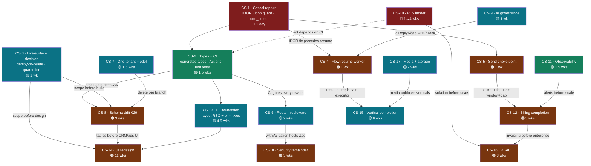

# 21 — Change Impact Analysis & Implementation Roadmap

**Principal Architect assessment · 2026-07-30 · 18 change sets, 20 impact dimensions each**

This document supersedes the sequencing in [19-IMPACT-ANALYSIS.md](19-IMPACT-ANALYSIS.md),
which analysed only the UI-redesign and vertical-conversion programme. This one covers
**every major module and proposed change**, and it is re-prioritised because reading
`app/api/automation-flows/[id]/execute/route.ts` in full surfaced a **Critical
cross-tenant credential-use vulnerability** that outranks everything previously logged.

---

## 0. New findings that reorder the roadmap

> ### ✅ STATUS: CS-1 IMPLEMENTED — 2026-07-30
>
> All four CRIT items below plus the webhook/dispatch defects are **fixed and verified**.
> `tsc --noEmit` exit 0 · `next build` exit 0 · cycle detection proven against 8 graphs ·
> all 3 live flows still validate · cross-tenant write and broken insert proven then
> re-proven fixed in a rolled-back transaction (0 rows persisted).
>
> | Fix | File |
> |---|---|
> | 5 IDORs + upfront ownership gate | `app/api/automation-flows/[id]/execute/route.ts` |
> | Loop guard (`visited` + `MAX_STEPS`) | same |
> | Cycle rejection at save time | `lib/automation/flow-schema.ts` |
> | `crm_notes` → `contacts.tags` | same route |
> | `aiReplyNode` → governed `runTask` | same route + `lib/ai/config.ts` |
> | Field allowlist + SSRF guard | same route |
> | Inbound `messages` insert (`wa_message_id`, `user_id`, jsonb `content`) | `app/api/webhook/whatsapp/route.ts` |
> | Cross-tenant `contacts` write | same |
> | Conversation window state on inbound | same |
> | Token resolution → `whatsapp_numbers` | `lib/whatsapp/dispatch.ts` |
>
> **Two corrections to this document's original claims:** (a) the `messages` insert failed
> on the unknown `meta_message_id` column and `user_id NOT NULL` — `type` and `status` both
> have defaults and were never blockers; (b) the database is **not** empty — `list_tables`
> row counts come from stale planner statistics. Actual: 1 user, 1 number, 21 contacts.
> Data-migration risk is still low, but not zero as stated in
> [05-DATABASE.md](05-DATABASE.md).
>
> **Still open:** CS-1 item 13 (verify `wallet_settle`'s `consumed_paise` handling) —
> de-risked by the loop guard, not resolved. Next: **CS-2** (types + CI).

All four verified against the live database during this pass.

### 🔴 CRIT-1 — Cross-tenant WhatsApp credential use and send-as-another-business

`app/api/automation-flows/[id]/execute/route.ts:133-153`

```ts
const { data: conv } = await supabase
  .from("conversations")
  .select("contact_phone, whatsapp_numbers(phone_number_id, access_token)")
  .eq("id", conversationId)          // ← attacker-supplied. NO user_id predicate.
  .single();

const wnToken = await decrypt(wn.access_token);   // ← decrypts ANOTHER tenant's token
await guardedSingleSend({
  userId: user.id,
  send: () => sendTextMessage(wn.phone_number_id, wnToken, conv.contact_phone, text),
});
```

The **flow** is correctly ownership-checked (`:63` — `.eq("user_id", user.id)` ✅).
`conversationId` is not checked at all.

**Exploit:** authenticated Tenant A calls `POST /api/automation-flows/{A's own flow}/execute`
with a `conversationId` belonging to Tenant B. SendAnjal then:

| Step | Result |
|---|---|
| Reads `conversations.contact_phone` | 🔴 Cross-tenant PII disclosure |
| Joins and **decrypts** `whatsapp_numbers.access_token` | 🔴 Cross-tenant credential decryption |
| Sends via B's `phone_number_id` with B's token | 🔴 **Sends a WhatsApp message as another business, to their customer** |
| Bills `userId: user.id` | 🟡 The attacker pays — the only mitigating factor |
| Meta quality rating | 🔴 Damage lands on **B's** number |

**Severity: Critical.** This is arbitrary send-as-any-tenant. Combined with
`DEMO_AUTO_LOGIN=true` in production (which mints a real session for any anonymous
visitor), the full chain is **unauthenticated → demo session → send as any tenant**.

Three sibling IDORs in the same file:

| Line | Query | Impact |
|---|---|---|
| `:78-82` | `contacts.select(...).eq("id", contactId)` | Cross-tenant contact read |
| `:181-188` | `contacts.update(...).eq("id", contactId)` | Cross-tenant write |
| `:239` | `contacts.update({[field]: value}).eq("id", contactId)` | Cross-tenant write, **attacker-controlled column name** |
| `:230` | `conversations.update(...).eq("id", conversationId)` | Cross-tenant write |

`:239` is additionally a column-injection primitive: `field` comes from flow config, so a
tenant can write to any writable `contacts` column.

**Fix: add `.eq("user_id", user.id)` to five queries and validate `field` against an
allowlist. ~30 minutes.**

### 🔴 CRIT-2 — Unbounded flow execution loop

`:124` `while (currentNodeId) { … }` has **no visited-set and no iteration cap**, and
`sanitizeFlowGraph` performs **no cycle detection** (verified: it checks node types, exactly
one trigger, referential edges, and count caps — `flow-schema.ts:118-148` — nothing more).

A cyclic flow therefore loops until the 300 s function timeout, calling `sendTextMessage`
on every pass. Because `idempotencyKey` is deterministic per node
(`flow:${sessionId}:${node.id}`, `:149`), `wallet_reserve` returns the *same* hold each
time — so the wallet does **not** hard-stop the loop, while Meta receives duplicate sends.

Each pass also inserts a new `message_billing` row (new `wa_message_id`) pointing at that
one reservation, and each subsequent status webhook calls `wallet_settle` with a distinct
`unit_idem`. **Whether that over-consumes the reservation depends on `wallet_settle`'s
`consumed_paise` handling in migration 011, which this audit has not read.** Flagged for
verification, not asserted.

**Consequence regardless of the money question: message-spam to a real customer plus a
300 s function burn.**

### 🔴 CRIT-3 — `contacts.crm_notes` does not exist; flow personalisation is dead

Live `contacts` columns: `id, user_id, name, phone, email, contact_group, tags, status,
last_contacted, added_date, created_at, updated_at, last_inbound_at, crm_stage`.
**No `crm_notes`.**

| Site | Effect |
|---|---|
| `:80` `.select("name, phone, crm_stage, crm_notes")` | PostgREST error → `contact` is null → `context = {}` |
| `:142` `.replace(/\{\{name\}\}/g, context.name \|\| "there")` | **Every flow message says "there"**, never the contact's name |
| `:181-188` `addTagNode` reads and writes `crm_notes` | **Tagging is entirely non-functional** |
| `:239` `updateContactNode` with `field="crm_notes"` | Fails silently |

So the two most-used automation nodes after `sendMessageNode` do not work, and
personalisation always degrades to a generic greeting.

### 🟠 CRIT-4 — `aiReplyNode` bypasses the entire AI governance layer

`:207-225` calls the Anthropic SDK **directly**, with **hardcoded model ids**
(`claude-sonnet-4-5-20251001`, `claude-haiku-4-5-20251001`), and no tier gate, no credit
pre-check, no debit, no `ai_usage_log` write, and no timeout.

This violates **Law #4** and **ADR-007** ("no model id in any route; one governed path").
It is unmetered AI spend invisible to the margin ledger. It also confirms the sanitizer
drift: `aiReplyNode` is executable here but absent from `CANVAS_NODE_TYPES`, so a flow using
it **cannot be saved** — the node is simultaneously live and unsavable.

### 🟢 Positive finding — the persistent worker is 90% built

`:160-168` already implements `waitNode` correctly against the **live** schema: it sets
`chatbot_sessions.status='waiting'`, `current_node_id`, `resume_at`, and persists `context`.
The partial index `idx_chatbot_sessions_resume_at … WHERE status='waiting'` exists.

**Nothing reads `resume_at`.** Verified: the only two references in the entire repo are the
write at `:163` and the return at `:166`.

So multi-step flows are not "unimplemented" — they are **implemented and unresumed**. The
missing piece is a cron route plus a `startNodeId` parameter (the executor currently always
starts from the trigger, `:121`).

**This revises CS-7 from 2–3 weeks down to ≈1 week** and is the single largest scope
reduction in the plan.

---

## 1. Change set register

| ID | Change set | Complexity | Risk | Effort |
|---|---|---|---|---|
| **CS-1** | Critical data-path & IDOR repairs | Low | 🔴 Critical | 1 day |
| **CS-2** | Type-safety & CI foundation | Low | 🟢 Low | 1.5 wks |
| **CS-3** | Live-surface decision & dead-code quarantine | Low | 🟡 Med | 1 wk |
| **CS-4** | Flow-execution completion (resume worker) | Medium | 🟠 High | 1 wk |
| **CS-5** | Unified send choke point (Law #5) | Medium | 🟠 High | 1 wk |
| **CS-6** | Route middleware stack | Medium | 🟡 Med | 2 wks |
| **CS-7** | Tenant-model unification | Medium | 🟡 Med | 1.5 wks |
| **CS-8** | Schema-drift reconciliation (19 tables) | High | 🟠 High | 3 wks |
| **CS-9** | AI governance closure | Low | 🟡 Med | 1 wk |
| **CS-10** | Tenant-isolation hardening (RLS ladder) | High | 🔴 Critical | 1 wk → 4 wks |
| **CS-11** | Observability & notification layer | Low | 🟢 Low | 1.5 wks |
| **CS-12** | Billing & subscription completion | Medium | 🟠 High | 3 wks |
| **CS-13** | Frontend architecture foundation | Medium | 🟡 Med | 4.5 wks |
| **CS-14** | UI redesign (36 pages) | High | 🟠 High | 11 wks |
| **CS-15** | Vertical completion | Medium | 🟡 Med | 6 wks |
| **CS-16** | RBAC & multi-seat | High | 🟠 High | 3 wks |
| **CS-17** | Media & object storage | Medium | 🟡 Med | 2 wks |
| **CS-18** | Security hardening remainder | Medium | 🟠 High | 3 wks |

---

## 2. Dependency graph



### Critical path

```
CS-1 → CS-2 → CS-3 → { CS-8, CS-13 } → CS-14
                ↘ CS-5 → CS-12 → CS-16
                ↘ CS-9 → CS-4 → CS-15
```

**Longest chain:** CS-1 → CS-2 → CS-3 → CS-13 → CS-14 = 1d + 1.5w + 1w + 4.5w + 11w ≈
**18 weeks**. Everything else parallelises inside that window with two engineers.

---

## 3. Change-set analyses

Each analysed across all 20 requested dimensions.

---

### CS-1 · Critical data-path & IDOR repairs

| # | Dimension | Assessment |
|---|---|---|
| 1 | **Files affected** | `app/api/automation-flows/[id]/execute/route.ts` · `app/api/webhook/whatsapp/route.ts` · `lib/whatsapp/dispatch.ts` · `lib/automation/flow-schema.ts` · one migration |
| 2 | **Components affected** | None (backend only) |
| 3 | **Database changes** | `CREATE INDEX idx_whatsapp_numbers_pnid ON whatsapp_numbers(phone_number_id)` + 13 FK indexes. Optionally `ALTER TABLE contacts ADD COLUMN crm_notes text` (or drop the code paths) |
| 4 | **API changes** | None to contracts. `execute` gains stricter 404s on foreign `contactId`/`conversationId` |
| 5 | **UI changes** | None. Inbox will begin showing inbound messages (behaviour, not markup) |
| 6 | **Authentication impact** | None |
| 7 | **Authorization impact** | 🔴 **Primary purpose** — closes 5 IDORs incl. cross-tenant credential use |
| 8 | **Tenant isolation impact** | 🔴 **Closes CRIT-1 and the `contacts` cross-tenant write.** The largest isolation gain available anywhere in the plan |
| 9 | **Subscription impact** | None |
| 10 | **AI workflow impact** | None |
| 11 | **External integration impact** | Meta: eliminates sends using the wrong tenant's token; reduces duplicate sends from cyclic flows |
| 12 | **Backward compatibility** | ✅ Full. Only *illegitimate* cross-tenant access breaks. `crm_notes` addition is additive |
| 13 | **Security risks** | Introduces none. Removes the highest-severity finding in the audit |
| 14 | **Performance impact** | ✅ **Positive** — the `phone_number_id` index removes a seq scan from every inbound event; loop guard bounds worst-case function time |
| 15 | **Testing scope** | Unit: `sanitizeFlowGraph` cycle rejection. Integration: cross-tenant `execute` returns 404 for foreign ids; inbound webhook persists a `messages` row; automation reply delivers. **Write the cross-tenant test first — it should fail before the fix** |
| 16 | **Migration strategy** | `029_indexes_and_crm_notes.sql`, additive, `IF NOT EXISTS`. Zero rows in prod ⇒ no data migration |
| 17 | **Rollback strategy** | Revert commit (< 5 min). Indexes: `DROP INDEX`. No state change to undo |
| 18 | **Complexity** | **Low** — 5 `.eq()` additions, one allowlist, one visited-set, one column reference, one migration |
| 19 | **Risk level** | 🟢 **Low to execute · 🔴 Critical to defer** |
| 20 | **Order** | **1 — immediately, before anything else** |

**Concrete work items**

| Item | Location | Change |
|---|---|---|
| 1 | `execute:78-82` | Add `.eq("user_id", user.id)` |
| 2 | `execute:133-137` | Add `.eq("user_id", user.id)` — **closes CRIT-1** |
| 3 | `execute:181-188`, `:239` | Add `.eq("user_id", user.id)` |
| 4 | `execute:230` | Add `.eq("user_id", user.id)` |
| 5 | `execute:239` | Allowlist `field` ∈ {`name`,`email`,`contact_group`,`crm_stage`,`status`} |
| 6 | `execute:124` | `const visited = new Set<string>()`; break on revisit; cap iterations at `MAX_NODES × 2` |
| 7 | `flow-schema.ts` | Add DFS cycle detection to `sanitizeFlowGraph`; throw `"flow contains a loop"` |
| 8 | `execute:80,181,239` | Either add `crm_notes` to `contacts` **or** move tagging onto the live `tags ARRAY` column (**preferred** — `tags` already exists and is indexed) |
| 9 | `webhook/whatsapp:421-427` | `wa_message_id`, add `user_id` + `type`, JSON-encode `content` |
| 10 | `webhook/whatsapp:386-389` | Hoist `wn.user_id` resolution above; add `.eq("user_id", wn.user_id)` |
| 11 | `lib/whatsapp/dispatch.ts:59-63` | `whatsapp_accounts` → `whatsapp_numbers` |
| 12 | migration | `phone_number_id` index + 13 FK indexes |
| 13 | `execute:149` | Make `idempotencyKey` include an execution nonce so a legitimate re-run cannot silently reuse a stale hold; **verify `wallet_settle` consumed_paise behaviour** first |

---

### CS-2 · Type-safety & CI foundation

| # | Dimension | Assessment |
|---|---|---|
| 1 | **Files affected** | `+types/database.ts` (generated) · `lib/supabase/server.ts` · `+.github/workflows/ci.yml` · `+.eslintrc.json` · `+vitest.config.ts` · `+~12 test files` · `package.json` |
| 2 | **Components affected** | None |
| 3 | **Database changes** | None (read-only introspection) |
| 4 | **API changes** | None |
| 5 | **UI changes** | None |
| 6–9 | **Auth / authz / tenancy / subscription** | None directly. **Indirectly the strongest control in the plan** — makes every column and table reference compile-checked |
| 10 | **AI workflow impact** | Unit tests on `rawCostPaise`, `tierAllows`, `parseIntent` |
| 11 | **External integration impact** | None |
| 12 | **Backward compatibility** | ⚠️ `createClient<Database>()` will surface **existing** type errors for the 19 missing tables and all column drift. **Expected and desirable** — but it means `tsc` goes red until CS-3/CS-8 resolve them. Mitigation: land generated types behind a second client export (`createTypedClient`) and migrate callers incrementally |
| 13 | **Security risks** | None. Reduces risk by making drift visible |
| 14 | **Performance impact** | None at runtime. CI adds ~4 min per PR |
| 15 | **Testing scope** | **This change set *is* the testing scope.** 12 pure functions, zero mocking: `windowStateFrom`, `canSend`, `toBillableCategory`, `rupeesToPaise`/`paiseToRupees`, `tierAxes`, `rawCostPaise`, `tierAllows`, `sanitizeFlowGraph`, `normalizeTemplateStatus`, `extractTemplateBody`, `parseIntent`, `isEncrypted`, plus the `OVERWRITABLE` rank logic. Also wire `supabase/tests/prepaid_wallet_test.sql` into CI |
| 16 | **Migration strategy** | Purely additive. `supabase gen types typescript --project-id tbqfsudapxfqakzqbkgb > types/database.ts`, committed and regenerated in CI to detect drift |
| 17 | **Rollback strategy** | Delete the workflow file / revert the client generic. Zero runtime impact |
| 18 | **Complexity** | **Low** |
| 19 | **Risk level** | 🟢 **Low** |
| 20 | **Order** | **2 — before any large rewrite.** CS-14 is a ~21,000-line rewrite; shipping it without CI is the highest-variance decision available |

---

### CS-3 · Live-surface decision & dead-code quarantine

| # | Dimension | Assessment |
|---|---|---|
| 1 | **Files affected** | ~34 route files + 7 pages + `lib/{segments,commerce,meta-ads}.ts` + `components/layout/Sidebar.tsx` + `middleware.ts` |
| 2 | **Components affected** | `Sidebar` (nav entries), 7 page components |
| 3 | **Database changes** | None in this set (deferred to CS-8) |
| 4 | **API changes** | 🟠 **Breaking for dead routes**: return `501 Not Implemented` with `{error:{code:"FEATURE_NOT_ENABLED"}}` instead of a 500. Legible failure replaces mystery failure |
| 5 | **UI changes** | Remove/flag 5 nav entries. **Repoint "Smart Segments" from the dead `/segments` to the live `/contacts/segments`** |
| 6–7 | **Auth / authz** | Remove deleted paths from `middleware.ts` `protectedPaths` |
| 8 | **Tenant isolation** | ✅ Positive — deleting the org-model routes removes a class of unscoped queries |
| 9 | **Subscription impact** | ⚠️ If any tier's marketing promises CRM/Catalog/Ads, **pricing copy must change with this**. Product decision, not engineering |
| 10 | **AI workflow impact** | None |
| 11 | **External integration impact** | Deleting `ads/*` removes the Meta Marketing API surface. Retain `lib/meta-ads.ts` if CTWA returns later |
| 12 | **Backward compatibility** | 🟠 Users who bookmarked `/crm` or `/catalog` get a 404. Mitigation: redirect to `/dashboard` with a toast rather than hard-404 |
| 13 | **Security risks** | ✅ Reduces attack surface by ~34 routes |
| 14 | **Performance impact** | ✅ Smaller bundle (−4,316 LOC of pages) |
| 15 | **Testing scope** | Nav renders without deleted entries; deleted routes 501/404; `middleware.ts` matcher unaffected for live paths |
| 16 | **Migration strategy** | Two commits: (a) 501 responses + nav flags — reversible; (b) deletion — after one release of soak |
| 17 | **Rollback strategy** | Trivial for (a). For (b), `git revert` restores files; **no DB state was ever created**, so rollback is lossless |
| 18 | **Complexity** | **Low** (engineering) / **Medium** (product decision) |
| 19 | **Risk level** | 🟡 **Medium** — the risk is a wrong product call, not a technical failure |
| 20 | **Order** | **3 — before CS-8 and CS-14.** Determines what gets built and designed |

**Recommended decisions** (from [19](19-IMPACT-ANALYSIS.md)): Appointments → **build** ·
Segments → **repoint nav** · CRM → **downgrade to a `contacts.crm_stage` kanban** ·
Catalog + Ads → **delete for now**. Removes ~2,270 LOC from the redesign; converts 1,337
into a real feature.

---

### CS-4 · Flow-execution completion (resume worker)

**Scope reduced from 2–3 weeks to ≈1 week** — `waitNode` persistence already exists; only
resumption is missing.

| # | Dimension | Assessment |
|---|---|---|
| 1 | **Files affected** | `app/api/automation-flows/[id]/execute/route.ts` (add `startNodeId`, extract the walker) · `+app/api/cron/resume-sessions/route.ts` · `+lib/automation/executor.ts` (extracted) · `vercel.json` · `lib/whatsapp/queue.ts` |
| 2 | **Components affected** | Optionally a "waiting" badge on `/automation` |
| 3 | **Database changes** | None — `chatbot_sessions.resume_at` + the partial index `WHERE status='waiting'` already exist. Optionally add `attempts` + `last_error` for DLQ semantics |
| 4 | **API changes** | `execute` accepts optional `startNodeId`; new cron route (`CRON_SECRET`-guarded) |
| 5 | **UI changes** | Minimal. **Critical copy change:** remove the "multi-step flows don't fully fire" caveat once shipped |
| 6 | **Authentication impact** | Cron route uses `CRON_SECRET`, not a session. Resumption acts **on behalf of** `chatbot_sessions.user_id` — must derive the tenant from the session row, never from a request parameter |
| 7 | **Authorization impact** | 🟠 New privileged execution context. The worker runs flows with no user present — a bug here executes across tenants. **Depends on CS-1 being complete** |
| 8 | **Tenant isolation impact** | 🟠 **High sensitivity.** Every query in the extracted executor must scope to `session.user_id`. This is exactly why CS-1 must land first |
| 9 | **Subscription impact** | 🟠 Multi-step flows multiply message volume per trigger. A 3-touch reminder is **3× the spend** of today's single reply. Starter's unenforced `monthly_msg_cap` becomes materially riskier ⇒ couples to CS-12 |
| 10 | **AI workflow impact** | If `aiReplyNode` appears mid-flow it must route through `runTask` ⇒ **depends on CS-9** |
| 11 | **External integration impact** | 🟠 Meta send volume rises sharply. Rate limits and messaging tiers are still unmodelled ([11](11-WHATSAPP.md)) |
| 12 | **Backward compatibility** | ✅ Additive. Existing single-reply flows behave identically. ⚠️ **But any already-saved multi-step flow starts firing its later steps** — including the 26 seeded vertical flows. **This silently changes behaviour for every provisioned tenant** |
| 13 | **Security risks** | Unbounded-loop protection (CS-1 #6/#7) is a **hard prerequisite** — a cyclic flow in a scheduled worker loops forever on a schedule. `httpRequestNode` SSRF also becomes cron-reachable ⇒ couples to CS-18 |
| 14 | **Performance impact** | New minute-cron. Batch-limit it (e.g. 50 sessions/run) and use `SELECT … FOR UPDATE SKIP LOCKED` semantics to avoid double execution |
| 15 | **Testing scope** | **Highest testing burden in the plan.** Resume from each node type; wait→resume→wait chains; cycle rejection; idempotency across resumes (no duplicate sends); tenant scoping; concurrent cron overlap; timezone correctness on `resume_at` |
| 16 | **Migration strategy** | Ship the cron **disabled** (env flag). Enable for one internal tenant. Then a **behaviour-change announcement** before enabling globally, because dormant flows will start completing |
| 17 | **Rollback strategy** | Remove the cron entry — sessions revert to accumulating in `waiting`. ⚠️ **Partially-executed flows cannot be un-sent.** Rollback stops future harm only |
| 18 | **Complexity** | **Medium** — the executor exists; extraction, `startNodeId`, and the cron are the work |
| 19 | **Risk level** | 🟠 **High** — not technically hard, but it changes live customer-facing messaging behaviour for every provisioned tenant |
| 20 | **Order** | **After CS-1 and CS-9.** Highest business value per week in the entire plan (unblocks the flagship claim of 4 of 6 verticals) |

---

### CS-5 · Unified send choke point (Law #5)

| # | Dimension | Assessment |
|---|---|---|
| 1 | **Files affected** | `+lib/whatsapp/send.ts` · `app/api/whatsapp/send` · `app/api/v1/messages/send` · `app/api/v1/documents/send` · `app/api/campaigns/execute` · `app/api/campaigns/[id]/launch` · `app/api/products/send` · `app/api/carts/[id]/recover` · `app/api/meta/test-message` · `app/api/inbox/[id]/send` · `lib/whatsapp/dispatch.ts` · `lib/automation/executor.ts` |
| 2 | **Components affected** | None |
| 3 | **Database changes** | Optional: drop `conversations.is_within_24h_window`/`window_expires_at` once `contacts.last_inbound_at` is the single source of truth (**or** keep them as a derived cache) |
| 4 | **API changes** | 🟠 **Behavioural break**: free-form sends outside the window now return `403 WINDOW_EXPIRED` instead of succeeding-then-failing at Meta. **This is a public-API contract change** for `/api/v1/messages/send` |
| 5 | **UI changes** | Surface the window state and remaining time on the composer and template picker |
| 6–7 | **Auth / authz** | None |
| 8 | **Tenant isolation** | ✅ Positive — one function to audit instead of 7 |
| 9 | **Subscription impact** | ✅ **The natural home for `monthly_msg_cap` enforcement** — the missing revenue control from [17](17-SAAS-MATURITY.md) |
| 10 | **AI workflow impact** | None |
| 11 | **External integration impact** | ✅ **Materially positive** — eliminates Meta 131047 rejections and the quality-rating damage they cause. Also the right home for retry/backoff and rate-limit modelling |
| 12 | **Backward compatibility** | 🔴 **Genuine break.** Any integrator relying on out-of-window free-form sends "working" (they were failing at Meta anyway) now gets a 403. **Requires API changelog + integrator notice.** Mitigation: 2-week `X-SendAnjal-Deprecation` warning header phase before enforcing |
| 13 | **Security risks** | None introduced |
| 14 | **Performance impact** | +1 read per send (`contacts.last_inbound_at`) unless cached. Recommend caching alongside the CS-11 config cache |
| 15 | **Testing scope** | Unit: `canSend` × 3 kinds × open/closed. Integration: each of the 7 paths refuses free-form when closed and permits templates always; template send reopens the window; the two window sources agree |
| 16 | **Migration strategy** | Phase 1 — route all paths through `sendMessage()` in **log-only** mode (record what *would* be blocked). Phase 2 — read the logs, notify affected integrators, then enforce. **Do not enforce blind** |
| 17 | **Rollback strategy** | Env flag `ENFORCE_24H_WINDOW=false` reverts to log-only instantly |
| 18 | **Complexity** | **Medium** |
| 19 | **Risk level** | 🟠 **High** — the only change set with a real external contract break |
| 20 | **Order** | **After CS-1, before CS-12** |

---

### CS-6 · Route middleware stack

| # | Dimension | Assessment |
|---|---|---|
| 1 | **Files affected** | `+lib/http/{withAuth,withAdmin,withApiKey,withValidation,withRateLimit,withErrorMapping,compose}.ts` · **all 113 route files** · `lib/validate.ts` · `lib/whatsapp/errors.ts` |
| 2 | **Components affected** | None |
| 3 | **Database changes** | `+rate_limits(key, window_start, count)` for the Postgres-backed limiter |
| 4 | **API changes** | 🟠 **Error-shape normalisation across all 113 routes** — four conventions collapse to `{error:{code,message}}`. **Breaking for any client parsing `{error: "string"}`** |
| 5 | **UI changes** | `lib/api.ts:request()` error extraction must handle the new shape (one function, `lib/api.ts:6-13`) |
| 6 | **Authentication impact** | ✅ Auth becomes structurally unforgettable rather than a 89× copy-paste convention |
| 7 | **Authorization impact** | ✅ `withAdmin` centralises the admin gate |
| 8 | **Tenant isolation impact** | 🟡 Indirect. Consider a `withTenant` helper that yields a pre-scoped query builder — would make CS-10's lint mostly unnecessary |
| 9 | **Subscription impact** | None |
| 10 | **AI workflow impact** | None |
| 11 | **External integration impact** | 🟠 v1 error shape already matches the target, so integrator impact is limited to session routes (internal callers only) |
| 12 | **Backward compatibility** | 🟠 Internal-only if `lib/api.ts` is updated in the same commit. **v1 routes must keep their existing envelope byte-identical** |
| 13 | **Security risks** | ✅ **Primary win** — Zod coverage goes 2.7% → ~100%; rate limiting becomes real; `withErrorMapping` stops `err.message` leaking (e.g. `whatsapp/send:93`) |
| 14 | **Performance impact** | Negligible per request. The Postgres limiter adds one upsert per limited request |
| 15 | **Testing scope** | Unit-test each wrapper once, then rely on composition. Regression-test the 3 already-Zod routes for identical behaviour. Verify v1 envelopes unchanged |
| 16 | **Migration strategy** | Land the wrappers first (additive, zero call sites). Migrate routes in batches by family, one PR each — CI green after every batch |
| 17 | **Rollback strategy** | Per-batch revert. The wrappers are inert until used |
| 18 | **Complexity** | **Medium** — mechanically large, individually trivial |
| 19 | **Risk level** | 🟡 **Medium** |
| 20 | **Order** | **After CS-2** (CI must be green to migrate 113 files safely) |

---

### CS-7 · Tenant-model unification

| # | Dimension | Assessment |
|---|---|---|
| 1 | **Files affected** | **Delete**: `lib/whatsapp/{engine,dispatch,service,repository,dto}.ts` (~1,200 LOC), `app/api/whatsapp/accounts/**`. **Edit**: `lib/whatsapp/queue.ts` (remove the dead branch), `app/api/whatsapp/onboard`, `meta/save-account`, `meta/manual-connect`, `webhook/whatsapp` (remove `whatsapp_accounts` lookups), `lib/audit.ts`, `lib/ai/service.ts` (drop nullable `organization_id`), `prisma/schema.prisma` |
| 2 | **Components affected** | None |
| 3 | **Database changes** | None — the org tables were never deployed. Optionally drop `audit_logs.organization_id` and `ai_usage_log.organization_id` (always NULL) |
| 4 | **API changes** | Remove 2 dead routes. Onboarding routes stop dual-writing |
| 5 | **UI changes** | None |
| 6 | **Authentication impact** | None |
| 7 | **Authorization impact** | None |
| 8 | **Tenant isolation impact** | ✅ **Significant** — one model to reason about; removes the ambiguity that produced CRIT-1's class of bug |
| 9–10 | **Subscription / AI** | None (`organizationId` was always null) |
| 11 | **External integration impact** | Onboarding simplifies: one write path instead of two |
| 12 | **Backward compatibility** | ✅ **Zero risk.** Deleting code that queries non-existent tables cannot regress behaviour. Verify with the CS-2 generated types: every deleted reference should already be a type error |
| 13 | **Security risks** | ✅ Removes ~1,200 LOC of unscoped-query surface |
| 14 | **Performance impact** | ✅ Removes 2 failed queries per inbound webhook event |
| 15 | **Testing scope** | Inbound webhook still resolves the tenant; automation reply still delivers (post-CS-1); ESU still completes. **Existing e2e must pass unchanged** |
| 16 | **Migration strategy** | Single PR after CS-2, so `tsc` proves nothing live referenced the deleted modules |
| 17 | **Rollback strategy** | `git revert`. No DB or state change |
| 18 | **Complexity** | **Medium** (volume, not difficulty) |
| 19 | **Risk level** | 🟡 **Medium** — low technical risk; the risk is deleting something a future plan wanted. Mitigated by ADR-016's decision to reintroduce organizations as a *parent* of users later |
| 20 | **Order** | **After CS-2, before CS-8** — shrinks CS-8's surface by 6 tables |

---

### CS-8 · Schema-drift reconciliation

| # | Dimension | Assessment |
|---|---|---|
| 1 | **Files affected** | `+supabase/migrations/030_*.sql` (per feature) · the ~34 route files kept from CS-3 · `lib/{segments,commerce}.ts` · `types/database.ts` regenerated |
| 2 | **Components affected** | The pages retained by CS-3 |
| 3 | **Database changes** | 🔴 **The largest DB change in the plan.** Per CS-3's decisions: create `appointments` (`user_id`-keyed) · add `contacts` CTWA columns **if** ads returns · add `subscriptions` · optionally `crm_*` / `products` / `carts` / `segments`. Plus `daily_analytics`'s missing `upsert_daily_analytics()` writer |
| 4 | **API changes** | Retained routes change from 500/501 to functional. **Additive** |
| 5 | **UI changes** | Retained pages become functional. No markup change required |
| 6–7 | **Auth / authz** | New tables must carry `user_id` + FK CASCADE from day one |
| 8 | **Tenant isolation impact** | 🟠 **Every new table is a new isolation surface.** Enforce: `user_id NOT NULL`, FK CASCADE, a tenant index, and an RLS policy in the **same** migration. Do not repeat the pattern that produced the current gap |
| 9 | **Subscription impact** | 🟠 `subscriptions` unblocks MRR reporting, renewal history, and dunning |
| 10 | **AI workflow impact** | None |
| 11 | **External integration impact** | If CTWA returns, the `contacts.ctwa_*` columns **and** the PostgREST filter-injection fix at `webhook:305` must land together |
| 12 | **Backward compatibility** | ✅ Purely additive. Zero rows in prod ⇒ no data migration anywhere |
| 13 | **Security risks** | 🟠 New tables without RLS policies would extend the current gap. **Gate: no new table merges without a policy** |
| 14 | **Performance impact** | New indexes required per table. `appointments` needs `(user_id, scheduled_at)` |
| 15 | **Testing scope** | Per feature: CRUD + tenant isolation + cascade-delete. Regenerate types and confirm `tsc` clean |
| 16 | **Migration strategy** | **One migration per feature, shipped independently.** Do not batch — a single large migration couples unrelated rollbacks |
| 17 | **Rollback strategy** | `DROP TABLE` per feature (safe: zero rows). Revert the route to 501 |
| 18 | **Complexity** | **High** — breadth, plus a product decision embedded in each table |
| 19 | **Risk level** | 🟠 **High** — mostly schedule risk; each table is individually easy |
| 20 | **Order** | **After CS-3 and CS-7.** Sequence by business value: `appointments` → `subscriptions` → the rest |

---

### CS-9 · AI governance closure

| # | Dimension | Assessment |
|---|---|---|
| 1 | **Files affected** | `app/api/automation-flows/[id]/execute/route.ts:207-225` · `lib/automation/flow-schema.ts` (`CANVAS_NODE_TYPES`) · `components/automation/FlowNodes.tsx` · `lib/ai/prompts/*` · `lib/ai/config.ts` (`TaskType`) · one `ai_model_config` row |
| 2 | **Components affected** | `FlowNodes` (node registry, labels, `DEFAULT_CONFIGS`) |
| 3 | **Database changes** | `UPDATE ai_model_config` — repoint `automation_runtime_intent` to `provider='google'`. `INSERT` a row for a new `automation_ai_reply` task type. **CHECK constraint on `task_type` may need widening** |
| 4 | **API changes** | None external |
| 5 | **UI changes** | "AI Reply" node becomes **savable** (it currently renders and executes but fails `sanitizeFlowGraph`). Show credit cost on the node |
| 6–7 | **Auth / authz** | ✅ `aiReplyNode` gains the tier gate it currently bypasses |
| 8 | **Tenant isolation impact** | None |
| 9 | **Subscription impact** | 🟠 **Positive and material** — AI replies become metered and tier-gated. Today they are free, unlimited, and invisible to the margin ledger |
| 10 | **AI workflow impact** | 🔴 **Primary purpose.** Removes the only bypass of `runTask`; removes 2 hardcoded model ids; adds timeout, credits, and `ai_usage_log` |
| 11 | **External integration impact** | Repointing the intent task to Gemini requires `GEMINI_API_KEY` and a live check of the existing `GeminiAdapter` |
| 12 | **Backward compatibility** | 🟠 **Behavioural:** AI replies that were free now consume credits and are tier-gated. A Starter tenant using `aiReplyNode` today would **stop** working. Verify against the 3 live flows (none currently use it) before enforcing |
| 13 | **Security risks** | ✅ Removes an ungoverned outbound LLM call path |
| 14 | **Performance impact** | ✅ A timeout is added where none existed (an unbounded Anthropic call sits inside the flow walker today) |
| 15 | **Testing scope** | `aiReplyNode` survives `sanitizeFlowGraph`; debits exactly one credit; falls back gracefully with no key; the 4-file node-type registry stays in sync (**add a test asserting that**) |
| 16 | **Migration strategy** | (a) add the node type to `CANVAS_NODE_TYPES` — fixes the unsavable bug immediately; (b) route execution through `runTask`; (c) repoint the intent provider |
| 17 | **Rollback strategy** | Revert the code; set `ai_model_config.is_active=false` to disable the task without a deploy |
| 18 | **Complexity** | **Low** |
| 19 | **Risk level** | 🟡 **Medium** — the 4-site node-type coupling is the only real hazard |
| 20 | **Order** | **Before CS-4** — a scheduled worker must not execute an ungoverned LLM node |

---

### CS-10 · Tenant-isolation hardening (RLS ladder)

| # | Dimension | Assessment |
|---|---|---|
| 1 | **Files affected** | **Rung 1**: `+.eslintrc` custom rule, `+e2e/cross-tenant.spec.ts`. **Rung 2**: `lib/supabase/server.ts`, `+lib/db/scoped.ts`, all 24 tenant-table call sites, `+migration` with ~24 policies |
| 2 | **Components affected** | None |
| 3 | **Database changes** | **Rung 2**: `CREATE POLICY tenant_isolation ON <t> USING (user_id = current_setting('app.current_user_id', true)::uuid)` × 24 |
| 4 | **API changes** | None. Failure mode changes from "wrong data" to "no data" |
| 5 | **UI changes** | None |
| 6 | **Authentication impact** | **Rung 2** requires a transaction-scoped connection issuing `SET LOCAL app.current_user_id`. `supabase-js` (HTTP/PostgREST) cannot do this ⇒ needs a `pg`-based client wrapper |
| 7 | **Authorization impact** | ✅ Authorization moves from convention to enforcement |
| 8 | **Tenant isolation impact** | 🔴 **The entire point.** Adds the missing backstop for 24 tables |
| 9–10 | **Subscription / AI** | None |
| 11 | **External integration impact** | Webhook and cron paths have **no user session** — they need an explicit service-context escape hatch, and that hatch is then the thing to audit |
| 12 | **Backward compatibility** | 🔴 **Rung 2 is high-risk**: any query missing the session variable silently returns zero rows. Symptom is "data disappeared", not an error. Mitigation: enable policies table-by-table with `FORCE ROW LEVEL SECURITY` off first, monitor, then enforce |
| 13 | **Security risks** | ✅ Closes the largest structural gap in the platform |
| 14 | **Performance impact** | 🟡 Per-request `SET LOCAL` and a real pooled connection instead of stateless HTTP. Needs load testing; interacts with pg-boss's session-mode requirement |
| 15 | **Testing scope** | **Rung 1 is itself the test asset**: seed two tenants, assert A cannot read or mutate any of B's resources across every route. This suite is the permanent regression net for CRIT-1's whole class |
| 16 | **Migration strategy** | **Rung 1 (1 wk) now**: lint + cross-tenant e2e. **Rung 2 (4 wks) before the first enterprise contract**, one table per PR |
| 17 | **Rollback strategy** | Rung 1: delete the rule. Rung 2: `ALTER TABLE … DISABLE ROW LEVEL SECURITY` per table — instant, per-table granularity |
| 18 | **Complexity** | **Low** (Rung 1) / **High** (Rung 2) |
| 19 | **Risk level** | 🟢 Rung 1 / 🔴 Rung 2 |
| 20 | **Order** | **Rung 1 immediately after CS-2. Rung 2 after CS-14** — do not re-plumb the DB client during a 21,000-line UI rewrite |

---

### CS-11 · Observability & notification layer

| # | Dimension | Assessment |
|---|---|---|
| 1 | **Files affected** | `lib/logger.ts` · `lib/audit.ts` (extend `AuditAction`) · 8 admin routes · `app/api/campaigns/execute:143,228` · `+app/api/cron/notify/route.ts` · `lib/email.ts` · `app/api/webhook/whatsapp` (new event branches) · `+lib/observability/sentry.ts` |
| 2 | **Components affected** | Optional in-app notification bell. **Replace the hardcoded `badge: 3`** at `Sidebar.tsx:50` with `conversations.unread_count` |
| 3 | **Database changes** | `+notifications` table (optional); index `ai_usage_log(created_at)` for margin queries |
| 4 | **API changes** | Additive |
| 5 | **UI changes** | Low-balance banner; template approve/reject toast; notification centre (optional) |
| 6 | **Authentication impact** | None |
| 7 | **Authorization impact** | ✅ **Closes the financial-audit gap** — `rates.update`, `margin.update`, `billing_mode.change`, `tier.change`, `ai_config.update`, `vertical.assign` |
| 8 | **Tenant isolation impact** | Notifications must be `user_id`-scoped |
| 9 | **Subscription impact** | ✅ **Low-balance alerts are a churn-prevention mechanism.** Today a managed tenant hits `INSUFFICIENT_BALANCE` with zero warning, despite both threshold columns existing and being read |
| 10 | **AI workflow impact** | ✅ Margin dashboard from `ai_usage_log` — data already collected, never queried |
| 11 | **External integration impact** | ✅ New Meta webhook branches: `message_template_status_update`, `phone_number_quality_update`. Both currently classified `"unknown"` and dropped |
| 12 | **Backward compatibility** | ✅ Purely additive |
| 13 | **Security risks** | 🟡 Log redaction must be verified before shipping to Sentry — `logger.error` can carry `err.message` from Graph responses |
| 14 | **Performance impact** | Negligible. One extra insert per audited admin action |
| 15 | **Testing scope** | Audit rows written for each privileged mutation; low-balance fires once per crossing (not per send); template-status webhook updates `templates.status` |
| 16 | **Migration strategy** | Fully incremental — each notifier ships independently |
| 17 | **Rollback strategy** | Per-feature env flags. No state to unwind |
| 18 | **Complexity** | **Low** |
| 19 | **Risk level** | 🟢 **Low** |
| 20 | **Order** | **Early and in parallel** — cheap, and it is the diagnostic capability every later change set depends on |

---

### CS-12 · Billing & subscription completion

| # | Dimension | Assessment |
|---|---|---|
| 1 | **Files affected** | `lib/billing/{rates,pricing,tiers}.ts` · `app/api/billing/{webhook,create-subscription,usage}` · `+lib/billing/invoice.ts` · `+lib/billing/expiry.ts` · `+app/api/cron/{credit-expiry,rate-staleness}/route.ts` · `lib/whatsapp/send.ts` (cap enforcement) · `+app/api/admin/margin` extension |
| 2 | **Components affected** | Billing pages (3), plans page, admin margin page |
| 3 | **Database changes** | `+subscriptions` · `+invoices` · `wallet`/`transactions`: drop the legacy `numeric` columns · optionally `credit_expiry` tracking |
| 4 | **API changes** | Additive: invoice download, subscription history |
| 5 | **UI changes** | Invoice list + PDF download; cap-usage meter; expiry warning |
| 6–7 | **Auth / authz** | Invoice access must be tenant-scoped; admin-only margin views |
| 8 | **Tenant isolation impact** | Invoices are highly sensitive — must be RLS-protected in CS-10 Rung 2 |
| 9 | **Subscription impact** | 🔴 **Primary purpose.** Persist subscriptions, enforce `monthly_msg_cap`, collect credit expiry, GST invoicing, dunning |
| 10 | **AI workflow impact** | Apply or remove `markupMultiplier` (currently loaded and unused) |
| 11 | **External integration impact** | Razorpay: subscription lifecycle events now persist. GST invoicing may need a tax provider |
| 12 | **Backward compatibility** | 🔴 **Enforcing `monthly_msg_cap` is a live behaviour change** — a Starter tenant sending above 5,000/month starts getting blocked. **Requires notice, a grace period, and an overage path.** Credit expiry likewise: never retroactively expire existing balances |
| 13 | **Security risks** | 🟡 Invoices contain financial PII; audit every read |
| 14 | **Performance impact** | Cap enforcement = one counter read per send. **Denormalise a monthly counter**; do not `COUNT(*)` on the send path |
| 15 | **Testing scope** | Cap boundary (4,999 / 5,000 / 5,001); expiry does not touch unexpired credits; invoice totals reconcile to `transactions`; Razorpay webhook idempotency preserved; **the legacy `numeric` column drop has no remaining writer** |
| 16 | **Migration strategy** | Cap enforcement in **log-only mode first** (exactly like CS-5) — measure who would be blocked, notify, then enforce |
| 17 | **Rollback strategy** | Env flags per mechanism (`ENFORCE_MSG_CAP`, `ENFORCE_CREDIT_EXPIRY`). ⚠️ Expired credits cannot be un-expired — **never enable expiry without a dry run** |
| 18 | **Complexity** | **Medium** |
| 19 | **Risk level** | 🟠 **High** — this change set can take money from customers incorrectly. Treat every step as reversible-first |
| 20 | **Order** | **After CS-5** (the choke point is where the cap belongs) |

---

### CS-13 · Frontend architecture foundation

| # | Dimension | Assessment |
|---|---|---|
| 1 | **Files affected** | `app/(dashboard)/layout.tsx` · `+components/layout/SidebarShell.tsx` · `+components/ui/*` (~25) · `+app/(dashboard)/{loading,error}.tsx` · `+app/(auth)/{loading,error}.tsx` · `package.json` |
| 2 | **Components affected** | ✅ **Adds ~25 primitives**: `Button`, `Input`, `Textarea`, `Select`, `Checkbox`, `Radio`, `Switch`, `Field`, `Form`, `Modal`, `Drawer`, `Table`, `Tabs`, `Card`, `Badge`, `Tooltip`, `Dropdown`, `Pagination`, `Toast`, `Alert`, `Avatar`, `Spinner`, `Progress`, `Separator`, `Command` |
| 3 | **Database changes** | None |
| 4 | **API changes** | None |
| 5 | **UI changes** | 🔴 **Foundational.** The layout becomes a Server Component; `loading.tsx`/`error.tsx` appear per route group |
| 6 | **Authentication impact** | None — `middleware.ts` is untouched |
| 7 | **Authorization impact** | None |
| 8–10 | **Tenancy / subscription / AI** | None |
| 11 | **External integration impact** | None |
| 12 | **Backward compatibility** | 🟠 The layout conversion means children can no longer assume client context. **Existing pages already declare `"use client"` themselves, so they keep working** — the change is permissive, not breaking |
| 13 | **Security risks** | ✅ Building `htmlFor`/`aria-describedby` into `Field` fixes the 0-`htmlFor` accessibility gap structurally rather than by 43-page sweep |
| 14 | **Performance impact** | ✅ **Large.** Unblocks RSC for 41 pages; `loading.tsx` removes blank-screen navigation; `next/dynamic` on xyflow/Recharts/`EmbeddedSignupModal` cuts four route bundles |
| 15 | **Testing scope** | Visual regression on the primitives (Storybook or Playwright screenshots); a11y assertions per primitive (axe); existing 3 e2e specs must pass unchanged |
| 16 | **Migration strategy** | (a) `SidebarShell` + server layout — ~20 LOC, ship alone; (b) `loading.tsx`/`error.tsx`; (c) primitives, additive, no page changes; (d) `next/dynamic`. **Every step independently shippable** |
| 17 | **Rollback strategy** | Per-step revert. Primitives are additive and inert until used |
| 18 | **Complexity** | **Medium** |
| 19 | **Risk level** | 🟡 **Medium** |
| 20 | **Order** | **Before CS-14, non-negotiable.** Without it, 43 redesigned pages get written as client components and hand-roll their own controls again — a 12-week penalty |

> **Recommendation: adopt `shadcn/ui`.** It is copy-in (no runtime dependency), expects
> exactly this Tailwind + CSS-variable token setup, and ships a11y defaults. `globals.css`
> already defines `--background`, `--primary`, `--muted`, `--destructive`, `--radius` in the
> shape shadcn consumes.

---

### CS-14 · UI redesign (36 pages)

| # | Dimension | Assessment |
|---|---|---|
| 1 | **Files affected** | 36 pages (~14,300 LOC after CS-3 deletions) · `Sidebar` · `Navbar` · 10 feature components · `lib/api.ts` |
| 2 | **Components affected** | All. `components/verticals/*` (604 LOC) is **already in the target design language — keep it** |
| 3 | **Database changes** | None |
| 4 | **API changes** | None — contracts unchanged |
| 5 | **UI changes** | 🔴 Total |
| 6 | **Authentication impact** | ⚠️ Only if routes are renamed. **Do not rename routes** |
| 7–10 | **Authz / tenancy / subscription / AI** | None |
| 11 | **External integration impact** | 🔴 `EmbeddedSignupModal` (1,313 LOC) is coupled to `META_SDK_VERSION` and the FB SDK. **Restyle only — never rewrite.** Failures are silent, per-user, and cost onboarding revenue |
| 12 | **Backward compatibility** | 🟠 Internal. Users lose muscle memory if IA changes ⇒ ship IA and visual changes as separate releases |
| 13 | **Security risks** | 🟡 Re-implementing forms risks losing validation. Mitigated by CS-6's server-side Zod being authoritative |
| 14 | **Performance impact** | ✅ Should improve substantially with RSC + primitives + dynamic imports |
| 15 | **Testing scope** | 🔴 **The weakest point of the whole plan.** All 3 e2e specs break on selectors. Mitigation: **write ESU + campaign + inbox e2e coverage before touching those screens**, and add `data-testid` attributes as pages are migrated |
| 16 | **Migration strategy** | Page-by-page. Route groups let old and new coexist. Add a feature flag (env var minimum) or use Vercel Rolling Releases |
| 17 | **Rollback strategy** | ✅ Vercel instant rollback (< 2 min); per-page commit revert. **Except** route renames (hard) and an ESU rewrite (silent failures) |
| 18 | **Complexity** | **High** |
| 19 | **Risk level** | 🟠 **High** — volume risk plus a thin regression net |
| 20 | **Order** | **After CS-3 and CS-13.** Runs in parallel with CS-15 (different layers) |

---

### CS-15 · Vertical completion

| # | Dimension | Assessment |
|---|---|---|
| 1 | **Files affected** | `+app/api/appointments/**` · `+lib/appointments/*` · `app/(dashboard)/appointments/**` (3 pages, replace `DEMO_APPOINTMENTS`) · `lib/automation/flow-schema.ts` + `FlowNodes.tsx` + executor + `lib/ai/prompts/flow-builder.ts` (`paymentLinkNode`) · `+app/(auth)/register` vertical picker · `lib/verticals/seed-data.ts` |
| 2 | **Components affected** | Appointments UI, new `PaymentLinkNode`, vertical picker |
| 3 | **Database changes** | `+appointments` (`user_id`-keyed, `(user_id, scheduled_at)` index) · `+payment_links` (click + paid state) |
| 4 | **API changes** | Additive: appointments CRUD, payment-link callback |
| 5 | **UI changes** | Appointments becomes real; vertical picker at signup with "Skip / not sure" as an **equal-weight** option |
| 6 | **Authentication impact** | Payment-link callback is a public endpoint ⇒ needs HMAC verification |
| 7 | **Authorization impact** | Appointments tenant-scoped |
| 8 | **Tenant isolation impact** | 🟠 Two new tables ⇒ two new isolation surfaces. Apply the CS-8 gate |
| 9 | **Subscription impact** | 🟠 Reminder cadences multiply send volume ⇒ couples to CS-12's cap enforcement |
| 10 | **AI workflow impact** | `paymentLinkNode` must be added to `flow-builder.ts`'s prompt contract — the AI generation surface changes |
| 11 | **External integration impact** | Razorpay payment links; Meta send volume rises |
| 12 | **Backward compatibility** | ✅ Additive. ⚠️ Adding a node type changes the AI contract — regenerate and re-validate a sample of AI-drafted flows |
| 13 | **Security risks** | 🟡 Payment-link callbacks are a money-adjacent public endpoint — HMAC + idempotency mandatory |
| 14 | **Performance impact** | Reminder cron scales with appointment volume — batch it |
| 15 | **Testing scope** | The 4-site node-registry sync test (from CS-9); appointment reminder fires at the right offsets across timezones; payment-link state transitions; seeded flows still pass `sanitizeFlowGraph` |
| 16 | **Migration strategy** | `appointments` first (highest vertical value), then `paymentLinkNode`, then the picker, then new content |
| 17 | **Rollback strategy** | Drop tables (zero rows); revert node type — ⚠️ **any flow already saved using `paymentLinkNode` becomes unopenable**. Mitigation: never remove a node type once shipped; deprecate instead |
| 18 | **Complexity** | **Medium** |
| 19 | **Risk level** | 🟡 **Medium** |
| 20 | **Order** | **After CS-4 and CS-9.** Parallel with CS-14 |

---

### CS-16 · RBAC & multi-seat

| # | Dimension | Assessment |
|---|---|---|
| 1 | **Files affected** | `lib/auth.ts` · `+lib/authz/can.ts` · `middleware.ts` · all 113 routes (via CS-6's `withAuth`) · `app/(dashboard)/settings/team` · `+app/api/team-members/invite` · `+app/(auth)/accept-invite` |
| 2 | **Components affected** | Team settings, invite flow, role-aware nav |
| 3 | **Database changes** | `users.role` · `team_members`: add `user_id` FK + `invite_token` + `accepted_at` · optionally `users.parent_user_id` for the tenant/seat relationship |
| 4 | **API changes** | 🟠 All routes gain role checks. **Some actions become 403 for non-owners** |
| 5 | **UI changes** | Role-aware nav and action visibility |
| 6 | **Authentication impact** | 🔴 **New login path for team members** — invite acceptance, password set, session issuance |
| 7 | **Authorization impact** | 🔴 **Primary purpose.** `team_members.role` (`owner`/`admin`/`agent`) becomes enforced instead of decorative |
| 8 | **Tenant isolation impact** | 🔴 **Highest-sensitivity change in the plan.** A seat is a user who must see the *owner's* data. This inverts the current invariant that `user_id` = tenant = login. **Requires the tenant model decision (ADR-016) to be settled first** |
| 9 | **Subscription impact** | ✅ Unblocks per-seat pricing — a direct ARPU lever |
| 10 | **AI workflow impact** | AI credits are owner-scoped; seats consume the owner's pool |
| 11 | **External integration impact** | API keys should become role/scope-aware |
| 12 | **Backward compatibility** | 🔴 **Highest-risk compatibility change.** Every existing user must become `role='owner'` with no behaviour change. A migration error locks tenants out of their own data |
| 13 | **Security risks** | 🔴 Privilege escalation and invite-token abuse are new attack surfaces. Requires single-use, expiring, high-entropy tokens |
| 14 | **Performance impact** | One role lookup per request — cache with the CS-11 config cache |
| 15 | **Testing scope** | Exhaustive authorization matrix: 3 roles × every action. Owner retains full access post-migration. Invite tokens are single-use and expiring. **A seat cannot escalate to owner** |
| 16 | **Migration strategy** | (a) `ALTER TABLE users ADD role text NOT NULL DEFAULT 'owner'` — inert; (b) `can()` helper in permissive mode, logging what *would* be denied; (c) read the logs; (d) enforce. **Never enforce blind** |
| 17 | **Rollback strategy** | Env flag `ENFORCE_RBAC=false` reverts to owner-everywhere instantly. Keep the flag for a full release cycle |
| 18 | **Complexity** | **High** |
| 19 | **Risk level** | 🟠 **High** — it changes the meaning of "tenant" |
| 20 | **Order** | **After CS-10 Rung 1 and ADR-016.** Do not attempt while two tenant models exist |

---

### CS-17 · Media & object storage

| # | Dimension | Assessment |
|---|---|---|
| 1 | **Files affected** | `app/api/webhook/whatsapp` (media branches) · `+lib/storage/blob.ts` · `+lib/whatsapp/media.ts` · `lib/meta.ts` (download-media) · `app/(dashboard)/inbox` (attachments) |
| 2 | **Components affected** | Inbox composer + message bubble |
| 3 | **Database changes** | `+media` table (`user_id`, `wa_media_id`, `blob_url`, `mime`, `size`, `expires_at`) |
| 4 | **API changes** | Additive: media upload/download |
| 5 | **UI changes** | 🔴 Inbox attachments — the "coming soon" feature becomes real |
| 6 | **Authentication impact** | Media URLs must be authenticated or signed with short expiry — **never public** |
| 7 | **Authorization impact** | Tenant-scoped media access |
| 8 | **Tenant isolation impact** | 🟠 Blob paths must be tenant-prefixed and access-checked server-side. A guessable URL is a cross-tenant leak |
| 9 | **Subscription impact** | 🟡 Storage is a new cost centre — consider a per-tier quota |
| 10 | **AI workflow impact** | None (no vision features) |
| 11 | **External integration impact** | Meta media ids expire in ~30 days ⇒ download-and-store on receipt, not on demand |
| 12 | **Backward compatibility** | ✅ Additive. Currently all inbound media is silently dropped |
| 13 | **Security risks** | 🟠 File-upload surface: MIME validation, size caps, malware considerations, and **no path traversal in blob keys** |
| 14 | **Performance impact** | Download-on-receipt adds latency to the inbound worker — enqueue it, do not inline it |
| 15 | **Testing scope** | Each media type round-trips; expiry handling; cross-tenant URL access denied; size-cap rejection |
| 16 | **Migration strategy** | Inbound-only first (highest user value), outbound second |
| 17 | **Rollback strategy** | Disable the media branches; drop the table. Stored blobs orphan harmlessly |
| 18 | **Complexity** | **Medium** |
| 19 | **Risk level** | 🟡 **Medium** |
| 20 | **Order** | **After CS-8.** Unblocks the logistics/healthcare/construction verticals |

---

### CS-18 · Security hardening remainder

| # | Dimension | Assessment |
|---|---|---|
| 1 | **Files affected** | `next.config.mjs` (CSP) · `lib/crypto.ts` (key versioning) · `lib/webhooks-out.ts` + executor `httpRequestNode` (SSRF) · `lib/auth.ts` (session revocation) · `middleware.ts` · `app/api/auth/{forgot-password,dev-login}` · migrations (encrypt `meta_app_secret`, `webhook_endpoints.secret`) · `webhook/whatsapp:305` (filter injection) |
| 2 | **Components affected** | Password-reset UI |
| 3 | **Database changes** | `+revoked_sessions` · encrypt two plaintext secret columns · `+rate_limits` (if not from CS-6) |
| 4 | **API changes** | State-changing `GET` → `POST` on 4 endpoints — 🟠 **breaking for anything calling them by URL** |
| 5 | **UI changes** | Working password reset; any client calling the converted `GET`s must be updated |
| 6 | **Authentication impact** | 🔴 Session revocation (`jti` + denylist), functional password reset, ESU token cache → signed JWE cookie |
| 7 | **Authorization impact** | Sandbox the demo tenant (no balance, no keys, send disabled) |
| 8 | **Tenant isolation impact** | ✅ ESU cookie fix removes intermittent onboarding cross-instance failure |
| 9 | **Subscription impact** | None |
| 10 | **AI workflow impact** | Remove `api.anthropic.com` from CSP `connect-src` (the browser never calls it) |
| 11 | **External integration impact** | 🟠 SSRF blocking on `webhook_endpoints.url` may break tenants pointing at internal hosts — audit existing rows first |
| 12 | **Backward compatibility** | 🟠 `GET`→`POST` and SSRF blocking are the two real breaks. Nonce CSP may break inline scripts — **test in preview first** |
| 13 | **Security risks** | 🔴 **Primary purpose.** Closes A01/A02/A05/A07/A10 from [12](12-SECURITY.md) |
| 14 | **Performance impact** | Session-denylist check adds one lookup per request — cache it |
| 15 | **Testing scope** | CSP violations in preview; SSRF blocks loopback/link-local/RFC1918 **and** resolves-then-validates (DNS rebinding); revoked sessions rejected; reset tokens single-use + expiring |
| 16 | **Migration strategy** | Each item independent. CSP in report-only mode first. Encrypt secrets with `isEncrypted()`-style transparent migration (the pattern already exists in `lib/crypto.ts:50`) |
| 17 | **Rollback strategy** | Per-item revert. CSP report-only is inherently safe. Encryption is one-way ⇒ **keep the decrypt-legacy path permanently** |
| 18 | **Complexity** | **Medium** |
| 19 | **Risk level** | 🟠 **High** — several small live behaviour changes |
| 20 | **Order** | **Spread across the programme.** Demo-tenant sandboxing belongs in CS-1's week; the rest follows CS-6 |

---

## 4. Compact impact matrix

| CS | Files | DB | API | UI | Auth | Authz | Tenancy | Subs | AI | Ext | BC risk | Sec | Perf | Cx | Risk |
|---|---:|:-:|:-:|:-:|:-:|:-:|:-:|:-:|:-:|:-:|:-:|:-:|:-:|:-:|:-:|
| CS-1 | 5 | idx | — | — | — | 🔴 | 🔴 | — | — | ✅ | 🟢 | ✅ | ✅ | L | 🟢 |
| CS-2 | 18 | — | — | — | — | — | ✅ | — | 🟡 | — | ⚠️ | ✅ | — | L | 🟢 |
| CS-3 | 45 | — | 🟠 | 🟠 | 🟡 | — | ✅ | ⚠️ | — | 🟡 | 🟠 | ✅ | ✅ | L | 🟡 |
| CS-4 | 5 | — | 🟡 | 🟡 | 🟡 | 🟠 | 🟠 | 🟠 | 🟡 | 🟠 | ⚠️ | 🟠 | 🟡 | M | 🟠 |
| CS-5 | 12 | opt | 🔴 | 🟡 | — | — | ✅ | ✅ | — | ✅ | 🔴 | — | 🟡 | M | 🟠 |
| CS-6 | 120 | +1 | 🟠 | 🟡 | ✅ | ✅ | 🟡 | — | — | 🟡 | 🟠 | ✅ | 🟡 | M | 🟡 |
| CS-7 | 14 | — | 🟡 | — | — | — | ✅ | — | — | 🟡 | 🟢 | ✅ | ✅ | M | 🟡 |
| CS-8 | 40 | 🔴 | 🟡 | 🟡 | 🟡 | 🟡 | 🟠 | 🟠 | — | 🟡 | 🟢 | 🟠 | 🟡 | H | 🟠 |
| CS-9 | 6 | cfg | — | 🟡 | — | ✅ | — | 🟠 | 🔴 | 🟡 | 🟠 | ✅ | ✅ | L | 🟡 |
| CS-10 | 30 | 🔴 | — | — | 🔴 | ✅ | 🔴 | — | — | 🟠 | 🔴 | ✅ | 🟡 | H | 🔴 |
| CS-11 | 12 | +1 | 🟡 | 🟡 | — | ✅ | 🟡 | ✅ | ✅ | ✅ | 🟢 | 🟡 | 🟡 | L | 🟢 |
| CS-12 | 12 | 🟠 | 🟡 | 🟠 | — | 🟡 | 🟡 | 🔴 | 🟡 | 🟠 | 🔴 | 🟡 | 🟡 | M | 🟠 |
| CS-13 | 32 | — | — | 🔴 | — | — | — | — | — | — | 🟠 | ✅ | ✅ | M | 🟡 |
| CS-14 | 48 | — | — | 🔴 | ⚠️ | — | — | — | — | 🔴 | 🟠 | 🟡 | ✅ | H | 🟠 |
| CS-15 | 12 | 🟠 | 🟡 | 🟠 | 🟡 | 🟡 | 🟠 | 🟠 | 🟡 | 🟠 | 🟢 | 🟡 | 🟡 | M | 🟡 |
| CS-16 | 120 | 🟠 | 🟠 | 🟠 | 🔴 | 🔴 | 🔴 | ✅ | 🟡 | 🟡 | 🔴 | 🔴 | 🟡 | H | 🟠 |
| CS-17 | 6 | +1 | 🟡 | 🔴 | 🟠 | 🟠 | 🟠 | 🟡 | — | 🟠 | 🟢 | 🟠 | 🟡 | M | 🟡 |
| CS-18 | 12 | 🟠 | 🟠 | 🟡 | 🔴 | 🟡 | ✅ | — | 🟡 | 🟠 | 🟠 | 🔴 | 🟡 | M | 🟠 |

Legend — 🔴 major · 🟠 significant · 🟡 minor · ✅ improves · ⚠️ conditional · — none

---

## 5. Implementation roadmap

```mermaid
gantt
    dateFormat X
    axisFormat W%s
    title Recommended order — 2 engineers (1 BE, 1 FE)

    section Wave 0 · Stop the bleeding (1 wk)
    CS-1 Critical repairs + IDOR       :crit, 0, 1
    CS-18a Demo-tenant sandbox         :crit, 0, 1

    section Wave 1 · Foundation (3 wks)
    CS-2 Types + CI + unit tests       :1, 2
    CS-10a Tenant lint + x-tenant e2e  :2, 1
    CS-3 Live-surface decision         :2, 1
    CS-11 Observability + audit        :1, 2

    section Wave 2 · Make it true (7 wks)
    CS-7 One tenant model              :4, 2
    CS-9 AI governance                 :4, 1
    CS-4 Flow resume worker            :5, 1
    CS-5 Send choke point (log-only)   :6, 1
    CS-6 Route middleware              :6, 2
    CS-8 Schema drift (per feature)    :7, 3
    CS-5b Enforce window               :9, 1
    CS-13 FE foundation + primitives   :6, 5

    section Wave 3 · Make it good (13 wks)
    CS-14 UI redesign (36 pages)       :11, 11
    CS-15 Vertical completion          :11, 6
    CS-12 Billing completion           :11, 3
    CS-17 Media + storage              :17, 2
    CS-18b Security remainder          :14, 3

    section Wave 4 · Enterprise (8 wks)
    CS-10b Session-variable RLS        :22, 4
    CS-16 RBAC + multi-seat            :24, 3
```



### Order, with rationale

| # | Change set | Why here |
|---:|---|---|
| **1** | **CS-1** | CRIT-1 is arbitrary send-as-any-tenant. 1 day. Nothing precedes it |
| **1** | **CS-18a** (demo sandbox) | Same week — it is the amplifier that turns CRIT-1 from authenticated to anonymous |
| **2** | **CS-2** | CI + types before any large rewrite; makes CS-7/CS-8 provable |
| **3** | **CS-10a** | Cross-tenant e2e is the permanent regression net for CRIT-1's class |
| **3** | **CS-3** | Scope decision gates CS-8 and CS-14 |
| **3** | **CS-11** | Cheap, parallel, and the diagnostic capability everything later depends on |
| **4** | **CS-7** | Shrinks CS-8's surface by 6 tables; CS-2's types prove the deletions are safe |
| **4** | **CS-9** | Must precede CS-4 — a scheduled worker must not run an ungoverned LLM node |
| **5** | **CS-4** | Highest business value per week. Unblocks 4 of 6 verticals' flagship claim |
| **6** | **CS-5** | Log-only first; enforce in week 9 after measuring impact |
| **6** | **CS-6** | Needs green CI to migrate 113 files |
| **6** | **CS-13** | FE track starts here, parallel to the BE track |
| **7** | **CS-8** | Per feature, ordered by value: `appointments` → `subscriptions` → rest |
| **11** | **CS-14** | Only after CS-3 (scope) and CS-13 (primitives) |
| **11** | **CS-15** | Parallel with CS-14 — different layers |
| **11** | **CS-12** | After CS-5 (the cap lives in the choke point) |
| **17** | **CS-17** | After CS-8; unblocks 4 more verticals |
| **22** | **CS-10b** | Do **not** re-plumb the DB client during a 21,000-line rewrite |
| **24** | **CS-16** | Requires the tenant model settled and isolation enforced |

### Milestones

| Week | Milestone | Readiness |
|---:|---|---:|
| 1 | No cross-tenant send capability; inbound messages persist; automation replies deliver | 52 |
| 4 | Drift is a compile error; CI green; cross-tenant suite passing; scope decided | 62 |
| 11 | Multi-step flows fire; one tenant model; window enforced; validation ~100% | 74 |
| 24 | New UI shipped; verticals complete; billing complete | 88 |
| 32 | RLS enforced; RBAC shipped | 94 |

---

## 6. Cross-cutting risks

| ID | Risk | L | I | Mitigation |
|---|---|:-:|:-:|---|
| PR-1 | CS-14 ships on a thin regression net | High | High | CS-2 before CS-14; e2e for ESU/campaign/inbox **before** touching them; `data-testid` as you migrate |
| PR-2 | CS-4 silently activates dormant multi-step flows for every provisioned tenant | High | High | Ship the cron disabled; enable per-tenant; **announce the behaviour change** |
| PR-3 | CS-5 / CS-12 enforcement blocks legitimate customer traffic | Med | High | **Log-only phase on both.** Measure, notify, then enforce. Env-flag every gate |
| PR-4 | CS-10b makes data "disappear" via a missing session variable | Med | Critical | Table-by-table, monitor, per-table `DISABLE ROW LEVEL SECURITY` rollback |
| PR-5 | CS-16 migration locks tenants out of their own data | Low | Critical | `DEFAULT 'owner'`; permissive mode + logging before enforcement; `ENFORCE_RBAC` flag |
| PR-6 | CS-9 / CS-15 desync the 4-site node-type registry | Med | Med | Add a test asserting `CANVAS_NODE_TYPES` ≡ `FlowNodes.nodeTypes` ≡ executor switch ≡ AI prompt |
| PR-7 | CS-2's generated types turn `tsc` red and block all merges | High | Med | Land as a second client export; migrate callers incrementally |
| PR-8 | Wrong CS-3 product call wastes CS-8 and CS-14 effort | Med | High | Decision gate with named owner before either starts |
| PR-9 | An ESU rewrite breaks onboarding silently | Low | Critical | **Restyle only.** Written into the CS-14 definition of done |
| PR-10 | Rising send volume (CS-4, CS-15) hits unmodelled Meta rate limits | Med | High | Model rate limits in the CS-5 choke point before CS-15 ships |
| PR-11 | Route renames during CS-14 | Low | High | Explicit prohibition; requires architect sign-off to override |
| PR-12 | Two parallel tracks collide on `lib/api.ts` | Med | Low | Interface freeze on `lib/api.ts` for the CS-14 duration |

---

## 7. Architect's recommendation

**Do CS-1 today.** It is one day of work and it currently allows any authenticated
tenant — and, with `DEMO_AUTO_LOGIN=true`, any anonymous visitor — to send WhatsApp
messages as any other business using that business's decrypted credentials. Everything else
in this document can wait a week. That cannot.

**Then resist starting the redesign for three weeks.** Waves 0–1 are four weeks that convert
the project's central weakness (a type system blind to its own database, and no CI) into its
central safety net. A 21,000-line UI rewrite executed on top of that foundation is a
manageable programme; executed without it, it is a coin flip.

**The best news in this analysis:** the persistent worker everyone assumed was a 2–3 week
build is already written — `waitNode` persists correctly against the live schema and the
index for resumption exists. It needs a cron route and a `startNodeId` parameter. One week
of work unblocks the flagship claim of four of your six verticals.

**Complexity: High · Risk: Critical until CS-1 lands, then Medium · Confidence: High (90%)**
