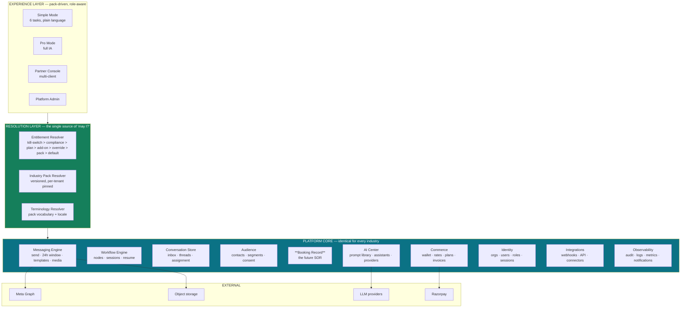

# SendAnjal Platform v2 — Executive Brief

**Founding-architect assessment · 2026-07-30 · design only, no implementation**

> **Deliverables 1 (Product Vision) and 20 (Success Metrics) live here. The other 18 are
> mapped in [README.md](README.md).**

---

## 1. Product Vision

> **SendAnjal is the operating system for how Indian businesses talk to their customers on
> WhatsApp — one messaging engine, many industries, zero technical skill required.**

Three sentences of strategy:

1. **We are the carrier, not the app.** SendAnjal is a Meta Tech Provider. The margin comes
   from routing conversations at a markup on Meta's wholesale rate. Every product decision
   should increase messages routed per tenant or the margin per message.
2. **Industry knowledge is content, not code.** A hospital and a real-estate broker run the
   *same* engine. What differs is the prompt library, the template library, the workflow
   presets, the dashboard, and the words on screen — all data, all editable by a
   non-engineer, all versioned.
3. **The product's job is to make a 45-year-old shop owner in Coimbatore look like they
   have a marketing team.** Not to expose a workflow builder.

### The 5-year arc

| Horizon | What SendAnjal is | Moat |
|---|---|---|
| Today | A WhatsApp campaign + automation tool with 6 industry content packs | BSP margin |
| Year 1 | A verticalized messaging platform: packs, entitlements, seats, AI Center | Content depth + switching cost of published templates |
| Year 2–3 | **Owns the booking and conversation record** for its verticals — the appointment, the enquiry, the order status | System-of-record lock-in |
| Year 4–5 | An industry-pack ecosystem where partners and agencies author packs | Network effects |

---

## 2. Eight assumptions I am challenging

You asked for this. These are ordered by how much money they cost if left unchallenged.

### ⚠️ Challenge 1 — 14 industries at launch will kill the product

This is the single most consequential assumption in the brief, and it is the classic
vertical-SaaS failure mode.

You named Shopify, HubSpot and Zoho. Consider what they actually did:

| Company | Launch scope | Expansion |
|---|---|---|
| **Shopify** | One vertical: online stores. Ruthlessly narrow for ~8 years | Then POS, then B2B, then Plus |
| **HubSpot** | One motion: inbound marketing for SMB. One persona | Then sales, then service, then CRM platform |
| **Zoho** | **Went horizontal-wide early** | And it is arguably their structural weakness: 50+ thin products, low ARPU per product, a reputation for breadth over depth |

**Zoho is the anti-pattern here, not the model.** If you launch 14 industries you will ship
14 shallow content packs, 14 sets of support expectations, 14 sales narratives, and 14
different definitions of "done" — with one team.

**Concretely, the cost:** each industry needs ~12 quality artifacts (flows, templates,
prompts), industry vocabulary, a dashboard, a sales narrative, and at least one reference
customer. At a genuinely good pace that is 3–4 weeks per industry *including* the reference
customer. Fourteen industries is a year of work that produces no depth in any one market —
and depth is what lets you charge more than ₹1,999/month.

**Recommendation: 3 launch verticals, 3 fast-follow, 3 deferred-pending-integrations,
3 declined, 1 reframed.** See §3.

### ⚠️ Challenge 2 — this is not Vertical SaaS, and the name matters

**Vertical SaaS owns the industry's system of record.** Toast owns the restaurant's orders.
Veeva owns the pharma rep's call record. Procore owns the construction project.

What you are describing is a **horizontal messaging engine with a vertical experience
layer** — sometimes called verticalized horizontal SaaS. That is a perfectly good business
and probably the right one. But naming it correctly changes three decisions:

| If you believe… | Then… |
|---|---|
| "We are Vertical SaaS" | You will over-invest in industry features and under-invest in the engine, and be disappointed by pricing power |
| "We are a verticalized horizontal engine" | You invest in the engine + content system, price on volume + seats, and accept that your moat is margin and content, not workflow lock-in |

**And it tells you the upgrade path.** To become *actual* vertical SaaS you must own a
record the business runs on. The cheapest one available to you is **the booking**. That
reframes the appointment-persistence work from "a missing feature" to **"the first step of
becoming a defensible vertical platform."** It should be prioritised accordingly.

### ⚠️ Challenge 3 — "Individual WhatsApp Business users" is not a market you can serve

Individual users are on the **WhatsApp Business App** (free, phone-based). They do not need
and cannot use a BSP. To serve them you would need them to migrate to the API, give up the
app UX, verify a business, and pay — for a use case the free app already covers.

**Recommendation: decline this segment explicitly.** It is a support-cost sink with near-zero
willingness to pay, and serving it would drag the product toward a consumer UX that
conflicts with every other persona.

### ⚠️ Challenge 4 — Marketing agencies are a *channel*, not a vertical

An agency does not want an industry pack. An agency wants to manage 40 client accounts,
white-label the UI, get consolidated billing, and take a margin. That is a **reseller /
partner architecture** — parent-child tenancy, delegated admin, aggregated wallets — which
is categorically different from a content pack.

**Recommendation: build a Partner Program (parent-tenant model), not an "Agency industry
pack."** And build it *after* multi-seat RBAC, because it is a generalisation of it. In
India, agencies are plausibly your highest-leverage distribution channel — which is exactly
why it deserves its own architecture rather than being mislabelled.

### ⚠️ Challenge 5 — Manufacturing, Logistics and Finance are poor fits *as messaging-led products*

| Industry | Why WhatsApp-led fails | What would actually be needed |
|---|---|---|
| **Manufacturing** | RFQ→quote→order lives in ERP and email. WhatsApp is peripheral chatter | ERP integration; long multi-turn B2B threads; document exchange |
| **Logistics** | The value is *tracking data*, and WhatsApp is a notification sink. Low ARPU, high integration cost per customer | A tracking-system integration platform + inbound media (proof-of-delivery photos) |
| **Finance / NBFC** | RBI-regulated; every template needs compliance review; mis-selling liability | A compliance workflow, audit-grade logging, and legal review capacity |

These are not "later packs". They are **different products that happen to use WhatsApp.**
Attempting them in year 1 buys you enterprise sales cycles you cannot yet support.

### ⚠️ Challenge 6 — "Hospitals" and "Clinics" are two different companies

You listed them separately, which is right, but the brief then treats them as one pack.

| | Clinic / Diagnostic centre | Hospital |
|---|---|---|
| Buyer | Owner-doctor or practice manager | IT committee + procurement |
| Sales cycle | Days | 6–18 months |
| Requirements | Appointments, reminders, reports-ready | HIS/EMR integration, SSO, DPDP DPA, security review, audit, on-prem questions |
| ARPU | ₹2–5k/mo | ₹50k+/mo |
| Your readiness | ✅ High | 🔴 None (no SSO, no MFA, no RBAC, no DPA, no SOC 2) |

**Recommendation: launch "Clinics & Diagnostics". Defer "Hospitals" until RBAC, audit, and a
DPDP package exist.** They are on the roadmap as an *enterprise* motion, not a pack.

### ⚠️ Challenge 7 — three configuration systems will collapse under their own weight

The brief asks for **feature flags**, **subscription-driven capabilities**, and **industry
packs** — and the codebase already has **tier gating** (`tierAllows`) and `is_active`
columns. That is four overlapping mechanisms answering one question: *"may this tenant do X
right now?"*

Left unresolved, you get the failure mode where nobody can explain why a customer can't see
a button.

**Recommendation: ONE Entitlement Resolver with a published precedence order.** Design in
[04-ENTITLEMENTS.md](04-ENTITLEMENTS.md). The precedence that matters most:

```
platform kill-switch  >  COMPLIANCE POLICY  >  plan  >  add-on  >  tenant override  >  pack default  >  global default
```

**Compliance policy must outrank plan entitlement.** A hospital on the top plan still must
not have patient message text sent to an LLM without explicit opt-in. If plan beats
compliance, you will sell your way into a DPDP breach.

### ⚠️ Challenge 8 — a Marketplace is 2+ years premature

A marketplace needs supply (third-party builders) and demand (tenants who will pay for
add-ons). You have neither, and no partner has an incentive to build for a platform with no
installed base.

**Recommendation: build the precursor — a versioned Industry Pack Registry** with the same
data contracts an external author would use. Then internal packs, then partner-authored
packs (agencies first, since they already have industry expertise), then a public
marketplace if the numbers justify it. Renaming "Marketplace" to "Pack Registry" in the
roadmap prevents a year of misdirected effort.

### One more, unprompted but important

**⚠️ You cannot build v2 on top of v1's current state.** Doc
[21-CHANGE-IMPACT-ANALYSIS.md](../architecture/21-CHANGE-IMPACT-ANALYSIS.md) documents a
Critical vulnerability (any authenticated tenant — and with `DEMO_AUTO_LOGIN=true`, any
anonymous visitor — can send WhatsApp messages as any other business using that business's
decrypted credentials), 19 tables the code queries that do not exist, and zero RLS policies.

**Phase 0 of this blueprint is that remediation.** It is one week for the critical items and
four for the foundation. Designing v2 while that is open is how you ship the same bugs at
14× the surface area.

---

## 3. Recommended vertical portfolio

| Tier | Industries | Why | Timing |
|---|---|---|---|
| **T1 — Launch** | **Clinics & Diagnostics** · **Retail / D2C Commerce** · **Real Estate** | Highest WhatsApp-centrality × willingness to pay × existing seeded content. Three different economic shapes (recurring reminders / high volume / high ARPU) which stress-tests the engine properly | 0–6 mo |
| **T2 — Fast follow** | **Restaurants** · **Salon & Fitness** · **Education (schools + coaching)** | Same booking engine, proven by T1. Education needs `paymentLinkNode` first | 6–12 mo |
| **T3 — Needs an integration platform** | **Travel** · **Insurance** · **Logistics** | All three need external system data (PNR, policy, tracking). Gate on an Integrations module | 12–24 mo |
| **Declined** | **Manufacturing** · **Finance/NBFC** · **Individual WhatsApp Business users** | Wrong product shape, wrong regulatory load, or no willingness to pay | — |
| **Reframed** | **Marketing Agencies** → **Partner Program** · **Hospitals** → **Enterprise motion** | Architecture, not content | 12–18 mo |

### Why these three at launch

| Vertical | Killer workflow | Economic shape | Existing assets |
|---|---|---|---|
| **Clinics & Diagnostics** | Appointment → confirm → 24h/2h reminder → report-ready doorbell | Predictable recurring UTILITY volume; low churn (bookings are operational) | 12 seeded artifacts |
| **Retail / D2C** | Order confirm → shipping → COD confirm → abandoned cart → "where's my order" | **Highest message volume per tenant** = highest gross margin contribution | 13 seeded artifacts |
| **Real Estate** | Enquiry → budget/purpose/timeline qualification → site visit → nurture | **Highest ARPU** — a broker will pay ₹10k/mo for qualified leads | 11 seeded artifacts |

Together they exercise every engine capability (recurring reminders, high-volume
transactional, lead qualification), so the platform hardens correctly. Fourteen shallow
packs would exercise none of them deeply.

---

## 4. Target architecture in one diagram



**The invariant:** nothing in PLATFORM CORE may branch on industry. Every industry
difference resolves in the RESOLUTION layer and is expressed as data. This is testable —
see the CI gate proposed in [05-INDUSTRY-PACKS.md](05-INDUSTRY-PACKS.md).

---

## 5. What to keep from v1

Discovery ([docs/architecture](../architecture/README.md)) found the hardest-to-build parts
are already correct. **Do not rewrite these:**

| Asset | Why it stays |
|---|---|
| `lib/billing/*` — reserve/confirm, integer paise, triple idempotency | Enterprise-grade. Extend, never replace |
| `lib/ai/service.ts` — one governed `runTask` path | Exactly the right shape for the AI Center. Grows into it |
| `lib/queue/index.ts` — swappable driver | Durability is a config change |
| Webhook integrity — HMAC, `processed_events`, persist-then-enqueue | Production-grade |
| `lib/verticals/*` — packs as data, jargon blocklist, seed-time validation | **The v2 pack system is a generalisation of this, not a replacement** |
| `app/globals.css` design tokens — two palettes | Keep. Redesign the components, not the tokens |
| `meta_rates` / `plan_tiers` / `platform_settings` config-as-data | The entitlement engine extends this pattern |

**Roughly 60% of the v2 backend already exists and is good.** The work is (a) remediation,
(b) generalising verticals → packs, (c) entitlements, (d) identity/RBAC, (e) the frontend.

---

## 6. Success Metrics *(Deliverable 20)*

Metrics chosen so that **no metric can be improved by shipping shallow breadth.**

### North Star

> **Billable conversations routed per active tenant per month.**

It rises only when a tenant genuinely runs their customer communication on SendAnjal. It cannot
be gamed by adding industries, features, or seats.

### Activation & time-to-value

| Metric | Definition | Target |
|---|---|---|
| **TTFM** | Signup → first message delivered to a real customer | **< 30 min** (today: unmeasured; ESU is the blocker) |
| Pack activation | % of provisioned tenants who publish ≥1 pack artifact within 7 days | > 60% |
| Guided-onboarding completion | % completing number + contacts + first template | > 70% |
| Time-to-first-automation | Signup → first active flow | < 3 days |

### Engagement & retention

| Metric | Target |
|---|---|
| Weekly active tenants / total paying | > 75% |
| Messages per active tenant per month | Growing MoM; segment by pack |
| Inbox DAU per tenant (seats using it) | > 1.5 |
| Logo churn (monthly) | < 2.5% |
| **Net Dollar Retention** | > 115% (wallet top-ups + seats + add-ons) |

### Unit economics — the ones that decide whether this is a business

| Metric | Definition | Target |
|---|---|---|
| **Gross margin per message** | `(charged − wholesale) / charged` | > 20% blended |
| **AI margin** | `(credits_charged × credit_price − raw_cost_paise) / credits_charged×price` | > 60% |
| Wallet breakage | Expired unused credits / credits sold | Track; do not optimise (customer-hostile) |
| CAC payback | | < 6 months |
| Support tickets per tenant per month | The breadth-discipline metric | **< 0.4** |
| Margin leak incidents | Sends priced from the legacy fallback instead of `meta_rates` | **0** |

### Platform health — gates on shipping

| Metric | Target | Why |
|---|---|---|
| **Cross-tenant isolation test suite** | **100% pass, blocking merge** | CRIT-1 must never recur |
| Meta 131047 rate (window violations) | < 0.1% of sends | Quality-rating protection |
| Number quality rating GREEN | > 95% of tenant numbers | BSP obligation |
| Delivery rate | > 97% | |
| Webhook processing p95 | < 500 ms to 200-ack | Meta retry avoidance |
| Token-expiry-caused outages | **0** | Today: no rotation job exists |
| Flow resume SLA | Scheduled step fires within 2 min of `resume_at` | The multi-step promise |
| Unresolved P0 security findings | **0** | |

### Pack-system health — proves the architecture works

| Metric | Target | Why it matters |
|---|---|---|
| **Code changes required to ship a new pack** | **0** | The core architectural claim. Measure it every time |
| Time for a non-engineer to author a pack | < 1 day | |
| `industry_branch_lint` violations in core | **0, CI-blocking** | No `if (vertical === …)` in PLATFORM CORE |
| Pack artifact adoption | % of seeded artifacts activated per tenant | Tells you which content is worthless |

### Anti-metrics — explicitly *not* goals

| Do not optimise | Because |
|---|---|
| Number of industries supported | Rewards shallow breadth |
| Number of features shipped | Rewards surface over depth |
| Total registered tenants | Rewards signups over activation |
| Number of prompts in the library | Rewards volume over quality |

---

## 7. The one-page recommendation

| Decision | Recommendation |
|---|---|
| **Positioning** | Verticalized horizontal engine. Path to true vertical SaaS = own the booking record |
| **Launch scope** | 3 verticals: Clinics & Diagnostics · Retail/D2C · Real Estate |
| **Decline** | Manufacturing · Finance/NBFC · Individual WhatsApp Business users |
| **Reframe** | Marketing agencies → Partner Program · Hospitals → Enterprise motion · Marketplace → Pack Registry |
| **Architecture** | One Entitlement Resolver, compliance above plan. Zero industry branching in core, CI-enforced |
| **Tenancy** | Introduce `organizations` as a **parent** of users; do not replace `user_id` in one step |
| **First SOR** | Generic `bookings` table driven by pack `BookingContext` — not a hospital-specific `appointments` table |
| **Sequence** | **Phase 0 = remediation** (1 week critical + 3 weeks foundation). Then packs, entitlements, identity, frontend |
| **Do not start with** | UI redesign, marketplace, 14 packs, or hospital enterprise sales |

**Complexity: High · Risk: High until Phase 0 completes · Confidence: Medium-High (82%)** —
architecture and current-state facts are High; market and competitor judgements are
Medium and flagged for verification in [01-MARKET-PERSONAS.md](01-MARKET-PERSONAS.md).
