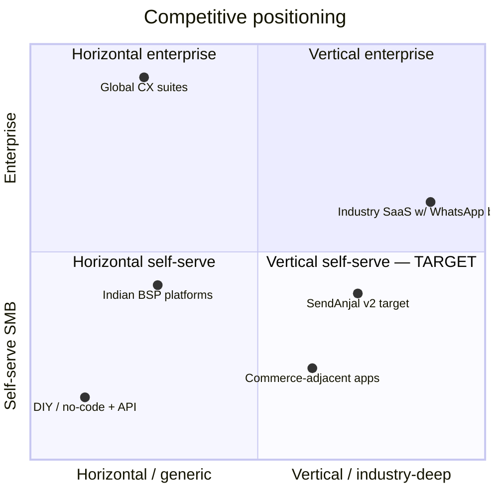

# 01 — Market Analysis, Competitor Analysis & User Personas

> **Deliverables 2 (Market Analysis), 3 (Competitor Analysis), 4 (User Personas).**

## ⚠️ Evidence standard for this document

| Section | Basis | Confidence |
|---|---|---|
| Market **structure** and segment logic | First-principles reasoning + the code/pricing facts verified in discovery | Medium-High |
| Market **size numbers** | **Deliberately omitted.** I will not invent TAM/SAM figures | — |
| Competitor **strategic positions** | General knowledge, cutoff **May 2026**, no live research this session | **Medium — verify before use in a board deck or fundraise** |
| Competitor **pricing / feature specifics** | **Deliberately omitted** | — |
| Personas | Inferred from the product surface, the `.claude/skills/onboarding-signup` guidance ("audience is NON-TECHNICAL clients"), and the seeded vertical content | Medium |

**If you need this hardened, ask me to run live research** — I can verify competitor
positioning, pricing tiers, and BSP landscape and revise. I have not done so unprompted.

---

## 1. Market Analysis

### 1.1 Why WhatsApp, and why India

The structural facts that make this a business:

| Fact | Consequence for SendAnjal |
|---|---|
| WhatsApp is the default communication channel for Indian consumers — not an app they check, the app they live in | Open/read rates are structurally higher than email or SMS. This is the entire value proposition to an SMB |
| Meta prices conversations wholesale, per category, per region | **A markup business exists.** This is SendAnjal's actual product |
| Meta requires a BSP/Tech Provider for API access | There is a mandatory intermediary layer, and SendAnjal can be it |
| Indian SMBs are prepaid-native (mobile recharge, UPI) | The prepaid wallet is the *correct* commercial model, not a compromise |
| Indian SMBs are largely non-technical and price-sensitive | Guided setup and plain language are features, not polish |
| DPDP Act now governs personal data | Hospitals/schools/finance carry real compliance load |

### 1.2 Segment structure

The honest segmentation is by **who signs and how they buy**, not by industry name.

| Segment | Buyer | Decision speed | ARPU shape | SendAnjal fit |
|---|---|---|---|---|
| **Micro (1–5 staff)** — local shop, salon, single clinic | Owner, on a phone | Minutes | ₹500–2,000/mo, low volume | 🟠 High intent, **but** see §1.3 — Model C blocker |
| **SMB (5–50)** — D2C brand, clinic chain, brokerage, restaurant group | Owner or marketing lead | Days–weeks | ₹2,000–15,000/mo + wallet | 🟢 **The core market** |
| **Mid-market (50–500)** — hospital, school group, NBFC | Committee + procurement | 3–12 months | ₹50k+/mo | 🔴 Not ready (no RBAC/SSO/audit/DPA) |
| **Agencies** | Agency owner | Weeks | Margin-share across N clients | 🟢 **Highest leverage channel — needs parent-tenant architecture** |
| **Individual WhatsApp Business App users** | Individual | — | ~₹0 | 🔴 **Decline** — free app already serves them; no API need |

### 1.3 The commercial contradiction you must resolve

Verified from live `plan_tiers` and `lib/billing/tiers.ts:16-18`:

| Tier | Price | Model | Can it actually send? |
|---|---|---|---|
| Starter | ₹999/mo | C — shared platform WABA | 🔴 **No.** Requires a platform-owned number pool that does not exist |
| Growth | ₹1,999/mo | B — own WABA, managed billing | ✅ Yes |
| Enterprise | ₹4,999/mo | A — own WABA, client pays Meta | ✅ Yes |

**The tier designed for the largest segment (micro/SMB) is the one that cannot send.** Every
micro-business must therefore complete Meta Embedded Signup with their own WABA — which is
precisely the technical complexity the product exists to remove, and the ESU token cache is
per-process so it fails intermittently on Vercel.

**This is the #1 growth blocker and it is not a marketing problem.** Either build the shared
number pool, or reposition Starter as an onboarding-assisted tier at a higher price and stop
targeting micro self-serve.

### 1.4 Where the margin actually comes from

Derived from live `meta_rates` × `plan_tiers` × `platform_settings` (buffer 1000 bps):

| Category | Wholesale | Growth price (28% uplift) | Margin/msg |
|---|---:|---:|---:|
| MARKETING | 86p | 110p | 24p |
| UTILITY | 13p | 17p | 4p |
| AUTHENTICATION | 15p | 19p | 4p |
| SERVICE | 0p | 0p | 0 |

**Strategic consequence that should drive the roadmap:** a MARKETING message earns **6× the
absolute margin** of a UTILITY message. But UTILITY (reminders, order updates, OTP) is what
makes a tenant *operationally dependent* on you and drives retention.

| Vertical | Dominant category | Implication |
|---|---|---|
| Retail / D2C | Mixed — high UTILITY volume + MARKETING campaigns | **Best blended economics.** High volume × both categories |
| Clinics | Almost entirely UTILITY | Low margin/msg, **very low churn**. A retention play |
| Real Estate | MARKETING-heavy | High margin/msg, higher churn. A revenue play |

That is the real argument for the three launch verticals: one retention anchor, one revenue
driver, one volume engine.

### 1.5 Market risks

| Risk | Severity | Note |
|---|---|---|
| **Meta changes wholesale pricing** | 🔴 High | Margin is a spread. `meta_rates` is editable with no deploy ✅, but there is **no staleness alert** — a rate rise you don't notice means selling below cost silently |
| **Meta disintermediates BSPs** | 🟠 Med | Structural, unhedgeable. Mitigation: own the booking record so you're not only a pipe |
| **Meta policy / quality-rating enforcement tightens** | 🟠 Med | You are accountable as BSP for tenants' sending behaviour. Today the 24h window is enforced on 2 of 7 send paths |
| **Price war among Indian BSPs** | 🟠 Med | Margin compresses. Defence = content depth + SOR, not price |
| **DPDP enforcement** | 🟠 Med | Currently no DPA, no retention policy, no erasure route, and inbound customer message text is sent to an LLM with no tenant opt-out |
| Race to the bottom on micro-SMB | Med | Reinforces the case against chasing individual users |

---

## 2. Competitor Analysis

> Structural, not numeric. **Verify specifics before external use.**

### 2.1 The five competitor categories



| # | Category | Strategic position | Where SendAnjal wins | Where SendAnjal loses |
|---|---|---|---|---|
| **1** | **Global CX / conversation suites** (Twilio-class, Infobip-class, omnichannel CPaaS) | Multi-channel, enterprise-grade, developer-first | Price for India; WhatsApp-only depth; non-technical UX; industry content | Scale, reliability track record, compliance certifications, multi-channel, global support |
| **2** | **Indian BSP platforms** (the direct competitors — WhatsApp-first, India-priced) | Same business model, often further along on volume | **Industry packs + AI Center are genuine differentiation if executed with depth.** Most competitors in this category are horizontal | Feature parity in the messaging core; installed base; brand; often better onboarding today |
| **3** | **Commerce-adjacent apps** (Shopify/WooCommerce WhatsApp plugins, abandoned-cart tools) | Deeply integrated into one platform's data | Multi-industry; own the conversation, not just cart events | **In retail/D2C specifically they beat you on integration depth** — they already have order data. You do not |
| **4** | **DIY / no-code** (direct Meta API + n8n/Zapier/Make) | Cheapest; for technical users | Everything: no technical skill, billing, compliance, content | Price for technical buyers. Agencies may build on Meta directly |
| **5** | **Industry SaaS with a WhatsApp bolt-on** (clinic-management, school-ERP, CRM with WhatsApp) | **Already owns the system of record** | Messaging depth, deliverability, template management, AI content | 🔴 **The most dangerous category.** They own the appointment/fee/order record. WhatsApp is a feature for them, and features beat products for an existing customer |

### 2.2 The competitive insight that should shape strategy

**Category 5 is the existential threat, and Challenge 2 in the brief is the answer.**

A clinic-management system that adds WhatsApp reminders wins the clinic, because it already
holds the appointment. SendAnjal sends messages *about* a record it does not own.

Two viable responses:

| Response | Description | Assessment |
|---|---|---|
| **A — Own the record** | Become the booking system for verticals where the incumbent SOR is weak or absent (small clinics on paper/WhatsApp, brokers in spreadsheets, salons in notebooks) | ✅ **Recommended.** This is why generic `bookings` is strategic, not cosmetic |
| **B — Be the best pipe** | Integrate with every SOR; win on deliverability, cost, and content | 🟡 Viable but commoditising; ends in a price war |

**A and B are not exclusive** — do A for micro/SMB (no incumbent to displace) and B for
mid-market (integrate with their HIS/ERP). But A must come first, because it is what makes
you more than a reseller of Meta conversations.

### 2.3 Honest differentiation audit

What can SendAnjal actually claim today, verified against the code?

| Claimed differentiator | Real? | Evidence |
|---|---|---|
| Industry packs, data-driven, zero-code to add | ✅ **Real and rare** | 6 packs, 58 artifacts live; `lib/verticals/types.ts:4-7` rule enforced |
| Governed AI with per-action credit metering | ✅ **Real** | `lib/ai/service.ts` — one path, tier-gated, debit-on-success, always-logged |
| Prepaid wallet with confirm-on-delivery billing | ✅ **Real and genuinely better than most** | Reserve → settle on Meta status; unsent = uncharged |
| Non-technical UX | 🟡 **Partly** | Jargon blocklist in pack validation ✅; but 0 `htmlFor`, no guided onboarding, 7 broken screens |
| Multi-step nurture / reminder sequences | 🔴 **Not yet** | Only the first reply fires; `resume_at` is written and never read |
| Multi-seat / team collaboration | 🔴 **No** | `team_members.role` stored, never enforced; invited members cannot log in |
| Enterprise-ready | 🔴 **No** | No RBAC/SSO/MFA/audit-of-financials/DPA/SOC 2 |
| CRM, catalog, ads ROI | 🔴 **No** | Tables do not exist in production |

**Two of the three real differentiators (packs, AI governance) are invisible to a buyer
today** because the UI doesn't surface them and the content is thin. That is a marketing and
depth problem, not an engineering one — and it is fixable faster than the engineering items.

---

## 3. User Personas

Ten personas as requested. Each includes the **design constraint** they impose — the thing
that must be true in the product for this person to succeed.

---

### P1 · Dr. Anjali — Clinic owner-doctor *(T1 launch persona)*

| | |
|---|---|
| **Context** | 2-doctor clinic, ~40 patients/day, one receptionist, no IT staff. Appointments in a paper register and a personal WhatsApp |
| **Goals** | Reduce no-shows (the single biggest revenue leak) · stop the reception phone ringing all day · look professional |
| **Pain points** | 25–30% no-show rate · reception spends hours confirming by phone · personal number blurs work/life · does not know what a "template" is or why Meta must approve it |
| **Daily tasks** | Review today's appointments · confirm tomorrow's · answer "are reports ready?" · handle walk-in enquiries |
| **Required features** | Appointment booking flow · **multi-step reminders (24h/2h)** · report-ready doorbell (notify, never disclose) · a today-view dashboard · pre-approved templates |
| **UX considerations** | Mobile-first (she uses a phone between patients) · zero WhatsApp jargon · "Send reminder" not "Execute UTILITY template" · **must never be asked to build a flow** |
| **Design constraint** | 🔴 **Multi-step flows must actually fire.** Her entire value proposition is the 2-touch reminder. Today it does not work |
| **Compliance constraint** | 🔴 Patient message text must not reach an LLM without explicit opt-in (DPDP) |

---

### P2 · Dr. Ramesh — Consulting doctor (a *user*, not the buyer)

| | |
|---|---|
| **Context** | Visits 3 clinics weekly. Cares about his schedule, not the platform |
| **Goals** | Know today's patient list · avoid double-booking · not learn new software |
| **Pain points** | Gets his schedule as a screenshot on WhatsApp · no visibility into cancellations |
| **Daily tasks** | Check schedule. That is genuinely all |
| **Required features** | Read-only day view · optional daily digest to *his* WhatsApp |
| **UX considerations** | **He may never log in.** The product should reach him *through* WhatsApp |
| **Design constraint** | 🟠 Argues for **notification-only participants** — a person who receives value with no account. Do not force a seat licence on him |

---

### P3 · Priya — Reception / front-desk staff *(the highest-frequency user in the product)*

| | |
|---|---|
| **Context** | Operates the platform 6–8 hours/day. Moderate computer skill. High interruption rate |
| **Goals** | Clear the inbox · book without errors · not get blamed for a missed message |
| **Pain points** | Context-switching between phone, register, and screen · **24h window rules are invisible until a send fails** · cannot tell which messages are unanswered |
| **Daily tasks** | Reply to inbound · book/reschedule · send reminders · escalate to the doctor |
| **Required features** | Fast inbox with keyboard shortcuts · **visible window countdown** · quick-reply canned responses · assignment · booking from the conversation |
| **UX considerations** | **Density over beauty.** She wants many conversations on screen. Undo on destructive actions. Never lose a typed draft |
| **Design constraint** | 🔴 **Needs multi-seat with her own login and an `agent` role.** Today she would share the owner's credentials — an audit and security failure. Also needs the 24h window surfaced *before* she types, not as a 403 after |

---

### P4 · Suresh — Retail shop owner *(T1 launch persona)*

| | |
|---|---|
| **Context** | Kirana/apparel shop, 1,500 customers in his phone. Runs the shop himself |
| **Goals** | Bring customers back · announce offers without paying for print · take orders on WhatsApp |
| **Pain points** | Broadcast lists cap at 256 and look spammy · no idea who read anything · fears being blocked · **has no idea marketing messages cost 6× utility ones** |
| **Daily tasks** | Post offers · confirm orders · chase payments |
| **Required features** | Contact import from phone · one-tap campaign from a template · **cost preview before sending** · read/delivery counts |
| **UX considerations** | **Show cost in rupees before he presses send**, and show it as information not alarm (the `--cost-note` amber token already exists for this) · Hindi/Tamil UI · works on a ₹8,000 Android phone |
| **Design constraint** | 🟠 **Cost transparency is a retention feature.** A surprise wallet drain is the fastest path to churn. Also: he is exactly the buyer Starter targets — and Starter cannot send |

---

### P5 · Farhan — Restaurant owner *(T2)*

| | |
|---|---|
| **Context** | 60-cover restaurant, 2 outlets. Peak-hour chaos |
| **Goals** | Fill tables on slow nights · take reservations without a phone line · handle delivery-order status |
| **Pain points** | Reservation no-shows · staff turnover means retraining · no time during service |
| **Daily tasks** | Confirm reservations · post the day's specials · handle complaints |
| **Required features** | Table booking flow · waitlist · slow-night campaign · menu-on-demand |
| **UX considerations** | Must be operable in <2 min between covers · scheduled sends (he plans at midnight) |
| **Design constraint** | 🟡 Needs **scheduling** and **staff-proof simplicity** — high turnover means the UI must be learnable in one shift |

---

### P6 · Nikhil — Marketing agency owner *(the channel, not a vertical)*

| | |
|---|---|
| **Context** | Manages WhatsApp for 25 SMB clients across 5 industries |
| **Goals** | Manage all clients from one screen · white-label · take a margin · prove ROI in client reports |
| **Pain points** | Logging into 25 accounts · no consolidated billing · cannot reuse a winning template across clients · client churn when they see the vendor's brand |
| **Daily tasks** | Client campaigns · reports · onboarding new clients · handling approvals |
| **Required features** | 🔴 **Parent-tenant console** · client switcher · cross-client template library · consolidated wallet + per-client cost attribution · white-label domain/branding · client-facing report export |
| **UX considerations** | Power-user density. Bulk operations. API access. He is technical enough to leave for the raw Meta API if you frustrate him |
| **Design constraint** | 🔴 **This is a distinct architecture (parent-child tenancy + delegated admin + aggregated billing), not a content pack.** It is a generalisation of multi-seat RBAC and must come after it. Highest distribution leverage in the Indian market |

---

### P7 · Meera — Real-estate broker *(T1 launch persona, highest ARPU)*

| | |
|---|---|
| **Context** | 6-agent brokerage. Leads from portals, Facebook ads, walk-ins |
| **Goals** | Qualify leads fast (budget/purpose/timeline) · stop wasting agent time on tyre-kickers · nurture 6-month buying cycles |
| **Pain points** | Leads go cold in hours · agents forget follow-ups · no record of who said what · lead source attribution is guesswork |
| **Daily tasks** | Distribute leads to agents · follow up · schedule site visits · report to developers |
| **Required features** | Qualification flow with branching · **long nurture sequences** · lead assignment to agents · site-visit booking · source attribution |
| **UX considerations** | Pipeline view (she thinks in stages) · mobile for agents in the field · notifications that survive a noisy phone |
| **Design constraint** | 🔴 Needs **multi-seat with assignment** + **multi-step nurture** + **a lead/deal record**. `conversations.assigned_to` exists with an index and no code path. This persona is worth ₹10k+/mo and is currently unservable |

---

### P8 · Lakshmi — Non-technical local shop user *(the hardest UX test)*

| | |
|---|---|
| **Context** | Tailoring shop. Uses WhatsApp and YouTube. Has never used a dashboard. Prefers Tamil |
| **Goals** | Tell customers their order is ready. That is the whole job |
| **Pain points** | Every SaaS UI she has seen is in English and assumes concepts she does not have · afraid of pressing the wrong thing and being charged |
| **Daily tasks** | One task: "order ready → tell customer" |
| **Required features** | **One screen, one button.** Pick customer → pick "order ready" → send. Nothing else visible |
| **UX considerations** | 🔴 **Simple Mode must exist as a first-class shell**, not a stripped Pro Mode · Tamil/Hindi throughout · voice input · confirm-before-charge · no empty states that look broken |
| **Design constraint** | 🔴 **She and P6 (Nikhil) cannot share one UI.** This is the strongest argument for the **dual-shell** design in [07-UX-DESIGN.md](07-UX-DESIGN.md). Serving her with a simplified Pro Mode always fails, because the concepts leak through |

---

### P9 · Vikram — Enterprise IT / hospital CIO *(gated persona — do not sell yet)*

| | |
|---|---|
| **Context** | 400-bed hospital. HIS + EMR. Answers to a compliance committee |
| **Goals** | Reduce no-shows without a new data-protection liability · integrate with HIS · pass an internal security review |
| **Pain points** | Vendor risk assessments · DPDP accountability for patient data · staff access control · audit requirements |
| **Daily tasks** | Not a daily user. He is a **gatekeeper** |
| **Required features** | 🔴 SSO/SAML · MFA · granular RBAC · audit log export · DPA + data-processing register · retention & erasure controls · **per-tenant AI opt-out** · HIS integration · SLA + status page |
| **UX considerations** | He evaluates documents, not screens. Your security page is your product to him |
| **Design constraint** | 🔴 **Every single requirement above is missing today.** Verified: no `users.role`, no MFA, audit covers only ESU actions, no DPA, no erasure route, inbound patient text goes to an LLM with no opt-out. **Selling to him now would fail the security review and burn the reference.** Gate this persona behind Phase 3 |

---

### P10 · Internal platform administrator *(SendAnjal staff)*

| | |
|---|---|
| **Context** | Founder or ops staff. Controls COGS, margin, packs, and tenant configuration |
| **Goals** | Protect margin · provision tenants fast · diagnose issues without a database client |
| **Pain points** | 🔴 **No audit trail on any pricing, margin, or billing-mode change** · no margin dashboard despite `ai_usage_log` + `message_billing` holding every needed column · no way to answer "why is this tenant's send failing?" without SQL |
| **Daily tasks** | Rate updates · tenant provisioning · pack authoring · support escalations · margin review |
| **Required features** | Rate/markup editor **with audit** · margin dashboard · pack authoring + versioning · tenant impersonation (audited) · entitlement override UI · webhook replay · queue depth |
| **UX considerations** | Density and speed. Every destructive action confirmed and logged |
| **Design constraint** | 🔴 **Unlogged privileged pricing changes fail any financial-controls review.** `lib/audit.ts` exists and covers 10 ESU actions — extending it to financial mutations is ~20 lines and is a Phase 0 item |

---

### 3.1 Persona → capability matrix

| Capability | P1 Clinic | P2 Doctor | P3 Recep. | P4 Retail | P5 Rest. | P6 Agency | P7 Realty | P8 Micro | P9 Ent. | P10 Admin |
|---|:-:|:-:|:-:|:-:|:-:|:-:|:-:|:-:|:-:|:-:|
| Simple Mode shell | ○ | — | — | ● | ● | — | — | 🔴 | — | — |
| Pro Mode shell | ● | — | ● | ○ | ○ | ● | ● | — | ● | ● |
| Partner console | — | — | — | — | — | 🔴 | — | — | — | — |
| **Multi-seat + roles** | ● | ○ | 🔴 | — | ○ | 🔴 | 🔴 | — | 🔴 | — |
| **Multi-step flows** | 🔴 | — | ○ | ● | ● | ● | 🔴 | — | ● | — |
| **Booking record** | 🔴 | ● | 🔴 | — | 🔴 | ○ | 🔴 | — | ● | — |
| Inbox + assignment | ○ | — | 🔴 | ○ | ● | ● | ● | — | ● | — |
| Cost transparency | ● | — | ● | 🔴 | ● | ● | ● | 🔴 | ○ | ● |
| Campaigns | ○ | — | — | 🔴 | ● | 🔴 | ● | — | ○ | — |
| AI content assist | ● | — | ○ | ● | ● | 🔴 | ● | ○ | ○ | — |
| Localisation (hi/ta) | ● | — | ● | 🔴 | ● | — | ○ | 🔴 | — | — |
| **Per-tenant AI opt-out** | 🔴 | — | — | — | — | — | — | — | 🔴 | ● |
| SSO / MFA | — | — | — | — | — | ○ | — | — | 🔴 | ● |
| **Financial audit** | — | — | — | — | — | ● | — | — | 🔴 | 🔴 |
| API access | — | — | — | — | — | 🔴 | ○ | — | ● | — |

🔴 critical / ● important / ○ nice-to-have / — irrelevant

### 3.2 What the matrix reveals

Five capabilities are **critical for 3 or more personas** and none of them exists today:

| Rank | Capability | Critical for | Status |
|---:|---|---|---|
| 1 | **Multi-seat + roles** | P3, P6, P7, P9 | 🔴 `team_members.role` stored, never enforced |
| 2 | **Multi-step flows** | P1, P7 (+ important for 5 more) | 🔴 `resume_at` written, never read |
| 3 | **Booking record** | P1, P3, P5, P7 | 🔴 Demo `useState` only |
| 4 | **Cost transparency** | P4, P8 | 🟡 Tokens exist; not surfaced pre-send |
| 5 | **Simple Mode shell** | P8 (and it is the whole micro segment) | 🔴 Single dense shell only |

**This is the roadmap, derived from personas rather than asserted.** Note that none of the
top five is an industry pack — which independently confirms Challenge 1: breadth is not what
the personas need.

### 3.3 The two personas that must not share a UI

```
P8 Lakshmi  →  one screen, one button, Tamil, afraid of cost
P6 Nikhil   →  25 clients, bulk ops, API, white-label, density
```

No single information architecture serves both. Attempting it produces a UI that is too
complex for Lakshmi and too limited for Nikhil — which is a fair description of most SMB
SaaS. **Two shells over one core** is the design response, detailed in
[07-UX-DESIGN.md](07-UX-DESIGN.md).
