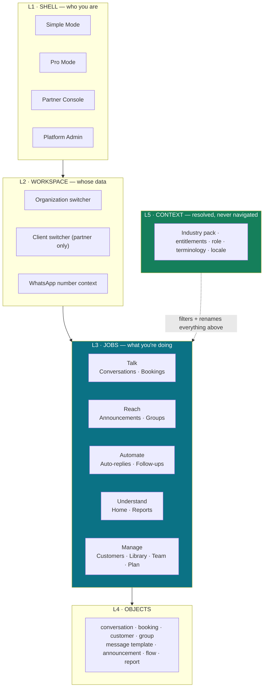
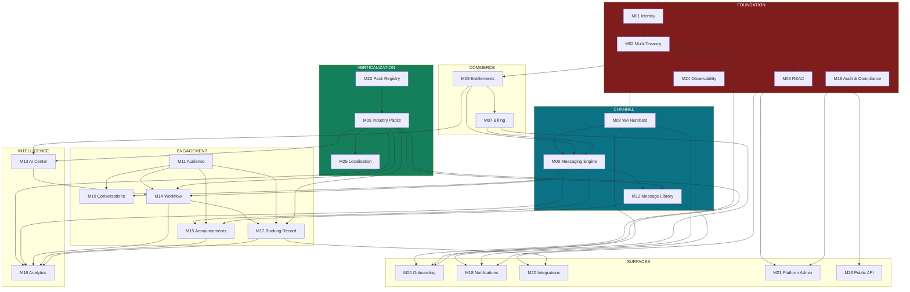

# 02 — Information Architecture, Navigation & Module Catalogue

> **Deliverables 5 (Information Architecture), 6 (Complete Module Catalogue),
> 12 (Navigation Structure).**

---

## 1. Information Architecture

### 1.1 The organising principle

Current IA is **feature-oriented**: 7 nav groups, 25 links, named after system objects
(Templates, Campaigns, Automation, Segments). It requires the user to already know how
WhatsApp messaging works.

Target IA is **job-oriented**: named after what the business is trying to do.

| Current (system language) | Target (business language) |
|---|---|
| Templates | Message Library |
| Campaigns | Announcements |
| Automation / Flows | Auto-Replies & Follow-ups |
| Segments | Customer Groups |
| Contacts | Customers |
| Inbox | Conversations |
| WhatsApp Numbers | My WhatsApp |
| Wallet / Billing | Balance & Plan |

**This is not cosmetic.** The `lib/verticals/validate.ts` jargon blocklist already bans
`webhook`, `payload`, `waba`, `api`, `endpoint`, `json`, `node`, `cron` from client-facing
copy. The IA should be held to the same standard the pack content already is — and today it
is not.

### 1.2 Five-layer IA



**L5 is the architectural key.** Pack, plan, role, and locale are *resolved*, never
*browsed*. A clinic never sees a "choose your industry" screen after onboarding — it sees
"Appointments" where a broker sees "Site Visits", because both are the same `booking` object
renamed by the terminology resolver.

### 1.3 Progressive disclosure ladder

The current product shows all 25 links to every user on day one. Target:

| Stage | Trigger | Nav items visible |
|---|---|---|
| **0 · Setup** | No number connected | 3 — Connect WhatsApp · Import Customers · Help |
| **1 · First value** | Number connected, 0 messages sent | 5 — + Send First Message · Conversations |
| **2 · Operating** | ≥1 message sent | 8 — + Announcements · Customers · Balance |
| **3 · Growing** | ≥100 messages or ≥7 days | 12 — + Auto-replies · Groups · Reports |
| **4 · Power** | Pro Mode or ≥2 seats | Full IA + API + Integrations |

Gated by **behaviour**, not plan. A Starter tenant who is genuinely operating gets stage 3;
an Enterprise tenant who hasn't connected a number gets stage 0. Plan gates *capability*;
behaviour gates *visibility*.

---

## 2. Navigation Structure

### 2.1 Simple Mode — P8 Lakshmi, P4 Suresh

Bottom tab bar on mobile, left rail on desktop. **Five destinations, maximum.**

```
┌─────────────────────────────────────┐
│  ॐ  Kumar Tailors        ₹1,240  ⚙ │   ← balance always visible
├─────────────────────────────────────┤
│                                     │
│   What do you want to do?           │
│                                     │
│   ┌───────────────────────────────┐ │
│   │ 📦  Tell a customer their     │ │  ← pack-provided
│   │     order is ready            │ │     top task
│   └───────────────────────────────┘ │
│   ┌───────────────────────────────┐ │
│   │ 📣  Announce an offer         │ │
│   └───────────────────────────────┘ │
│   ┌───────────────────────────────┐ │
│   │ 💬  3 customers waiting  ●    │ │  ← real unread count
│   └───────────────────────────────┘ │
│                                     │
├─────────────────────────────────────┤
│  🏠 Home  💬 Chats  👥 Customers  ⚙ │
└─────────────────────────────────────┘
```

Rules:
- **Verbs, not nouns.** "Tell a customer their order is ready", not "Send template".
- Top 3 tasks come from the **industry pack**, ordered by that pack's `sort_order`.
- Balance in the header, permanently. Cost shown *before* every send.
- No settings tree — one flat settings sheet.
- Never an empty state that looks broken; every empty state offers the next action.

### 2.2 Pro Mode — P1, P3, P5, P7

```
TALK
  Conversations              ← was "Inbox"
  Bookings                   ← pack-renamed: Appointments | Site Visits | Reservations
REACH
  Announcements              ← was "Campaigns"
  Customer Groups            ← was "Segments"
AUTOMATE
  Auto-Replies               ← simple keyword rules
  Follow-up Journeys         ← was "Automation flows"
UNDERSTAND
  Home
  Reports
MANAGE
  Customers
  Message Library            ← was "Templates"
  AI Center                  ▸ Prompt Library · Assistants · Credits
  Team
  Balance & Plan
  Settings                   ▸ Business · My WhatsApp · Integrations · API · Audit
```

**5 groups, 13 primary items** (down from 7 groups / 25 links). Every removed item either
had no backend (`Catalog`, `Ads ROI`, `CRM`) or is folded into a parent.

Changes from today's nav, and why:

| Change | Reason |
|---|---|
| "Ads ROI", "Catalog" removed | No backing tables in production |
| "CRM Pipeline" → a stage view inside Customers | `crm_*` tables absent; `contacts.crm_stage` exists |
| "Smart Segments" repointed | Nav currently links to the dead `/segments`; the live implementation is `/contacts/segments` |
| "Appointments" → "Bookings", pack-renamed | Generic record, industry vocabulary |
| Inbox badge | Currently **hardcoded to `3`** (`Sidebar.tsx:50`) — must read `conversations.unread_count` |
| AI Center promoted | It is a differentiator and is currently invisible |
| Audit surfaced | Required for P9/P10 and for financial controls |

### 2.3 Partner Console — P6 Nikhil

```
┌──────────────────────────────────────────────────────┐
│ Nikhil Digital        [All clients ▾]   ₹48,200  ⚙  │
├──────────────────────────────────────────────────────┤
│ CLIENTS (25)              spend  msgs  needs action  │
│  ● Sharma Clinic        ₹2,140  1,204   2 approvals  │
│  ● Kumar Tailors          ₹890    412   low balance  │
│  ○ Green Cafe             ₹210     98   ⚠ paused     │
├──────────────────────────────────────────────────────┤
│ SHARED LIBRARY   ·   REPORTS   ·   BILLING   ·   API │
└──────────────────────────────────────────────────────┘
```

Distinct because the unit of work is the **client**, not the conversation. Requires
parent-child tenancy, delegated admin, aggregated wallet with per-client attribution, and
white-label branding.

### 2.4 Shell selection

```
if (user.partner_org)               → Partner Console
else if (isPlatformAdmin(user))     → Admin (+ can impersonate, audited)
else if (org.ui_mode === 'simple')  → Simple Mode
else if (seats > 1 || plan.pro_ui)  → Pro Mode
else                                → Simple Mode          ← default
```

**Default is Simple.** Users graduate to Pro by a visible, reversible toggle. Defaulting to
Pro is how you lose P8 in the first session.

---

## 3. Complete Module Catalogue

25 modules. Each specifies purpose, responsibilities, dependencies, APIs, entities, screens,
and extensibility, plus its **current state** from discovery.

---

### M01 · Identity & Authentication

| | |
|---|---|
| **Purpose** | Establish *who* is making a request |
| **Responsibilities** | Registration · login (password, Google, later SSO) · session lifecycle · password reset · MFA · session revocation · device/session list |
| **Dependencies** | — (foundation) |
| **APIs** | `POST /auth/register` `/login` `/logout` `/refresh` · `GET /auth/me` · `POST /auth/password/{forgot,reset,change}` · `POST /auth/mfa/{enroll,verify}` · `GET /auth/sessions` · `DELETE /auth/sessions/:id` |
| **Entities** | `users` · `sessions` · `mfa_factors` · `password_reset_tokens` · `login_attempts` |
| **UI screens** | Login · Register · Forgot/Reset · MFA enrol · Active sessions |
| **Extensibility** | SSO/SAML/OIDC adapters · WebAuthn · magic link (well suited to P8) |
| **Current state** | 🟡 JWT + Google OAuth work. 🔴 Password reset is a `TODO` stub; no MFA; 7-day token with no revocation; login rate limit is per-process so ineffective |

---

### M02 · Multi-Tenancy & Organizations

| | |
|---|---|
| **Purpose** | Define the tenant boundary and enforce it |
| **Responsibilities** | Organization lifecycle · membership · tenant context resolution per request · parent-child (partner) hierarchy · isolation enforcement |
| **Dependencies** | M01 |
| **APIs** | `GET/PATCH /orgs/:id` · `GET /orgs/:id/members` · `POST /orgs/:id/members/invite` · `GET /me/orgs` · `POST /orgs/:id/switch` |
| **Entities** | `organizations` · `organization_members` · `organization_settings` · `organizations.parent_org_id` |
| **UI screens** | Org switcher · Org profile · Members |
| **Extensibility** | Multi-level partner hierarchies · per-org data residency |
| **Current state** | 🔴 **The central architectural debt.** `users.id` *is* the tenant. An org model exists in 12 code files and **zero deployed tables**. Zero RLS policies across 37 tables. One confirmed cross-tenant write, one Critical cross-tenant credential-use hole |

> **Design decision:** introduce `organizations` as a **parent of users**, not a replacement.
> Migration: create one org per existing user → backfill `organization_id` → dual-read →
> cut over. Never a big-bang re-key. See [08](08-GAP-MIGRATION-ROADMAP.md).

---

### M03 · Roles & Permissions (RBAC)

| | |
|---|---|
| **Purpose** | Decide *what* an authenticated identity may do |
| **Responsibilities** | Role definitions · permission catalogue · `can(actor, action, resource)` · delegated admin · scope narrowing for partners |
| **Dependencies** | M01, M02 |
| **APIs** | `GET /roles` · `GET /permissions` · `PATCH /orgs/:id/members/:uid/role` · `POST /authz/check` (internal) |
| **Entities** | `roles` · `permissions` · `role_permissions` · `organization_members.role` |
| **UI screens** | Team list with roles · Role editor (Enterprise) · Permission matrix |
| **Extensibility** | Custom roles · resource-level ACLs (per-number, per-group) · ABAC |
| **Current state** | 🔴 No `users.role`. Admin is an `ADMIN_EMAILS` env allowlist. `team_members.role` stored and never read; invited members **cannot log in**. Blocks P3, P6, P7, P9 |

---

### M04 · Tenant Onboarding

| | |
|---|---|
| **Purpose** | Get a business from signup to first delivered message in under 30 minutes |
| **Responsibilities** | Guided setup wizard · industry selection · WhatsApp connection (ESU) · contact import · first template · first send · progress tracking · resumability |
| **Dependencies** | M01, M02, M08, M09, M11, M20 |
| **APIs** | `GET /onboarding/state` · `POST /onboarding/steps/:key/complete` · `POST /onboarding/industry` · `POST /onboarding/skip` |
| **Entities** | `onboarding_progress` · `onboarding_steps` |
| **UI screens** | Welcome · Industry picker (with a first-class "Skip / not sure") · Connect WhatsApp · Import customers · First message · Success |
| **Extensibility** | Pack-specific onboarding steps · concierge/assisted onboarding for high-touch tiers |
| **Current state** | 🔴 No guided onboarding exists. `users.onboarding_path` column present, unused. Vertical assignment is **admin-only** — friction in exactly the funnel verticalization should improve. ESU token cache is per-process ⇒ intermittent failure at the worst moment |

---

### M05 · Industry Packs

| | |
|---|---|
| **Purpose** | Deliver all industry-specific behaviour as versioned data |
| **Responsibilities** | Pack registry · versioning · artifact catalogue (prompts, templates, flows, dashboards, terminology) · install/upgrade/pin per tenant · seed-time validation · authoring |
| **Dependencies** | M02, M12, M13, M15, M16 |
| **APIs** | `GET /packs` · `GET /packs/:slug/versions` · `GET /packs/:slug/artifacts` · `POST /orgs/:id/pack` · `POST /orgs/:id/pack/upgrade` · `POST /admin/packs` (author) · `POST /admin/packs/:id/publish` |
| **Entities** | `industry_packs` · `pack_versions` · `pack_artifacts` · `org_pack_installs` · `pack_terminology` |
| **UI screens** | Pack picker · Pack preview · Recommended-for-you rails · Admin pack authoring + version diff |
| **Extensibility** | Partner-authored packs · pack marketplace · regional pack variants |
| **Current state** | 🟢 **Best subsystem in the codebase.** `industry_verticals` + `vertical_template_library` deployed with 6 packs / 58 artifacts. Data-driven rule genuinely enforced. **Missing: versioning, terminology, dashboards, upgrade semantics** — see [05](05-INDUSTRY-PACKS.md) |

---

### M06 · Subscription & Entitlements

| | |
|---|---|
| **Purpose** | Answer "may this tenant do X right now?" — once, consistently |
| **Responsibilities** | Plan catalogue · feature catalogue · entitlement resolution with precedence · usage limits + counters · add-ons · trials · upgrade/downgrade/proration · renewal · dunning · **kill switches** |
| **Dependencies** | M02, M07 |
| **APIs** | `GET /plans` · `GET /orgs/:id/entitlements` · `POST /orgs/:id/subscription` (up/downgrade) · `POST /orgs/:id/addons` · `GET /orgs/:id/usage` · `POST /admin/entitlement-overrides` |
| **Entities** | `plans` · `features` · `plan_entitlements` · `subscriptions` · `subscription_items` · `addons` · `entitlement_overrides` · `usage_counters` · `compliance_policies` |
| **UI screens** | Plans page · Current plan + usage meters · Upgrade flow · Add-ons · Admin override console |
| **Extensibility** | Usage-based pricing · custom enterprise contracts · regional price books |
| **Current state** | 🟡 `plan_tiers` is a good config-as-data start. 🔴 `subscriptions` table **missing in prod** so lifecycle is not persisted; `monthly_msg_cap` read and never enforced; `credit_validity_months` never enforced; four overlapping gating mechanisms |

---

### M07 · Billing & Commerce

| | |
|---|---|
| **Purpose** | Take money correctly and protect margin |
| **Responsibilities** | Prepaid wallet · reserve/settle/release · rate table (COGS) · markup + buffer · per-message pricing · top-up bands · payments · invoices + GST · credit expiry · margin reporting |
| **Dependencies** | M02, M06, M09 |
| **APIs** | `GET /wallet` · `POST /wallet/topup` · `GET /transactions` · `POST /billing/subscription` · `POST /billing/webhook` · `GET /invoices/:id` · `GET /admin/margin` · `GET/POST /admin/rates` |
| **Entities** | `wallet` · `wallet_reservations` · `transactions` · `message_billing` · `message_pricing` · `meta_rates` · `topup_bands` · `platform_settings` · `platform_charges` · `invoices` |
| **UI screens** | Balance · Recharge · Transactions · Invoices · Plans · Admin rates/margin |
| **Extensibility** | Multi-currency · postpaid for enterprise · partner margin-share · revenue-share with pack authors |
| **Current state** | 🟢 **Keep and extend — do not rewrite.** Reserve/confirm, integer paise, triple idempotency, margin trail per message. 🔴 Missing: GST invoicing, credit expiry, cap enforcement, **audit on rate/margin changes**, margin dashboard, rate-staleness alert |

---

### M08 · WhatsApp Numbers & Accounts

| | |
|---|---|
| **Purpose** | Own the tenant↔Meta relationship |
| **Responsibilities** | Embedded Signup · WABA + number provisioning · token encryption + **rotation** · webhook subscription · quality-rating monitoring · messaging-tier tracking · shared-number pool (Model C) · number migration |
| **Dependencies** | M01, M02, M21 |
| **APIs** | `GET/POST /numbers` · `PATCH/DELETE /numbers/:id` · `POST /numbers/esu/{start,exchange,save,subscribe}` · `POST /numbers/:id/rotate-token` · `GET /numbers/:id/quality` |
| **Entities** | `whatsapp_numbers` · `number_tokens` (versioned) · `webhook_subscriptions` · `number_quality_history` · `platform_number_pool` |
| **UI screens** | My WhatsApp · Connect (ESU) · Number health · Quality alerts |
| **Extensibility** | Multi-WABA per org · number pooling/rotation · BYO-BSP migration |
| **Current state** | 🟡 ESU works; token encrypted at rest (AES-256-GCM) and never exposed to the browser ✅. 🔴 **No token rotation → predictable ~60-day tenant outages** · `meta_app_secret` stored plaintext · `phone_number_id` unindexed (hottest read in the system) · **no shared pool ⇒ Starter cannot send** · no quality-rating webhook branch |

---

### M09 · Messaging Engine *(the core — must never branch on industry)*

| | |
|---|---|
| **Purpose** | Deliver a message correctly, once, at the right price, inside the rules |
| **Responsibilities** | **Single send choke point** · 24-hour window enforcement · template vs free-form decision · category → price resolution · billing integration · retry + backoff · Meta rate-limit modelling · status lifecycle · media |
| **Dependencies** | M06, M07, M08, M17 |
| **APIs** | Internal `sendMessage()` is the only path. Public: `POST /v1/messages/send` · `/v1/documents/send` · `GET /v1/messages/:id` |
| **Entities** | `messages` · `campaign_messages` · `api_messages` · `message_billing` · `media` |
| **UI screens** | None (infrastructure). Surfaces as window countdown + cost preview |
| **Extensibility** | Additional channels (SMS/RCS/Instagram) behind the same choke point · multi-region |
| **Current state** | 🟡 Send + billing + status are solid. 🔴 **24h window enforced on 2 of 7 send paths, via two different mechanisms that can disagree** · inbound `messages` insert fails (wrong column, missing NOT NULLs) · no retry/backoff · Meta rate limits unmodelled · inbound media dropped |

---

### M10 · Conversations & Inbox

| | |
|---|---|
| **Purpose** | Let a human handle a customer conversation |
| **Responsibilities** | Thread store · assignment · unread state · window state display · quick replies · notes · handover from automation · search |
| **Dependencies** | M03, M09, M11 |
| **APIs** | `GET /conversations` · `GET/PATCH /conversations/:id` · `POST /conversations/:id/send` · `POST /conversations/:id/assign` · `POST /conversations/:id/notes` |
| **Entities** | `conversations` · `messages` · `conversation_notes` · `quick_replies` |
| **UI screens** | Conversations list + thread + composer · assignment · window countdown |
| **Extensibility** | Team inbox with presence · SLA timers · CSAT · canned-response library per pack |
| **Current state** | 🟠 Outbound works and correctly enforces the window (`inbox/[id]/send:67-74`). 🔴 **Inbound messages never persist**, so the inbox shows only one side of every conversation. `assigned_to` column + index exist with no code path. Page is 1,198 LOC |

---

### M11 · Audience (Customers, Groups, Consent)

| | |
|---|---|
| **Purpose** | Know who you may message and why |
| **Responsibilities** | Contact CRUD + import/export · dedupe · custom fields · tags · groups (static + dynamic) · RFM · **consent + opt-out ledger** · 24h-window source of truth (`last_inbound_at`) |
| **Dependencies** | M02, M05 |
| **APIs** | `GET/POST /customers` · `PATCH/DELETE /customers/:id` · `POST /customers/import` · `GET/POST /groups` · `POST /groups/:id/preview` · `POST /customers/:id/consent` |
| **Entities** | `contacts` · `contact_custom_fields` · `groups` · `group_rules` · `consent_events` |
| **UI screens** | Customers list · Import wizard · Customer detail · Groups builder |
| **Extensibility** | Pack-defined custom fields · CRM sync · lookalike groups |
| **Current state** | 🟡 Contacts work; unique `(user_id, phone)` ✅. 🔴 `segments` table **missing** (nav links to the dead route) · no consent ledger (only `contacts.status`) · no custom fields · **cross-tenant write on `last_inbound_at`** |

---

### M12 · Message Library (Templates)

| | |
|---|---|
| **Purpose** | Manage Meta-approved message templates without the user learning Meta |
| **Responsibilities** | Local mirror + Meta sync · create/submit · category management · **approval/rejection notification** · variable mapping · quality score · Meta library instantiation · pack template install · cost labelling |
| **Dependencies** | M05, M08, M09, M13 |
| **APIs** | `GET/POST /templates` · `POST /templates/sync` · `POST /templates/:id/submit` · `GET /templates/meta-library` · `POST /templates/from-pack/:artifactId` · `POST /templates/generate` (AI) |
| **Entities** | `templates` · `template_versions` · `template_variables` |
| **UI screens** | Message Library · Create/Edit · Approval status · Pack recommendations |
| **Extensibility** | Multi-language variants · A/B variants · pack-versioned template upgrades |
| **Current state** | 🟢 Genuinely good: auto-pagination, status normalisation, variable extraction from Meta examples, AUTHENTICATION shape validation. 🔴 **No approval/rejection notification** (`message_template_status_update` webhook unhandled) · quality score fetched, not stored |

---

### M13 · AI Center

| | |
|---|---|
| **Purpose** | One governed path for every AI action, and a library of industry knowledge |
| **Responsibilities** | Prompt library (platform/pack/org/shared) · prompt versioning + variables · assistants · provider abstraction · model selection · tier gating · credit metering · cost + token tracking · safety/moderation · graceful fallback |
| **Dependencies** | M02, M05, M06, M07 |
| **APIs** | `GET /ai/prompts` · `POST /ai/prompts` · `GET /ai/prompts/:id/versions` · `POST /ai/run` · `GET /ai/credits` · `GET /ai/usage` · `GET/POST /admin/ai/models` |
| **Entities** | `prompts` · `prompt_versions` · `prompt_variables` · `prompt_categories` · `ai_assistants` · `ai_model_config` · `ai_credit_wallet` · `ai_credit_ledger` · `ai_usage_log` |
| **UI screens** | AI Center home · Prompt Library · Prompt editor + version history · Assistants · Credits + usage · Admin model routing |
| **Extensibility** | Agents with tools · RAG over tenant knowledge base · fine-tunes · eval harness |
| **Current state** | 🟢 **Architecturally excellent** — one `runTask` path, config-driven routing, separate credit ledger, debit-on-success, always-logged. 🔴 `aiReplyNode` **bypasses all of it** with hardcoded model ids · `automation_runtime_intent` on the expensive provider contradicting its own design note · **no prompt library UI** · `ai_usage_log` written and never read · no per-tenant AI opt-out (DPDP) |

---

### M14 · Workflow Engine (Auto-replies & Journeys)

| | |
|---|---|
| **Purpose** | Run multi-step customer journeys without a human |
| **Responsibilities** | Node vocabulary + registry · graph validation (incl. **cycle detection**) · session state · **scheduled resumption** · condition evaluation · intent routing · idempotent execution · execution log |
| **Dependencies** | M09, M10, M11, M13, M17 |
| **APIs** | `GET/POST /journeys` · `PATCH /journeys/:id` · `POST /journeys/:id/activate` · `POST /journeys/:id/test` · `GET /journeys/:id/runs` · internal `POST /cron/resume-sessions` |
| **Entities** | `automation_flows` · `flow_versions` · `chatbot_sessions` · `flow_runs` · `node_types` (registry) |
| **UI screens** | Journeys list · Canvas builder · Simple auto-reply builder · Run history · Pack journey install |
| **Extensibility** | New node types via registry · pack-provided journeys · A/B branches · webhook triggers |
| **Current state** | 🟠 Executor exists and handles `waitNode` correctly against the live schema. 🔴 **Nothing reads `resume_at`** — multi-step journeys never resume · **no cycle detection** → unbounded loop → duplicate sends · 4 IDORs incl. cross-tenant credential use · `crm_notes` column missing so personalisation always says "there" and tagging is dead · 3 divergent node vocabularies |

> **This module is where the most severe defects and the largest opportunity both sit.**
> A resume cron + `startNodeId` is ~1 week and unblocks the flagship claim of 4 of 6 packs.

---

### M15 · Announcements (Campaigns & Broadcasts)

| | |
|---|---|
| **Purpose** | Send one message to many, safely and affordably |
| **Responsibilities** | Audience selection · template selection · **cost preview** · scheduling · batched fan-out · per-unit settle · progress · pause/resume · throttling for quality protection |
| **Dependencies** | M06, M07, M09, M11, M12 |
| **APIs** | `GET/POST /announcements` · `POST /announcements/:id/estimate` · `POST /announcements/:id/launch` · `POST /announcements/:id/pause` · `GET /announcements/:id/progress` |
| **Entities** | `campaigns` · `campaign_messages` · `campaign_schedules` |
| **UI screens** | Announcements list · Create wizard · **Cost preview + confirm** · Progress · Results |
| **Extensibility** | A/B testing · recurring announcements · pack campaign presets · send-time optimisation |
| **Current state** | 🟡 Works: reserve-whole → 50-batch → settle-per-unit → release. 🔴 Two competing send paths (`launch` 265 LOC, `execute` 499 LOC) · ~1,000-recipient ceiling per invocation with no continuation · **no 24h window check** · no throttling |

---

### M16 · Analytics & Reports

| | |
|---|---|
| **Purpose** | Show the business what its messaging is producing |
| **Responsibilities** | Delivery metrics · engagement · journey conversion · booking outcomes · spend + margin · pack-specific dashboards · exports · scheduled reports |
| **Dependencies** | M05, M07, M09, M14, M15 |
| **APIs** | `GET /reports/overview` · `/reports/delivery` · `/reports/journeys` · `/reports/spend` · `/reports/bookings` · `POST /reports/export` |
| **Entities** | `daily_analytics` · `report_definitions` · `scheduled_reports` |
| **UI screens** | Home dashboard (pack-selected widgets) · Report browser · Export |
| **Extensibility** | **Pack-defined dashboards** (the differentiated reporting upsell) · warehouse export · embedded partner reports |
| **Current state** | 🔴 `/api/analytics` reads `daily_analytics`, which **nothing writes** (`upsert_daily_analytics()` not deployed) — so analytics shows zeros. No margin dashboard despite all data being collected |

---

### M17 · Booking Record *(new — the future system of record)*

| | |
|---|---|
| **Purpose** | Own the record the business actually runs on |
| **Responsibilities** | Generic booking lifecycle (requested → confirmed → completed / no-show / cancelled) · pack-defined capture fields · slot/resource availability · reminder scheduling · calendar views · no-show tracking |
| **Dependencies** | M05, M09, M11, M14 |
| **APIs** | `GET/POST /bookings` · `PATCH /bookings/:id` · `GET /bookings/calendar` · `GET /bookings/availability` · `POST /bookings/:id/remind` |
| **Entities** | `bookings` · `booking_fields` (JSONB per pack) · `booking_resources` · `booking_slots` · `booking_reminders` |
| **UI screens** | Bookings calendar/day view · Booking detail · Availability config · No-show report |
| **Extensibility** | Resource scheduling (doctors, tables, agents) · payment on booking · external calendar sync · HIS/PMS integration |
| **Current state** | 🔴 **Does not exist.** 3 demo pages, 1,337 LOC of `useState`, `DEMO_APPOINTMENTS` array, no API, no table. The org-keyed `appointments` table in migrations was never deployed |

> **Strategically the most important new module.** One generic `bookings` table driven by the
> pack's `BookingContext` serves clinic appointments, site visits, table reservations, salon
> slots, and school counsellor meetings. **Do not build a hospital-specific `appointments`
> table** — that is how you end up with 14 codebases.

---

### M18 · Notifications

| | |
|---|---|
| **Purpose** | Tell the right person the right thing at the right time |
| **Responsibilities** | Event catalogue · channel routing (in-app, email, WhatsApp-to-owner) · preferences · digests · **silent-failure alerts** |
| **Dependencies** | M01, M02, M07, M08, M12 |
| **APIs** | `GET /notifications` · `POST /notifications/:id/read` · `GET/PATCH /notifications/preferences` |
| **Entities** | `notifications` · `notification_preferences` · `notification_templates` |
| **UI screens** | Notification centre · Preferences · Banners |
| **Extensibility** | Slack/Teams for enterprise · pack-defined operational alerts |
| **Current state** | 🔴 Payment emails only. **Four silent-failure notifications missing** despite the data existing: low wallet balance (threshold columns present and read), template approved/rejected, number quality drop, token expiring. Nav badge is hardcoded to `3` |

---

### M19 · Audit & Compliance

| | |
|---|---|
| **Purpose** | Prove who did what, and satisfy DPDP |
| **Responsibilities** | Append-only audit log · **privileged-action coverage** · tenant-scoped audit view · retention policies · data export (portability) · erasure (right to be forgotten) · processing register · consent records |
| **Dependencies** | M01, M02, M03 |
| **APIs** | `GET /audit` · `POST /audit/export` · `POST /orgs/:id/data-export` · `POST /orgs/:id/erase` · `GET /admin/audit` |
| **Entities** | `audit_logs` · `retention_policies` · `data_export_jobs` · `erasure_requests` · `consent_events` |
| **UI screens** | Audit log viewer · Data export · Erasure request · Admin audit |
| **Extensibility** | SIEM export · SOC 2 evidence collection · per-region residency |
| **Current state** | 🔴 `audit_logs` exists but covers **only 10 ESU/token actions**. **Zero coverage of rate, margin, billing-mode, tier, or AI-config changes** — fails any financial-controls review. No retention, no erasure, no export. `webhook_inbox` holds raw multi-tenant customer message content with no tenant column and no purge |

---

### M20 · Integrations

| | |
|---|---|
| **Purpose** | Move data between SendAnjal and the systems a business already runs |
| **Responsibilities** | Outbound webhooks (signed, retried) · connector framework · OAuth broker · field mapping · sync scheduling · **SSRF protection** |
| **Dependencies** | M02, M03, M11, M17 |
| **APIs** | `GET/POST /webhook-endpoints` · `GET /integrations` · `POST /integrations/:slug/connect` · `POST /integrations/:slug/sync` |
| **Entities** | `webhook_endpoints` · `webhook_deliveries` · `integrations` · `integration_connections` · `field_mappings` |
| **UI screens** | Integrations directory · Connection setup · Webhook config + delivery log · Field mapping |
| **Extensibility** | **This module gates T3 verticals** (Travel/Insurance/Logistics all need external system data) · Shopify/WooCommerce · clinic-management systems · Tally · Google Sheets (underrated for Indian SMBs) |
| **Current state** | 🟡 Outbound webhooks work well (signed, `next_retry_at`, delivery log). 🔴 No connector framework · **SSRF unprotected** on both `webhook_endpoints.url` and `httpRequestNode` · `secret` stored plaintext |

---

### M21 · Platform Administration

| | |
|---|---|
| **Purpose** | Let SendAnjal staff operate the platform |
| **Responsibilities** | Tenant management · entitlement overrides · rate/margin config · pack authoring + publishing · AI model routing · impersonation (audited) · support tooling · queue/webhook replay |
| **Dependencies** | M02, M03, M05, M06, M07, M13, M19 |
| **APIs** | `GET /admin/orgs` · `POST /admin/orgs/:id/{tier,pack,billing-mode}` · `GET/POST /admin/rates` · `GET /admin/margin` · `POST /admin/impersonate` · `POST /admin/webhooks/replay` |
| **Entities** | (reads across all) · `admin_actions` (audit) · `impersonation_sessions` |
| **UI screens** | Tenant list + detail · Rates/margin · Pack authoring · AI config · Support console |
| **Extensibility** | Role-scoped admin (support vs finance vs engineering) · runbook automation |
| **Current state** | 🟡 8 admin routes cover rates, margin, billing mode, AI config, packs — a genuinely good operator toolkit. 🔴 **None of it is audited.** No margin dashboard. No impersonation. Admin identity is an env allowlist with no MFA |

---

### M22 · Pack Registry *(replaces "Marketplace")*

| | |
|---|---|
| **Purpose** | The distribution mechanism for industry knowledge |
| **Responsibilities** | Pack publishing pipeline · version diff + changelog · validation gate · install/upgrade/rollback per tenant · author attribution · (later) partner submission + review + revenue share |
| **Dependencies** | M05, M06, M19 |
| **APIs** | `GET /registry/packs` · `GET /registry/packs/:slug/:version` · `POST /registry/packs/:slug/install` · `POST /admin/registry/publish` · `POST /admin/registry/review` |
| **Entities** | `pack_versions` · `pack_publications` · `pack_reviews` · `pack_authors` · `pack_installs` |
| **UI screens** | Pack browser · Pack detail + changelog · Install/upgrade · Author console |
| **Extensibility** | **Sequence: internal packs → partner packs (agencies first) → public marketplace.** Only build the public marketplace if installed base justifies it |
| **Current state** | 🔴 Does not exist. Packs are seeded by script with no versioning. **Recommendation: build the Registry, not a Marketplace** — see Challenge 8 |

---

### M23 · Public API & Developer Platform

| | |
|---|---|
| **Purpose** | Let technical customers and partners build on SendAnjal |
| **Responsibilities** | API key lifecycle + scopes · rate limiting per key · versioning + deprecation · OpenAPI spec · sandbox · docs · SDKs |
| **Dependencies** | M01, M03, M06, M09 |
| **APIs** | `GET/POST /api-keys` · `DELETE /api-keys/:id` · plus the whole `/v1/*` surface |
| **Entities** | `api_keys` · `api_messages` · `api_request_log` |
| **UI screens** | API keys · Docs · Sandbox console · Usage |
| **Extensibility** | Webhooks-as-API · GraphQL · partner-scoped keys |
| **Current state** | 🟢 **Best-engineered slice of the current API**: SHA-256 hashed keys, 6 scopes with inheritance, per-key limits, `client_reference` idempotency, OTP flow. 🔴 No OpenAPI spec, no sandbox, no SDK; rate limiting is per-process |

---

### M24 · Observability

| | |
|---|---|
| **Purpose** | Know what the platform is doing and be told when it breaks |
| **Responsibilities** | Structured logging · error tracking · metrics · tracing/correlation ids · alerting · health checks · queue depth · SLO tracking |
| **Dependencies** | all |
| **APIs** | `GET /health` (deep) · `GET /admin/metrics` |
| **Entities** | (external systems) · `webhook_inbox` (replay source) |
| **UI screens** | Admin platform health · Status page (public) |
| **Extensibility** | OpenTelemetry · per-tenant SLA dashboards |
| **Current state** | 🔴 `lib/logger.ts` emits good structured JSON **to stdout with no sink**. No APM, no alerting, no correlation ids. `console.error` on the two most critical paths (wallet settle/release). `/api/health` checks nothing external |

---

### M25 · Localisation & Terminology

| | |
|---|---|
| **Purpose** | Speak the user's language — both natural language and industry vocabulary |
| **Responsibilities** | UI locale (en, hi, ta, te, bn, mr, gu) · pack terminology overrides · number/date/currency formatting · RTL readiness · translation workflow |
| **Dependencies** | M05 |
| **APIs** | `GET /i18n/:locale` · `GET /terminology?pack=` |
| **Entities** | `locales` · `translations` · `pack_terminology` |
| **UI screens** | Language selector · Admin translation console |
| **Extensibility** | Community translation · pack-specific glossaries · per-org custom vocabulary |
| **Current state** | 🔴 **Nothing implemented.** `profileSchema` accepts 7 language codes (`lib/validate.ts:126`) and nothing consumes them. Zero UI strings externalised. **This blocks P4 and P8 — a large share of the addressable micro/SMB market** |

---

## 4. Module dependency graph



### Build-order implications

| Observation | Consequence |
|---|---|
| M02 → M03 → everything | **Tenancy and RBAC are the true foundation.** Nothing multi-user works before them |
| M06 gates M09 and M13 | The entitlement resolver must exist before capability gating means anything |
| M05 fans out to 6 modules | Packs touch AI, templates, workflow, analytics, booking, and localisation. Its data contracts must be stable **early** |
| M17 depends on M14 | The booking record needs a working workflow engine — so **fix journey resumption before building bookings** |
| M25 blocks 2 personas | Localisation is not polish; it gates the micro/SMB segment |
| M24 + M19 have no dependents | **Buildable immediately, in parallel, cheaply.** Do them first — they are how you debug everything else |

---

## 5. The core invariant, and how to enforce it

> **No module in PLATFORM CORE may branch on industry.**

Enforceable mechanically. Recommended CI gate:

```
industry_branch_lint:
  fail if, in lib/{messaging,workflow,audience,billing,conversations,booking}/**
    or app/api/** (excluding app/api/admin/packs/**):
      - any string literal matching a known pack slug
        (hospital|clinic|ecommerce|retail|school|real_estate|restaurant|salon|travel|...)
      - any identifier matching /vertical|industry/ used in a conditional
```

Two allowed exceptions, both declared: the pack resolver (`lib/packs/**`) and the
terminology resolver (`lib/i18n/**`).

**Target metric: 0 violations, merge-blocking.** This single gate is what keeps 14 industries
on one codebase — it converts an architectural aspiration into a build failure.
